# DevOps Notes (Cheatsheet)

These notes are meant to be coupled with a practical component and serve merely as the theoritical reference. These notes combine various technical blogs, courses, and books. All references have been included.

_Have fun.. and remember, do not get stuck in tutorial hell :)_

### Table of Contents

- [DevOps Overview](#devops-overview)
- [  What is DevOps?](#what-is-devops)
- [  Key DevOps Operations](#key-devops-operations)
- [Containers](#containers-reference)
- [  What is a Container?](#what-is-a-container)
- [  Containers' Building Blocks](#containers-building-blocks)
- [Github Actions](#github-actions)
- [  What is Github Actions?](#what-is-github-actions)
- [  Github Features](#github-features)
- [  Types of Actions](#types-of-actions)
- [  Github Actions Workflows](#github-actions-workflows)
- [  Components of Github Actions](#components-of-github-actions)
- [  More on Github Actions](#more-on-github-actions)
- [  Some Important Actions](#some-important-actions)
- [DevOps Directive Kubernetes Course](#devops-directive-kubernetes-course-link)
- [  Terminologies](#terminologies)
- [  Kubernetes Architecture](#kubernetes-architecture)
- [  Kubernetes System Components](#kubernetes-system-components)
- [  Setup Tools](#setup-tools)
- [  Built-in Kubernetes Resources](#built-in-kubernetes-resources)
- [  Helm](#helm)
- [  Demo Application](#demo-application)
- [  Extending the Kubernetes API](#extending-the-kubernetes-api)
- [  Auxiliary Tooling](#auxiliary-tooling)
- [  Developer Experience](#developer-experience)
- [  Debugging](#debugging)
- [  Deploying to Multiple Environments](#deploying-to-multiple-environments)
- [  Cluster/Node Upgrades](#clusternode-upgrades)
- [  CI/CD](#cicd)
- [GitOps](#gitops)
- [  What is GitOps?](#what-is-gitops)
- [  Perks of using GitOps](#perks-of-using-gitops)
- [  How does GitOps work?](#how-does-gitops-work)
- [  Working with Multiple Applications and Environments](#working-with-multiple-applications-and-environments)
- [  Secret Handling](#secret-handling)
- [  GitOps References](#gitops-references)
- [GitOps Cookbook](#gitops-cookbook-link)
- [  Chapter 1: Introduction](#chapter-1-introduction)
- [  Chapter 2: Requirements](#chapter-2-requirements)
- [  Chapter 3: Containers](#chapter-3-containers)
- [  Chapter 4: Kustomize](#chapter-4-kustomize)
- [  Chapter 5: Helm](#chapter-5-helm)
- [  Chapter 6: Cloud Native CI/CD](#chapter-6-cloud-native-cicd)
- [  Chapter 7: ArgoCD](#chapter-7-argocd)
- [Certified Kubernetes Application Developer (CKAD) Prep Notes]

### DevOps Overview

#### What is DevOps?

DevOps is a collaborative culture and set of practices that unify software development (Dev) and IT operations (Ops). It emphasizes automation, continuous feedback, and shared ownership to accelerate software delivery, improve reliability, and foster agility. By breaking down silos between teams, DevOps enables organizations to ship high-quality code faster and respond to market changes effectively.

#### Key DevOps Operations

| **Operation**                    | **Description**                                                               | **Examples**                                 |
| -------------------------------- | ----------------------------------------------------------------------------- | -------------------------------------------- |
| **Continuous Integration (CI)**  | Automate building and testing code changes to catch issues early.             | Jenkins, GitHub Actions, GitLab CI           |
| **Continuous Delivery (CD)**     | Automate deployments to staging/production environments after CI passes.      | ArgoCD, Spinnaker, AWS CodeDeploy            |
| **Infrastructure as Code (IaC)** | Define and manage infrastructure (servers, networks) using declarative code.  | Terraform, AWS CloudFormation                |
| **Monitoring & Observability**   | Track system health, logs, and metrics in real-time to detect anomalies.      | Prometheus, Grafana, Datadog                 |
| **Incident Management**          | Respond to and resolve outages with tools for alerts, collaboration, and RCA. | PagerDuty, Opsgenie, Jira Service Management |
| **Security (DevSecOps)**         | Integrate security checks into pipelines to identify vulnerabilities early.   | Snyk, SonarQube, HashiCorp Vault             |
| **Configuration Management**     | Automate server/application configuration to ensure consistency.              | Ansible, Chef, Puppet                        |

**End of DevOps Overview!**

### Containers ([reference](https://courses.devopsdirective.com/docker-beginner-to-pro))

#### What is a Container?

A Docker container image is a lightweight, standalone, executable package of software that includes everything needed to run an application. This package contains:

- Underlying OS dependencies
- Runtime dependencies (e.g., Python runtime)
- Libraries (e.g., SQL Alchemy, FastAPI)
- Application code
  Containers leverage three linux features to work their magic:

Docker is a specific implementation of the Open Container Initiative (OCI) standard that aims to create open standards for container formats. When referring to Docker images or Docker container images, it means the Docker implementation of the OCI specification.

#### Containers' Building Blocks

1. cgroups: are a Linux kernel feature which allow processes to be organized into hierarchical groups whose usage of various types of resources (e.g., CPU, memory, etc) can then be limited and monitored.

2. namespaces: wraps a global system resource in an abstraction that makes it appear to the processes within the namespace that they have their own isolated instance of the global resource. Changes to the global resource are visible to other processes that are members of the namespace, but are invisible to other processes.

3. union fileystems: allows files and directories of separate file systems, known as branches, to be transparently overlaid, forming a single coherent file system.

Contents of directories which have the same path within the merged branches will be seen together in a single merged directory, within the new, virtual filesystem.

This approach allows for efficient use of space because common layers can be shared. For example, if multiple containers from the same image are created on a single host, the container runtime only has to allocate a thin overlay specific to each container, while the underlying image layers can be shared. More detail on understanding the implications of these filesystem on data persistence can be found in 04-using-3rd-party-containers.

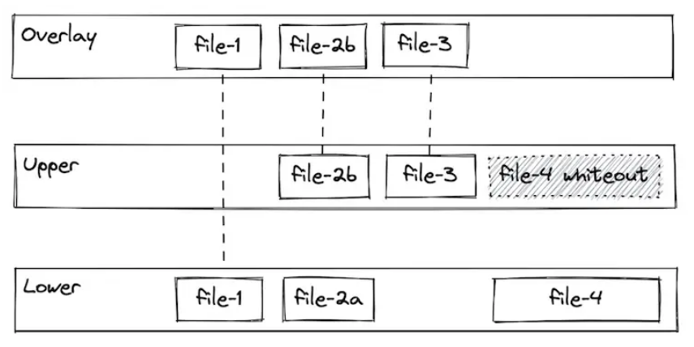

**End of Containers!**

### Github Actions

#### What is Github Actions?

GitHub Actions are packaged scripts to automate tasks in a software-development workflow in GitHub. You can configure GitHub Actions to trigger complex workflows that meet your organization's needs. The trigger can happen each time developers check new source code into a specific branch, at timed intervals, or manually. The result is a reliable and sustainable automated workflow, which leads to a significant decrease in development time.

#### Github Features

GitHub is designed to help teams of developers and DevOps engineers build and deploy applications quickly. There are many features in GitHub that enable this, but they generally fall into one of two categories:

Communication: Consider all of the ways that GitHub makes it easy for a team of developers to communicate about the software development project: code reviews in pull requests, GitHub issues, project boards, wikis, notifications, and so on.
Automation: GitHub Actions lets your team automate workflows at every step in the software-development process, from integration to delivery to deployment. It even lets you automate adding labels to pull requests and checking for stale issues and pull requests.

#### Types of Actions

There are three types of GitHub actions: container actions, JavaScript actions, and composite actions.

With container actions, the environment is part of the action's code. These actions can only be run in a Linux environment that GitHub hosts. Container actions support many different languages.

JavaScript actions don't include the environment in the code. You'll have to specify the environment to execute these actions. You can run these actions in a VM (virtual machine) in the cloud or on-premises. JavaScript actions support Linux, macOS, and Windows environments.

Composite actions allow you to combine multiple workflow steps within one action. For example, you can use this feature to bundle together multiple run commands into an action, and then have a workflow that executes the bundled commands as a single step using that action.

#### Github Actions Workflows

A GitHub Actions workflow is a process that you set up in your repository to automate software-development lifecycle tasks, including GitHub Actions. With a workflow, you can build, test, package, release, and deploy any project on GitHub. To create a workflow, you add actions to a .yml file in the .github/workflows directory in your GitHub repository.

A workflow must have at least one job. A job is a section of the workflow associated with a runner. A runner can be GitHub-hosted or self-hosted, and the job can run on a machine or in a container. You'll specify the runner with the runs-on: attribute. A runner is simply a server that has the GitHub Actions runner application installed.

#### Components of Github Actions

There are several components that work together to run tasks or jobs within a GitHub Actions workflow. In short, an event triggers the workflow, which contains a job. This job then uses steps to dictate which actions will run within the workflow.


A workflow is an automated process that you add to your repository. A workflow needs to have at least one job, and different events can trigger it. You can use it to build, test, package, release, or deploy your repository's project on GitHub.

The job is the first major component within the workflow. A job is a section of the workflow that will be associated with a runner. A runner can be GitHub-hosted or self-hosted, and the job can run on a machine or in a container.

A step is an individual task that can run commands in a job.

The actions inside your workflow are the standalone commands that are executed. These standalone commands can reference GitHub actions such as using your own custom actions, or community actions.

#### More on Github Actions

In addition to default environment variables, you can use defined variables as contexts. Contexts and default variables are similar in that they both provide access to environment information, but they have some important differences. While default environment variables can only be used within the runner, context variables can be used at any point within the workflow. For example, context variables allow you to run an if statement to evaluate an expression before the runner is executed.

#### Some Important Actions

1. actions/checkout:
   - Clones your repository to the GitHub Actions runner.
   - Checks out the specified ref (branch, tag, SHA).
   - Sets up Git credentials for subsequent Git operations.
   - Configures the Git environment for the workflow.

  2. actions/setup-node:
    - Sets up a Node.js environment for use in your workflow.
    - Allows you to specify the Node.js version.
    - Useful for installing dependencies and running JavaScript/TypeScript builds or tests.

  3. actions/cache:
    - Caches dependencies and build outputs to speed up workflow execution.
    - Commonly used to cache package manager directories (e.g., npm, pip, Maven).

  4. actions/upload-artifact & actions/download-artifact:
    - Uploads and downloads build artifacts between workflow steps or jobs.
    - Useful for sharing files (e.g., test reports, binaries) across jobs.

  5. docker/build-push-action:
    - Builds and pushes Docker images to a container registry.
    - Supports advanced features like build caching and multi-platform builds.

  6. actions/setup-python:
    - Sets up a Python environment for your workflow.
    - Allows you to specify the Python version and install dependencies.

  7. github/codeql-action:
    - Runs CodeQL analysis for security and code quality scanning.
    - Helps identify vulnerabilities in your codebase.

  8. actions/github-script:
    - Allows you to run custom JavaScript directly in your workflow.
    - Useful for automating GitHub API calls or custom logic.

  For a comprehensive list, see the [GitHub Actions Marketplace](https://github.com/marketplace?type=actions).

**End of Github Actions!**
### DevOps Directive Kubernetes Course ([link](https://youtu.be/2T86xAtR6Fo?si=FrIHT84JCSGWPfY6))

#### Terminologies

**Clusters**: a set of machines (physical or virtual) that work together to run containerized applications. It consists of at least one control plane (master node) and multiple worker nodes.

**Nodes**: a single machine (physical or virtual) in a Kubernetes cluster. Nodes are responsible for running the workloads (pods and containers). There are two types of nodes:

- Control Plane Node (Master Node): Manages the cluster, schedules workloads, and maintains the desired state of the system.
- Worker Node: Executes the workloads (pods and containers). Each worker node has a kubelet (agent) that communicates with the control plane.

**Namespaces**: a logical partition within a Kubernetes cluster. It is used to organize and isolate resources (like pods, services, and deployments) within the cluster. Namespaces are particularly useful in multi-tenant environments, where different teams or projects share the same cluster but need resource isolation.

**Workloads**: an application or a set of applications running on the cluster.

**Pods**: the smallest deployable unit in Kubernetes. It represents a single instance of a running process in your cluster. A pod can contain one or more containers that share the same network namespace, storage, and configuration. Pods are ephemeral by nature, meaning they can be created, destroyed, and replaced as needed.

**Containers**: a lightweight, standalone, and executable package of software that includes everything needed to run an application (code, runtime, libraries, and dependencies). In Kubernetes, containers are run inside pods. Kubernetes supports multiple container runtimes, with Docker being the most commonly used.

**CPU Requests**: CPU requests specify the minimum amount of CPU resources a container is guaranteed to have. Kubernetes uses this value to schedule the container on a node that has enough available CPU capacity. Measured in cores or millicores.
If a container's CPU request is not set, Kubernetes may schedule it on a node without guaranteeing that the container will have enough CPU resources, which could lead to performance issues.

**CPU Limits**: CPU limits specify the maximum amount of CPU resources a container is allowed to use. If the container tries to exceed this limit, Kubernetes throttles the container's CPU usage. Measured in cores or millicores.
If a container's CPU limit is not set, it can use as much CPU as is available on the node, potentially starving other containers of resources.

#### Kubernetes Architecture

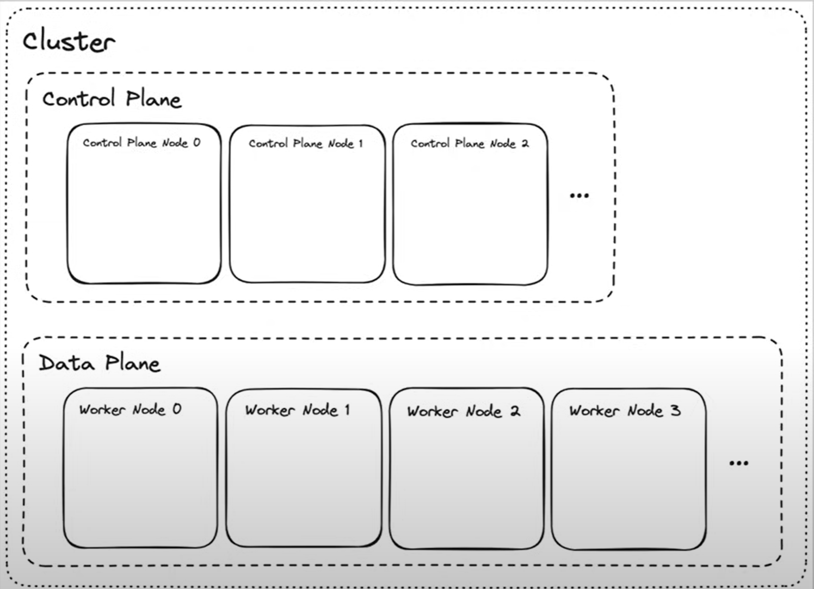

Node: A "node" is a computer/server. Multiple nodes are joined together to form a "cluster".

Control Plane: A subset of nodes in the cluster dedicated to performing system tasks. Nodes that are part of the control plane are referred to as "control plane nodes".

Data Plane: A subset of nodes in the cluster dedicated to running user worklods. Nodes that are part of the data plane are referred to as "worker nodes".

#### Kubernetes System Components

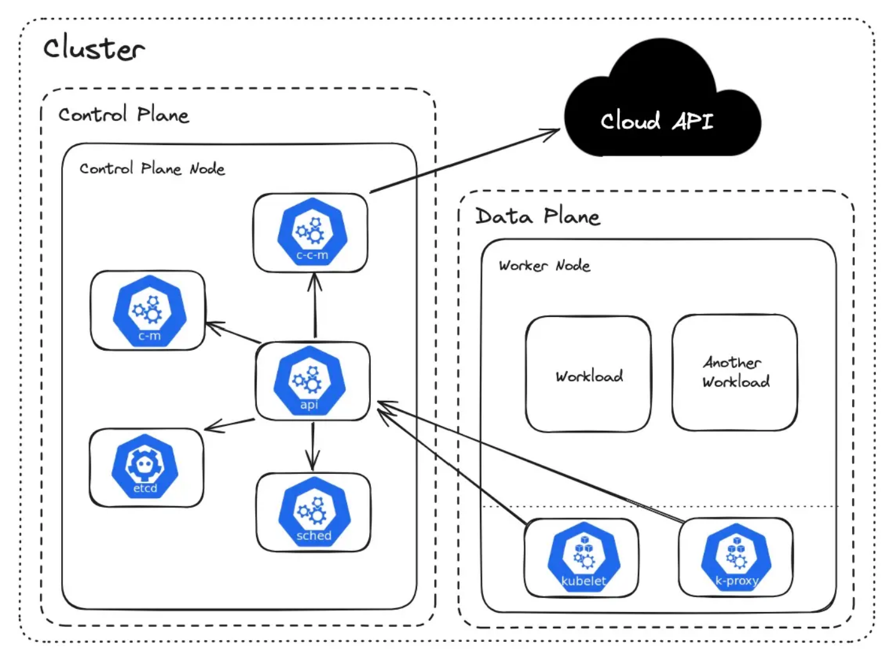
Kubernetes is comprised of many smaller components:

- etcd: Key-value store used for storing all cluster data. It serves as the source of truth for the cluster state and configuration.

- kube-apiserver: The front end for the Kubernetes control plane.

- kube-scheduler: Schedules pods onto the appropriate nodes based on resource availability and other constraints.

- kube-controller-manager: Runs controller processes. Each controller is a separate process that manages routine tasks such as maintaining the desired state of resources, managing replication, handling node operations, etc...

- cloud-controller-manager: Integrates with the underlying cloud provider (if running in one) to manage cloud-specific resources. It handles tasks such as managing load balancers, storage, and networking.

- kubelet: An agent that runs on each worker node and ensures that containers are running in pods and manages the lifecycle of containers.

- kube-proxy: This network proxy runs on each node and maintains network rules to allow communication to and from pods (not a necessity, other networking mechanisms exist).

- Interfaces: Container Runtime Interface (CRI), Container Network Interface (CNI), Container Storage Interface (CSI). Defining these interfaces allows for a modular system where innovation can happen outside of the main Kubernetes project and be easily “plugged in” or swapped to achieve new functionality.
  - CRI: Standard interface that Kubernetes uses to exeucte and run container processes within the system (e.g., container d, cri-o). Docker is no longer compatible.
  - CNI: Defines how networking should be set up for the containers running within Kubernetes. Many different ones exist. Not all of them uses kube-proxy.
  - CSI: Interface to provide storage to containers through drivers (e.g., cloud specific driver, cert manager driver, secrets store driver).

Kubernetes uses Docker images (OCI-compliant container images) as the standardized packaging format, but runs them through container runtimes like containerd or CRI-O that implement the Container Runtime Interface (CRI). This separation allows Kubernetes to support multiple runtime implementations while maintaining compatibility with the widely-adopted Docker image format.

[CNCF Landscape](https://landscape.cncf.io/) -> A website to find all the tools that are out there

#### Setup Tools

- DevBox: Devbox is a command-line tool developed by Jetpack.io that creates isolated, reproducible development environments. It allows developers to specify and manage development dependencies using a simple configuration file.
- KinD: simple local cluster for development. Supports multiple nodes where each node is a container.
- Civo: managed cluster platform.
- GKE: Google's Kubernetes Engine for a recommended managed cluster experience. Two modes: standard and autopilot. Google manages control plane in both but autopilot abstracts more details.

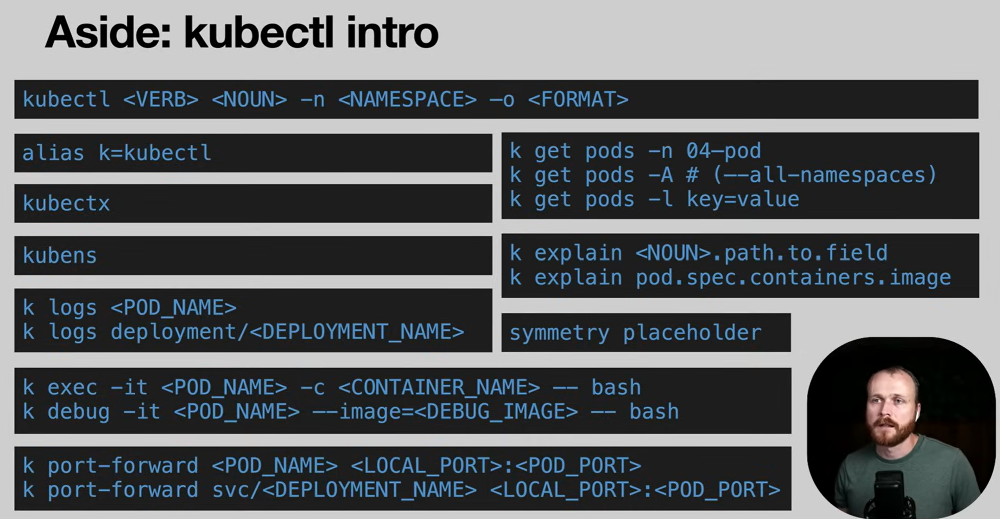

#### Built-in Kubernetes Resources

- Namespace: provides a mechanism to logically group resources within a cluster. There are four initial namespaces: default, kube-system, kube-node-lease, kube-public.
  By default, namespaces DO NOT act as a network/security boundary.
- Pods: the smallest deployable unit in Kubernetes. You almost never create a pod directly. Containers within a pod share networking and storage. Usually primary container, init containers (ran before primary container is run), and sidecar containers (run alongside primary container in perpetuity). To investigate a pod: `kubectl logs some-pod`. `kubectl get pods -o wide`
  Pod -> ReplicaSet -> Deployment -> StatefulSet.
- ReplicaSet: creates replica instances of the pods at all time. labels are the link between ReplicaSet and Pods.
- Deployment: adds the concept of rollouts and rollbacks to ReplicaSet. Used for long-running stateless applications.
- Service: an internal load balancer across replicas. It routes network traffic. Uses pod labels to determine which pods to serve. Types: ClusterIP (internal), NodePort (listens on each node in cluster), LoadBalancer (provisions external load balancer with cloud provider)

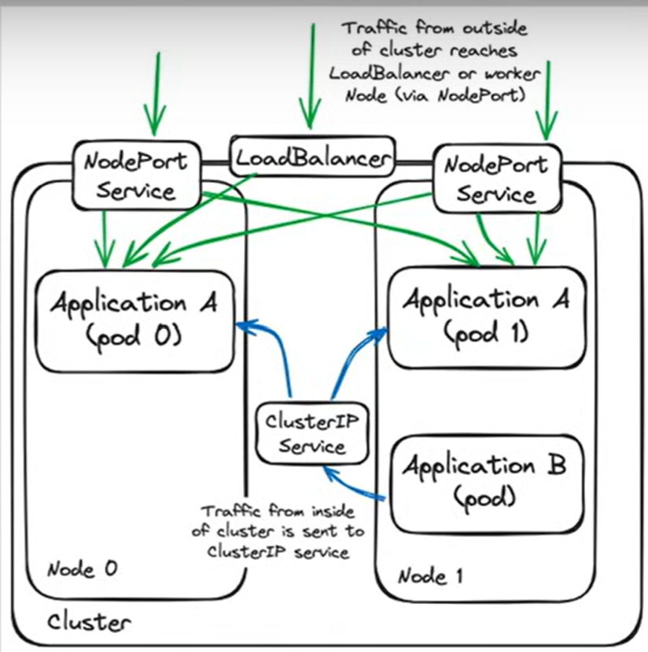

- Jobs: pods with completion tracking. Adds ability to retry pods. To investigate a job: `kubectl describe job some-job`
- CronJobs: scheduled jobs. [How the schedule string works](https://crontab.guru).
- DaemonSet: runs a copy of the specific pod on all (or some) nodes in the cluster. Useful for log aggregation, cluster storage daemon, monitoring. An example would be Grafana.
- StatefulSet: Similar to deployments but designed for stateful workloads. Has sticky identity (e.g., pod-0, pod-1), each pod mounts separate volumes, rollout behavior is ordered. Limitation: can't modify many of the fields after a StatefulSet has been created. InitContainers are often used with StatefulSets.
  Note that a headless ClusterIP service is needed to address each pod in the StatefulSet individually (DNS resolution) as the normal ClusterIP service provides a single stable IP address and DNS name for accessing the StatefulSet pods as a whole and not individually.
- ConfigMaps: enable environment specific configuration to be decoupled from container images. Two primary styles: property-like keys, file-like keys.
- Secrets: similar to ConfigMaps with one main difference: data is base64 encoded. This is to support binary data.
- Ingress: enables routing traffic to many services via a single external LoadBalancer (ingress controllers e.g., Ingress-nginx, HAProxy, Kong). Only officialy supports layer 7 routing but some application allow for layer 4 (TCP/UDP) routing.
  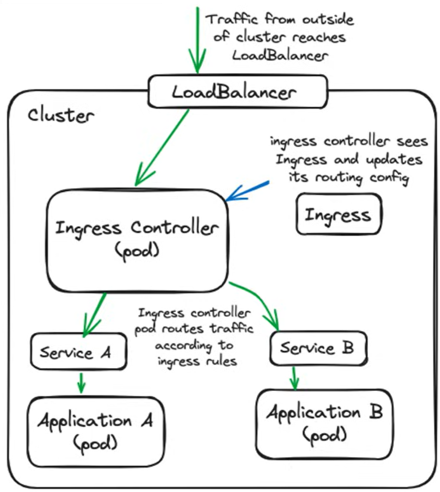
- GatewayAPI: evolution of the Ingress API. Adds support for layer 4 routing and more advanced routing scenarios.
  
  (See Ingress x GatewayAPI x LoadBalancer GPT explanation below)
- PersistentVolume & PersistentVolumeClaim: provides api for persistent storage. Access modes: ReadWriteOnce (limited mounting to one node) ReadWriteOncePod (one pod), ReadOnlyMany, ReadWriteMany. Reclaim policy: retain vs delete.
  Note that dynamically specified Deployments and StatefulSets behave different when it comes tp PersistentVolumeClaim, where Deployment only creates one volume claim that is shared across the pods but StatefulSets creates one per pod.
  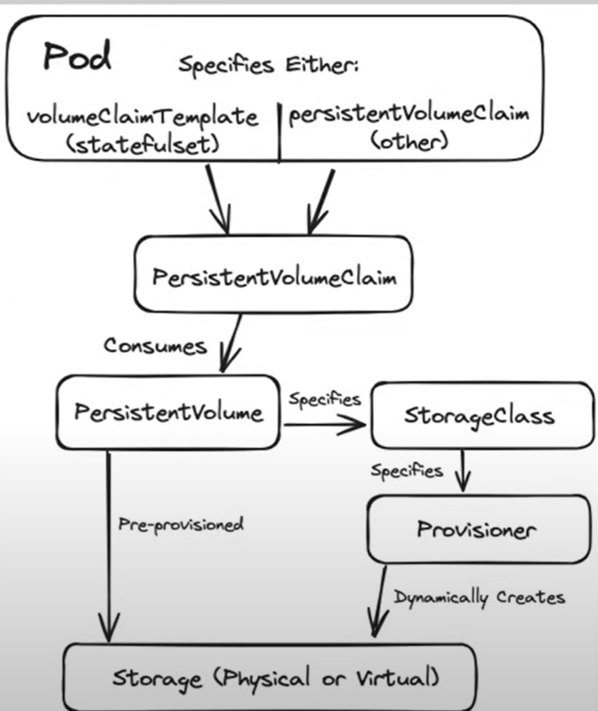
- RBAC (ServiceAccount, Role, RoleBinding): provide applications or users access to the Kubernetes API. Access can be granted by namespace or cluster wide.
- Labels: key-value pairs used to identify and organize Kubernetes resources. Can be used to filter api-servier queries (e.g., with kubectl).
- Annotations: Key-value pairs used for non-identifiying metadata. Used for things like configuration details, deployment history. Often used by tools to configure specific behaviors (e.g., ingress annotations).
  **Ingress x GatewayAPI x LoadBalancer GPT explanation:**

**Ingress** is a Kubernetes API object that manages external access to services within a Kubernetes cluster, typically HTTP/HTTPS traffic. It acts as a smart router, allowing you to define rules for routing traffic from outside the cluster to internal services based on hostnames, paths, or other criteria.

**Key points about Ingress:**

- It provides a way to expose multiple services under the same IP address or DNS name.
- Ingress resources define rules (e.g., "traffic to `/api` goes to Service A, `/web` goes to Service B"). Services here are the different application components.

  Typical flow of a request:
  ```
  External Request → Load Balancer → Ingress Controller → Single Ingress Resource
                                              ├── /api → Backend Service → Backend Pods
                                              ├── /web → Frontend Service → Frontend Pods
                                              └── /admin → Admin Service → Admin Pods
  ```
- Ingress requires an **Ingress Controller** (like NGINX, Traefik, or HAProxy) to actually implement the routing logic.

**Important Summary:**

**Ingress Controller = The software/infrastructure (nginx, traefik, ALB) - shared across cluster.**

**Ingress Resource = Your app's specific routing rules - one per app/service.**

---

The **Gateway API** is a newer, more flexible, and extensible way to manage traffic into Kubernetes clusters. It aims to address some limitations of Ingress and provide a more expressive model for traffic management.

**Key points about Gateway API:**

- It introduces new resources: `GatewayClass`, `Gateway`, `HTTPRoute`, `TCPRoute`, etc.
- It separates infrastructure concerns (e.g., how traffic enters the cluster) from application routing (e.g., which service gets the traffic).
- It supports advanced use cases like traffic splitting, header-based routing, and cross-namespace routing.
- It is designed to be more portable across different environments and vendors.

---

A **Load Balancer** in Kubernetes is typically an external or cloud-managed resource that distributes incoming network traffic across multiple backend pods or services to ensure reliability and scalability.

**Key points about Load Balancers:**

- When you create a `Service` of type `LoadBalancer`, Kubernetes asks the cloud provider (e.g., AWS, GCP, Azure) to provision an external load balancer.
- The load balancer gets a public IP address and forwards traffic to the Kubernetes nodes, which then route it to the appropriate pods.
- In on-premises environments, you might use MetalLB or similar solutions to provide load balancer functionality.

---

**How They Work Together:** Here’s how these components typically interact in a Kubernetes environment:

1. **External Traffic Entry:**  
   Traffic from the internet first hits a **Load Balancer** (provisioned by a Service of type LoadBalancer or by the Gateway API).

2. **Routing to the Cluster:**  
   The load balancer forwards the traffic to one or more Kubernetes nodes, targeting the Ingress Controller or Gateway implementation running as a pod.

3. **Application Routing:**

   - If using **Ingress**, the Ingress Controller reads Ingress resources and routes the traffic to the correct service based on the rules.
   - If using **Gateway API**, the Gateway implementation reads Gateway and Route resources to determine how to route the traffic.

4. **Service Discovery:**  
   The traffic is finally forwarded to the appropriate Kubernetes Service, which then load balances it across the relevant pods.

#### Helm

Helm is the De-facto standard for distributing software for Kubernetes. Its a combination of a package manager and a templating engine. Primary use cases: application deployment, environment management.
Commands:

- helm install
- helm upgrade
- helm rollback

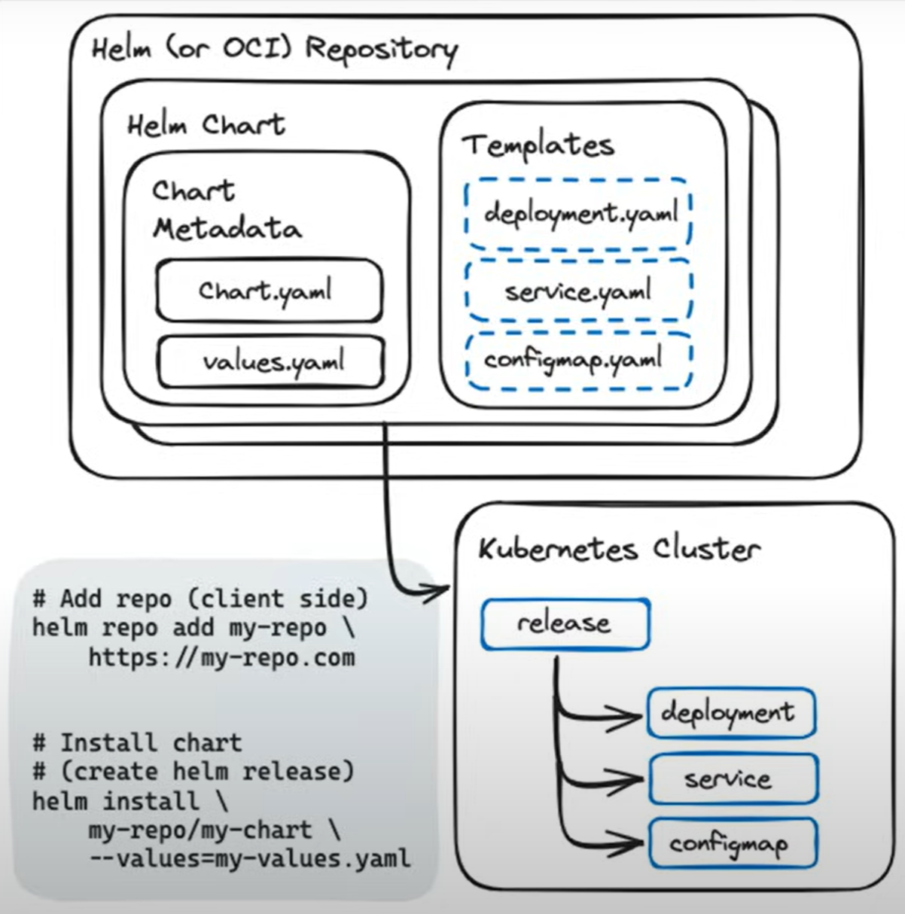

#### Demo Application

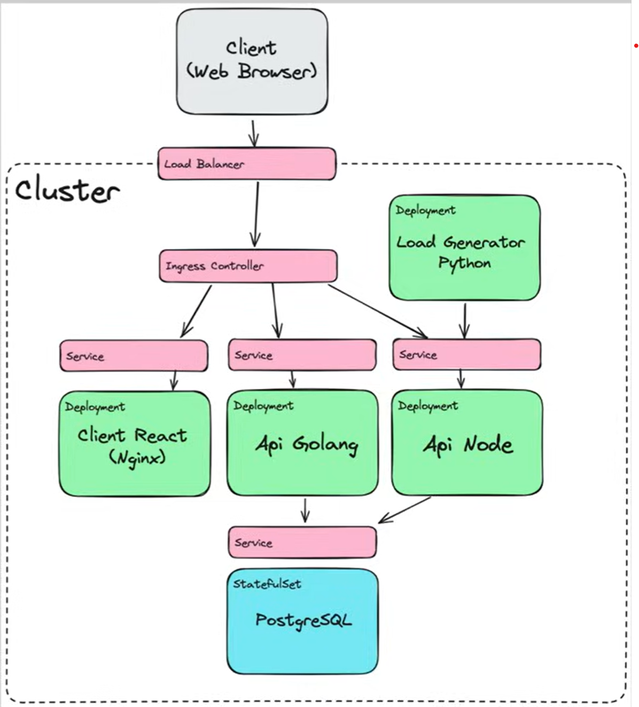
Demo application architecture. Container images hosting on docker hub used for all components except postgres and ingress controller, to which helm charts were used.

#### Extending the Kubernetes API

Kubernetes is not just a container orchestrator.
It provides an API for:

- Declaring a set of resources.
- Observing and acting upon those resources (control loop).

Custom Resource Definitions (CRDs) allow applications to extend the default resource set.

Custom controllers observe and act upon CRDs.

Use Cases:

- Embed custom login into "Operators" (CloudNativePG).
- Manage TLS certificates (Cert-Manager).
- Deploy infrastructure with automatic reconciliation (Crossplane).

To build your own resource, define your own configuration and build a controller (operator) to act upon that custom configuration.

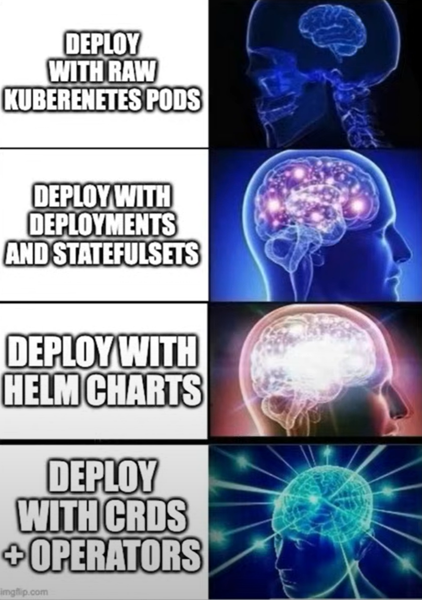

#### Auxiliary Tooling

**CloudNative PG:** A Kubernetes operator that manages PostgreSQL workloads with high availability, disaster recovery, and cloud-native features. Barman: backup and recovery manager.

**Trivy Operator:** A Kubernetes operator that continuously scans your cluster for vulnerabilities and misconfigurations using Trivy scanner.

#### Developer Experience

**Tilt:** A developer tool that rebuilds, deploys, and updates your application continuously as you edit code, providing fast feedback for Kubernetes development workflows. This is better than using a docker compose as tilt works in a real kubernetes environment, rather than just a Dockerfile.

**External Secrets Operator**: A Kubernetes operator that synchronizes secrets from external APIs (like AWS Secrets Manager, HashiCorp Vault, or Azure Key Vault) into Kubernetes as Secret resources.

#### Debugging

[Troubleshooting Guide](https://learnk8s.io/troubleshooting-deployments)

#### Deploying to Multiple Environments

1. Kustomize: a tool built into kubectl. Uses base + overlay model where you define some base configuration and then for each environment you will specify an overlay. Its limitations lie within lists and multi-line strings in YAML.
   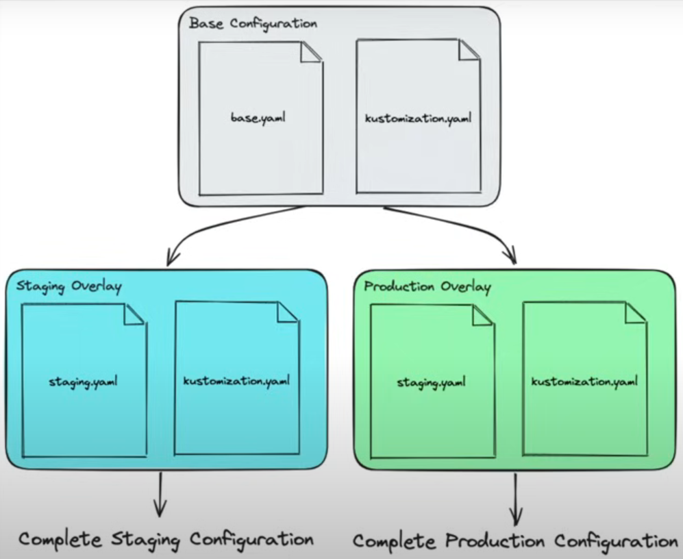
2. Helm: uses a templating model. A configuration file for each environment. Has "hooks" which allow encoding dependencies. Its limitations are with the un-readable templates at a large scale, boilerplate configuration, and CRD management is limited.
3. Kluctl: uses a templating model. Also has hooks. Integrates with helm and kustomize. Includes a built in GitOps engine. Great choice for deploying to multiple environments, but requires slightly more setup.

#### Cluster/Node Upgrades

**Upgrade Process:**

1. `Check for usage of deprecated APIs`: If you are using deprecated APIs that will be removed by a Kubernetes upgrade, you need to address those before upgrading. One tool that automatically checks this is [kubent](https://github.com/doitintl/kube-no-trouble).

2. `Update the control plane`: The control plane version can be ahead of the worker nodes, but cannot be behind so it is updated first.

3. `Create a new nodepool`: Rather than update nodes in place, it can be safer to create a new node group. This way the new nodes will be fully operational before you shift workloads to them and if something goes wrong you can shift the workloads back to the old nodes.

4. `Drain and cordon the old nodes`: You can use kubernetes scheduling capabilities to shift all of the pods onto the newly provisioned nodes.

5. `Delete the old nodepool`: Once all of the workloads are successfully running on the new nodes, you can safely delete the old nodes.

_Note: managed clusters may not give the perms to follow the above process, to which you will have to upgrade in place. Some people also prefer to deploy entirely new clusters rather than upgrading (depending on the amount of state in the cluster)._

#### CI/CD

##### Deployment Strategies

- Level -1: kubectl create (imperative).
- Level 0: kubectl apply manually (declarative).
- Level 1: kubectl apply from pipeline (automated).
- Level 2: GitOps (continuous).

##### Continuous Integration

- Run linting, tests, validation.
- Build and push container images.

Both of these are easily done via Github Actions.

[**Sample Github Actions CI Workflow**](workflows/image-ci.yml)

This workflow builds and pushes Docker images (CI), while updating image tags in Kubernetes manifests for CD.

##### Continuous Delivery

- Update Kubernetes manifests using Github Actions.

- Apply updated manifests to cluster(s) using kluctl GitOps (or other CD tools like ArgoCD).

  Kluctl GitOps architecture:
  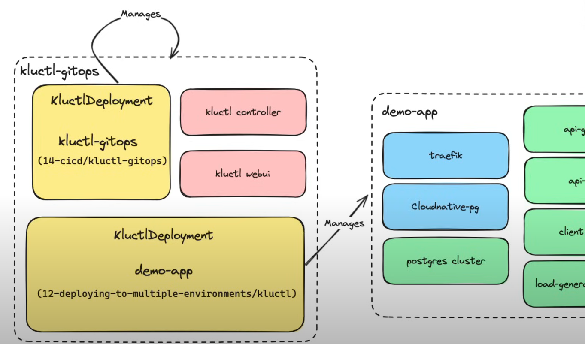

- Validate deployments worked as expected.

**End of DevOps Directive Kubernetes Course!**

### GitOps

#### What is GitOps?

GitOps is a way to do Kubernetes cluster management and application delivery. It works by using Git as a single source of truth for declarative infrastructure and applications (i.e., infrastructure as code), together with tools ensuring the actual state of infrastructure and applications converges towards the desired state declared in Git. With Git at the center of your delivery pipelines, developers can make pull requests to accelerate and simplify application deployments and operations tasks to your infrastructure or container-orchestration system (e.g. Kubernetes).

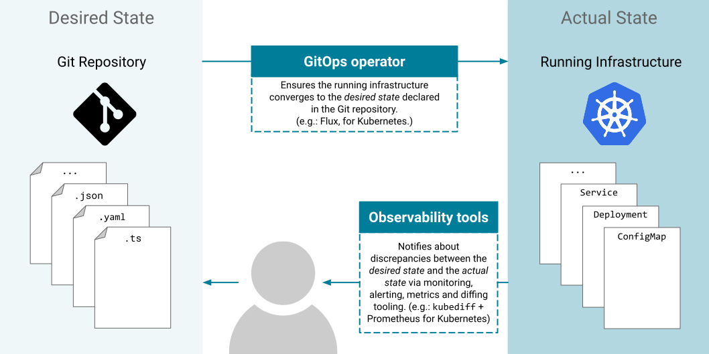

The core idea of GitOps is having a Git repository that always contains declarative descriptions of the infrastructure currently desired in the production environment and an automated process to make the production environment match the described state in the repository. If you want to deploy a new application or update an existing one, you only need to update the repository - the automated process handles everything else. It’s like having cruise control for managing your applications in production.

_GitOps: versioned CI/CD on top of declarative infrastructure. Stop scripting and start shipping._ - Kelsey Hightower

_GitOps is a subset of DevOps: GitOps implements DevOps principles (automation, collaboration) but focuses specifically on deployment workflows. - Deepseek R1_

#### Perks of using GitOps

_High Velocity Deployments_: What is unique about GitOps is that you don’t have to switch tools for deploying your application. Everything happens in the version control system you use for developing the application anyways.

_Easy and Fast Error Recovery_: With GitOps you have a complete history of how your environment changed over time. This makes error recovery as easy as issuing a `git revert` and watching your environment being restored.

_The Git record is then not just an audit log but also a transaction log. You can roll back & forth to any snapshot._ - Alexis Richardson

_Easier Credential Management_: GitOps allows you to manage deployments completely from inside your environment. For that, your environment only needs access to your repository and image registry. That’s it. You don’t have to give your developers direct access to the environment.

_Self-documenting Deployments_: Have you ever SSH’d into a server and wondered what’s running there? With GitOps, every change to any environment must happen through the repository. You can always check out the master branch and get a complete description of what is deployed where plus the complete history of every change ever made to the system. And you get an audit trail of any changes in your system for free!

_Shared Knowledge_: Using Git to store complete descriptions of your deployed infrastructure allows everybody in your team to check out its evolution over time. With great commit messages everybody can reproduce the thought process of changing infrastructure and also easily find examples of how to set up new systems.

#### How does GitOps work?

_Environment Configurations as Git repository_: GitOps organizes the deployment process around code repositories as the central element. There are at least two repositories: the application repository and the environment configuration repository. The application repository contains the source code of the application and the deployment manifests to deploy the application. The environment configuration repository contains all deployment manifests of the currently desired infrastructure of an deployment environment. It describes what applications and infrastructural services (message broker, service mesh, monitoring tool, …) should run with what configuration and version in the deployment environment.

_Push-based vs. Pull-based Deployments_: There are two ways to implement the deployment strategy for GitOps: Push-based and Pull-based deployments. The difference between the two deployment types is how it is ensured, that the deployment environment actually resembles the desired infrastructure. When possible, the Pull-based approach should be preferred as it is considered the more secure and thus better practice to implement GitOps.

The Push-based deployment strategy is implemented by popular CI/CD tools such as Jenkins, CircleCI, or Travis CI. The source code of the application lives inside the application repository along with the Kubernetes YAMLs needed to deploy the app. Whenever the application code is updated, the build pipeline is triggered, which builds the container images and finally the environment configuration repository is updated with new deployment descriptors.

Tip: You can also just store templates of the YAMLs in the application repository. When a new version is built, the template can be used to generate the YAML in the environment configuration repository.


With this approach it is indispensable to provide credentials to the deployment environment. So the pipeline has god-mode enabled. In some use cases a Push-based deployment is inevitable when running an automated provisioning of cloud infrastructure. In such cases it is strongly recommended to utilize the fine-granular configurable authorization system of the cloud provider for more restrictive deployment permissions.

Another important thing to keep in mind when using this approach is that the deployment pipeline only is triggered when the environment repository changes. It can not automatically notice any deviations of the environment and its desired state. This means, it needs some way of monitoring in place, so that one can intervene if the environment doesn’t match what is described in the environment repository.

The Pull-based deployment strategy uses the same concepts as the push-based variant but differs in how the deployment pipeline works. Traditional CI/CD pipelines are triggered by an external event, for example when new code is pushed to an application repository. With the pull-based deployment approach, the operator is introduced. It takes over the role of the pipeline by continuously comparing the desired state in the environment repository with the actual state in the deployed infrastructure. Whenever differences are noticed, the operator updates the infrastructure to match the environment repository. Additionally the image registry can be monitored to find new versions of images to deploy.


Just like the push-based deployment, this variant updates the environment whenever the environment repository changes. However, with the operator, changes can also be noticed in the other direction. Whenever the deployed infrastructure changes in any way not described in the environment repository, these changes are reverted. This ensures that all changes are made traceable in the Git log, by making all direct changes to the cluster impossible.

This change in direction solves the problem of push-based deployments, where the environment is only updated when the environment repository is updated. However, this doesn’t mean you can completely do without any monitoring in place. Most operators support sending mails or Slack notifications if it can not bring the environment to the desired state for any reason, for example if it can not pull a container image. Additionally, you probably should set up monitoring for the operator itself, as there is no longer any automated deployment process without it.

The operator should always live in the same environment or cluster as the application to deploy. This prevents the god-mode, seen with the push-based approach, where credentials for doing deployments are known by the CI/CD pipeline. When the actual deploying instance lives inside the very same environment, no credentials need to be known by external services. The Authorization mechanism of the deployment platform in use can be utilized to restrict the permissions on performing deployments. This has a huge impact in terms of security. When using Kubernetes, RBAC configurations and service accounts can be utilized.

#### Working with Multiple Applications and Environments

You can always just set up multiple build pipelines that update the environment repository. From there on the regular automated GitOps workflow kicks in and deploys all parts of your application.

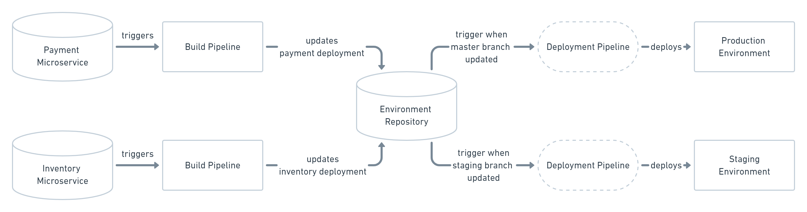

Managing multiple environments with GitOps can be done by just using separate branches in the environment repository. You can set up the operator or the deployment pipeline to react to changes on one branch by deploying to the production environment and another to deploy to staging.

#### Secret Handling

First of all, never store secrets in plain text in git! Never!

That being said, you have secrets created within the environment which never leave the environment. The secret stays unknown, and applications get the secrets they require but they aren’t exposed to the outside world. For example, you provision a database within the environment and give the secret to the applications interacting with the database only.

Another approach is to add a private key once to the environment (probably by someone from a dedicated ops team) and from that point you can add secrets encrypted by the public key to the environment repository. There’s even tool support for such sealed secrets in the K8s ecosystem.

_There are no GitOps engineers. GitOps is not a role (and neither is DevOps). GitOps is a set of practices. You can look for a developer who has experience practicing GitOps — or simply let your developers try out those practices._

#### GitOps References

- https://github.com/weaveworks/awesome-gitops
- https://www.gitops.tech/

**End of GitOps!**

### GitOps Cookbook ([link](https://developers.redhat.com/e-books/gitops-cookbook))

#### Chapter 1: Introduction

#### Intro

GitOps is a methodology and practice that uses Git repositories as a single source of truth to deliver infrastructure as code. It takes the pillars and approaches from DevOps culture and provides a framework to start realizing the results. The relationship between DevOps and GitOps is close, as GitOps has become the popular choice to implement and enhance DevOps, platform engineering, and SRE.
CI/CD pipelines are one of the most common use cases for GitOps.

The three main pillars of GitOps are:

- Git is the single source of truth
- Treat everything as code
- Operations are performed through Git workflows

**Some Terms:**

_Declarative_: A system managed by GitOps must have its desired state expressed declaratively.
_Versioned and immutable_: The desired state is stored in a way that enforces immutability and versioning and retains a complete version history.
_Pulled automatically_: Software agents automatically pull the desired state declarations from the source.
_Continuously reconciled_: Software agents continuously observe the actual system state and attempt to apply the desired state.

#### Kubernetes CICD

In a typical CI/CD pipeline, submitted code checks the CI process while the CD process checks and applies requirements for things like security, infrastructure as code, or any other boundaries set for the application framework. All code changes are tracked, making updates easy while also providing version control should a rollback be needed. CD is the GitOps domain and it works together with the CI part to deploy apps in multiple environments.

With Kubernetes, it’s easy to implement an in-cluster CI/CD pipeline. You can have CI software create the container image representing your application and store it in a container image registry. Afterward, a Git workflow such as a pull request can change the Kubernetes manifests illustrating the deployment of your apps and start a CD sync loop.

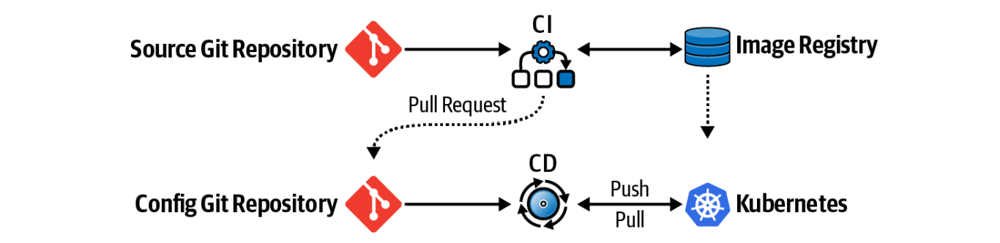

#### App Deployment

As GitOps is an agnostic, platform-independent approach, the application deployment model on Kubernetes can be either in-cluster or multicluster. An external
GitOps tool can use Kubernetes just as a target platform for deploying apps. At the same time, in-cluster approaches run a GitOps engine inside Kubernetes to deploy apps and sync manifests in one or more Kubernetes clusters.

The GitOps engine takes care of the CD part of the CI/CD pipeline and accomplishes
_Deploy_: Deploy the manifests from Git.

_Monitor_: Monitor either the Git repo or the cluster state.

_Detect Drift_: Detect any change from what is described in Git and what is present in the cluster.

_Take Action_: Perform an action that reflects what is on Git (rollback or three-way diff). Git is the source of truth, and any change is performed via a Git workflow.

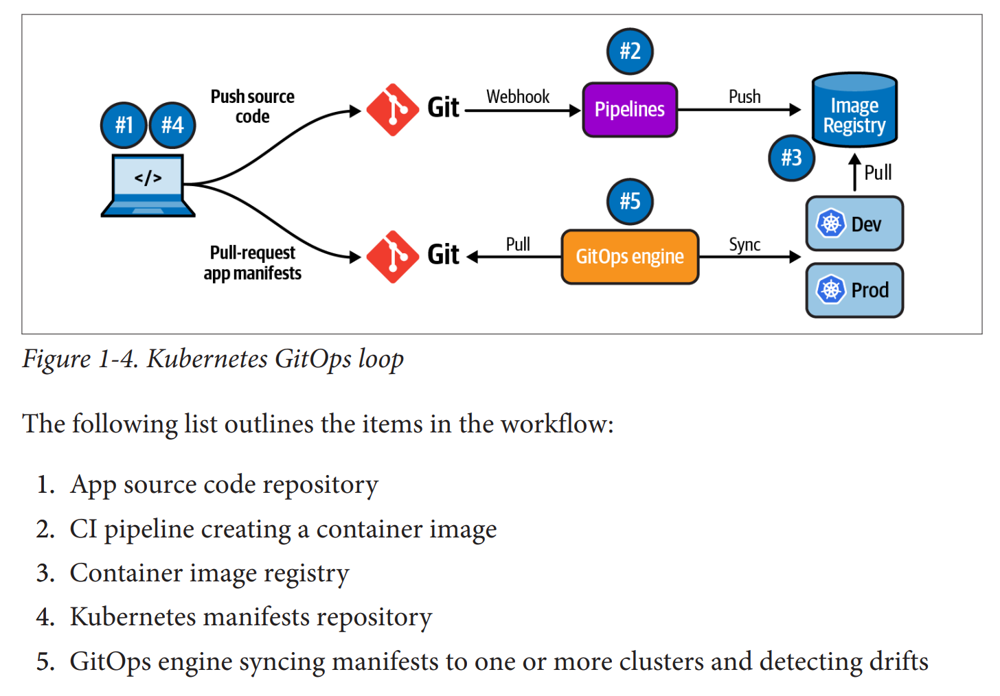

_Cultural Change in IT Organizations Needed_: The “Teaching Elephants to Dance (and Fly!)” speech from Burr Sutter gives a clear idea of the context. The elephant is where your organization is today. There are phases of change between traditional and modern environments powered by GitOps
tools. Some organizations have the luxury of starting from scratch, but for many
businesses, the challenge is teaching their lumbering elephant to dance like a graceful
ballerina.

#### Chapter 2: Requirements

#### Minikube

Minikube is a tool that simplifies running a Kubernetes cluster locally on a single machine. In the case of Minikube, the entire Kubernetes cluster (control plane and worker node) is installed inside a VM or container. This is a special case for local development and testing, not a production setup. In essence, the Kubernetes cluster is installed inside a VM or container, and it orchestrates containers from there.

Kubernetes is well known as a container orchestration platform to deploy and manage apps. However, it doesn’t include support for building container images out-of-the-box. Indeed, according to Kubernetes documentation: “(Kubernetes) Does not deploy source code and does not build your application. Continuous Integration, Delivery, and Deployment (CI/CD) workflows are determined by organization cultures and preferences as well as technical requirements.

#### Chapter 3: Containers

Shipwright is an extensible framework for building container images on Kubernetes. It supports popular tools such as Buildah, Cloud Native Buildpacks, and kaniko. It uses Kubernetes-style APIs, and it runs workloads using Tekton.

kaniko is another dockerless solution to build container images from a Dockerfile inside a container or Kubernetes cluster. Shipwright brings additional APIs to Kubernetes to use tools such as kaniko to create container images, acting as an abstract layer that can be considered an extensible building system for Kubernetes.

Some key concepts in Shipwright, which are defined using Kubernetes Custom Resource Definitions (CRDs). Each CRD represents a specific part of the build process (defined with a unique yaml file):

1. ClusterBuildStrategy
   - What it is: This defines how the build will be executed. It specifies the steps and tools to use for building a container image.
   - Example: You might use a ClusterBuildStrategy for tools like Kaniko, Buildah, or Cloud Native Buildpacks. It describes the process of building an image, such as which Dockerfile to use, what commands to run, and how to push the image to a registry.
   - Scope: It is cluster-wide, meaning it can be used by builds in any namespace.
2. Build
   - What it is: This defines what to build and where to push the resulting container image. It references a ClusterBuildStrategy to specify how the build should be executed.
   - Key Details: Specifies the source code (e.g., a Git repository). Specifies the output image (e.g., the container registry and image name). Links to a ClusterBuildStrategy to define the build process.
   - Example: A Build object might say, "Take the code from this Git repository, use the Kaniko strategy, and push the resulting image to Docker Hub."
3. BuildRun
   - What it is: This represents the actual execution of a build. When you create a BuildRun object, it triggers the build process defined in the Build object.
   - Key Details: It uses the Build object as a template. It creates a Kubernetes Pod to execute the build process. Once the BuildRun is complete, the container image is pushed to the specified registry.
   - Example: A BuildRun object might say, "Run the build defined in the Build object named my-app-build."

#### Chapter 4: Kustomize

Deploying to a Kubernetes cluster is, in summary, applying some YAML files and checking the result.

The hard part is developing the initial YAML files version; after that, usually, they suffer only small changes such as updating the container image tag version, the number of replicas, or a new configuration value. One option is to make these changes directly in the YAML files—it works, but any error in this version (modification of the wrong line, deleting something by mistake, putting in the wrong whitespace) might be catastrophic.

For this reason, some tools let you define base Kubernetes manifests (which change infrequently) and specific files (maybe one for each environment) for setting the parameters that change more frequently. One of these tools is Kustomize.

#### Chapter 5: Helm

Helm works similarly to Kustomize, but it’s a template solution and acts more like a package manager, producing artifacts that are versionable, sharable, or deployable.

One of the differences between Kustomize and Helm is the concept of a Chart. A Chart is a packaged artifact that can be shared and contains multiple elements like dependencies on other Charts. Additionally, in contrast to Kustomize, which can be used either within the kubectl command or as a standalone CLI tool, Helm needs to be downloaded and installed in your local machine.

Sample Helm project:
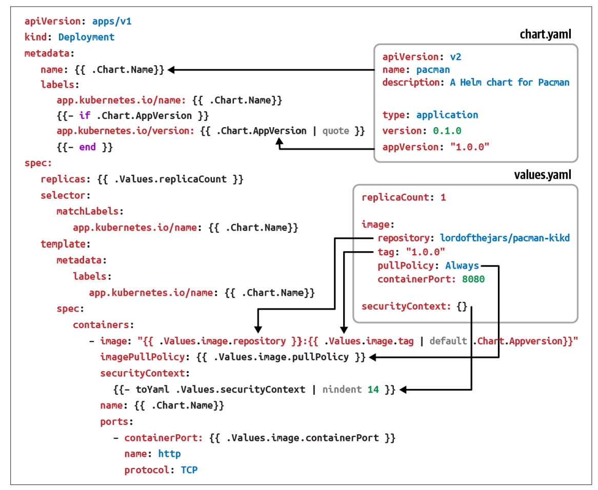
If you have multiple environments, you would simply have multiple `values.yaml` files.

#### Chapter 6: Cloud Native CI/CD

Cloud native refers to the model where cloud computing and cloud services are involved in this process. Examples include Tekton, Drone, and Github Actions.

#### Chapter 7: ArgoCD

CD is all about how to deploy an application to an environment (a Kubernetes cluster) using the GitOps methodology and not creating a script running kubectl/helm commands.

As Daniel Bryant puts it, “If you weren’t using SSH in the past to deploy your application in production, don’t use kubectl to do it in Kubernetes.”

A typical operation done in Kubernetes is a rolling update to a new version of the container, and ArgoCD integrates with another tool (e.g., Kustomize or Helm) to make this process smooth.

An application in ArgoCD is composed of three Kubernetes manifest files, including a Namespace, a Deployment, and a Service definition.

ArgoCD treats Git repositories as the single source of truth for Kubernetes deployments.

**Sync Process:**

1. **Monitors** GitHub repo for changes (polls every 3 minutes or via webhooks)
2. **Fetches** YAML manifests from Git and caches temporarily
3. **Detects drift** between cluster state and Git declarations
4. **Applies manifests** to Kubernetes cluster using kubectl
5. **Persists resources** in cluster's etcd database

**Workflow:**

Code Push → ArgoCD Detects → Fetch Manifests → Apply to Cluster → Resources Stored

With a pure Argo CD solution, after the container image is published to a container registry, we need to update the Kubernetes/Kustomize/Helm manifest files pointing
to the new container image and push the result to the Git repository. This is usually done during the continuous integration phase via Github Actions.

Although this approach works, it could be automated so the cluster
could detect a new image pushed to the container registry and update the current deployment file pointing to the newer version.
ArgoCD IU is a Kubernetes controller monitoring for a new container version and updating the manifests (i.e., versions) defined in the ArgoCD YAML file. It then commits those changes to the Git repository, which triggers Argo CD to deploy the new version of the image.

Using Github Actions to handle the update of versions in the Kubernetes manifests (e.g., ArgoCD YAML file) to point to the new versions is simpler and preferred (by myself, at least).

ArgoCD IU Lifecycle:

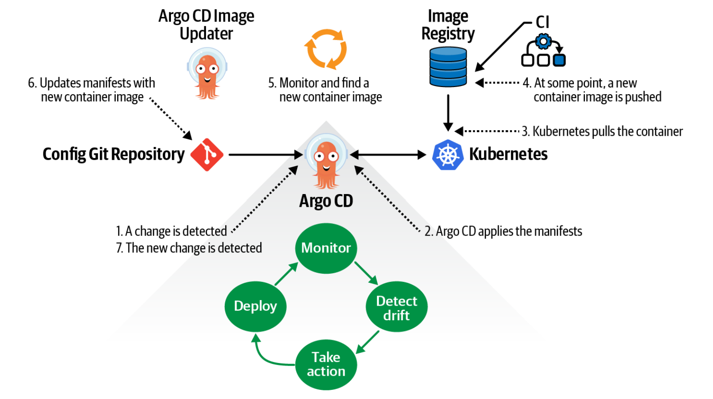

Argo CD has three phases (resource hooks) when applying resources: the first phase is executed before applying the manifests (PreSync), the second phase is when the manifests are applied (Sync), and the third phase is executed after all manifests are applied and synchronized (PostSync).

Overview of the available hooks:

| Hook | Description | Use case |
|------|-------------|----------|
| PreSync | Executes prior to the application of the manifests | Database migrations |
| Sync | Executes at the same time as manifests | Complex rolling update strategies like canary releases or dark launches |
| PostSync | Executes after all Sync hooks have completed and were successful (healthy) | Run tests to validate deployment was correctly done |
| SyncFail | Executes when the sync operation fails | Rollback operations in case of failure |
| Skip | Skip the application of the manifest | When manual steps are required to deploy the application (i.e., releasing public traffic to new version) |

A sync wave is a way to order how Argo CD applies the manifests stored in Git. All manifests have zero waves by default, and the lower values go first. You can use the `argocd.argoproj.io/sync-wave` annotation to set the wave number to a resource.

For example, you might want to deploy a database first and then create the database schema; for this case, you should set a sync-wave lower in the database deployment file than in the job for creating the database schema.

When Argo CD starts applying the manifests, it orders the resources in the following way:
1. Phase
2. Wave (lower precedence first)
3. Kind
4. Name

**End of GitOps Cookbook!**

