# DevOps Notes (Cheatsheet)

These notes are meant to be coupled with a practical component and serve merely as the theoritical reference. These notes combine various technical blogs, courses, and books. All references have been included.

_Have fun.. and remember, do not get stuck in tutorial hell :)_

### Table of Contents

1. [DevOps Overview](#devops-overview)

- [What is DevOps?](#what-is-devops)
- [Key DevOps Operations](#key-devops-operations)

2. [Containers](#containers-reference)

- [What is a Container?](#what-is-a-container)
- [Containers' Building Blocks](#containers-building-blocks)

3. [Github Actions](#github-actions)

- [What is Github Actions?](#what-is-github-actions)
- [Github Features](#github-features)
- [Types of Actions](#types-of-actions)
- [Github Actions Workflows](#github-actions-workflows)
- [Components of Github Actions](#components-of-github-actions)
- [More on Github Actions](#more-on-github-actions)
- [Some Important Actions](#some-important-actions)

4. [DevOps Directive Kubernetes Course](#devops-directive-kubernetes-course-link)

- [Terminologies](#terminologies)
- [Kubernetes Architecture](#kubernetes-architecture)
- [Kubernetes System Components](#kubernetes-system-components)
- [Setup Tools](#setup-tools)
- [Built-in Kubernetes Resources](#built-in-kubernetes-resources)
- [Helm](#helm)
- [Demo Application](#demo-application)
- [Extending the Kubernetes API](#extending-the-kubernetes-api)
- [Auxiliary Tooling](#auxiliary-tooling)
- [Developer Experience](#developer-experience)
- [Debugging](#debugging)
- [Deploying to Multiple Environments](#deploying-to-multiple-environments)
- [Cluster/Node Upgrades](#clusternode-upgrades)
- [CI/CD](#cicd)

5. [GitOps](#gitops)

- [What is GitOps?](#what-is-gitops)
- [Perks of using GitOps](#perks-of-using-gitops)
- [How does GitOps work?](#how-does-gitops-work)
- [Working with Multiple Applications and Environments](#working-with-multiple-applications-and-environments)
- [Secret Handling](#secret-handling)
- [GitOps References](#gitops-references)

6. [Certified Kubernetes Application Developer (CKAD) Certification](#certified-kubernetes-application-developer-ckad-certification)

- [About The Certification](#about-the-certification)
- [Resources](#resources)

7. [CKAD Udemy Course](#ckad-udemy-course-link)

- [Section 1: Introduction](#section-1-introduction)
- [Section 2: Core Concepts](#section-2-core-concepts)
- [Section 3: Configuration](#section-3-configuration)
- [Section 4: Multi-Container Pods](#section-4-multi-container-pods)
- [Section 5: Observability](#section-5-observability)
- [Section 6: Pod Design](#section-6-pod-design)
- [Section 7: Services & Networking](#section-7-services--networking)
- [Section 8: State Persistence](#section-8-state-persistence)
- [Section 9: Security](#section-9-security)
- [Section 10: Helm Fundamentals](#section-10-helm-fundamentals)
- [Section 11: Kustomize Basics](#section-11-kustomize-basics)

8. [CKA](#cka)

- [Introduction](#introduction)
- [etcd](#etcd)
- [kube-api](#kube-api)
- [kube-controller manager](#kube-controller-manager)
- [kube-scheduler](#kube-scheduler)
- [kubelet](#kubelet)
- [kube-proxy](#kube-proxy)
- [DaemonSets](#daemonsets)
- [Static Pods](#static-pods)
- [Priority Classes](#priority-classes)
- [Scheduler Profiles](#scheduler-profiles)
- [Horizontal Pod Autoscaling (HPA)](#horizontal-pod-autoscaling-hpa)
- [Vertical Pod Autoscaling (VPA)](#vertical-pod-autoscaling-vpa)
- [In-Place Pod Resize](#in-place-pod-resize-kubernetes-v133)
- [OS Upgrades](#os-upgrades)
- [Cluster Upgrade Process](#cluster-upgrade-process)
- [etcd Backup](#etcd-backup)
- [TLS in Kubernetes](#tls-in-kubernetes)
- [KubeConfig](#kubeconfig)
- [CNI (Container Network Interface)](#cni-container-network-interface)
- [Service Networking](#service-networking)
- [DNS in Kubernetes](#dns-in-kubernetes)
- [Gateway API](#gateway-api)

9. [CKS](#cks)

- [The 4C's of Cloud Native Security](#the-4cs-of-cloud-native-security)
- [Cluster Setup and Hardening](#cluster-setup-and-hardening)
- [System Hardening](#system-hardening)
- [Minimize Microservice Vulnerabilities](#minimize-microservice-vulnerabilities)
- [Supply Chain Security](#supply-chain-security)
- [Monitoring, Logging, and Runtime Security](#monitoring-logging-and-runtime-security)

### DevOps Overview

#### What is DevOps?

DevOps is a collaborative culture and set of practices that unify software development (Dev) and IT operations (Ops). It emphasizes automation, continuous feedback, and shared ownership to accelerate software delivery, improve reliability, and foster agility. By breaking down silos between teams, DevOps enables organizations to ship high-quality code faster and respond to market changes effectively.

#### Key DevOps Operations

| **Operation**                    | **Description**                                                               | **Examples**                                 |
| -------------------------------- | ----------------------------------------------------------------------------- | -------------------------------------------- |
| **Continuous Integration (CI)**  | Automate building and testing code changes to catch issues early.             | Jenkins, GitHub Actions, GitLab CI           |
| **Continuous Delivery (CD)**     | Automate deployments to staging/production environments after CI passes.      | ArgoCD, Spinnaker, AWS CodeDeploy            |
| **Infrastructure as Code (IaC)** | Define and manage infrastructure (servers, networks) using declarative code.  | Terraform, AWS CloudFormation                |
| **Monitoring & Observability**   | Track system health, logs, and metrics in real-time to detect anomalies.      | Prometheus, Grafana, Datadog                 |
| **Incident Management**          | Respond to and resolve outages with tools for alerts, collaboration, and RCA. | PagerDuty, Opsgenie, Jira Service Management |
| **Security (DevSecOps)**         | Integrate security checks into pipelines to identify vulnerabilities early.   | Snyk, SonarQube, HashiCorp Vault             |
| **Configuration Management**     | Automate server/application configuration to ensure consistency.              | Ansible, Chef, Puppet                        |

**End of DevOps Overview!**

### Containers ([reference](https://courses.devopsdirective.com/docker-beginner-to-pro))

#### What is a Container?

A Docker container image is a lightweight, standalone, executable package of software that includes everything needed to run an application. This package contains:

- Underlying OS dependencies
- Runtime dependencies (e.g., Python runtime)
- Libraries (e.g., SQL Alchemy, FastAPI)
- Application code
  Containers leverage three linux features to work their magic:

Docker is a specific implementation of the Open Container Initiative (OCI) standard that aims to create open standards for container formats. When referring to Docker images or Docker container images, it means the Docker implementation of the OCI specification.

#### Containers' Building Blocks

1. cgroups: are a Linux kernel feature which allow processes to be organized into hierarchical groups whose usage of various types of resources (e.g., CPU, memory, etc) can then be limited and monitored.

2. namespaces: wraps a global system resource in an abstraction that makes it appear to the processes within the namespace that they have their own isolated instance of the global resource. Changes to the global resource are visible to other processes that are members of the namespace, but are invisible to other processes.

3. union fileystems: allows files and directories of separate file systems, known as branches, to be transparently overlaid, forming a single coherent file system.

Contents of directories which have the same path within the merged branches will be seen together in a single merged directory, within the new, virtual filesystem.

This approach allows for efficient use of space because common layers can be shared. For example, if multiple containers from the same image are created on a single host, the container runtime only has to allocate a thin overlay specific to each container, while the underlying image layers can be shared. More detail on understanding the implications of these filesystem on data persistence can be found in 04-using-3rd-party-containers.

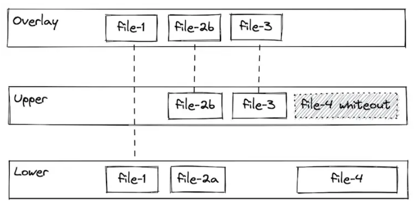

**End of Containers!**

### Github Actions

#### What is Github Actions?

GitHub Actions are packaged scripts to automate tasks in a software-development workflow in GitHub. You can configure GitHub Actions to trigger complex workflows that meet your organization's needs. The trigger can happen each time developers check new source code into a specific branch, at timed intervals, or manually. The result is a reliable and sustainable automated workflow, which leads to a significant decrease in development time.

#### Github Features

GitHub is designed to help teams of developers and DevOps engineers build and deploy applications quickly. There are many features in GitHub that enable this, but they generally fall into one of two categories:

Communication: Consider all of the ways that GitHub makes it easy for a team of developers to communicate about the software development project: code reviews in pull requests, GitHub issues, project boards, wikis, notifications, and so on.
Automation: GitHub Actions lets your team automate workflows at every step in the software-development process, from integration to delivery to deployment. It even lets you automate adding labels to pull requests and checking for stale issues and pull requests.

#### Types of Actions

There are three types of GitHub actions: container actions, JavaScript actions, and composite actions.

With container actions, the environment is part of the action's code. These actions can only be run in a Linux environment that GitHub hosts. Container actions support many different languages.

JavaScript actions don't include the environment in the code. You'll have to specify the environment to execute these actions. You can run these actions in a VM (virtual machine) in the cloud or on-premises. JavaScript actions support Linux, macOS, and Windows environments.

Composite actions allow you to combine multiple workflow steps within one action. For example, you can use this feature to bundle together multiple run commands into an action, and then have a workflow that executes the bundled commands as a single step using that action.

#### Github Actions Workflows

A GitHub Actions workflow is a process that you set up in your repository to automate software-development lifecycle tasks, including GitHub Actions. With a workflow, you can build, test, package, release, and deploy any project on GitHub. To create a workflow, you add actions to a .yml file in the .github/workflows directory in your GitHub repository.

A workflow must have at least one job. A job is a section of the workflow associated with a runner. A runner can be GitHub-hosted or self-hosted, and the job can run on a machine or in a container. You'll specify the runner with the runs-on: attribute. A runner is simply a server that has the GitHub Actions runner application installed.

#### Components of Github Actions

There are several components that work together to run tasks or jobs within a GitHub Actions workflow. In short, an event triggers the workflow, which contains a job. This job then uses steps to dictate which actions will run within the workflow.

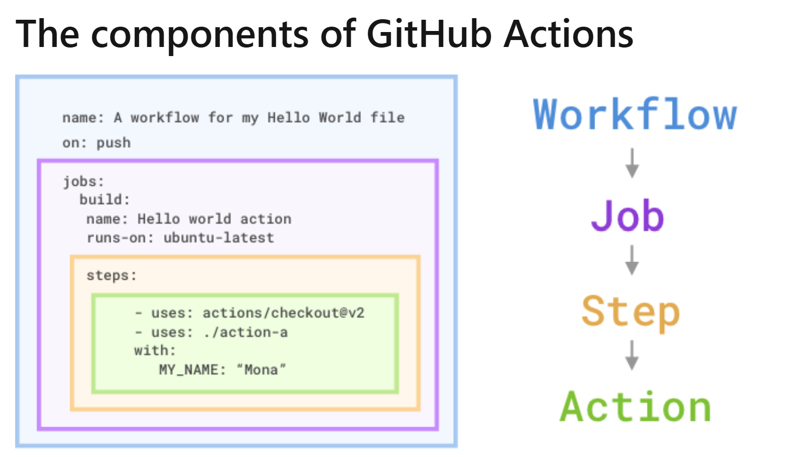

A workflow is an automated process that you add to your repository. A workflow needs to have at least one job, and different events can trigger it. You can use it to build, test, package, release, or deploy your repository's project on GitHub.

The job is the first major component within the workflow. A job is a section of the workflow that will be associated with a runner. A runner can be GitHub-hosted or self-hosted, and the job can run on a machine or in a container.

A step is an individual task that can run commands in a job.

The actions inside your workflow are the standalone commands that are executed. These standalone commands can reference GitHub actions such as using your own custom actions, or community actions.

#### More on Github Actions

In addition to default environment variables, you can use defined variables as contexts. Contexts and default variables are similar in that they both provide access to environment information, but they have some important differences. While default environment variables can only be used within the runner, context variables can be used at any point within the workflow. For example, context variables allow you to run an if statement to evaluate an expression before the runner is executed.

#### Some Important Actions

1. actions/checkout:

   - Clones your repository to the GitHub Actions runner.
   - Checks out the specified ref (branch, tag, SHA).
   - Sets up Git credentials for subsequent Git operations.
   - Configures the Git environment for the workflow.

2. actions/setup-node:

   - Sets up a Node.js environment for use in your workflow.
   - Allows you to specify the Node.js version.
   - Useful for installing dependencies and running JavaScript/TypeScript builds or tests.

3. actions/cache:

   - Caches dependencies and build outputs to speed up workflow execution.
   - Commonly used to cache package manager directories (e.g., npm, pip, Maven).

4. actions/upload-artifact & actions/download-artifact:

   - Uploads and downloads build artifacts between workflow steps or jobs.
   - Useful for sharing files (e.g., test reports, binaries) across jobs.

5. docker/build-push-action:

   - Builds and pushes Docker images to a container registry.
   - Supports advanced features like build caching and multi-platform builds.

6. actions/setup-python:

   - Sets up a Python environment for your workflow.
   - Allows you to specify the Python version and install dependencies.

7. github/codeql-action:

   - Runs CodeQL analysis for security and code quality scanning.
   - Helps identify vulnerabilities in your codebase.

8. actions/github-script:

   - Allows you to run custom JavaScript directly in your workflow.
   - Useful for automating GitHub API calls or custom logic.

For a comprehensive list, see the [GitHub Actions Marketplace](https://github.com/marketplace?type=actions).

**End of Github Actions!**

### DevOps Directive Kubernetes Course ([link](https://youtu.be/2T86xAtR6Fo?si=FrIHT84JCSGWPfY6))

#### Terminologies

**Clusters**: a set of machines (physical or virtual) that work together to run containerized applications. It consists of at least one control plane (master node) and multiple worker nodes.

**Nodes**: a single machine (physical or virtual) in a Kubernetes cluster. Nodes are responsible for running the workloads (pods and containers). There are two types of nodes:

- Control Plane Node (Master Node): Manages the cluster, schedules workloads, and maintains the desired state of the system.
- Worker Node: Executes the workloads (pods and containers). Each worker node has a kubelet (agent) that communicates with the control plane.

**Namespaces**: a logical partition within a Kubernetes cluster. It is used to organize and isolate resources (like pods, services, and deployments) within the cluster. Namespaces are particularly useful in multi-tenant environments, where different teams or projects share the same cluster but need resource isolation.

**Workloads**: an application or a set of applications running on the cluster.

**Pods**: the smallest deployable unit in Kubernetes. It represents a single instance of a running process in your cluster. A pod can contain one or more containers that share the same network namespace, storage, and configuration. Pods are ephemeral by nature, meaning they can be created, destroyed, and replaced as needed.

**Containers**: a lightweight, standalone, and executable package of software that includes everything needed to run an application (code, runtime, libraries, and dependencies). In Kubernetes, containers are run inside pods. Kubernetes supports multiple container runtimes, with Docker being the most commonly used.

**CPU Requests**: CPU requests specify the minimum amount of CPU resources a container is guaranteed to have. Kubernetes uses this value to schedule the container on a node that has enough available CPU capacity. Measured in cores or millicores.
If a container's CPU request is not set, Kubernetes may schedule it on a node without guaranteeing that the container will have enough CPU resources, which could lead to performance issues.

**CPU Limits**: CPU limits specify the maximum amount of CPU resources a container is allowed to use. If the container tries to exceed this limit, Kubernetes throttles the container's CPU usage. Measured in cores or millicores.
If a container's CPU limit is not set, it can use as much CPU as is available on the node, potentially starving other containers of resources.

#### Kubernetes Architecture

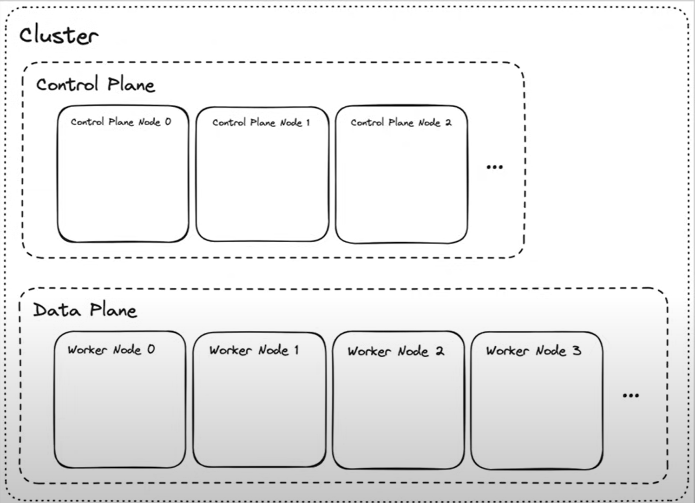

Node: A "node" is a computer/server. Multiple nodes are joined together to form a "cluster".

Control Plane: A subset of nodes in the cluster dedicated to performing system tasks. Nodes that are part of the control plane are referred to as "control plane nodes".

Data Plane: A subset of nodes in the cluster dedicated to running user worklods. Nodes that are part of the data plane are referred to as "worker nodes".

#### Kubernetes System Components

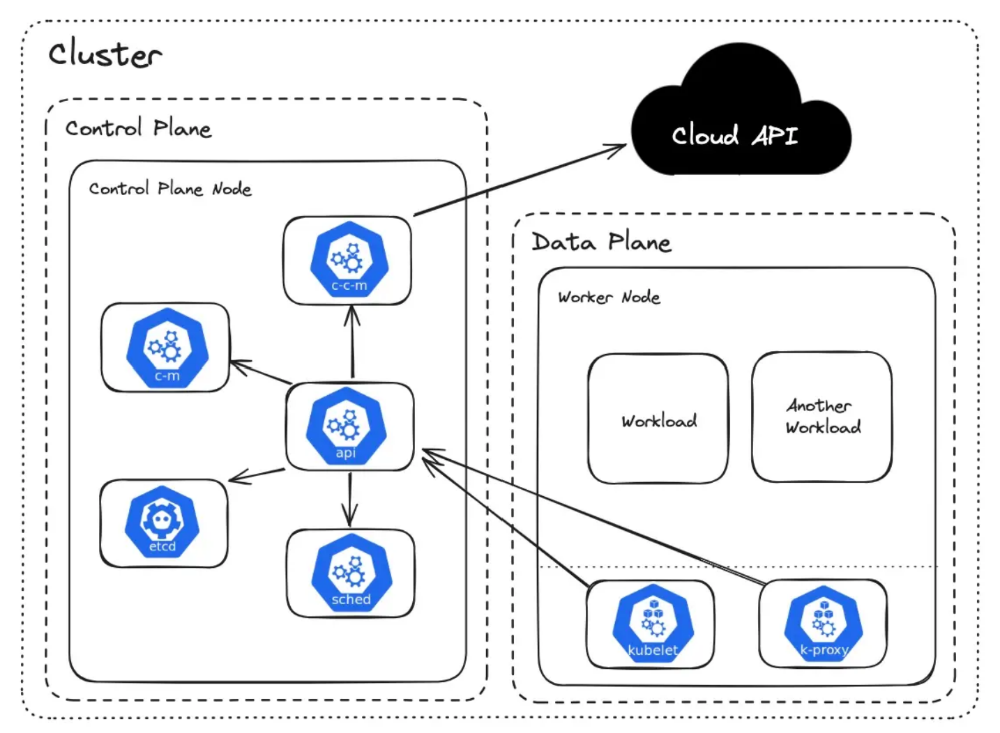
Kubernetes is comprised of many smaller components:

- etcd: Key-value store used for storing all cluster data. It serves as the source of truth for the cluster state and configuration.

- kube-apiserver: The front end for the Kubernetes control plane.

- kube-scheduler: Schedules pods onto the appropriate nodes based on resource availability and other constraints.

- kube-controller-manager: Runs controller processes. Each controller is a separate process that manages routine tasks such as maintaining the desired state of resources, managing replication, handling node operations, etc...

- cloud-controller-manager: Integrates with the underlying cloud provider (if running in one) to manage cloud-specific resources. It handles tasks such as managing load balancers, storage, and networking.

- kubelet: An agent that runs on each worker node and ensures that containers are running in pods and manages the lifecycle of containers.

- kube-proxy: This network proxy runs on each node and maintains network rules to allow communication to and from pods (not a necessity, other networking mechanisms exist).

- Interfaces: Container Runtime Interface (CRI), Container Network Interface (CNI), Container Storage Interface (CSI). Defining these interfaces allows for a modular system where innovation can happen outside of the main Kubernetes project and be easily “plugged in” or swapped to achieve new functionality.
  - CRI: Standard interface that Kubernetes uses to exeucte and run container processes within the system (e.g., container d, cri-o). Docker is no longer compatible.
  - CNI: Defines how networking should be set up for the containers running within Kubernetes. Many different ones exist. Not all of them uses kube-proxy.
  - CSI: Interface to provide storage to containers through drivers (e.g., cloud specific driver, cert manager driver, secrets store driver).

Kubernetes uses Docker images (OCI-compliant container images) as the standardized packaging format, but runs them through container runtimes like containerd or CRI-O that implement the Container Runtime Interface (CRI). This separation allows Kubernetes to support multiple runtime implementations while maintaining compatibility with the widely-adopted Docker image format.

[CNCF Landscape](https://landscape.cncf.io/) -> A website to find all the tools that are out there

#### Setup Tools

- DevBox: Devbox is a command-line tool developed by Jetpack.io that creates isolated, reproducible development environments. It allows developers to specify and manage development dependencies using a simple configuration file.
- KinD: simple local cluster for development. Supports multiple nodes where each node is a container.
- Civo: managed cluster platform.
- GKE: Google's Kubernetes Engine for a recommended managed cluster experience. Two modes: standard and autopilot. Google manages control plane in both but autopilot abstracts more details.

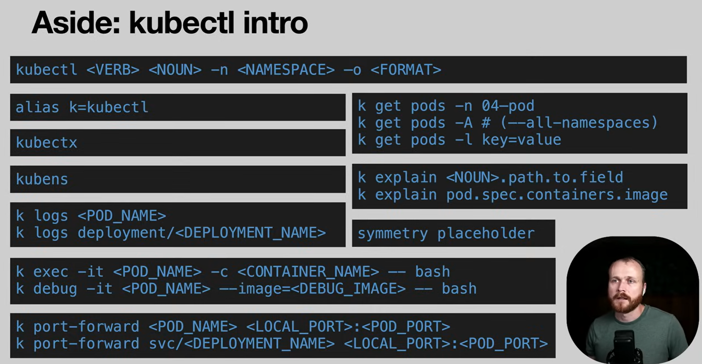

#### Built-in Kubernetes Resources

- Namespace: provides a mechanism to logically group resources within a cluster. There are four initial namespaces: default, kube-system, kube-node-lease, kube-public.
  By default, namespaces DO NOT act as a network/security boundary.
- Pods: the smallest deployable unit in Kubernetes. You almost never create a pod directly. Containers within a pod share networking and storage. Usually primary container, init containers (ran before primary container is run), and sidecar containers (run alongside primary container in perpetuity). To investigate a pod: `kubectl logs some-pod`. `kubectl get pods -o wide`

  **Pod -> ReplicaSet -> Deployment -> StatefulSet**

- ReplicaSet: creates replica instances of the pods at all time. labels are the link between ReplicaSet and Pods.
- Deployment: adds the concept of rollouts and rollbacks to ReplicaSet. Used for long-running stateless applications.
- Service: an internal load balancer across replicas. It routes network traffic. Uses pod labels to determine which pods to serve. Types: ClusterIP (internal), NodePort (listens on each node in cluster), LoadBalancer (provisions external load balancer with cloud provider)

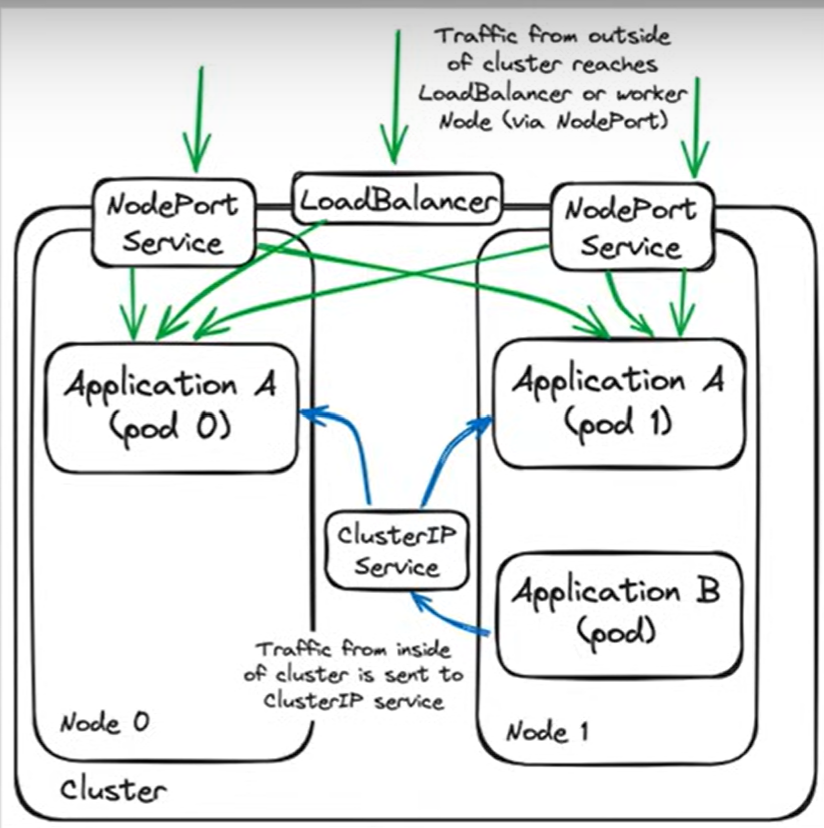

- Jobs: pods with completion tracking. Adds ability to retry pods. To investigate a job: `kubectl describe job some-job`
- CronJobs: scheduled jobs. [How the schedule string works](https://crontab.guru).
- DaemonSet: runs a copy of the specific pod on all (or some) nodes in the cluster. Useful for log aggregation, cluster storage daemon, monitoring. An example would be Grafana.
- StatefulSet: Similar to deployments but designed for stateful workloads. Has sticky identity (e.g., pod-0, pod-1), each pod mounts separate volumes, rollout behavior is ordered. Limitation: can't modify many of the fields after a StatefulSet has been created. InitContainers are often used with StatefulSets.
  Note that a headless ClusterIP service is needed to address each pod in the StatefulSet individually (DNS resolution) as the normal ClusterIP service provides a single stable IP address and DNS name for accessing the StatefulSet pods as a whole and not individually.
- ConfigMaps: enable environment specific configuration to be decoupled from container images. Two primary styles: property-like keys, file-like keys.
- Secrets: similar to ConfigMaps with one main difference: data is base64 encoded. This is to support binary data.
- Ingress: enables routing traffic to many services via a single external LoadBalancer (ingress controllers e.g., Ingress-nginx, HAProxy, Kong). Only officialy supports layer 7 routing but some application allow for layer 4 (TCP/UDP) routing.
  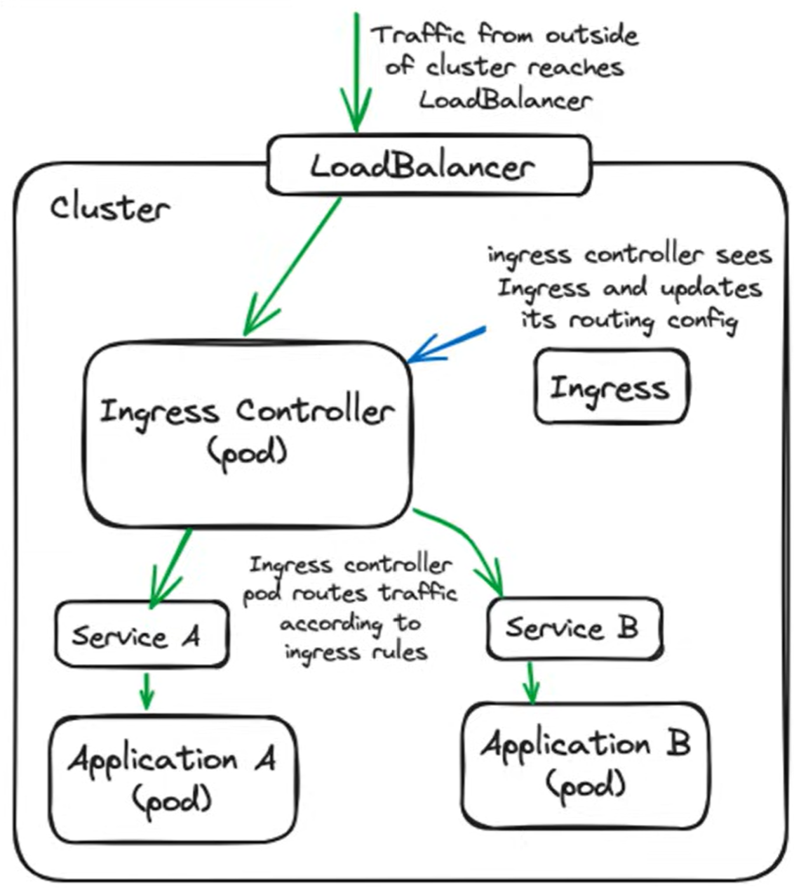
- GatewayAPI: evolution of the Ingress API. Adds support for layer 4 routing and more advanced routing scenarios.
  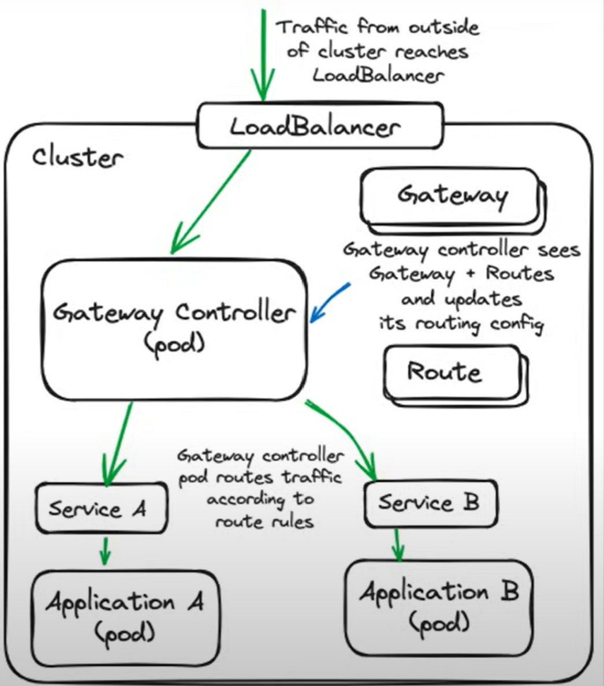
  (See Ingress x GatewayAPI x LoadBalancer GPT explanation below)
- PersistentVolume & PersistentVolumeClaim: provides api for persistent storage. Access modes: ReadWriteOnce (limited mounting to one node) ReadWriteOncePod (one pod), ReadOnlyMany, ReadWriteMany. Reclaim policy: retain vs delete.
  Note that dynamically specified Deployments and StatefulSets behave different when it comes tp PersistentVolumeClaim, where Deployment only creates one volume claim that is shared across the pods but StatefulSets creates one per pod.
  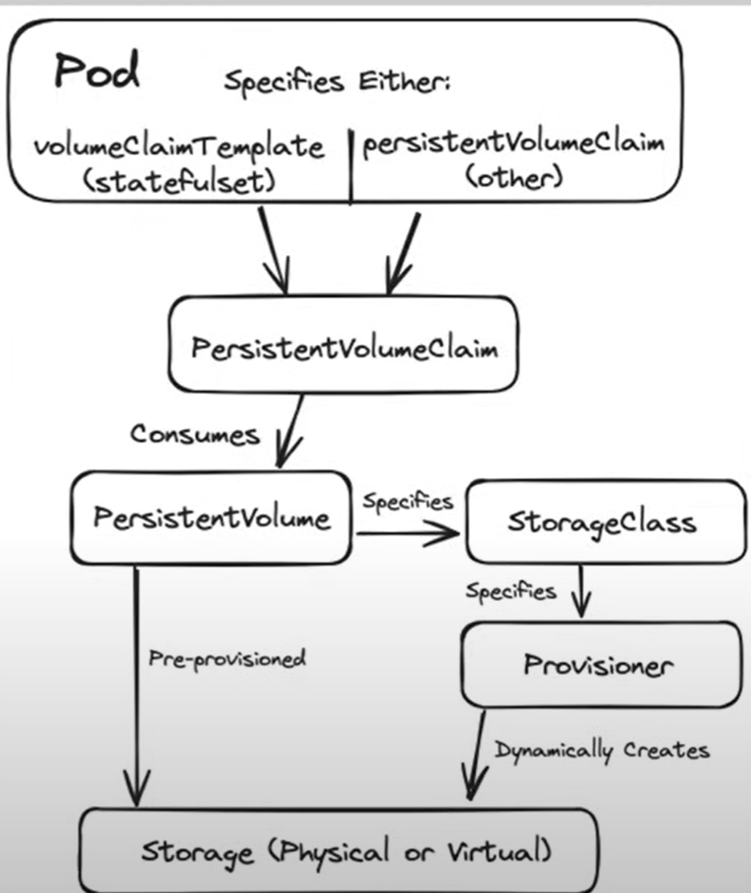
- RBAC (ServiceAccount, Role, RoleBinding): provide applications or users access to the Kubernetes API. Access can be granted by namespace or cluster wide.
- Labels: key-value pairs used to identify and organize Kubernetes resources. Can be used to filter api-servier queries (e.g., with kubectl).
- Annotations: Key-value pairs used for non-identifiying metadata. Used for things like configuration details, deployment history. Often used by tools to configure specific behaviors (e.g., ingress annotations).
  **Ingress x GatewayAPI x LoadBalancer GPT explanation:**

**Ingress** is a Kubernetes API object that manages external access to services within a Kubernetes cluster, typically HTTP/HTTPS traffic. It acts as a smart router, allowing you to define rules for routing traffic from outside the cluster to internal services based on hostnames, paths, or other criteria.

**Key points about Ingress:**

- It provides a way to expose multiple services under the same IP address or DNS name.
- Ingress resources define rules (e.g., "traffic to `/api` goes to Service A, `/web` goes to Service B"). Services here are the different application components.

  Typical flow of a request:

  ```
  External Request → Load Balancer → Ingress Controller → Single Ingress Resource
                                              ├── /api → Backend Service → Backend Pods
                                              ├── /web → Frontend Service → Frontend Pods
                                              └── /admin → Admin Service → Admin Pods
  ```

- Ingress requires an **Ingress Controller** (like NGINX, Traefik, or HAProxy) to actually implement the routing logic.

**Important Summary:**

**Ingress Controller = The software/infrastructure (nginx, traefik, ALB) - shared across cluster.**

**Ingress Resource = Your app's specific routing rules - one per app/service.**

---

The **Gateway API** is a newer, more flexible, and extensible way to manage traffic into Kubernetes clusters. It aims to address some limitations of Ingress and provide a more expressive model for traffic management.

**Key points about Gateway API:**

- It introduces new resources: `GatewayClass`, `Gateway`, `HTTPRoute`, `TCPRoute`, etc.
- It separates infrastructure concerns (e.g., how traffic enters the cluster) from application routing (e.g., which service gets the traffic).
- It supports advanced use cases like traffic splitting, header-based routing, and cross-namespace routing.
- It is designed to be more portable across different environments and vendors.

---

A **Load Balancer** in Kubernetes is typically an external or cloud-managed resource that distributes incoming network traffic across multiple backend pods or services to ensure reliability and scalability.

**Key points about Load Balancers:**

- When you create a `Service` of type `LoadBalancer`, Kubernetes asks the cloud provider (e.g., AWS, GCP, Azure) to provision an external load balancer.
- The load balancer gets a public IP address and forwards traffic to the Kubernetes nodes, which then route it to the appropriate pods.
- In on-premises environments, you might use MetalLB or similar solutions to provide load balancer functionality.

---

**How They Work Together:** Here’s how these components typically interact in a Kubernetes environment:

1. **External Traffic Entry:**  
   Traffic from the internet first hits a **Load Balancer** (provisioned by a Service of type LoadBalancer or by the Gateway API).

2. **Routing to the Cluster:**  
   The load balancer forwards the traffic to one or more Kubernetes nodes, targeting the Ingress Controller or Gateway implementation running as a pod.

3. **Application Routing:**

   - If using **Ingress**, the Ingress Controller reads Ingress resources and routes the traffic to the correct service based on the rules.
   - If using **Gateway API**, the Gateway implementation reads Gateway and Route resources to determine how to route the traffic.

4. **Service Discovery:**  
   The traffic is finally forwarded to the appropriate Kubernetes Service, which then load balances it across the relevant pods.

#### Helm

Helm is the De-facto standard for distributing software for Kubernetes. Its a combination of a package manager and a templating engine. Primary use cases: application deployment, environment management.
Commands:

- helm install
- helm upgrade
- helm rollback

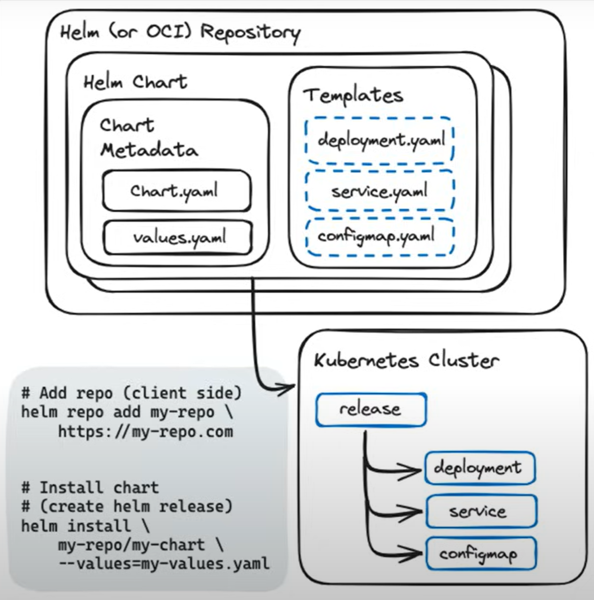

#### Demo Application

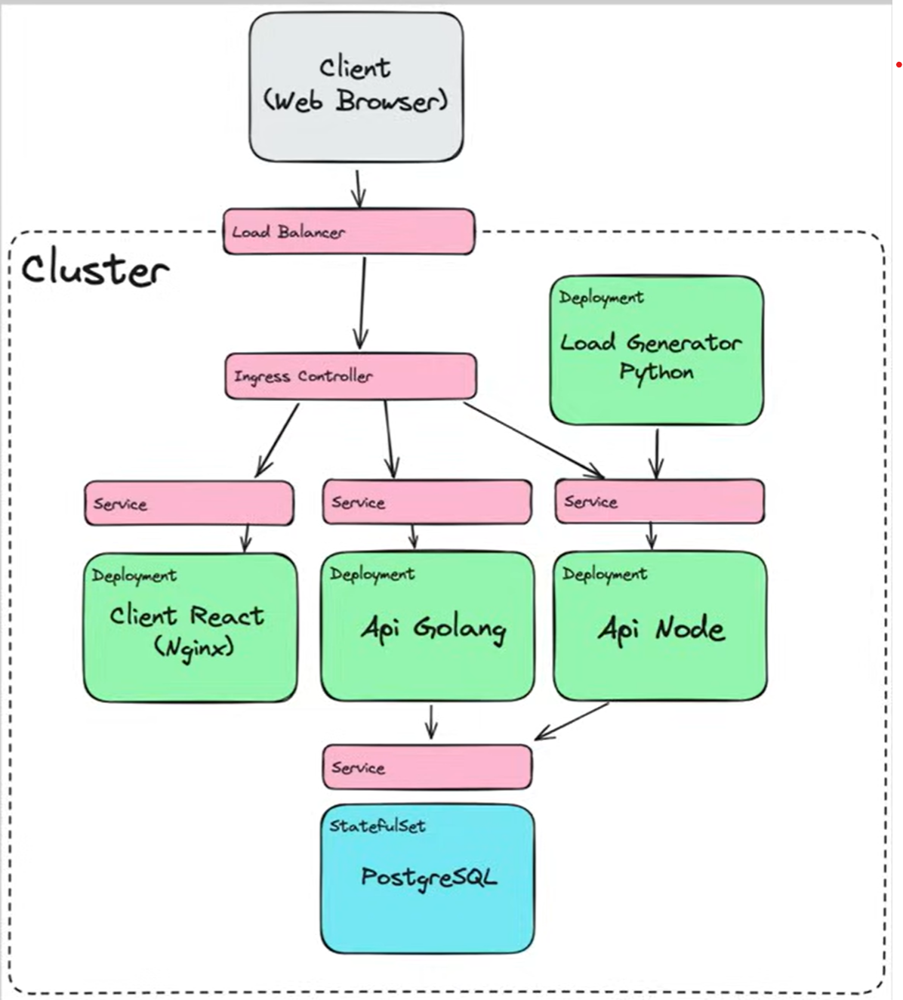
Demo application architecture. Container images hosting on docker hub used for all components except postgres and ingress controller, to which helm charts were used.

#### Extending the Kubernetes API

Kubernetes is not just a container orchestrator.
It provides an API for:

- Declaring a set of resources.
- Observing and acting upon those resources (control loop).

Custom Resource Definitions (CRDs) allow applications to extend the default resource set.

Custom controllers observe and act upon CRDs.

Use Cases:

- Embed custom login into "Operators" (CloudNativePG).
- Manage TLS certificates (Cert-Manager).
- Deploy infrastructure with automatic reconciliation (Crossplane).

To build your own resource, define your own configuration and build a controller (operator) to act upon that custom configuration.

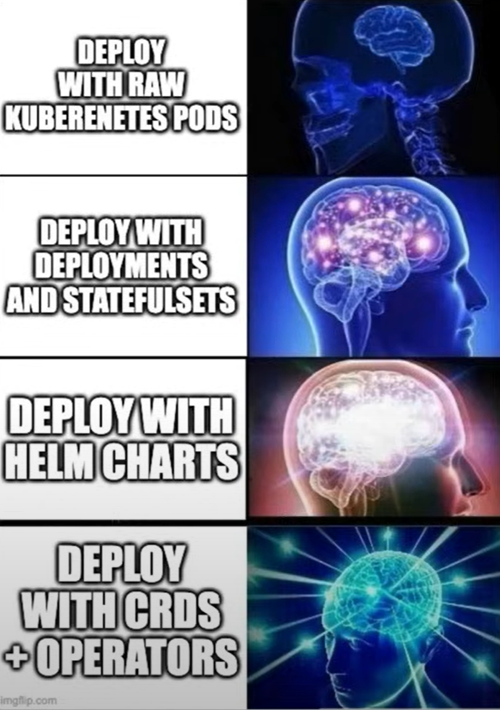

#### Auxiliary Tooling

**CloudNative PG:** A Kubernetes operator that manages PostgreSQL workloads with high availability, disaster recovery, and cloud-native features. Barman: backup and recovery manager.

**Trivy Operator:** A Kubernetes operator that continuously scans your cluster for vulnerabilities and misconfigurations using Trivy scanner.

#### Developer Experience

**Tilt:** A developer tool that rebuilds, deploys, and updates your application continuously as you edit code, providing fast feedback for Kubernetes development workflows. This is better than using a docker compose as tilt works in a real kubernetes environment, rather than just a Dockerfile.

**External Secrets Operator**: A Kubernetes operator that synchronizes secrets from external APIs (like AWS Secrets Manager, HashiCorp Vault, or Azure Key Vault) into Kubernetes as Secret resources.

#### Debugging

[Troubleshooting Guide](https://learnk8s.io/troubleshooting-deployments)

#### Deploying to Multiple Environments

1. Kustomize: a tool built into kubectl. Uses base + overlay model where you define some base configuration and then for each environment you will specify an overlay. Its limitations lie within lists and multi-line strings in YAML.
   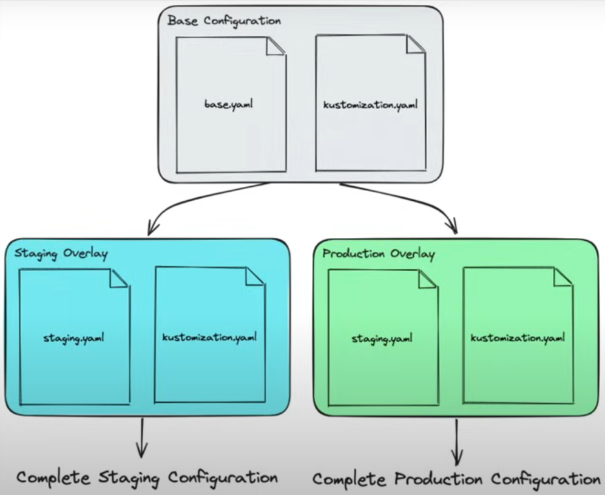
2. Helm: uses a templating model. A configuration file for each environment. Has "hooks" which allow encoding dependencies. Its limitations are with the un-readable templates at a large scale, boilerplate configuration, and CRD management is limited.
3. Kluctl: uses a templating model. Also has hooks. Integrates with helm and kustomize. Includes a built in GitOps engine. Great choice for deploying to multiple environments, but requires slightly more setup.

#### Cluster/Node Upgrades

**Upgrade Process:**

1. `Check for usage of deprecated APIs`: If you are using deprecated APIs that will be removed by a Kubernetes upgrade, you need to address those before upgrading. One tool that automatically checks this is [kubent](https://github.com/doitintl/kube-no-trouble).

2. `Update the control plane`: The control plane version can be ahead of the worker nodes, but cannot be behind so it is updated first.

3. `Create a new nodepool`: Rather than update nodes in place, it can be safer to create a new node group. This way the new nodes will be fully operational before you shift workloads to them and if something goes wrong you can shift the workloads back to the old nodes.

4. `Drain and cordon the old nodes`: You can use kubernetes scheduling capabilities to shift all of the pods onto the newly provisioned nodes.

5. `Delete the old nodepool`: Once all of the workloads are successfully running on the new nodes, you can safely delete the old nodes.

_Note: managed clusters may not give the perms to follow the above process, to which you will have to upgrade in place. Some people also prefer to deploy entirely new clusters rather than upgrading (depending on the amount of state in the cluster)._

#### CI/CD

##### Deployment Strategies

- Level -1: kubectl create (imperative).
- Level 0: kubectl apply manually (declarative).
- Level 1: kubectl apply from pipeline (automated).
- Level 2: GitOps (continuous).

##### Continuous Integration

- Run linting, tests, validation.
- Build and push container images.

Both of these are easily done via Github Actions.

[**Sample Github Actions CI Workflow**](workflows/image-ci.yml)

This workflow builds and pushes Docker images (CI), while updating image tags in Kubernetes manifests for CD.

##### Continuous Delivery

- Update Kubernetes manifests using Github Actions.

- Apply updated manifests to cluster(s) using kluctl GitOps (or other CD tools like ArgoCD).

  Kluctl GitOps architecture:
  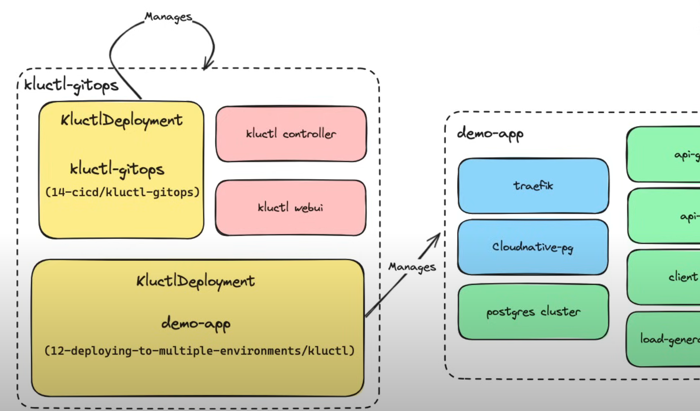

- Validate deployments worked as expected.

**End of DevOps Directive Kubernetes Course!**

### GitOps

#### What is GitOps?

GitOps is a way to do Kubernetes cluster management and application delivery. It works by using Git as a single source of truth for declarative infrastructure and applications (i.e., infrastructure as code), together with tools ensuring the actual state of infrastructure and applications converges towards the desired state declared in Git. With Git at the center of your delivery pipelines, developers can make pull requests to accelerate and simplify application deployments and operations tasks to your infrastructure or container-orchestration system (e.g. Kubernetes).

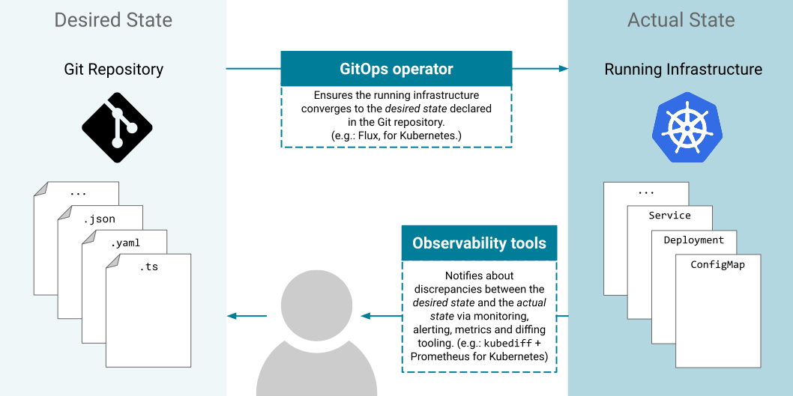

The core idea of GitOps is having a Git repository that always contains declarative descriptions of the infrastructure currently desired in the production environment and an automated process to make the production environment match the described state in the repository. If you want to deploy a new application or update an existing one, you only need to update the repository - the automated process handles everything else. It’s like having cruise control for managing your applications in production.

_GitOps: versioned CI/CD on top of declarative infrastructure. Stop scripting and start shipping._ - Kelsey Hightower

_GitOps is a subset of DevOps: GitOps implements DevOps principles (automation, collaboration) but focuses specifically on deployment workflows. - Deepseek R1_

#### Perks of using GitOps

_High Velocity Deployments_: What is unique about GitOps is that you don’t have to switch tools for deploying your application. Everything happens in the version control system you use for developing the application anyways.

_Easy and Fast Error Recovery_: With GitOps you have a complete history of how your environment changed over time. This makes error recovery as easy as issuing a `git revert` and watching your environment being restored.

_The Git record is then not just an audit log but also a transaction log. You can roll back & forth to any snapshot._ - Alexis Richardson

_Easier Credential Management_: GitOps allows you to manage deployments completely from inside your environment. For that, your environment only needs access to your repository and image registry. That’s it. You don’t have to give your developers direct access to the environment.

_Self-documenting Deployments_: Have you ever SSH’d into a server and wondered what’s running there? With GitOps, every change to any environment must happen through the repository. You can always check out the master branch and get a complete description of what is deployed where plus the complete history of every change ever made to the system. And you get an audit trail of any changes in your system for free!

_Shared Knowledge_: Using Git to store complete descriptions of your deployed infrastructure allows everybody in your team to check out its evolution over time. With great commit messages everybody can reproduce the thought process of changing infrastructure and also easily find examples of how to set up new systems.

#### How does GitOps work?

_Environment Configurations as Git repository_: GitOps organizes the deployment process around code repositories as the central element. There are at least two repositories: the application repository and the environment configuration repository. The application repository contains the source code of the application and the deployment manifests to deploy the application. The environment configuration repository contains all deployment manifests of the currently desired infrastructure of an deployment environment. It describes what applications and infrastructural services (message broker, service mesh, monitoring tool, …) should run with what configuration and version in the deployment environment.

_Push-based vs. Pull-based Deployments_: There are two ways to implement the deployment strategy for GitOps: Push-based and Pull-based deployments. The difference between the two deployment types is how it is ensured, that the deployment environment actually resembles the desired infrastructure. When possible, the Pull-based approach should be preferred as it is considered the more secure and thus better practice to implement GitOps.

The Push-based deployment strategy is implemented by popular CI/CD tools such as Jenkins, CircleCI, or Travis CI. The source code of the application lives inside the application repository along with the Kubernetes YAMLs needed to deploy the app. Whenever the application code is updated, the build pipeline is triggered, which builds the container images and finally the environment configuration repository is updated with new deployment descriptors.

Tip: You can also just store templates of the YAMLs in the application repository. When a new version is built, the template can be used to generate the YAML in the environment configuration repository.

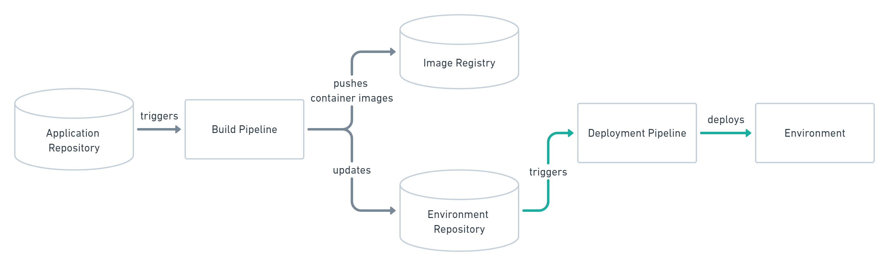

With this approach it is indispensable to provide credentials to the deployment environment. So the pipeline has god-mode enabled. In some use cases a Push-based deployment is inevitable when running an automated provisioning of cloud infrastructure. In such cases it is strongly recommended to utilize the fine-granular configurable authorization system of the cloud provider for more restrictive deployment permissions.

Another important thing to keep in mind when using this approach is that the deployment pipeline only is triggered when the environment repository changes. It can not automatically notice any deviations of the environment and its desired state. This means, it needs some way of monitoring in place, so that one can intervene if the environment doesn’t match what is described in the environment repository.

The Pull-based deployment strategy uses the same concepts as the push-based variant but differs in how the deployment pipeline works. Traditional CI/CD pipelines are triggered by an external event, for example when new code is pushed to an application repository. With the pull-based deployment approach, the operator is introduced. It takes over the role of the pipeline by continuously comparing the desired state in the environment repository with the actual state in the deployed infrastructure. Whenever differences are noticed, the operator updates the infrastructure to match the environment repository. Additionally the image registry can be monitored to find new versions of images to deploy.


Just like the push-based deployment, this variant updates the environment whenever the environment repository changes. However, with the operator, changes can also be noticed in the other direction. Whenever the deployed infrastructure changes in any way not described in the environment repository, these changes are reverted. This ensures that all changes are made traceable in the Git log, by making all direct changes to the cluster impossible.

This change in direction solves the problem of push-based deployments, where the environment is only updated when the environment repository is updated. However, this doesn’t mean you can completely do without any monitoring in place. Most operators support sending mails or Slack notifications if it can not bring the environment to the desired state for any reason, for example if it can not pull a container image. Additionally, you probably should set up monitoring for the operator itself, as there is no longer any automated deployment process without it.

The operator should always live in the same environment or cluster as the application to deploy. This prevents the god-mode, seen with the push-based approach, where credentials for doing deployments are known by the CI/CD pipeline. When the actual deploying instance lives inside the very same environment, no credentials need to be known by external services. The Authorization mechanism of the deployment platform in use can be utilized to restrict the permissions on performing deployments. This has a huge impact in terms of security. When using Kubernetes, RBAC configurations and service accounts can be utilized.

#### Working with Multiple Applications and Environments

You can always just set up multiple build pipelines that update the environment repository. From there on the regular automated GitOps workflow kicks in and deploys all parts of your application.

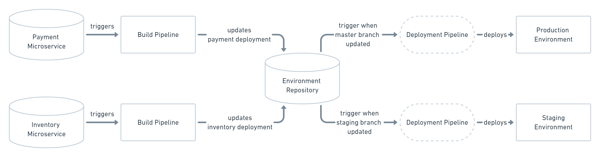

Managing multiple environments with GitOps can be done by just using separate branches in the environment repository. You can set up the operator or the deployment pipeline to react to changes on one branch by deploying to the production environment and another to deploy to staging.

#### Secret Handling

First of all, never store secrets in plain text in git! Never!

That being said, you have secrets created within the environment which never leave the environment. The secret stays unknown, and applications get the secrets they require but they aren’t exposed to the outside world. For example, you provision a database within the environment and give the secret to the applications interacting with the database only.

Another approach is to add a private key once to the environment (probably by someone from a dedicated ops team) and from that point you can add secrets encrypted by the public key to the environment repository. There’s even tool support for such sealed secrets in the K8s ecosystem.

_There are no GitOps engineers. GitOps is not a role (and neither is DevOps). GitOps is a set of practices. You can look for a developer who has experience practicing GitOps — or simply let your developers try out those practices._

#### GitOps References

- https://github.com/weaveworks/awesome-gitops
- https://www.gitops.tech/

**End of GitOps!**

### Certified Kubernetes Application Developer (CKAD) Certification

#### About The Certification

The [Certified Kubernetes Application Developer (CKAD) certification](https://training.linuxfoundation.org/certification/certified-kubernetes-application-developer-ckad/) is a performance-based exam designed to validate a candidate's ability to design, build, and run applications on Kubernetes. It focuses on core concepts such as configuration, multi-container pods, observability, pod design, services, networking, and state persistence. The exam is hands-on and requires practical knowledge of Kubernetes resources, YAML manifest creation, and troubleshooting skills, making it ideal for developers who want to demonstrate their proficiency in deploying and managing applications in Kubernetes environments.

#### Resources

There are many ways to help prepare you for the [CKAD exam](https://training.linuxfoundation.org/certification/certified-kubernetes-application-developer-ckad/), the following notes are based on this [udemy course](https://udemy.com/course/certified-kubernetes-application-developer) with its practical labs from [KodeKloud](https://kodekloud.com/).

For practice exams, [killer.sh](https://killer.sh/) and [acloud.guru](http://acloud.guru/) are the go to.

### CKAD Udemy Course [(link)](https://udemy.com/course/certified-kubernetes-application-developer)

#### Section 1: Introduction

All introductory concepts are already covered with my other notes above. Be sure to be comfortable with the concepts above.

In the following sections, **I have only included new information, mainly commands, tips and tricks, and the practical side of Kubernetes**. Be sure to get your hands dirty, preferably follow the practical labs from [KodeKloud](https://kodekloud.com/).

#### Section 2: Core Concepts

##### Container Runtimes

Support for docker as Kubernete's container runtime (through dockershim) was removed version 1.24. This meant only CRI runtimes (e.g., containerd) could be used.

CLI tools to interact with containers:

| Tool        | Description                                                              | Use Case                                       | Supported Runtimes        | CLI Syntax Example             |
| ----------- | ------------------------------------------------------------------------ | ---------------------------------------------- | ------------------------- | ------------------------------ |
| **ctr**     | Low-level CLI for containerd; exposes containerd’s API directly.         | Advanced debugging, scripting, direct control. | containerd                | `ctr images pull nginx:latest` |
| **nerdctl** | Docker-compatible CLI for containerd; supports Docker-like commands.     | Docker-like workflows with containerd backend. | containerd                | `nerdctl run -d nginx:latest`  |
| **crictl**  | CLI for CRI-compatible runtimes (containerd, CRI-O); Kubernetes-focused. | Debugging Kubernetes nodes, troubleshooting.   | containerd, CRI-O, others | `crictl pods`                  |

**Summary:**

- `ctr` is for direct, low-level containerd operations.
- `nerdctl` is for users familiar with Docker CLI, but using containerd.
- `crictl` is for interacting with Kubernetes container runtimes via the CRI.

##### YAML Manifests

**The required YAML fields for a Kubernetes object are:**

1. `apiVersion`: Specifies the version of the Kubernetes API to use for the object.
2. `kind`: Specifies the type of Kubernetes object (e.g., Pod, Deployment, Service).
3. `metadata`: Provides data that helps uniquely identify the object, including a `name` and optionally `namespace`, `labels`, etc.
4. `spec`: Defines the desired state and configuration for the object.

Example:

```yaml
apiVersion: v1
kind: Pod
metadata:
  name: my-pod
spec:
  containers:
    - name: my-container
      image: nginx
```

##### Pod Definitions

If you are not given a pod definition file, you may extract the definition to a file using the below command:

`kubectl get pod <pod-name> -o yaml > pod-definition.yaml`

To modify the properties of the pod, you can utilize the `kubectl edit pod <pod-name>` command. Please note that only the properties listed below are editable.

- spec.containers[*].image

- spec.initContainers[*].image

- spec.activeDeadlineSeconds

- spec.tolerations

- spec.terminationGracePeriodSeconds

With Deployments, however, you can easily edit ANY field/property of the POD template. Since the pod template is a child of the deployment specification, with every change the deployment will automatically delete and create a new pod with the new changes. So if you are asked to edit a property of a POD part of a deployment you may do that simply by running the command:

```
kubectl edit deployment my-deployment
```

##### Scaling ReplicaSets

To scale up a ReplicaSet, you can use the `kubectl scale` command and specify the desired number of replicas. For example, to scale a ReplicaSet named `my-replicaset` to 5 replicas:

```
kubectl replace -f replicaset.yaml
```

**Tip:** For minor changes, consider using `kubectl apply` (declarative) or `kubectl edit` (interactive) instead of `replace`, as `replace` will overwrite the entire resource.

Alternatively, you can use the scale command, but the manifest file would not be updated.

```
kubectl scale replicaset my-replicaset --replicas=5
```

Alternatively, you can edit the ReplicaSet manifest and update the `spec.replicas` field, then apply the changes:

```
export KUBE_EDITOR="nano" # otherwise, vi will be used..
kubectl edit replicaset my-replicaset
```

Change the `replicas` value under `spec` and save the file.

**Note:** Deployments manage ReplicaSets automatically, so it's recommended to scale Deployments instead of ReplicaSets directly in most cases.

##### Cluster DNS

Kubernetes provides built-in DNS-based service discovery for workloads running in the cluster. The DNS add-on (usually CoreDNS) automatically creates DNS records for Services and Pods, allowing applications to refer to each other by name.

- **Service DNS:** Each Service gets a DNS entry in the form `<service-name>.<namespace>.svc.cluster.local`. For example, a Service named `backend` in the `default` namespace is accessible at `backend.default.svc.cluster.local`.
- **Pod DNS:** Pods can also be assigned DNS records, but direct Pod addressing is less common.
- **Automatic Resolution:** Applications can use just the Service name if they're in the same namespace, or the fully qualified domain name (FQDN) for cross-namespace communication.

**Example:**
If a Deployment's Pods need to connect to a database Service called `postgres` in the `db` namespace, they can use the address: `postgres.db.svc.cluster.local`.

**Note:** CoreDNS is the default DNS provider in modern Kubernetes clusters. You can check DNS resolution by running `nslookup <service-name>` or `dig <service-name>` from within a Pod.

**Troubleshooting:** If DNS resolution fails, check that the CoreDNS pods are running (`kubectl get pods -n kube-system -l k8s-app=kube-dns`) and that your Pod's DNS config is correct.

Switch namespaces manually (without kubens) using this command:

```
kubectl config set-context --current --namespace=<namespace-name>
```

##### Creating Manifest Files on The Run

`--dry-run`: By default, as soon as the command is run, the resource will be created.

If you simply want to test your command, use the `--dry-run=client` option. This will not create the resource. Instead, tell you whether the resource can be created and if your command is right.

`-o yaml`: This will output the resource definition in YAML format on the screen.

Use the above two in combination along with Linux output redirection to generate a resource definition file quickly, that you can then modify and create resources as required, instead of creating the files from scratch.

```
kubectl run nginx --image=nginx --dry-run=client -o yaml > nginx-pod.yaml
```

Similarly for other resource types:

```
kubectl create deployment --image=nginx nginx --dry-run -o yaml
```

Notice how run is used for Pods and create for all other resources.

Create a Service named redis-service of type ClusterIP to expose pod redis on port 6379:

```
kubectl expose pod redis --port=6379 --name redis-service --dry-run=client -o yaml
```

The above will automatically use the pod's labels as selectors.

Or:

```
kubectl create service clusterip redis --tcp=6379:6379 --dry-run=client -o yaml
```

This will not use the pods' labels as selectors; instead it will assume selectors as app=redis. You cannot pass in selectors as an option. So it does not work well if your pod has a different label set. So generate the file and modify the selectors before creating the service.

Now, what if you want to create a Service named nginx of type NodePort to expose pod nginx's port 80 on port 30080 on the nodes:

```
kubectl expose pod nginx --port=80 --name nginx-service --type=NodePort --dry-run=client -o yaml
```

Or

```
kubectl create service nodeport nginx --tcp=80:80 --node-port=30080 --dry-run=client -o yaml
```

Both the above commands have their own challenges. While one of it cannot accept a node port the other cannot accept a selector. I would recommend going with the `kubectl expose` command. If you need to specify a node port, generate a definition file using the same command and manually input the nodeport before creating the service.

##### Overriding Docker Image ENTRYPOINT and CMD in Kubernetes

In Kubernetes, when you specify a command in the Pod spec (under containers[].command), it overrides the Docker image’s ENTRYPOINT.

If you specify args (under containers[].args), it overrides the Docker image’s CMD.

**End of Section 2: Core Concepts!**

#### Section 3: Configuration

##### ConfigMaps and Secrets

ConfigMaps and Secrets allow a way to pass variables to Pods. The only difference is that a Secret is base64 encoded and is supposed to be used for sensitive data. You can still easily access the Secret data as its NOT encrypted by default.

You can (and should) encrypt Secrets at Rest in etcd by following the [documentation](https://kubernetes.io/docs/tasks/administer-cluster/encrypt-data/).

##### Service Accounts

By default, every Pod in Kubernetes is assigned a ServiceAccount named `default` in its namespace. The ServiceAccount's credentials (a token and CA certificate) are automatically mounted into the Pod at `/var/run/secrets/kubernetes.io/serviceaccount`. This allows applications running inside the Pod to authenticate to the Kubernetes API server.

You can specify a different ServiceAccount for a Pod by setting the `serviceAccountName` field in the Pod spec. If you do not want any ServiceAccount token to be mounted, set `automountServiceAccountToken: false` in the Pod or ServiceAccount spec.

**Example:**

```yaml
apiVersion: v1
kind: Pod
metadata:
   name: mypod
spec:
   serviceAccountName: my-custom-sa
   containers:
      - name: app
         image: nginx
```

**Key Points:**

- ServiceAccounts are used for Pod-to-API authentication.
- The default ServiceAccount is used unless overridden.
- Tokens are mounted as files in the Pod by default.
- You can create custom ServiceAccounts and bind roles to them for fine-grained access control.
- To list ServiceAccounts: `kubectl get serviceaccounts`
- To describe a ServiceAccount: `kubectl describe serviceaccount <name>`

##### Service Account Token: Secret Object vs TokenRequest API

**Legacy Secret-based Tokens:**

- Traditionally, when a ServiceAccount is created, Kubernetes automatically generates a long-lived Secret of type `kubernetes.io/service-account-token`.
- This Secret contains a JWT token and is mounted into Pods using that ServiceAccount.
- The token is static (does not expire) and is stored as a Secret resource in the namespace.
- Example:
  ```yaml
  apiVersion: v1
  kind: Secret
  type: kubernetes.io/service-account-token
  metadata:
    name: my-sa-token-xxxxx
    annotations:
      kubernetes.io/service-account.name: my-sa
  ```
- Drawbacks: Tokens are long-lived, cannot be easily revoked, and are visible as Secrets.

**TokenRequest API (Bound Service Account Tokens):**

- Introduced in Kubernetes 1.22+ for improved security.
- Tokens are created on-demand via the TokenRequest API (`/api/v1/namespaces/{namespace}/serviceaccounts/{name}/token`).
- These tokens are short-lived (default 1 hour), can be audience-bound, and are not stored as Secrets.
- Used by projected service account token volumes and for external systems needing a token.
- Example (kubectl):
  ```bash
  kubectl create token my-sa --duration=10m
  ```
- Benefits: Tokens are ephemeral, can be audience-restricted, and are not persisted in etcd.

**Historical Importance:**

In older Kubernetes versions, the default ServiceAccount had a secret with a static token mounted into Pods automatically. However, starting from Kubernetes 1.24 (and more fully in 1.25+), the ServiceAccount Token Volume Projection mechanism is used by default.

This means:

- Instead of mounting a static token secret, Kubernetes uses the TokenRequest API to dynamically request a short-lived token for the ServiceAccount.
- This token is projected into the Pod via a volume mount and is automatically refreshed.
- This approach improves security by avoiding long-lived static tokens.

**Best Practice:**

Prefer using the TokenRequest API and projected service account tokens for improved security and token management.

##### Resource Requirements

It is best practice to have at least requests of the pod set to guarantee its resources. If both limits and requests are not set, any pod can consume all available resources and starve the other pods in the node.

If both limits and requests are set, Kubernetes will ensure that the pod gets at least the requested resources, but will not allow it to exceed the specified limits. If a container tries to use more than its limit, it will be throttled (for CPU) or terminated (for memory), even if the resources are available and unused in the node.

**Example:**

```yaml
resources:
  requests:
    memory: '64Mi'
    cpu: '250m'
  limits:
    memory: '128Mi'
    cpu: '500m'
```

- `requests`: The minimum amount of resources guaranteed for the container.
- `limits`: The maximum amount of resources the container can use.

**Key Points:**

- If only `limits` are set, `requests` default to `limits`.
- If only `requests` are set, there is no upper bound; the container can use more if available.

**Commands:**

- To view resource usage:  
   `kubectl top pod <pod-name>`
- To describe resource requests/limits:  
   `kubectl describe pod <pod-name>`

**LimitRange:**

LimitRange is a Kubernetes resource that enforces default and maximum/minimum resource requests and limits for Pods or Containers within a namespace. This helps ensure that all workloads in a namespace have appropriate resource constraints, preventing resource starvation or overconsumption.

**Example:**

```yaml
apiVersion: v1
kind: LimitRange
metadata:
   name: mem-cpu-limit-range
spec:
   limits:
      - default:
            cpu: 500m
            memory: 256Mi
         defaultRequest:
            cpu: 250m
            memory: 128Mi
         type: Container
```

**ResourceQuota:**

ResourceQuota is a Kubernetes resource that sets aggregate resource limits (such as CPU, memory, number of objects) for a namespace. It helps prevent a single team or workload from consuming all resources in a shared cluster.

**Example:**

```yaml
apiVersion: v1
kind: ResourceQuota
metadata:
  name: compute-resources
spec:
  hard:
    pods: '10'
    requests.cpu: '4'
    requests.memory: 8Gi
    limits.cpu: '8'
    limits.memory: 16Gi
```

**Key Points:**

- ResourceQuotas are applied per namespace.
- If a quota is exceeded, new resources (pods, services, etc.) cannot be created until usage drops below the quota.
- Use `kubectl describe quota` to view current usage and limits.

**Best Practice:**

Combine `LimitRange` and `ResourceQuota` to enforce both per-container and per-namespace resource constraints.

##### Taints and Tolerations

Taints and tolerations work together to control which pods can be scheduled on which nodes in a Kubernetes cluster.

- **Taints** are applied to nodes and allow a node to repel a set of pods unless those pods explicitly tolerate the taint.
- **Tolerations** are applied to pods and allow (but do not require) the pods to be scheduled onto nodes with matching taints.

**Taint Example:**

```bash
kubectl taint nodes node1 key=value:NoSchedule
```

This command adds a taint to `node1` with key `key`, value `value`, and effect `NoSchedule`. Pods without a matching toleration will not be scheduled on this node.

**Toleration Example:**

```yaml
tolerations:
   - key: "key"
      operator: "Equal"
      value: "value"
      effect: "NoSchedule"
```

Add this toleration to a pod spec to allow it to be scheduled on nodes with the above taint.

**Taint Effects:**

- `NoSchedule`: Pod will not be scheduled on the node unless it tolerates the taint.
- `PreferNoSchedule`: Kubernetes will try to avoid placing a pod on the node unless necessary.
- `NoExecute`: Existing pods that do not tolerate the taint will be evicted from the node.

**Key Points:**

- Taints are for nodes; tolerations are for pods.
- Tolerations do not guarantee scheduling on tainted nodes—they only allow it.
- Use taints and tolerations to dedicate nodes to specific workloads or to isolate critical applications.

**Commands:**

- List taints on a node:  
   `kubectl describe node <node-name>`
- Remove a taint:  
   `kubectl taint nodes node1 key:NoSchedule-`

##### Node Selectors and Node Affinity

Node selectors and node affinity are mechanisms to influence pod scheduling onto specific nodes.

**Node Selector**

- The simplest way to constrain a pod to run on particular nodes.
- Uses node labels to select nodes.

**Example:**

```yaml
spec:
  nodeSelector:
    disktype: ssd
```

This pod will only be scheduled on nodes labeled `disktype=ssd`.

**Node Affinity**

- More expressive than nodeSelector.
- Supports required (hard) and preferred (soft) rules.
- Defined under `affinity.nodeAffinity` in the pod spec.

**Types:**

- `requiredDuringSchedulingIgnoredDuringExecution`: Pod is scheduled only if rules are met (hard requirement).
- `preferredDuringSchedulingIgnoredDuringExecution`: Scheduler tries to place the pod on matching nodes, but will use others if none match (soft preference).

**Example:**

```yaml
spec:
   affinity:
      nodeAffinity:
         requiredDuringSchedulingIgnoredDuringExecution:
            nodeSelectorTerms:
               - matchExpressions:
                     - key: disktype
                        operator: In
                        values:
                           - ssd
         preferredDuringSchedulingIgnoredDuringExecution:
            - weight: 1
               preference:
                  matchExpressions:
                     - key: zone
                        operator: In
                        values:
                           - us-east-1a
```

**Key Points:**

- Use nodeSelector for simple, single-label constraints.
- Use node affinity for complex, multi-label, or preference-based scheduling.
- Both mechanisms help ensure pods run on appropriate nodes for performance, compliance, or hardware requirements.
- Node affinity is recommended over nodeSelector for new workloads.

**Commands:**

- Add a label to a node:  
   `kubectl label nodes <node-name> <key>=<value>`
- View node labels:  
   `kubectl get nodes --show-labels`

**End of Section 3: Configuration!**

#### Section 4: Multi-Container Pods

Following a microservices architecture, its best practice to separate services as much as possible. For example, for a web server and a logging agent, you would not want to merge them as they function differently. You would want the two to be deployed separately but for them to work together. That can be achieved by placing the two in the same pod, sharing the same lifecycle, network, and resources. In a multi-container pod, each container is expected to run a process that stays alive as long as the pod's lifecycle.

##### Design Patterns

There are three common multi-container pod design patterns in Kubernetes: **sidecar**, **adapter**, and **ambassador**. Each pattern addresses a different use case for running multiple containers together in a single pod.

##### Sidecar Pattern

A **sidecar** container extends or enhances the primary application container. It shares the pod's storage and network, allowing it to augment the main container's functionality without modifying its code.

**Implementation note:**

Starting with Kubernetes v1.29, sidecar containers are implemented as restartable init containers by setting `restartPolicy: Always`, and are placed under the `initContainers` field. This approach ensures that sidecar containers start before and are terminated after the main application containers and continue running throughout the Pod's lifecycle.

When a pod is first created the initContainer is run, and the process in the initContainer must run to a completion before the real container hosting the application starts.

You can configure multiple such initContainers as well, like how we did for multi-pod containers. In that case each init container is run one at a time in sequential order.

**Co-located containers** refer to multiple containers running within the same Pod that collaborate to achieve a common goal. That is the new term now used to distinguish what was previously referred to as a sidecar before the Kubernetes v1.29 updates. Unlike sidecar containers, co-located containers often share equal responsibility in the application's functionality. They can start and stop independently and may not have a defined startup order.

**Use cases:**

- Log shippers (e.g., forwarding logs to a central system)
- Proxies for TLS termination
- Automatic configuration reloaders

**Example:**  
A web server container with a sidecar container running a log forwarder.

##### Adapter Pattern

An **adapter** container transforms data or interfaces between the main application and other systems. It acts as a translator, converting output from the main container into a format required by external systems.

**Use cases:**

- Converting application logs to a standard format
- Translating metrics for monitoring systems

**Example:**  
A container that reads logs from a shared volume and reformats them before sending to a monitoring service.

##### Ambassador Pattern

An **ambassador** container acts as a proxy between the main application and the outside world (or other services). It handles communication, such as routing, load balancing, or protocol translation.

**Use cases:**

- Connecting to external databases or APIs
- Injecting service mesh proxies (e.g., Envoy, Istio sidecars)

**Example:**  
A database proxy container that manages secure connections to an external database on behalf of the main application.

**Design Patterns Summary Table:**

| Pattern    | Purpose                                     | Example Use Case                 |
| ---------- | ------------------------------------------- | -------------------------------- |
| Sidecar    | Augment/extend main container functionality | Log forwarding, config reload    |
| Adapter    | Transform data/interface for compatibility  | Log/metrics format conversion    |
| Ambassador | Proxy/mediate external communication        | Database/API proxy, service mesh |

These patterns help structure multi-container pods for modularity, reusability, and separation of concerns.

**End of Section 4: Multi-Container Pods**

#### Section 5: Observability

##### Readiness and Liveness Probes

Kubernetes uses probes to determine the health and availability of containers in a Pod. The two most common types are **readiness** and **liveness** probes.

**Readiness Probe**

- Indicates if a container is _ready_ to accept traffic.
- If the readiness probe fails, the Pod is removed from Service endpoints and will not receive requests.
- Useful for delaying traffic until the application is fully initialized.

**Liveness Probe**

- Indicates if a container is _alive_ (i.e., running as expected).
- If the liveness probe fails, Kubernetes restarts the container.
- Useful for recovering from deadlocks or stuck processes.

**Probe Types**

- `httpGet`: Performs an HTTP GET request.
- `tcpSocket`: Checks if a TCP socket is open.
- `exec`: Runs a command inside the container.

**Example:**

```yaml
livenessProbe:
  httpGet:
    path: /healthz
    port: 8080
  initialDelaySeconds: 10
  periodSeconds: 5

readinessProbe:
  httpGet:
    path: /ready
    port: 8080
  initialDelaySeconds: 5
  periodSeconds: 5
```

**End of Section 5: Observability**

#### Section 6: Pod Design

##### Deployment Strategies

When deploying new versions of applications in Kubernetes, common deployment strategies are **Recreate**, **Rolling Update**, **Blue Green**, and **Canary**.

**1. Recreate**

- Terminates all existing pods before creating new ones.
- Causes downtime during the deployment, as no pods are available while the new version starts.
- Simple to implement but not suitable for high-availability applications.
- Example: All old pods are stopped, then new pods are started with the updated version.
- Pros: Ensures only one version is running at any time, avoids compatibility issues.
- Cons: Downtime during the transition, not ideal for production workloads.

**2. Rolling Update**

- Gradually replaces old pods with new ones.
- Ensures zero downtime by incrementally updating pods.
- Kubernetes Deployments use rolling updates by default. Under the hood, a new replicaset is created for the rolling update.
- Example: If you have 5 replicas, Kubernetes will terminate one old pod and start a new one, repeating until all pods are updated.
- Pros: No downtime, easy rollback.
- Cons: Briefly runs both old and new versions, which may cause issues if they are incompatible.

**Important: Rollout**

- Every time you update the Deployment spec (e.g., change the image, environment variables, etc.), Kubernetes creates a new _revision_.
- The revision history is stored in the Deployment's ReplicaSets and can be viewed with the `rollout history` command.

  ```sh
  kubectl rollout status deployment/<deployment-name>
  ```

  Shows the progress of the current rollout.

  ```sh
  kubectl rollout history deployment/<deployment-name>
  ```

  Lists all revisions of the Deployment, showing changes over time.

  ```sh
  kubectl rollout undo deployment/<deployment-name> --to-revision=<revision-number>
  ```

  Rolls back to a specific revision from the history.

  ```sh
  kubectl set image deployment nginx nginx=nginx:1.17 --record
  ```

  We can use the --record flag to save the command used to create/update a deployment against the revision number (shown in the change-clause of `rollout history`)

**3. Blue Green**

- Maintains two separate environments: "blue" (current/production) and "green" (new version).
- Deploys the new version to the green environment while blue continues serving traffic.
- Once the green environment is verified, traffic is switched from blue to green (usually by updating a Service or Ingress).
- Enables instant rollback by redirecting traffic back to blue if issues are found.
- Pros: Zero downtime, easy rollback, safe testing of new versions.
- Cons: Requires double the resources during deployment, more complex setup.

**4. Canary**

- Gradually rolls out the new version to a small subset of users or pods before a full rollout.
- Initially, only a small percentage of traffic is routed to the new version (the "canary"), while the rest continues to use the old version.
- If the canary performs well (no errors, good metrics), the rollout continues to more pods or users until the new version is fully deployed.
- If issues are detected, the rollout can be halted or rolled back with minimal impact.
- Pros: Reduces risk by exposing changes to a small group first, enables real-world testing, easy rollback.
- Cons: Requires monitoring and automation to manage traffic shifting, more complex than rolling updates.

**Example:** In Kubernetes, canary deployments can be implemented using multiple Deployments and Services, or with advanced tools like [Argo Rollouts](https://argoproj.github.io/argo-rollouts/), or [Flagger](https://flagger.app/) that automate traffic shifting and analysis.

```yaml
# Example: Two Deployments (stable and canary) with a Service
apiVersion: apps/v1
kind: Deployment
metadata:
  name: my-app-stable
spec:
  replicas: 4
  template:
    spec:
      containers:
        - name: my-app
          image: my-app:v1
---
apiVersion: apps/v1
kind: Deployment
metadata:
  name: my-app-canary
spec:
  replicas: 1 # this will make the service route the least traffic here as it distributes the traffic equally among the replicas
  template:
    spec:
      containers:
        - name: my-app
          image: my-app:v2
```

The Service routes traffic to both Deployments, allowing a small portion to hit the canary since it only has one pod.

##### Jobs

A **Job** in Kubernetes is a controller that ensures a specified number of pods successfully complete their work (run to completion). Unlike Deployments, which manage long-running applications, Jobs are used for batch or one-off tasks such as data processing, database migrations, or scheduled scripts.

```yaml
apiVersion: batch/v1
kind: Job
metadata:
  name: pi
spec:
  template:
    spec:
      containers:
        - name: pi
          image: perl
          command: ['perl', '-Mbignum=bpi', '-wle', 'print bpi(2000)']
      restartPolicy: Never
```

- `restartPolicy: Never` is required for Jobs. By default for pods, `restartPolicy: Always` which makes Pods restart the container shortly after it exits. Hence, `restartPolicy: Never` is required for Jobs.

You can run multiple pods in parallel by setting `parallelism` and `completions`:

```yaml
spec:
  completions: 5
  parallelism: 2
```

- `completions`: Total successful pods needed.
- `parallelism`: How many pods run at the same time.

##### CronJobs

For recurring tasks, use a **CronJob**:

```yaml
apiVersion: batch/v1
kind: CronJob
metadata:
  name: hello
spec:
  schedule: '*/5 * * * *'
  jobTemplate:
    spec:
      template:
        spec:
          containers:
            - name: hello
              image: busybox
              args:
                - /bin/sh
                - -c
                - date; echo Hello from the Kubernetes cluster
          restartPolicy: OnFailure
```

**Useful Commands:**

- List jobs: `kubectl get jobs`
- Describe a job: `kubectl describe job <job-name>`
- View job pods: `kubectl get pods --selector=job-name=<job-name>`

**End of Section 6: Pod Design!**

#### Section 7: Services & Networking

##### Services

Kubernetes **Services** provide stable networking endpoints to access a set of pods from inside and outside the cluster. Since pods are ephemeral and can be recreated with different IPs, Services abstract away the underlying pod IPs and offer a consistent way to reach your application.

**Why Use Services?**

- Pods are created and destroyed dynamically; their IPs change.
- Services provide a stable DNS name and IP address for clients to connect to.
- They enable load balancing across multiple pod replicas.

**Types of Services:**

1. **ClusterIP** (default)

- Exposes the Service on an internal IP in the cluster.
- Accessible only within the cluster.
- Use case: Provides an interface for internal communication between the different microservices.
- Example:
  ```yaml
  apiVersion: v1
  kind: Service
  metadata:
    name: my-service
  spec:
    selector:
      app: my-app
    ports:
      - protocol: TCP
        port: 80
        targetPort: 8080
  ```

2. **NodePort**

- Exposes the Service on a static port on each node's IP.
- Accessible from outside the cluster using `<NodeIP>:<NodePort>`.
- If you have an app spanning multiple nodes, NodePort allows you to access any pod replica via any node's IP and the assigned port without extra configuration.
- Use case: Simple external access for development/testing.
- Example:
  ```yaml
  spec:
    type: NodePort
    ports:
      - port: 80 # required
        targetPort: 8080 # optional, defaults to port
        nodePort: 30080 # optional, defaults to any valid port available between 30000 and 32767
  ```

3. **LoadBalancer**

- Provisions an external load balancer (cloud provider required).
- Exposes the Service externally using a cloud provider's load balancer.
- Use case: Production-grade external access.
- Example:
  ```yaml
  spec:
    type: LoadBalancer
    ports:
      - port: 80
        targetPort: 8080
  ```

4. **ExternalName**

- Maps the Service to a DNS name (external to the cluster).
- No proxying; just DNS CNAME.
- Example:
  ```yaml
  spec:
    type: ExternalName
    externalName: my.database.example.com
  ```

**How Services Work:**

- Services use **selectors** to match pods via labels.
- Traffic sent to the Service is load balanced across matching pods.
- Kubernetes sets up virtual IPs (ClusterIP) and manages routing via kube-proxy.

**Useful Commands:**

- List services: `kubectl get svc`
- Describe a service: `kubectl describe svc <service-name>`
- Get endpoints: `kubectl get endpoints <service-name>`

**Headless Services:**

- Set `clusterIP: None` to create a headless Service.
- No load balancing or cluster IP; DNS returns pod IPs directly.
- Useful for StatefulSets and direct pod-to-pod communication.

##### Ingress

**Ingress** is a Kubernetes API object that manages external HTTP and HTTPS access to services within a cluster. It provides a way to define routing rules for incoming traffic, enabling you to expose multiple services under a single IP address or DNS name and route requests based on hostnames or URL paths.

**Why Use Ingress?**

- Consolidates access to multiple services behind a single entry point.
- Supports advanced routing (e.g., path-based, host-based).
- Enables TLS/SSL termination at the edge.
- Reduces the need for multiple LoadBalancer or NodePort services.

**How Ingress Works:**

- **Ingress Resource:** Defines routing rules (e.g., `/api` goes to Service A, `/web` to Service B).
- **Ingress Controller:** A pod running in the cluster (e.g., NGINX, Traefik) that implements the rules and manages the actual traffic routing. You must provision this as Kubernetes does not provide one by default.

**Typical Flow:**

```
Client → LoadBalancer/NodePort → Ingress Controller → Service → Pod
```

**Example: Deploying an Ingress Controller (NGINX)**

To use Ingress resources, you need to deploy an Ingress controller. Below is a minimal example of deploying the NGINX Ingress Controller using a Deployment and a ConfigMap.

**nginx-ingress-controller Deployment:**

This is a simple example nginx-ingress-controller deployment for demo purposes. Other services such as LoadBalancer/NodePort, ConfigMap, and ServiceAccount are required.

```yaml
apiVersion: apps/v1
kind: Deployment
metadata:
  name: ingress-nginx-controller
  namespace: ingress-nginx
  labels:
    app.kubernetes.io/name: ingress-nginx
spec:
  replicas: 1
  selector:
    matchLabels:
      app.kubernetes.io/name: ingress-nginx
  template:
    metadata:
      labels:
        app.kubernetes.io/name: ingress-nginx
    spec:
      serviceAccountName: ingress-nginx
      containers:
      - name: controller
        image: registry.k8s.io/ingress-nginx/controller:v1.9.4
        args:
          - /nginx-ingress-controller
          - --configmap=$(POD_NAMESPACE)/ingress-nginx-controller
        env:
        - name: POD_NAME
            valueFrom:
              fieldRef:
                fieldPath: metadata.name
          - name: POD_NAMESPACE
            valueFrom:
              fieldRef:
                fieldPath: metadata.namespace
        ports:
          - name: http
            containerPort: 80
          - name: https
            containerPort: 443
```

Once the controller is running, your Ingress resources will be processed and traffic will be routed according to your rules.

**Example Ingress Resource:**

```yaml
apiVersion: networking.k8s.io/v1
kind: Ingress
metadata:
  annotations:
    nginx.ingress.kubernetes.io/rewrite-target: /
  name: example-ingress
spec:
  rules:
    - host: myapp.example.com
      http:
        paths:
          - path: /api
            pathType: Prefix
            backend:
              service:
                name: api-service
                port:
                  number: 80
          - path: /web
            pathType: Prefix
            backend:
              service:
                name: web-service
                port:
                  number: 80
  tls:
    - hosts:
        - myapp.example.com
      secretName: my-tls-secret
```

**Key Points:**

- **Ingress Controller Required:** You must deploy an Ingress controller (e.g., ingress-nginx) for Ingress resources to take effect.
- **TLS Support:** Ingress can terminate SSL/TLS using Kubernetes secrets.
- **Annotations:** Ingress resources can use annotations for custom behaviors (e.g., rewrite-target, rate limiting). The rewrite-target annotation, for instance, is used to modify the URL path of incoming requests before they are sent to the backend service.

**Useful Commands:**

- List ingresses: `kubectl get ingress`
- Describe ingress: `kubectl describe ingress <name>`

##### Network Policies

**Network Policies** in Kubernetes are resources that control the network traffic flow between pods and/or namespaces. They allow you to specify which pods can communicate with each other and with external endpoints, providing fine-grained control over network access within your cluster.

**Why Use Network Policies?**

- By default, all pods can communicate with each other (allow all).
- Network Policies let you restrict traffic for security and compliance.
- You can enforce isolation between environments, applications, or tenants.

**How Network Policies Work:**

- Network Policies are implemented by the network plugin (CNI) used in your cluster (e.g., Calico, Cilium, Weave). Not all CNIs support them.
- Policies are applied to pods selected by labels.
- You can define rules for ingress (incoming) and egress (outgoing) traffic.

**Basic Example: Allow Only Frontend to Access Backend**

```yaml
apiVersion: networking.k8s.io/v1
kind: NetworkPolicy
metadata:
  name: allow-frontend-to-backend
  namespace: my-app
spec:
  podSelector:
    matchLabels:
      app: backend
  policyTypes:
    - Ingress # Since only Ingress is specified, Egress default values persist.
  ingress:
    - from:
        - podSelector:
            matchLabels:
              app: frontend
```

- This policy allows only pods with label `app: frontend` to connect to pods with label `app: backend` in the `my-app` namespace.
- All other incoming traffic to backend pods is denied.

**Key Points:**

- If any NetworkPolicy selects a pod, all traffic not explicitly allowed is denied (default deny).
- You can combine multiple policies for complex scenarios.
- Policies can match on pod labels, namespace labels, and IP blocks.

**Useful Commands:**

- List network policies: `kubectl get networkpolicy`
- Describe a policy: `kubectl describe networkpolicy <name>`

**End of Section 7: Services & Networking!**

#### Section 8: State Persistence

##### Volumes

**Volumes** in Kubernetes provide a way for containers in a pod to store and share data. Unlike a container's local filesystem, which is ephemeral and lost when the container restarts, volumes persist data for the lifetime of the pod. Volumes can be used for sharing files between containers in a pod or for persisting data across container restarts (but not pod restarts).

**Types of Volumes:**

- `emptyDir`: Created when a pod is assigned to a node, exists as long as the pod runs.
- `hostPath`: Mounts a file or directory from the host node's filesystem.
- `configMap`, `secret`, `downwardAPI`: Used for injecting config data or secrets.
- Many others for cloud storage, NFS, etc.

##### Persistent Volumes and PersistentVolumeClaims

Kubernetes separates storage provisioning from usage using the Persistent Volume (PV) and PersistentVolumeClaim (PVC) model. Suppose you have a pod that needs to store user uploads. With a normal volume like `emptyDir`, data is lost if the pod restarts or moves to another node. Using a `hostPath` volume can persist data across container restarts and even pod restarts, but only as long as the pod is scheduled on the same node—if the pod moves to a different node, the data is lost.

With PV/PVC, storage is managed at the cluster level and is decoupled from individual pods and nodes. This means:

- Data persists even if the pod is deleted and recreated, or scheduled on a different node (as long as the underlying storage supports it).
- Storage can be dynamically provisioned and managed independently of workloads.
- Access modes and storage classes allow for flexible, cloud-native storage solutions.

**Example:**  
If you use a PVC backed by a networked storage system (like NFS or cloud block storage), your pod can be rescheduled anywhere in the cluster and still access the same persistent data, which is not possible with `hostPath` or `emptyDir`.

- **PersistentVolume (PV):**  
  A cluster-wide resource representing a piece of storage in the cluster, provisioned by an admin or dynamically via a StorageClass. PVs have a lifecycle independent of any individual pod.

  ```yaml
  apiVersion: v1
  kind: PersistentVolume
  metadata:
    name: my-pv
  spec:
    capacity:
      storage: 5Gi
    accessModes:
      - ReadWriteOnce
    hostPath:
      path: /mnt/data
  ```

- **PersistentVolumeClaim (PVC):**  
  A request for storage by a user. Pods use PVCs to claim storage resources. The PVC specifies size, access mode, and optionally a StorageClass.

  ```yaml
  apiVersion: v1
  kind: PersistentVolumeClaim
  metadata:
    name: my-pvc
  spec:
    accessModes:
      - ReadWriteOnce
    resources:
      requests:
        storage: 2Gi
  ```

- **How it works:**

  1. Admin (or dynamic provisioner) creates a PV.
  2. User creates a PVC.
  3. Kubernetes binds the PVC to a suitable PV.
  4. The PVC can be mounted as a volume in a pod.

  ```yaml
  apiVersion: v1
  kind: Pod
  metadata:
    name: my-pod
  spec:
    containers:
      - name: app
        image: busybox
        volumeMounts:
          - mountPath: '/data'
            name: my-storage
    volumes:
      - name: my-storage
        persistentVolumeClaim:
          claimName: my-pvc
  ```

**Key Points:**

- PVs are provisioned storage; PVCs are requests for storage.
- PVCs decouple storage usage from storage provisioning.
- 1 to 1 relationship between PVs and PVCs. Its advisable to use labels and selectors to pair them up.
- Supports dynamic provisioning via StorageClasses.
- Access modes: `ReadWriteOnce`, `ReadOnlyMany`, `ReadWriteMany`.
- Useful commands:
  - `kubectl get pv`
  - `kubectl get pvc`
  - `kubectl describe pvc <name>`

##### Storage Classes

**Storage Classes** in Kubernetes provide a way to describe different types of storage (e.g., SSD, HDD, network-attached, cloud block storage) and their provisioning parameters. They enable dynamic provisioning of PersistentVolumes (PVs) so that users don't need to manually create PVs ahead of time.

**Why Use Storage Classes?**

- Automate PV creation when a PersistentVolumeClaim (PVC) requests storage.
- Allow different storage backends and performance profiles (e.g., fast SSD vs. standard HDD).
- Enable features like encryption, replication, or custom mount options.

**How Storage Classes Work:**

- A cluster admin defines one or more StorageClass resources, each specifying a provisioner (plugin) and parameters.
- When a PVC specifies a `storageClassName`, Kubernetes uses the corresponding StorageClass to dynamically provision a PV that matches the claim.
- If no `storageClassName` is specified, the default StorageClass (if set) is used.

**Example StorageClass:**

```yaml
apiVersion: storage.k8s.io/v1
kind: StorageClass
metadata:
  name: fast-ssd
provisioner: kubernetes.io/aws-ebs
volumeBindingMode: waitForFirstConsumer
parameters:
  type: gp3
  encrypted: 'true'
reclaimPolicy: Delete
mountOptions:
  - discard
```

**Example PVC using a StorageClass:**

```yaml
apiVersion: v1
kind: PersistentVolumeClaim
metadata:
  name: my-fast-pvc
spec:
  accessModes:
    - ReadWriteOnce
  resources:
    requests:
      storage: 10Gi
  storageClassName: fast-ssd
```

**Key Points:**

- The `provisioner` field specifies the storage backend (e.g., AWS EBS, GCE PD, NFS, CSI drivers).
- `parameters` are backend-specific options (e.g., disk type, IOPS).
- `reclaimPolicy` controls what happens to the PV after the PVC is deleted (`Delete` or `Retain`).
- You can set a default StorageClass by adding the annotation `storageclass.kubernetes.io/is-default-class: "true"`.

**Useful Commands:**

- List storage classes: `kubectl get storageclass`
- Describe a storage class: `kubectl describe storageclass <name>`

##### StatefulSets

**StatefulSets** are a Kubernetes resource designed for managing stateful applications that require stable network identities, persistent storage, and ordered deployment or scaling. Unlike Deployments, which are ideal for stateless workloads, StatefulSets provide guarantees for the identity and storage of each pod.

**Key Features:**

- **Stable, unique network identities:** Each pod in a StatefulSet gets a persistent DNS name based on its ordinal index (e.g., `myapp-0`, `myapp-1`).
- **Stable storage:** Each pod can have its own PersistentVolumeClaim, ensuring data persists across pod restarts and rescheduling.
- **Ordered, graceful deployment and scaling:** Pods are created, updated, and deleted in a defined order (from lowest to highest ordinal).
- **Ordered rolling updates and rollbacks:** Ensures updates happen one pod at a time, maintaining application stability.

**Typical Use Cases:**

- Databases (e.g., MySQL, PostgreSQL, MongoDB) (important for database replication)
- Distributed systems (e.g., Kafka, Zookeeper, Elasticsearch)
- Any workload needing stable identities and persistent storage

**Example:**

```yaml
apiVersion: apps/v1
kind: StatefulSet
metadata:
  name: web
spec:
  serviceName: 'web'
  replicas: 3
  selector:
    matchLabels:
      app: nginx
  template:
    metadata:
      labels:
        app: nginx
    spec:
      containers:
        - name: nginx
          image: nginx:1.21
          volumeMounts:
            - name: www
              mountPath: /usr/share/nginx/html
  volumeClaimTemplates:
    - metadata:
        name: www
      spec:
        accessModes: ['ReadWriteOnce']
        resources:
          requests:
            storage: 1Gi
```

- Each pod (`web-0`, `web-1`, `web-2`) gets its own PVC named `www-web-0`, `www-web-1`, etc.
- Pods are created and terminated in order, ensuring predictable startup/shutdown.

**Important Notes:**

- StatefulSets require a headless Service (`clusterIP: None`) for stable network identities.
- PVCs created by StatefulSets are not deleted automatically when the StatefulSet is deleted; you must clean them up manually if desired.
- Not all applications need StatefulSets—use them only when you need stable identity or storage.

**Useful Commands:**

- List StatefulSets: `kubectl get statefulsets`
- Describe a StatefulSet: `kubectl describe statefulset <name>`
- View pods: `kubectl get pods -l app=nginx`

##### Storage in StatefulSets

When using StatefulSets, each pod gets its own PersistentVolumeClaim (PVC) from the `volumeClaimTemplates` section. This ensures that each replica has dedicated storage that persists across pod restarts and rescheduling. The PVCs are named using the pattern `<claim-name>-<statefulset-name>-<ordinal>`, e.g., `www-web-0`, `www-web-1`, etc.

**How it works:**

- When a StatefulSet is created, Kubernetes automatically creates a PVC for each replica based on the `volumeClaimTemplates`.
- Each pod mounts its own PVC at the specified mount path.
- If a pod is deleted and recreated (even on a different node), it will reattach to its own PVC, preserving its data.
- PVCs created by StatefulSets are not deleted when the StatefulSet or pods are deleted; you must manually delete them if you want to reclaim the storage.

**Example:**

```yaml
apiVersion: apps/v1
kind: StatefulSet
metadata:
  name: db
spec:
  serviceName: 'db'
  replicas: 2
  selector:
    matchLabels:
      app: postgres
  template:
    metadata:
      labels:
        app: postgres
    spec:
      containers:
        - name: postgres
          image: postgres:15
          volumeMounts:
            - name: data
              mountPath: /var/lib/postgresql/data
  volumeClaimTemplates:
    - metadata:
        name: data
      spec:
        accessModes: ['ReadWriteOnce']
        resources:
          requests:
            storage: 10Gi
```

This creates two PVCs: `data-db-0` and `data-db-1`, each mounted to its respective pod.

##### Headless Services

A **headless Service** in Kubernetes is a Service without a cluster IP (`clusterIP: None`). Unlike a standard Service, which provides a single stable virtual IP and load-balances traffic to backend pods, a headless Service allows clients to discover the individual pod IPs directly via DNS.

The headless ClusterIP service is needed to address each pod in a StatefulSet individually (DNS resolution) as the normal ClusterIP service provides a single stable IP address and DNS name for accessing the StatefulSet pods as a whole and not individually.

**Key Points:**

- Each pod gets a stable DNS name (e.g., `pod-0.my-headless-service.default.svc.cluster.local`).
- A `hostname` and a `subdomain` required for a regular Pod using headless service. A StatefulSet automatically assigns those fields but you must set the `serviceName` in the StatefulSet definition file.
- No load balancing or proxying is performed by Kubernetes.
- DNS returns A records for each pod IP.
- Essential for StatefulSets and some distributed systems.

**Useful Commands:**

- View endpoints: `kubectl get endpoints <service-name>`
- Describe service: `kubectl describe svc <service-name>`

**End of Section 8: State Persistence!**

#### Section 9: Security

##### Authentication

Authentication: who can access the cluster (kube-apiserver).
Kubernetes supports multiple authentication mechanisms to control access to the API server. Common methods include:

- **Static Token File:** Pre-generated bearer tokens mapped to users/groups. Useful for simple or test clusters.
- **X.509 Client Certificates:** Used for authenticating users and components (e.g., kubelets, controllers). Certificates are signed by the cluster's Certificate Authority (CA).
- **Bootstrap Tokens:** Short-lived tokens for bootstrapping nodes.
- **Service Account Tokens:** Automatically mounted into pods for in-cluster authentication. Used by applications and controllers.
- **OpenID Connect (OIDC):** Integrates with external identity providers (e.g., Google, Azure AD, Okta) for single sign-on and centralized user management.
- **Webhook Token Authentication:** Delegates authentication to an external service via webhook.

Authentication is the first step; after successful authentication, authorization and admission control determine what actions the user or service account can perform.

##### KubeConfig

A **kubeconfig** file is a YAML configuration file used by `kubectl` and other Kubernetes clients to authenticate and interact with one or more clusters. It contains information about clusters, users, contexts, and credentials.

**Key Sections:**

- `clusters`: Defines cluster endpoints and certificate authorities.
- `users`: Stores authentication info (certificates, tokens, etc.).
- `contexts`: Associates a user with a cluster and namespace.
- `current-context`: Specifies the default context for commands.

**Default Location:**  
`~/.kube/config` (can be overridden with `--kubeconfig` flag).

**Example:**

```yaml
apiVersion: v1
kind: Config
clusters:
  - name: my-cluster
    cluster:
      server: https://1.2.3.4:6443
      certificate-authority: /path/to/ca.crt
users:
  - name: my-user
    user:
      client-certificate: /path/to/client.crt
      client-key: /path/to/client.key
contexts:
  - name: my-context
    context:
      cluster: my-cluster
      user: my-user
      namespace: default
current-context: my-context
```

**Common Commands:**

- View config: `kubectl config view`
- Switch context: `kubectl config use-context <context-name>`
- List contexts: `kubectl config get-contexts`
- Set namespace: `kubectl config set-context --current --namespace=<ns>`

**Tip:**  
You can merge multiple kubeconfig files by setting the `KUBECONFIG` environment variable with a colon-separated list of files.

##### API Groups

Kubernetes organizes its API resources into logical groupings called **API groups**. Each group represents a set of related functionality and resources, allowing the Kubernetes API to evolve and add new features without breaking existing clients.

**Core (Legacy) Group:**

- Resources like `Pod`, `Service`, `Node`, and `Namespace` are part of the core group.
- These resources use URLs like `/api/v1`.

**Named API Groups:**

- Additional features and resources are organized into named groups, such as:
  - `apps` (e.g., Deployments, StatefulSets, DaemonSets)
  - `batch` (e.g., Jobs, CronJobs)
  - `rbac.authorization.k8s.io` (e.g., Roles, RoleBindings)
  - `networking.k8s.io` (e.g., Ingress, NetworkPolicy)
- These resources use URLs like `/apis/<group>/<version>` (e.g., `/apis/apps/v1`).

**Why API Groups Matter:**

- Enable versioning and evolution of APIs.
- Allow independent development and deprecation of features.
- Help organize resources logically.

**How to Identify API Groups:**

- The `apiVersion` field in a manifest specifies the group and version, e.g.:
  - `apiVersion: v1` (core group)
  - `apiVersion: apps/v1` (apps group)
  - `apiVersion: batch/v1` (batch group)

**List All API Groups:**

```sh
kubectl api-versions
```

**Side note: kube-proxy vs kubectl-proxy:**

**kube-proxy** is a network component that runs on each node in a Kubernetes cluster. It maintains network rules on nodes, enabling communication to and from pods, and implements Service load balancing by managing iptables, IPVS, or userspace proxying.

**kubectl proxy** is a command-line tool that runs a local HTTP proxy (port 8001) to the Kubernetes API server. It allows you to access the Kubernetes API securely from your local machine or a pod, forwarding requests to the API server using your kubeconfig credentials.


##### Authroization

Authorization: what can a user do after they have been authenticated. Kubernetes supports multiple authorization modules, with the most common being **Role-Based Access Control (RBAC)**.

###### RBAC (Role-Based Access Control)

RBAC allows you to define roles with specific permissions and bind them to users or service accounts.

- **Role**: Defines permissions (verbs like get, list, create, delete) within a namespace.
- **ClusterRole**: Like Role, but applies cluster-wide or to non-namespaced resources.
- **RoleBinding**: Grants a Role's permissions to a user or service account within a namespace.
- **ClusterRoleBinding**: Grants a ClusterRole's permissions cluster-wide.

**Example: Granting read-only access to pods in dev namespace**

```yaml
apiVersion: rbac.authorization.k8s.io/v1
kind: Role
metadata:
  namespace: dev
  name: pod-reader
rules:
- apiGroups: [""]
  resources: ["pods"]
  verbs: ["get", "list", "watch"]
---
apiVersion: rbac.authorization.k8s.io/v1
kind: RoleBinding
metadata:
  name: read-pods
  namespace: dev
subjects:
- kind: User
  name: jane
roleRef:
  kind: Role
  name: pod-reader
  apiGroup: rbac.authorization.k8s.io
```

**Some Other Authorization Modes**

- **Node Authorization**: Grants kubelets permissions to perform actions on their own resources.
- **ABAC (Attribute-Based Access Control)**: Uses policies defined in a file (less common).
- **Webhook Authorization**: Delegates authorization decisions to an external service.

**Key Commands**

- List roles: `kubectl get roles --all-namespaces`
- List role bindings: `kubectl get rolebindings --all-namespaces`
- Check access: `kubectl auth can-i <verb> <resource> --as <user>`

###### Namspaced vs Cluster-Scoped Resources

In Kubernetes, resources are either **namespaced** or **cluster-scoped**:

- **Namespaced resources** exist within a specific namespace and are isolated from resources in other namespaces. Examples include Pods, Services, Deployments, ConfigMaps, Secrets, Roles, and RoleBindings. Namespaces are useful for organizing resources by environment, team, or application.

- **Cluster-scoped resources** exist at the cluster level and are not tied to any namespace. They apply to the entire cluster. Examples include Nodes, PersistentVolumes, Namespaces themselves, ClusterRoles, and ClusterRoleBindings.

**Key Differences:**

- Namespaced resources require a namespace for creation and access; cluster-scoped resources do not.
- RBAC permissions for namespaced resources use Roles and RoleBindings; cluster-scoped resources use ClusterRoles and ClusterRoleBindings.
- To list namespaced API resourced:
  `kubectl api-resources --namespaced=true`
- Side note: PVC is namespaced while PV is cluster-scoped
- To list namespaced resources:  
  `kubectl get <resource> -n <namespace>`
- To list cluster-scoped resources:  
  `kubectl get <resource>`
##### Admission Controllers

**Admission Controllers** are plugins that intercept requests to the Kubernetes API server after authentication and authorization, but before the object is persisted. They can modify (mutate) or reject (validate) requests, enforcing policies or injecting defaults.

Kubernetes enables several admission controllers by default to provide baseline security, resource management, and policy enforcement. 

**Types of Admission Controllers:**
- **Validating Admission Controllers:** Inspect requests and can reject them if they don't meet certain criteria (e.g., PodSecurity, ResourceQuota).
- **Mutating Admission Controllers:** Can modify requests before they are persisted (e.g., adding default labels, injecting sidecars).

**Common Use Cases:**
- Enforcing security policies (e.g., PodSecurityPolicy, PodSecurity admission).
- Injecting sidecar containers (e.g., Istio, Linkerd).
- Setting resource defaults or limits.
- Restricting image registries or namespaces.

**How They Work:**
1. User submits a request to the API server.
2. Authentication and authorization are performed.
3. Admission controllers are invoked in sequence:
  - Mutating controllers run first and can modify the object.
  - Validating controllers run next and can accept or reject the object.
4. If all controllers approve, the object is persisted.

- **Webhook Admission Controllers:** Allow custom logic via HTTP callbacks (MutatingAdmissionWebhook, ValidatingAdmissionWebhook). Useful for custom policies or integrations.

**Configuration:**
- Admission controllers are enabled/disabled via the API server's `--enable-admission-plugins` flag.
- Webhooks are configured using `MutatingWebhookConfiguration` and `ValidatingWebhookConfiguration` resources.

**Example Validating Webhook Configuration Manifest:**

```yaml
apiVersion: admissionregistration.k8s.io/v1
kind: ValidatingWebhookConfiguration
metadata:
  name: example-validating-webhook
webhooks:
  - name: validate.example.com
    clientConfig:
      service:
        name: example-webhook-service
        namespace: default
        path: /validate
      caBundle: <base64-encoded-CA-cert>
    rules:
      - apiGroups: ["apps"]
        apiVersions: ["v1"]
        operations: ["CREATE", "UPDATE"]
        resources: ["deployments"]
        scope: "Namespaced"
    admissionReviewVersions: ["v1"]
    sideEffects: None
    timeoutSeconds: 10
```

**Key Points:**
- Admission controllers are critical for enforcing cluster-wide policies and automating best practices.
- They operate at the API level, affecting all resource creation and modification requests.

**Useful Commands:**
- List enabled admission plugins:  
  `kube-apiserver -h  | grep enable-admission-plugins`
- You can also look at the kube-apiserver process:  
  `ps -ef | grep kube-apiserver | grep admission-plugins`
- View webhook configurations:  
  `kubectl get mutatingwebhookconfigurations`
  `kubectl get validatingwebhookconfigurations`

##### API Versions

Kubernetes resources are defined and managed via the Kubernetes API, which evolves over time. Each resource kind is associated with an `apiVersion` that determines the schema and features available for that resource.

**API Version Format:**
```
<group>/<version>
```
- **Core group** resources (like Pod, Service) use `apiVersion: v1`.
- Other resources use a group and version, e.g., `apps/v1`, `batch/v1`, `rbac.authorization.k8s.io/v1`.

**API Version Stages:**
- **alpha**: Early preview, may change or be removed at any time. Not enabled by default.
- **beta**: More stable, enabled by default, but may still change.
- **stable (no prefix)**: Considered production-ready (e.g., `v1`).

**Preferred and Storage Versions:**

  The preferred version is the API version that Kubernetes recommends for interacting with a resource via `kubectl` or client libraries. When you run `kubectl get <resource>`, Kubernetes uses the preferred version for that resource group.

  The storage version is the API version that Kubernetes uses to persist the resource in etcd (the cluster's backing store). Even if you create or update a resource using a different version, Kubernetes converts it to the storage version before saving it.

**Why API Versions Matter:**
- The API version controls which fields are available and how resources behave.
- Deprecated versions are eventually removed; manifests must be updated to use supported versions.
- Upgrading Kubernetes may require updating manifests to newer API versions.

**Examples:**
```yaml
apiVersion: v1
kind: Pod
# Core group, stable

apiVersion: apps/v1
kind: Deployment
# apps group, stable

apiVersion: networking.k8s.io/v1
kind: Ingress
# networking group, stable
```

**Checking Supported API Versions:**
- List all supported resources and their API versions:
  ```
  kubectl api-resources
  ```
- List all available API versions:
  ```
  kubectl api-versions
  ```

**Useful Tools:**
- [`kubent`](https://github.com/doitintl/kube-no-trouble): Detects deprecated APIs in your cluster.
- `kubectl explain <resource>`: Shows documentation for a resource, including supported fields for its API version.

##### API Deprecation

Kubernetes evolves rapidly, and as new features and improvements are introduced, older API versions may be deprecated and eventually removed. Understanding the deprecation policy is crucial for maintaining cluster compatibility and ensuring smooth upgrades.

API deprecation means that a particular API version is marked for removal in a future Kubernetes release. Deprecated APIs continue to function for a period of time, but users are encouraged to migrate to the newer, supported versions.

**API Deprecation Policy Rules:**

1. API elements may only be removed by incrementing the version of the API group (e.g., v1alpha1 to v1alpha2).
2. API objects must be able to round-trip between API versions in a given release without information loss, with the excpetion of whole REST resources that do not exist in some versions (e.g., v1alpha1 to v1alpha2 back to v1alpha1).
3. An API version in a given track may not be deprecated until a new API version at least as stable is released (e.g., GA can deprecate a beta version, but not the other way around).
4. a. Other then the most recent API versions in each track, older API versions must be supported after their announced deprecation for a duration of no less than: 
  - GA: 12 months or 3 releases (whichever is longer)
  - Beta: 9 months or 3 releases (whichever is longer)
  - Alpha: 0 releases

  b. The "preferred" API version and the "storage" version for a given group may not advance until after a release has been made that supports both the new version and the previous version (e.g., the second release after v1beta2 is introduced in addition to v1beta1)

**Deprecation Policy Highlights:**

- **Announcement:** Deprecations are announced in Kubernetes release notes and documentation.
- **Grace Period:** Deprecated APIs are typically supported for at least one full release (often longer), giving users time to migrate.
- **Removal:** After the deprecation period, the API version is removed in a subsequent release. Resources using the removed version will fail to work after upgrading.
- **Backward Compatibility:** Kubernetes aims to maintain backward compatibility within a major version, but deprecated APIs may be removed in minor releases (e.g., v1.22 to v1.23).

**Example:**

The `extensions/v1beta1` API for Deployments, Ingress, and DaemonSets was deprecated in Kubernetes 1.16 and removed in 1.22. Users needed to migrate to `apps/v1` for Deployments and DaemonSets, and `networking.k8s.io/v1` for Ingress.

**Converting to a new version:**

`kubectl convert` is a command-line tool that helps you migrate Kubernetes manifests from deprecated or old API versions to newer, supported versions. This is especially useful when upgrading clusters or updating manifests to comply with the latest Kubernetes API standards.

**Usage Examples:**

Convert a manifest file from an old API version to the latest supported version:
```sh
kubectl convert -f old-deployment.yaml --output-version new-api -o yaml > new-deployment.yaml
```

Convert a live resource in the cluster:
```sh
kubectl convert -f <(kubectl get deployment my-deployment -o yaml) -o yaml
```

**Note:**  
`kubectl convert` is not included in the default kubectl binary. You must [install](https://kubernetes.io/docs/tasks/tools/install-kubectl-linux/#install-kubectl-convert-plugin) it separately.

##### Custom Resource Definitions (CRDs)

**Custom Resource Definitions (CRDs)** allow you to extend the Kubernetes API by defining your own resource types. This enables you to manage custom objects (like `Foo`, `Bar`, etc.) just like built-in resources (Pods, Deployments).

**Why Use CRDs?**
- Add new API objects tailored to your application's needs.
- Build controllers/operators that automate tasks for custom resources.
- Integrate external systems or workflows with Kubernetes-native management.

**How CRDs Work:**
- You create a CRD manifest specifying the resource's schema, group, version, and scope (namespaced or cluster-scoped).
- Once applied, Kubernetes exposes new endpoints (e.g., `/apis/mygroup/v1/foos`).
- You can create, update, and delete custom resources using `kubectl` and the Kubernetes API.

**Example CRD Manifest:**
```yaml
apiVersion: apiextensions.k8s.io/v1
kind: CustomResourceDefinition
metadata:
  name: widgets.example.com
spec:
  group: example.com
  versions:
    - name: v1
      served: true
      storage: true
      schema:
        openAPIV3Schema:
          type: object
          properties:
            spec:
              type: object
              properties:
                size:
                  type: string
  scope: Namespaced
  names:
    plural: widgets
    singular: widget
    kind: Widget
    shortNames:
      - wd
```

**Creating a Custom Resource:**
```yaml
apiVersion: example.com/v1
kind: Widget
metadata:
  name: my-widget
spec:
  size: large
```

**Operators and Controllers:**
- For each built-in resource, there is a dedicated controller (e.g., deployment controller) that runs in the background as a process and monitors the resource and performs the needed changes to maintain the state as expected (e.g., create replicaset for a deployment controller). They are all managed by the kube-controller-manager.

- Operators are custom controllers that watch for changes to CRDs and automate actions (e.g., provisioning databases, managing certificates). Operator frameworks allows packaging of the custom controller with the CRD manifest. Popular operator frameworks: [Kubebuilder](https://book.kubebuilder.io/), [Operator SDK](https://sdk.operatorframework.io/).

**Useful Commands:**
- List CRDs: `kubectl get crds`
- View custom resources: `kubectl get <custom-resource>`
- Describe CRD: `kubectl describe crd <name>`

**Done with Section 9: Security!**

#### Section 10: Helm Fundamentals

**Helm** is a package manager and templating engine for Kubernetes that simplifies the deployment and management of applications using reusable templates called charts. Helm charts package Kubernetes resources and configuration into a single unit, making it easy to install, upgrade, and share applications.

**Key Concepts:**
- **Chart:** A collection of files that describe a related set of Kubernetes resources.
- **Release:** An instance of a chart running in a Kubernetes cluster.
- **Repository:** A collection of charts available for download and installation.

**Common Helm Commands:**
- Add a chart repository (artifact hub is added by default):
  ```
  helm repo add <repo-name> <repo-url>
  ```
- Update chart repositories:
  ```
  helm repo update
  ```
- Search for charts:
  ```
  helm search repo <keyword>
  ```
- Install a chart:
  ```
  helm install <release-name> <chart> [--values values.yaml]
  ```
- List installed releases:
  ```
  helm list
  ```
- Upgrade a release:
  ```
  helm upgrade <release-name> <chart> [--values values.yaml]
  ```
- Uninstall a release:
  ```
  helm uninstall <release-name>
  ```
- View release history:
  ```
  helm history <release-name>
  ```
- Roll back to a previous release revision:
  ```
  helm rollback <release-name> <revision>
  ```
- Show chart values:
  ```
  helm show values <chart>
  ```

**Example Directory Structure:**
  ```
  k8s/helm-chart/
    Chart.yaml           # Chart metadata (name, version, description)
    values.yaml          # Default configuration values
    values/              # Environment-specific values
      stg.yaml           # Staging values
      prod.yaml          # Production values
    templates/           # Kubernetes manifest templates (YAML files)
  ```
**Done with Section 10: Helm Fundamentals!**

#### Section 11: Kustomize Basics

**Kustomize** is a tool built into `kubectl` for customizing Kubernetes resource configurations without modifying the original YAML files. It enables you to manage overlays, patches, and environment-specific settings in a declarative way.

**Key Concepts:**
- **Base:** A directory containing original resource manifests.
- **Overlay:** A directory that modifies the base using patches, configMap generators, secret generators, etc.
- **kustomization.yaml:** The main configuration file that defines resources, patches, and customizations.

**Features:**
- Patch existing manifests (add labels, change images, etc.).
- Generate ConfigMaps and Secrets from files or literals.
- Compose multiple bases and overlays for different environments (dev, staging, prod).
- No need for templating languages; works directly with YAML.

**Example Directory Structure:**
```
k8s/
  base/
    deployment.yaml
    service.yaml
    kustomization.yaml
  overlays/
    dev/
      kustomization.yaml
      patch.yaml
    prod/
      kustomization.yaml
      patch.yaml
```

**Sample `kustomization.yaml`:**
```yaml
resources:
  - deployment.yaml
  - service.yaml

patchesStrategicMerge:
  - patch.yaml

configMapGenerator:
  - name: app-config
    files:
      - config.properties
```

**Common Commands:**
- Get kustomization manifest output (usually for testing):
  ```
  kustomize build <directory>
  ```
- Apply a kustomization:
  ```
  kubectl apply -k <directory>
  ```
- Build and view the final manifests:
  ```
  kubectl kustomize <directory>
  ```

**Transformers:**

Transformers (not the ones you are thinking about :) are plugins or built-in features in Kustomize that modify Kubernetes resources in bulk according to specific rules. They allow you to apply changes like adding labels, updating namespaces, or modifying image tags across multiple resources without editing each manifest individually.

**Common Built-in Transformers:**
- **LabelTransformer:** Adds or modifies labels on all resources.
- **NamespaceTransformer:** Sets the namespace for resources.
- **AnnotationTransformer:** Adds or updates annotations.
- **ImageTransformer:** Updates container image references.

**Example: Adding Labels to All Resources**
```yaml
# kustomization.yaml
commonLabels:
  app: my-app
  environment: dev
```

**Example: Changing Namespace**
```yaml
# kustomization.yaml
namespace: staging
```

**Custom Transformers:**
You can write custom transformers as Go plugins or use third-party transformers for advanced use cases. These are referenced in the `kustomization.yaml` under the `transformers` field.

**Example: Using a Custom Transformer**
```yaml
transformers:
  - custom-transformer.yaml
```

**Patches:**

**Kustomize patches** allow you to modify existing Kubernetes resource manifests without editing the original files. Patches are applied on top of base resources, making it easy to customize configurations for different environments or use cases.

**Types of Patches:**
- **Strategic Merge Patch:** Merges changes into the target resource using Kubernetes-specific rules. Commonly used for modifying fields like container images, resource limits, or labels.
- **JSON Patch:** Uses RFC 6902 syntax to specify operations (add, remove, replace) on resource fields.
- **Patch Transformer:** Applies patches using a transformer defined in the `kustomization.yaml`.

**Example: Strategic Merge Patch**

Suppose you want to change the image and add an environment variable to a Deployment:

```yaml
# patch.yaml
apiVersion: apps/v1
kind: Deployment
metadata:
  name: my-app
spec:
  template:
    spec:
      containers:
        - name: app-container
          image: my-app:v2
          env:
            - name: ENV
              value: "production"
```

Reference the patch in your `kustomization.yaml`:

```yaml
# kustomization.yaml
patchesStrategicMerge:
  - patch.yaml
```

**Example: JSON Patch**

```yaml
# kustomization.yaml
patchesJson6902:
  - target:
      group: apps
      version: v1
      kind: Deployment
      name: my-app
    path: json-patch.yaml
```

```yaml
# json-patch.yaml
- op: replace
  path: /spec/replicas
  value: 5
```

**Overlays:**

**Overlays** are a core feature in Kustomize that allow you to customize base Kubernetes manifests for different environments (such as development, staging, or production) without duplicating YAML files. Overlays reference a base configuration and apply patches, transformers, or additional resources to produce environment-specific manifests.

**How Overlays Work:**
- You define a **base** directory containing the common resource manifests and a `kustomization.yaml`.
- For each environment, you create an **overlay** directory with its own `kustomization.yaml` that points to the base and specifies patches or customizations.
- When you build or apply the overlay, Kustomize merges the base resources with the overlay modifications.

**Sample Overlay `kustomization.yaml`:**
```yaml
resources:
  - ../../base

patchesStrategicMerge:
  - patch.yaml

commonLabels:
  environment: dev
```

**Kustomize vs Helm:**

| Feature            | Kustomize                                         | Helm                                         |
|--------------------|---------------------------------------------------|----------------------------------------------|
| Approach           | Patch and overlay YAML manifests                   | Package, template, and manage charts         |
| Templating         | No templating language; uses overlays and patches  | Go templating engine for dynamic values      |
| Complexity         | Simple, declarative customization                  | Supports complex parameterization            |
| Packaging          | No chart packaging; works with raw YAML            | Packages resources into charts               |
| Dependencies       | No dependency management                           | Supports chart dependencies                  |
| Use Case           | Environment-specific customization, overlays       | Application installation, upgrades, sharing  |
| Integration        | Built into `kubectl`                               | Separate CLI (`helm`)                        |
| Learning Curve     | Lower; YAML-based                                  | Higher; requires understanding Helm concepts |

**Summary:**  
- Use **Kustomize** for straightforward customization and overlays of existing manifests, especially when you want to avoid templating.
- Use **Helm** when you need packaging, versioning, sharing, and advanced templating for complex applications.
- Both tools can be used together: Helm charts can be customized further with Kustomize overlays.

**Done with Section 11: Kustomize Basics!**

**Done with CKAD Course Material!**
### CKA

#### Introduction

Since CKAD and CKA share a lot of material in common, this will include only additional material covered by the CKA alone.

#### etcd

**etcd** is a distributed, consistent key-value store that serves as the primary data store for Kubernetes. It is used by the Kubernetes control plane to store all cluster state and configuration data, including information about nodes, pods, secrets, ConfigMaps, and more.

The kube-api server is the only component that interacts with the etcd server directly.

**Key Features:**
- Strong consistency and high availability using the Raft consensus algorithm.
- Stores all Kubernetes API objects and cluster metadata.
- Supports snapshots and data backup/restore for disaster recovery.
- Provides a simple HTTP/JSON API for reading and writing data.

**kubeadm Setup**
- In a kubeadm setup, etcd runs as a pod in the kube-system namespace.

**Typical Production Deployment:**
- Installed as binary
- Runs as a cluster of odd-numbered nodes (e.g., 3, 5) to tolerate failures.
- Each Kubernetes cluster has a single etcd cluster, usually managed by the control plane.

**etcdctl**

etcdctl is the CLI tool used to interact with etcd.etcdctl can interact with etcd Server using 2 API versions – Version 2 and Version 3. By default it’s set to use Version 2. Each version has different sets of commands.
To set the right version of API set the environment variable ETCDCTL_API command

```sh
export ETCDCTL_API=3
```
When the API version is not set, it is assumed to be set to version 2. And version 3 commands listed above don’t work. When API version is set to version 3, version 2 commands listed above don’t work.

Apart from that, you must also specify the path to certificate files so that ETCDCTL can authenticate to the ETCD API Server. The certificate files are available in the etcd-master at the following path. 

**Common etcd Commands:**

- **View cluster health:**  
  ```sh
  ETCDCTL_API=3 etcdctl endpoint health \
    --endpoints=https://127.0.0.1:2379 \
    --cacert=/etc/kubernetes/pki/etcd/ca.crt \
    --cert=/etc/kubernetes/pki/etcd/server.crt \
    --key=/etc/kubernetes/pki/etcd/server.key
  ```
- **Get a key/value:**  
  ```sh
  ETCDCTL_API=3 etcdctl get <key> \
    --endpoints=https://127.0.0.1:2379 \
    --cacert=/etc/kubernetes/pki/etcd/ca.crt \
    --cert=/etc/kubernetes/pki/etcd/server.crt \
    --key=/etc/kubernetes/pki/etcd/server.key
  ```
- **Put a key/value:**  
  ```sh
  ETCDCTL_API=3 etcdctl put <key> <value> \
    --endpoints=https://127.0.0.1:2379 \
    --cacert=/etc/kubernetes/pki/etcd/ca.crt \
    --cert=/etc/kubernetes/pki/etcd/server.crt \
    --key=/etc/kubernetes/pki/etcd/server.key
  ```
- **Delete a key:**  
  ```sh
  ETCDCTL_API=3 etcdctl del <key> \
    --endpoints=https://127.0.0.1:2379 \
    --cacert=/etc/kubernetes/pki/etcd/ca.crt \
    --cert=/etc/kubernetes/pki/etcd/server.crt \
    --key=/etc/kubernetes/pki/etcd/server.key
  ```
- **List members:**  
  ```sh
  ETCDCTL_API=3 etcdctl member list \
    --endpoints=https://127.0.0.1:2379 \
    --cacert=/etc/kubernetes/pki/etcd/ca.crt \
    --cert=/etc/kubernetes/pki/etcd/server.crt \
    --key=/etc/kubernetes/pki/etcd/server.key
  ```

- **Backup:**  
  ```sh
  ETCDCTL_API=3 etcdctl snapshot save /tmp/etcd-backup.db \
    --endpoints=https://127.0.0.1:2379 \
    --cacert=/etc/kubernetes/pki/etcd/ca.crt \
    --cert=/etc/kubernetes/pki/etcd/server.crt \
    --key=/etc/kubernetes/pki/etcd/server.key
  ```
  etcd server usually runs in port 2379
- **Restore:**  
  ```sh
  ETCDCTL_API=3 etcdctl snapshot restore /tmp/etcd-backup.db
  ```
- **List keys:**  
  ```sh
  ETCDCTL_API=3 etcdctl get / --prefix --keys-only
  ```
#### kube-api
  
Typical flow following a request to the kube-api server:

    1. Authenticate User
    2. Validate Request
    3. Retrieve Data
    4. Update etcd
    5. Scheduler
    6. Kubelet

The kube-api server is the only component that interacts with the etcd server directly.

#### kube-controller manager

The **kube-controller manager** is a core Kubernetes control plane component responsible for running controllers—background processes that regulate the state of cluster resources. Each controller watches the Kubernetes API for changes and works to reconcile the actual state with the desired state defined in resource manifests.

**Key Functions:**
- Runs controllers for resources like Deployments, ReplicaSets, Nodes, Endpoints, ServiceAccounts, and more.
- Ensures the cluster state matches the specifications (e.g., creates new pods if replicas are missing).
- Handles node lifecycle management, garbage collection, and resource finalization.
- Supports leader election for high availability (only one active manager at a time)..

**Configuration:**
- Runs as a pod in the `kube-system` namespace (in kubeadm setups). Otherwise, runs as a process following the installation of its binaries.
- Configured via flags (e.g., `--controllers`, `--leader-elect`).

#### kube-scheduler

The **kube-scheduler** is a Kubernetes control plane component responsible for assigning newly created pods to nodes in the cluster. 

It evaluates scheduling requirements such as resource requests, node taints/tolerations, affinity/anti-affinity rules, and other constraints to select the most suitable node for each pod. Once a decision is made, the scheduler updates the pod's specification with the chosen node, allowing the kubelet on that node to start the pod. 

Important note: the kubelet is the one that creates the pod, the schduler just assigns the pod to the respetvive node. It usually does this by filling the `.spec.nodeName` field.

**Configuration:**
- Runs as a pod in the `kube-system` namespace (in kubeadm setups). Otherwise, runs as a process following the installation of its binaries.

#### kubelet

The **kubelet** is the primary node agent in Kubernetes. It runs on every node in the cluster and is responsible for managing the lifecycle of containers as defined by Pod specifications. The kubelet communicates with the Kubernetes API server to receive instructions and reports node and pod status back to the control plane.

**Key Functions:**
- Watches for Pod specs assigned to its node and ensures the containers are running as described.
- Interacts with the container runtime (e.g., containerd, CRI-O) to start, stop, and monitor containers.
- Performs health checks and readiness probes for containers.
- Manages pod volumes and mounts.
- Reports node and pod status to the API server.
- Handles node-level operations such as resource management and garbage collection.

**Configuration:**
- In kubeadm setups, kubelet is **not** automatically deployed (unlike other components). You must manually install its binaries.
- Runs as a process on each node following the installation of its binaries.

#### kube-proxy

The **kube-proxy** is a network component that runs on every node in a Kubernetes cluster. Its primary role is to manage network rules that allow communication to and from pods, implementing the Kubernetes Service abstraction.

**Key Functions:**
- Maintains network rules (using iptables, IPVS, or userspace proxying) to route traffic destined for Services to the appropriate backend pods.
- Enables load balancing across pod replicas for each Service.
- Handles both internal cluster traffic and external access (for NodePort and LoadBalancer Services).
- Watches the Kubernetes API for Service and Endpoint changes, updating rules dynamically.

**How It Works:**
- For each Service, kube-proxy sets up rules so that requests to the Service's IP go to the pod's IP, as the service is not part of the CNI (i.e, its a virtual component). It does this by maintaining iptables rules.

**Configuration:**
- Runs as a deamonset in the `kube-system` namespace (in kubeadm setups). Otherwise, runs as a process in each node following the installation of its binaries.

#### DaemonSets

A **DaemonSet** is a Kubernetes controller that ensures a specific pod runs on every (or selected) node in the cluster. Unlike Deployments, which manage a variable number of replicas, DaemonSets guarantee that exactly one pod is scheduled per node. This is ideal for workloads that need to run on all nodes, such as log collectors, monitoring agents, or networking tools.

**Key Features:**
- Automatically adds a pod to new nodes as they join the cluster.
- Removes pods from nodes when they are removed from the cluster.
- Can be restricted to specific nodes using node selectors, affinity, or taints/tolerations.

**Common Use Cases:**
- Cluster-wide log shipping (e.g., Fluentd, Filebeat)
- Monitoring agents (e.g., Prometheus Node Exporter)
- Network plugins (e.g., Calico, Cilium)
- Storage daemons

**Example DaemonSet Manifest:**
```yaml
apiVersion: apps/v1
kind: DaemonSet
metadata:
  name: node-monitor
spec:
  selector:
    matchLabels:
      app: node-monitor
  template:
    metadata:
      labels:
        app: node-monitor
    spec:
      containers:
        - name: monitor
          image: monitoring-agent:latest
```

**Useful Commands:**
- List DaemonSets: `kubectl get daemonsets`
- Describe a DaemonSet: `kubectl describe daemonset <name>`
- View pods created by a DaemonSet: `kubectl get pods -l app=node-monitor`

**Notes:**
- DaemonSets do not support rolling updates by default; use the `updateStrategy` field for controlled updates.
- Pods managed by DaemonSets are not deleted when the DaemonSet is deleted unless specified with `kubectl delete --cascade`.

#### Static Pods

**Static Pods** are pods managed directly by the kubelet on a node, rather than by the Kubernetes API server or controllers like Deployments or DaemonSets. They are defined by placing a pod manifest file in a specific directory on the node (usually `/etc/kubernetes/manifests`). The kubelet watches this directory and automatically creates, updates, or deletes pods based on the files present.

**Key Characteristics:**
- Not managed by the Kubernetes control plane; no API object is created for them.
- Useful for running critical system components (e.g., control plane pods in single-node clusters).
- Automatically restarted by the kubelet if they fail.
- No higher-level controllers (e.g., ReplicaSet, Deployment) manage their lifecycle.
- Appear in `kubectl get pods -A` under the node's namespace, but cannot be managed with `kubectl delete pod`.

**How to Use:**
1. Place a pod manifest YAML file in the kubelet's static pod path (default: `/etc/kubernetes/manifests`). The path is passed to the kubelet service via `--pod-manifest-path` option or via a `config` file under `staticPodPath` option.
2. The kubelet detects the file and creates the pod.
3. To update or remove the pod, edit or delete the manifest file.

**Common Use Cases:**
- Bootstrapping control plane components (API server, controller manager, scheduler) in kubeadm clusters.
- Running node-local agents or monitoring tools outside of Kubernetes orchestration.

**Notes:**
- Static pods are not scheduled; they always run on the node where their manifest resides.
- The kubelet automatically creates a mirror pod object in the API server for visibility, but it cannot be managed like regular pods.
- For most workloads, prefer using Deployments, DaemonSets, or other controllers.

#### Priority Classes

**Priority Classes** in Kubernetes are a way to assign relative importance to pods, influencing the order in which pods are scheduled and evicted during resource shortages. Pods with higher priority are scheduled before lower-priority pods and are less likely to be evicted when the node runs out of resources.

**How Priority Classes Work:**
- You define PriorityClass resources with a `value` (integer between -2 billion and 1 billion) and an optional `globalDefault` flag.
- Pods reference a PriorityClass by name in their spec (`priorityClassName`).
- The scheduler uses the priority value to decide which pods to schedule first.
- During eviction (e.g., due to node pressure), lower-priority pods are evicted before higher-priority ones.

**Example PriorityClass Manifest:**
```yaml
apiVersion: scheduling.k8s.io/v1
kind: PriorityClass
metadata:
  name: high-priority
value: 100000
globalDefault: false
description: "This priority class is for critical workloads."
preemptionPolicy: PreemptLowerPriority # evict lower-priority pods if needed
```
#### Scheduler Profiles

**Scheduler Profiles** in Kubernetes allow you to configure multiple scheduling policies within a single cluster. Each profile can have its own set of plugins and configuration options, enabling different scheduling behaviors for different workloads.

**Scheduling Plugins:**
- Scheduling Queue -> PrioritySort
- Filtering -> NodeResourcesFit, NodeName, NodeUnschedulable
- Scoring -> NodeResourcesFit, ImageLocality
- Binding -> DefaultBinder

**Key Features:**
- Multiple profiles can be defined in the kube-scheduler configuration.
- Pods can select a scheduler profile by setting the `schedulerName` field in their spec.
- Each profile can enable or disable scheduling plugins, set plugin arguments, and customize scheduling logic.

**Use Cases:**
- Run workloads with different scheduling requirements (e.g., latency-sensitive vs. batch jobs).
- Apply custom scheduling plugins for specific namespaces or applications.
- Separate scheduling logic for system and user workloads.

**Example kube-scheduler configuration:**
```yaml
apiVersion: kubescheduler.config.k8s.io/v1
kind: KubeSchedulerConfiguration
profiles:
  - schedulerName: default-scheduler
    plugins:
      score:
        enabled:
          - name: NodeResourcesBalancedAllocation
  - schedulerName: batch-scheduler
    plugins:
      score:
        enabled:
          - name: NodeResourcesLeastAllocated
```

**Notes:**
- Scheduler profiles are configured via the kube-scheduler's config file (not via API objects).
- If no `schedulerName` is specified, the default profile is used.

#### Horizontal Pod Autoscaling (HPA)

**Horizontal Pod Autoscaling (HPA)** in Kubernetes automatically adjusts the number of pod replicas in a Deployment, ReplicaSet, or StatefulSet based on observed metrics such as CPU utilization, memory usage, or custom metrics. This enables applications to scale out (add pods) or scale in (remove pods) in response to changing load, improving resource efficiency and application availability.

**How HPA Works:**
- The HPA controller periodically checks metrics from the Metrics Server or custom sources.
- If the observed metric (e.g., average CPU usage) exceeds the target threshold, HPA increases the replica count.
- If usage drops below the threshold, HPA decreases the replica count, down to a specified minimum.

**Key Fields:**
- `minReplicas`: Minimum number of pods.
- `maxReplicas`: Maximum number of pods.
- `metrics`: Metric(s) to monitor (CPU, memory, or custom).

**Example HPA Manifest:**
```yaml
apiVersion: autoscaling/v2
kind: HorizontalPodAutoscaler
metadata:
  name: nginx-hpa
spec:
  scaleTargetRef:
    apiVersion: apps/v1
    kind: Deployment
    name: nginx
  minReplicas: 2
  maxReplicas: 10
  metrics:
    - type: Resource
      resource:
        name: cpu
        target:
          type: Utilization
          averageUtilization: 50
```

**Commands:**
- Create HPA:  
  `kubectl autoscale deployment nginx --cpu-percent=50 --min=2 --max=10`
- View HPA status:  
  `kubectl get hpa`
- Describe HPA:  
  `kubectl describe hpa <name>`

**Requirements:**
- HPA comes built in with Kubernetes since version 1.23.
- Metrics Server must be deployed in the cluster for CPU/memory-based autoscaling.
- For custom metrics, additional setup is required (e.g., Prometheus Adapter).

**Notes:**
- HPA only scales pods horizontally (replica count); for vertical scaling (resource requests/limits), use Vertical Pod Autoscaler (VPA).
- HPA does not scale nodes; use Cluster Autoscaler for node-level scaling.

#### Vertical Pod Autoscaling (VPA)

**Vertical Pod Autoscaling (VPA)** in Kubernetes automatically adjusts the resource requests and limits (CPU and memory) for pods based on observed usage. Unlike HPA, which changes the number of pod replicas, VPA modifies the resource allocation for each pod to optimize performance and resource utilization.

**How VPA Works:**
- Continuously monitors pod resource usage.
- Recommends or applies updated resource requests/limits.
- When an update is needed, VPA may evict and restart pods with new resource settings.

**Key Components:**
- **VPA Admission Controller:** Mutates pod specs on creation to set recommended resources.
- **VPA Recommender:** Analyzes metrics and suggests optimal resource values.
- **VPA Updater:** Optionally evicts pods to apply new resource settings.

**Example VPA Manifest:**
```yaml
apiVersion: autoscaling.k8s.io/v1
kind: VerticalPodAutoscaler
metadata:
  name: nginx-vpa
spec:
  targetRef:
    apiVersion: apps/v1
    kind: Deployment
    name: nginx
  updatePolicy:
    updateMode: "Auto" # "Off", "Initial", or "Auto"
```

**Update Modes:**
- `Off`: VPA only recommends resources; does not apply changes.
- `Initial`: Sets resources only at pod creation.
- `Auto`: Actively updates running pods by evicting and recreating them.

**Commands:**
- View VPA recommendations:  
  `kubectl describe vpa <name>`
- List VPA objects:  
  `kubectl get vpa`

**Notes:**
- VPA and HPA can conflict if both manage CPU/memory; use with care.
- VPA requires the VPA controller to be installed (not part of default Kubernetes).
- Best for workloads with unpredictable or variable resource needs.

#### In-Place Pod Resize (Kubernetes v1.33)

**In-place Pod Resize** is a feature graduated to beta in Kubernetes v1.33 that allows you to update the resource requests and limits (CPU and memory) of running pods without needing to delete and recreate them. Previously, changing these resources required pod eviction and recreation, which could disrupt workloads and cause downtime.

**How it works:**
- The spec.containers[*].resources field in a Pod specification now represents the desired resources and is mutable for CPU and memory.
- The status.containerStatuses[*].resources field reflects the actual resources currently configured on a running container.
- You can trigger a resize by updating the desired resources in the Pod spec via the new resize subresource.

**Example:**
```yaml
apiVersion: v1
kind: Pod
metadata:
  name: resize-demo
spec:
  containers:
  - name: pause
    image: registry.k8s.io/pause:3.8
    resizePolicy:
    - resourceName: cpu
      restartPolicy: NotRequired # Default, but explicit here
    - resourceName: memory
      restartPolicy: RestartContainer
    resources:
      limits:
        memory: "200Mi"
        cpu: "700m"
      requests:
        memory: "200Mi"
        cpu: "700m"
```

**Limitations:**

Limitations of In-Place Pod Resize at the time of writing this:

- Only CPU and memory resources can be resized.
- If the memory resize restart policy is NotRequired (or unspecified), the kubelet will make a best-effort attempt to prevent oom-kills when decreasing memory limits, but doesn't provide any guarantees. Before decreasing container memory limits, if memory usage exceeds the requested limit, the resize will be skipped and the status will remain in an "In Progress" state. This is considered best-effort because it is still subject to a race condition where memory usage may spike right after the check is performed.
- The Pod's original Quality of Service (QoS) class (Guaranteed, Burstable, or BestEffort) is determined at creation and cannot be changed by a resize.
- Non-restartable init containers and ephemeral containers cannot be resized. Sidecar containers can be resized.
- Resource requests and limits cannot be entirely removed once set; they can only be changed to different values.
- Windows pods do not support in-place resize.

#### OS Upgrades

Upgrading the operating system on Kubernetes nodes requires careful coordination to avoid disrupting workloads. The recommended approach is to gracefully evict pods from the node before performing the upgrade, then bring the node back into service.

**Typical Steps:**

1. **Cordon the Node:**  
  Prevent new pods from being scheduled on the node.
  ```sh
  kubectl cordon <node-name>
  ```

2. **Drain the Node:**  
  Evict all pods (except DaemonSet and mirror pods) from the node.
  ```sh
  kubectl drain <node-name> --ignore-daemonsets --delete-emptydir-data
  ```
  - `--ignore-daemonsets`: Leaves DaemonSet-managed pods running.
  - `--delete-emptydir-data`: Allows deletion of pods using emptyDir volumes.

3. **Perform OS Upgrade:**  
  Upgrade the OS using your preferred method (e.g., package manager, image replacement).

4. **Uncordon the Node:**  
  Allow pods to be scheduled on the node again.
  ```sh
  kubectl uncordon <node-name>
  ```

**Best Practices:**
- Upgrade nodes one at a time to maintain cluster availability.
- Monitor workloads and node status during the process.
- Consider using node pools or autoscaling groups for rolling upgrades in managed environments.

#### Cluster Upgrade Process

The different components of the control plane can be of different versions:

- `kube-apiserver` must be in a version higher than the remaining components. 
- The `controller-manager` and `scheduler` can be at one version lower. 
- `kubelet` and `kube-proxy` can be at two versions lower.
- `kubectl` can be +- 1 versions from the `kube-apiserver`.

This version-skewness allows us to perform live upgrades.

#### Upgrade Steps

These steps don't apply in the same order for kubeadm as it handles most upgrades for you. You would only have to upgrade the `kubelet` manually. Refer to the documentation for the exact steps.

1. **Check for Deprecated APIs:**  
  Before upgrading, use tools like [`kubent`](https://github.com/doitintl/kube-no-trouble) to identify deprecated API versions in your manifests and cluster resources. Update them to supported versions.

2. **Upgrade the Control Plane:**  
  - Upgrade the `kube-apiserver` first, as it must be at the highest version.
  - Upgrade `kube-controller-manager` and `kube-scheduler` next. These can lag one minor version behind the API server.
  - If using kubeadm, run `kubeadm upgrade plan` to see upgrade paths and then `kubeadm upgrade apply <version>` to upgrade the control plane. Note: you must upgrade kubeadm before running the `kubeadm upgrade` commands.

3. **Upgrade Node Components:**  
  - Upgrade `kubelet` and `kube-proxy` on each node. These can be up to two minor versions behind the API server.

4. **Upgrade Add-ons and CRDs:**  
  - Update cluster add-ons (e.g., CoreDNS, CNI plugins, metrics server) to compatible versions.
  - Upgrade Custom Resource Definitions (CRDs) if needed.

**In a kubeadm setup, there are two main downtime-free strategies to upgrade kubelet in worker nodes:**
  - One node at a time by draining each node, upgrading it, then uncordoning it.
  - Spinning up new nodes with the new version (if in a cloud set up or one with extra nodes).

**Best Practices:**
- Always back up etcd before starting the upgrade.
- Upgrade one component at a time and monitor for issues.
- Review release notes for breaking changes and migration steps.
- For managed clusters, follow the cloud provider's upgrade documentation.
#### etcd Backup

Backing up etcd is critical for disaster recovery and cluster restoration. The recommended method is to take a snapshot of the etcd data using the `etcdctl snapshot save` command. This creates a point-in-time backup of the entire key-value store.

**Example: Save a snapshot**
```sh
etcdctl snapshot save /tmp/etcd-backup.db \
  --endpoints=https://127.0.0.1:2379 \
  --cacert=/etc/kubernetes/pki/etcd/ca.crt \
  --cert=/etc/kubernetes/pki/etcd/server.crt \
  --key=/etc/kubernetes/pki/etcd/server.key
```

**Restoring from a snapshot**
```sh
etcdutl --data-dir <data-dir-location> snapshot restore /tmp/etcd-backup.db
```

**Best Practices:**
- Store snapshots securely and off-node.
- Automate regular backups.
- Always back up etcd before cluster upgrades or major changes.

#### TLS in Kubernetes

Transport Layer Security (TLS) is fundamental to securing communication within a Kubernetes cluster. TLS is used for encrypting traffic, authenticating clients and servers, and establishing trust between components.

##### Certificate Authorities (CA)

A **Certificate Authority (CA)** is a trusted entity that issues digital certificates. In Kubernetes, the CA is responsible for signing certificates used by the API server, kubelets, controllers, and other components. The CA's root certificate is distributed to all cluster nodes and clients to establish trust.

- The CA private key and certificate are typically stored in `/etc/kubernetes/pki/ca.key` and `/etc/kubernetes/pki/ca.crt`.
- All certificates used by cluster components are signed by this CA.

##### Server Certificates

**Server certificates** authenticate the identity of servers (e.g., kube-apiserver, etcd, kubelet) and enable encrypted communication.

- The API server presents a server certificate to clients (kubectl, kubelet, controllers) to prove its identity.
- Server certificates are signed by the cluster CA and include the server's DNS names and IP addresses in the Subject Alternative Name (SAN) field.
- Example: `/etc/kubernetes/pki/apiserver.crt` and `/etc/kubernetes/pki/apiserver.key`.

##### Client Certificates

**Client certificates** authenticate users and components to the API server.

- Users (admins, automation tools) and components (kubelet, controller-manager, scheduler) use client certificates to prove their identity when connecting to the API server.
- Client certificates are signed by the cluster CA and include the user's or component's identity in the Common Name (CN) field.
- Example: `/etc/kubernetes/pki/kubelet-client.crt` and `/etc/kubernetes/pki/kubelet-client.key`.

##### Mutual TLS (mTLS)

Kubernetes uses **mutual TLS (mTLS)** for authentication between components. Both the client and server present certificates signed by the CA, allowing each to verify the other's identity.

- The API server requires client certificates for authentication from kubelets and controllers.
- etcd uses mTLS for secure communication between cluster members and clients.

##### Certificate Bootstrapping

Kubelets can use **certificate bootstrapping** to request client certificates from the API server. The process involves:

1. Kubelet starts with a bootstrap token.
2. Kubelet requests a client certificate from the API server's `/certificatesigningrequests` API.
3. The request is approved (manually or automatically), and the signed certificate is returned.

##### Certificate Rotation

Kubernetes supports **automatic certificate rotation** for kubelets and other components. Certificates are renewed before expiration to maintain secure communication.

##### TLS in kubeconfig

The `kubeconfig` file uses TLS certificates for authentication:

```yaml
users:
  - name: admin
    user:
      client-certificate: /etc/kubernetes/pki/admin.crt
      client-key: /etc/kubernetes/pki/admin.key
clusters:
  - name: my-cluster
    cluster:
      certificate-authority: /etc/kubernetes/pki/ca.crt
      server: https://api-server:6443
```

##### Certificates API

The **Certificates API** in Kubernetes provides a way for users and components to request, approve, and manage X.509 certificates for secure communication within the cluster. It is commonly used for kubelet client certificate bootstrapping and other scenarios where automated certificate issuance is needed. It is handled by the controller manager component.

**Key Resource:**
- `CertificateSigningRequest` (CSR): Represents a certificate request. Users or components submit a CSR, which can then be approved or denied by a cluster administrator.

**Typical Workflow:**
1. **Create a CSR:**  
  A user or component submits a CSR object containing a PEM-encoded certificate signing request.
  ```yaml
  apiVersion: certificates.k8s.io/v1
  kind: CertificateSigningRequest
  metadata:
    name: my-csr
  spec:
    request: <base64-encoded-CSR>
    signerName: kubernetes.io/kube-apiserver-client
    usages:
     - digital signature
     - key encipherment
     - client auth
  ```
2. **Approve or Deny the CSR:**  
  An admin reviews and approves or denies the CSR.
  ```
  kubectl certificate approve my-csr
  kubectl certificate deny my-csr
  ```
3. **Retrieve the Signed Certificate:**  
  Once approved, the signed certificate is available in the CSR's status.
  ```
  kubectl get csr my-csr -o jsonpath='{.status.certificate}' | base64 --decode > client.crt
  ```

**Useful Commands:**
- List CSRs: `kubectl get csr`
- View CSR details: `kubectl describe csr <name>`
- Approve a CSR: `kubectl certificate approve <name>`
- Deny a CSR: `kubectl certificate deny <name>`

##### Securing Ingress and Services

- Ingress controllers use TLS certificates for HTTPS traffic termination. Certificates are stored as Kubernetes secrets and referenced in Ingress resources.
- Internal services can use TLS for pod-to-pod encryption, often managed by service meshes (e.g., Istio, Linkerd).

##### Useful Commands

- View API server certificate details:
  ```
  openssl x509 -in /etc/kubernetes/pki/apiserver.crt -text -noout
  ```
- List certificate signing requests:
  ```
  kubectl get csr
  ```
- Approve a CSR:
  ```
  kubectl certificate approve <csr-name>
  ```
  #### KubeConfig 

  A **kubeconfig** file is the central configuration file used by `kubectl` and other Kubernetes clients to authenticate, select clusters, users, and contexts, and manage access to multiple clusters.

  **Key Sections:**
  - `clusters`: Defines cluster endpoints and CA certificates.
  - `users`: Stores authentication info (certs, tokens, etc.).
  - `contexts`: Associates a user with a cluster and namespace.
  - `current-context`: Specifies the default context for commands.

  **Default Location:**  
  `~/.kube/config` (can be overridden with `--kubeconfig`).

  **Switching Contexts:**
  ```sh
  kubectl config use-context <context-name>
  ```

  **Setting Namespace:**
  ```sh
  kubectl config set-context --current --namespace=<namespace>
  ```

  **Merging Multiple Kubeconfigs:**
  Set the `KUBECONFIG` environment variable with a colon-separated list of files:
  ```sh
  export KUBECONFIG=~/.kube/config:/path/to/other/config
  kubectl config view --merge
  ```

  **Creating a kubeconfig for a ServiceAccount:**
  1. Create a ServiceAccount and RoleBinding.
  2. Extract the token and CA certificate from the ServiceAccount secret.
  3. Build a kubeconfig referencing the cluster, user (token), and context.

  **Example:**
  ```yaml
  apiVersion: v1
  kind: Config
  clusters:
  - name: my-cluster
    cluster:
      server: https://1.2.3.4:6443
      certificate-authority-data: <base64-encoded-ca.crt>
  users:
  - name: my-user
    user:
      token: <service-account-token>
  contexts:
  - name: my-context
    context:
      cluster: my-cluster
      user: my-user
      namespace: default
  current-context: my-context
  ```

  **Tips:**
  - Use `kubectl config view` to inspect your config.
  - Use `kubectl config get-contexts` to list available contexts.
  - Use `kubectl config set-credentials` to update user credentials.

#### CNI (Container Network Interface)

**CNI (Container Network Interface)** is a specification and set of libraries for configuring network interfaces in Linux containers. In Kubernetes, CNI is the standard for implementing pod networking, enabling communication between pods across nodes in a cluster.

**How CNI Works in Kubernetes:**
- When a pod is scheduled on a node, the kubelet calls the CNI plugin to set up networking for the pod.
- The CNI plugin creates a network interface for the pod, assigns an IP address, and configures routing so the pod can communicate with other pods and external networks.
- CNI plugins are responsible for both pod-to-pod networking and network policy enforcement (if supported).

**Popular CNI Plugins:**
- **Calico:** Provides networking and network policy, supports both layer 3 routing and overlay networks.
- **Flannel:** Simple overlay network, easy to set up for basic networking.
- **Cilium:** Uses eBPF for high-performance networking and advanced security policies.
- **Weave Net:** Mesh-based overlay network with encryption support.
- **Canal:** Combines Flannel for networking and Calico for network policy.

**Key Concepts:**
- **Pod Network:** All pods in a cluster can communicate with each other without NAT.
- **Network Policies:** Some CNI plugins support Kubernetes NetworkPolicy resources for controlling traffic.
- **CNI Configuration:** CNI plugins are configured via JSON files in `/etc/cni/net.d/` on each node.

**CNI Plugin Lifecycle:**
1. Pod is created.
2. Kubelet invokes the CNI plugin with the pod's details.
3. Plugin sets up the network interface and IP address.
4. When the pod is deleted, the plugin cleans up the network resources.

**Commands:**
- View CNI configuration:  
  `cat /etc/cni/net.d/*`
- Check CNI plugin pods:  
  `kubectl get pods -n kube-system`

**Notes:**
- Kubernetes does not provide a default CNI plugin; you must install one for pod networking to work.
- The choice of CNI plugin affects features like network policy, performance, and compatibility.

#### CNI networking — what it does, how it works (namespaces, drivers, pod & cluster context)

##### 1) Purpose & high-level model
- The Container Network Interface (CNI) is a pluggable specification + small binaries used by kubelet/container runtimes to attach containers (pods) to a cluster network.
- Goal: give every Pod an IP (and connectivity) so:
  - Pod-to-Pod: any pod can reach any other pod (IP-per-pod flat addressing model) unless policies restrict it.
  - Node-to-Pod: nodes forward traffic to pods.
  - Services, Ingress, external access layered on top (kube-proxy / Service mesh / Gateway).

##### 2) CNI lifecycle and operations
- Kubernetes (kubelet) invokes CNI binaries on lifecycle events:
  - ADD — create networking for a container (allocate IP, create interfaces, program routes/rules).
  - DEL — tear down networking and release IP.
  - CHECK (optional) — verify network status.
- Invocation parameters (stdin JSON) include:
  - container ID
  - netns (path to container's network namespace)
  - ifName (interface name inside the netns)
  - args (e.g., K8S_POD_NAME, K8S_POD_NAMESPACE)
  - CNI config file (from /etc/cni/net.d)
- CNI binaries reside on the node (commonly /opt/cni/bin) and are chained by a CNI config that may include plugins and IPAM.

##### 3) Network namespaces & interfaces
- Linux network namespace (netns) isolates network stacks per Pod/container.
  - Each Pod typically has its own network namespace (unless hostNetwork: true).
  - Within the Pod netns you usually see a single interface (eth0) with the Pod IP and loopback.
- veth pairs:
  - CNI creates a veth pair: one end moved into the Pod's netns (peer named e.g., eth0), the other end remains in the host namespace.
  - Host-side veth is attached to a bridge, routing table, or CNI datapath plugin.
- Bridge mode:
  - Host veth is attached to a Linux bridge; bridge routes/bridges traffic among host and other veths.
- Routing mode:
  - Host programs routes (and optionally policy routing) to route Pod IP ranges between nodes.

##### 4) IPAM (IP Address Management)
- IPAM plugins allocate and release Pod IPs, persist allocations.
- Modes:
  - Host-local (local file/database per-node)
  - External/centralized (Calico, Cilium, cloud VPC IPAM)
- IPAM returns IP address, gateway, routes and optional DNS info to the ADD call.

##### 5) Types of CNI drivers / datapaths (and trade-offs)
- Overlay tunnels (encapsulation) 
  - Overlay is a virtual network that tunnels traffic across hosts over the existing network infrastructure.
  - VXLAN, Geneve, IP-in-IP: encapsulate Pod traffic between nodes.
  - Pros: works on any L2, easier to deploy across clouds; cons: MTU overhead, CPU cost.
  - Example plugins: Flannel (VXLAN mode), Canal (Flannel + Calico), Weave (mesh overlay).
- Routed / L3 (no encapsulation)
  - Assigns routable IPs or programs routes between node subnets (Calico in BGP mode, Cilium with routing).
  - Pros: lower overhead, can use BGP for scale; cons: requires L3 config and routing support in infra.
- eBPF-powered datapath
  - Uses eBPF to implement forwarding/policing at kernel level (Cilium).
  - Pros: high performance, flexible policy, observability hooks.
- Bridge (simple L2)
  - Simple host bridge connecting veths on same node; cross-node uses overlay or routing.
- Host-local plugin vs managed (cloud) plugins
  - Cloud providers may provide VPC-native CNIs that integrate with cloud networking (AWS VPC CNI).
- Overlay vs Routed
  - Routed (L3): The original pod packet travels through the network with routing decisions made based on the pod's IP.
  - Overlay: The original pod packet is hidden inside another packet, and routing decisions are made based only on the node's IP.

##### 6) How CNI integrates into Kubernetes cluster networking
- Pod network model:
  - Each Pod gets an IP from the cluster (or node-specific) CIDR.
  - Node-level routing or overlay ensures that reaching a Pod IP is independent of node.
- kubelet + container runtime:
  - When runtime creates container, kubelet calls CNI ADD with netns; after return, container has its network configured.
- Services vs Pod IPs:
  - Service ClusterIP is virtual; kube-proxy (iptables, IPVS) or L4/L7 proxies implement service IP -> pod endpoint mapping.
  - CNI is responsible for Pod IP reachability; kube-proxy handles service NAT/load-balancing.

##### 7) NetworkPolicies and enforcement
- NetworkPolicy is a Kubernetes API object (declarative rules).
- Enforcement is implemented by the CNI plugin (or by an attached-network-policy engine):
  - iptables/iptables-save rules (older plugins)
  - ipset + iptables
  - eBPF programs (Cilium) for higher performance and richer semantics.
- Default behavior: if no NetworkPolicy selects a pod, traffic is allowed. When policies select pods, unspecified traffic is denied (default deny effect when policies exist).
- CNI plugins interpret NetworkPolicy semantics and program the kernel accordingly.

##### 8) Multitenancy, namespaces, and isolation
- Kubernetes namespaces are logical groupings; CNI enforces network isolation via:
  - NetworkPolicy that can be scoped to NamespaceSelector.
  - Multi-tenant CNIs may implement per-namespace VNIs or VRFs.
- Network namespaces are OS-level constructs separate from Kubernetes namespaces; a Kubernetes namespace maps to many pods/containers each with their own netns.

##### 9) Overlay details, MTU and fragmentation
- Encapsulation reduces effective MTU — adjust MTU on veth and overlay to prevent fragmentation.
- Debug symptom: large transfers fail or high latency — check MTU and offload settings.

##### 10) Special cases & features
- hostNetwork: true
  - Pod uses node network namespace; no CNI veth created; Pod shares host IP.
- Multus / multiple interfaces
  - Multus acts as a meta-CNI to attach multiple networks/interfaces to Pods (e.g., secondary NICs for SR-IOV, macvlan).
- SR-IOV / macvlan
  - Bypass kernel networking for NIC performance; special CNI drivers allocate hardware VF to pod netns.
- Hairpin mode
  - Allows a pod to send traffic to a Service IP that resolves back to the same node/pod and get hairpinned back to the same pod; driver/bridge must support hairpin.

##### 11) Implementation details (what a CNI config looks like)
- /etc/cni/net.d/*.conf (JSON/YAML) describes plugin chain and IPAM:
```json
{
  "cniVersion": "0.4.0",
  "name": "my-cluster-net",
  "plugins": [
    {
      "type": "calico",
      "log_level": "info",
      "etcd_endpoints": "https://..."
    },
    {
      "type": "portmap",
      "capabilities": {"portMappings": true}
    }
  ]
}
```
- The first plugin handles allocation and datapath, later plugins (portmap, firewall) perform extra actions.

##### 12) Routing / node-level behavior
- Per-node routing table often contains routes for remote pod CIDRs routed via:
  - Overlay tunnel endpoints (VXLAN) on node IPs, or
  - BGP-peered routes advertising pod subnets (Calico BGP), or
  - IP routing via encapsulation-less L3 routing.
- Kube-proxy and CNI cooperate: CNI provides reachability to Pod IP, kube-proxy provides Service-level NAT/load balancing.

##### 13) Observability & debugging
- Check CNI config: /etc/cni/net.d/
- Check CNI binaries: /opt/cni/bin/
- Inspect namespaces and interfaces:
  - ip netns list
  - ip netns exec <netns> ip addr
  - ip link show
- Check node routes and bridge:
  - ip route show
  - brctl show (or bridge link)
- Examine CNI/plugin logs (systemd or kubelet logs) and plugin-specific daemon pods (Calico, Cilium, Flannel).
- Tools: tcpdump on host/veth, ss/iptables/ipvsadm to view rules.

##### 14) Compatibility & security notes
- CNI spec is stable; plugins evolve. Keep CNI plugin versions compatible with Kubernetes and kernel.
- Network plugins can run with elevated privileges (CAP_NET_ADMIN); secure the control plane and RBAC controlling who can install CNIs.
- NetworkPolicy does not encrypt traffic — use mTLS or service meshes for pod-to-pod encryption, or IPsec-capable CNIs for link-level encryption.

Summary: CNI is the modular bridge between container runtimes and cluster network design. It handles netns wiring, IP allocation, datapath programming (bridges, tunnels, routes, eBPF), and policy enforcement. The cluster-level behavior (flat Pod addressing, cross-node routing, Service abstraction) emerges by combining CNI datapath, IPAM, kubelet orchestration, and kube-proxy/service or higher-level service meshes.

#### Service Networking

Service networking in Kubernetes enables communication between pods and provides stable endpoints for applications. The key component responsible for implementing service networking is **kube-proxy**.

##### How Services Work

1. **Service Creation:**
  - When a Service is created, it gets a virtual IP (ClusterIP) from the service CIDR range.
  - The ClusterIP is purely virtual - no interface has this IP.
  - The API server stores the service information in etcd.

2. **Endpoint Creation:**
  - An Endpoints controller watches for Services and Pods.
  - When a Service is created, it identifies Pods matching the Service's selector.
  - Creates Endpoint objects listing the IPs of matching Pods.

3. **kube-proxy Operation:**
  - Runs on every node as a DaemonSet or system process.
  - Watches Services and Endpoints.
  - Creates network rules to redirect traffic from Service IP to Pod IPs.
  - Supports different proxy modes.

##### kube-proxy Modes

**1. Userspace Mode (legacy):**
  - Runs proxy server in userspace.
  - Installs iptables rules to redirect service traffic to this proxy.
  - Proxy load balances connections to backend pods.
  - Least efficient due to multiple userspace-kernel transitions.

**2. iptables Mode (default):**
  - Uses Linux kernel iptables for all proxy operations.
  - Creates DNAT rules to redirect service IPs to specific pods.
  - Random pod selection for load balancing.
  - Better performance than userspace mode.
  
  Example rules:
  ```sh
  # Redirect service traffic to pod
  -A KUBE-SERVICES -d 10.0.1.1/32 -j KUBE-SVC-XXX
  -A KUBE-SVC-XXX -j KUBE-SEP-YYY
  -A KUBE-SEP-YYY -j DNAT --to-destination 192.168.1.2:80
  ```

**3. IPVS Mode:**
  - Uses Linux kernel IPVS (IP Virtual Server) for load balancing.
  - Supports more load balancing algorithms.
  - Better performance for large clusters.
  - Requires kernel modules.
  
  Example configuration:
  ```sh
  ipvsadm -ln
  IP Virtual Server version 1.2.1 (size=4096)
  TCP  10.0.1.1:80 rr
    -> 192.168.1.2:80               Masq    1      0          0
    -> 192.168.1.3:80               Masq    1      0          0
  ```

##### Service Types and Traffic Flow

1. **ClusterIP:**
  - Internal-only service.
  - Traffic flow: Client Pod → Service IP (iptables/IPVS) → Backend Pod.

2. **NodePort:**
  - Extends ClusterIP with node port binding.
  - Traffic flow: External → Node:Port → Service IP → Backend Pod.

3. **LoadBalancer:**
  - Extends NodePort with cloud load balancer.
  - Traffic flow: External → Load Balancer → Node:Port → Service IP → Backend Pod.

##### Debugging Service Networking

**Commands:**
```sh
# View iptables rules
iptables-save | grep -v '^#' | grep KUBE

# View IPVS rules
ipvsadm -ln

# Check service endpoints
kubectl get endpoints <service-name>

# View DNS resolution
kubectl exec -it <pod-name> -- nslookup <service-name>

# Test connectivity
kubectl exec -it <pod-name> -- curl <service-ip>

# View kube-proxy logs
kubectl logs -n kube-system <kube-proxy-pod-name>
```

**Common Issues:**
- Service has no endpoints (check selectors and pod labels)
- Incorrect port mappings
- kube-proxy not running or misconfigured
- DNS resolution problems
- Network policy blocking traffic

**Best Practices:**
- Monitor kube-proxy performance and logs
- Consider IPVS mode for large clusters
- Use readiness probes to ensure traffic only goes to healthy pods
- Document service networking architecture and dependencies

#### DNS in Kubernetes

**DNS (Domain Name System)** is a critical component in Kubernetes that enables service discovery and name resolution within the cluster. Kubernetes uses CoreDNS (default since v1.13) as its DNS server, running as pods in the `kube-system` namespace.

##### DNS Architecture

1. **CoreDNS:**
  - Runs as a deployment in kube-system namespace
  - Typically deployed as two pods for redundancy
  - Configured via a ConfigMap
  - Watches Services and Pods for DNS record updates

2. **DNS Policy:**
  Pod's DNS policy can be set via `spec.dnsPolicy`:
  - `ClusterFirst` (default): Use cluster DNS first
  - `Default`: Use node's DNS resolution
  - `ClusterFirstWithHostNet`: For pods using host network
  - `None`: Allow custom DNS configuration

##### DNS Records

1. **Services:**
  - `<service-name>.<namespace>.svc.cluster.local`
  - Example: `mysql.default.svc.cluster.local`
  - Resolves to cluster IP or headless service pod IPs

2. **Pods:**
  - `<pod-ip>.<namespace>.pod.cluster.local`
  - Example: `10-244-2-5.default.pod.cluster.local`
  - Only created for pods in headless services by default

3. **Headless Services:**
  - Creates A records for each pod
  - Example: `pod-name.service-name.namespace.svc.cluster.local`

##### DNS Resolution Order

1. **Within same namespace:**
  - Just use `service-name`
  
2. **Across namespaces:**
  - Use `service-name.namespace`
  
3. **Fully Qualified Domain Name (FQDN):**
  - Use `service-name.namespace.svc.cluster.local`

##### Example Pod DNS Configuration:

```yaml
apiVersion: v1
kind: Pod
metadata:
  name: dns-example
spec:
  containers:
  - name: dns-example
   image: nginx
  dnsPolicy: "None"
  dnsConfig:
   nameservers:
    - 1.2.3.4
   searches:
    - ns1.svc.cluster.local
    - my.dns.search.suffix
   options:
    - name: ndots
      value: "2"
```

##### Debugging DNS:

1. **Check CoreDNS pods:**
```bash
kubectl get pods -n kube-system -l k8s-app=kube-dns
```

2. **View CoreDNS logs:**
```bash
kubectl logs -n kube-system -l k8s-app=kube-dns
```

3. **Test DNS resolution from a pod:**
```bash
kubectl run -it --rm debug --image=busybox -- nslookup kubernetes.default
```

4. **Check DNS configuration:**
```bash
kubectl exec -it <pod-name> -- cat /etc/resolv.conf
```

#### Gateway API
#### Gateway API

The **Gateway API** is a new standard for Kubernetes service networking that provides a more flexible and extensible way to manage external access to cluster services compared to the traditional Ingress API. It separates concerns between different roles (infrastructure providers, cluster operators, and application developers) and supports more advanced use cases.

##### Key Differences from Ingress

1. **Role Separation:**
  - Ingress: Single namespaced resource type mixing infrastructure and application concerns. Hard to manage when multiple people are in the picture.
  - Gateway API: Separate resources for different roles (GatewayClass, Gateway, Routes)

2. **Protocol Support:**
  - Ingress: HTTP/HTTPS only (officially)
  - Gateway API: Multi-protocol (HTTP, TCP, UDP, TLS, gRPC)

3. **Feature Set:**
  - Ingress: Basic HTTP routing with limited customization
  - Gateway API: Rich features including traffic splitting, header manipulation, weighted routing

4. **Configuration Model:**
  - Ingress: Heavy reliance on annotations for advanced features, which differ between each controller
  - Gateway API: Structured and standardized configuration through CRDs

##### Core Resources

1. **GatewayClass:**
  - Defines a type of gateway implementation
  - Managed by infrastructure providers
  - Similar to StorageClass for storage
  ```yaml
  apiVersion: gateway.networking.k8s.io/v1
  kind: GatewayClass
  metadata:
    name: example-gc
  spec:
    controllerName: example.com/gateway-controller
  ```

2. **Gateway:**
  - Represents a load balancer instance
  - Managed by cluster operators
  - Defines listeners and their properties
  ```yaml
  apiVersion: gateway.networking.k8s.io/v1
  kind: Gateway
  metadata:
    name: example-gateway
  spec:
    gatewayClassName: example-gc
    listeners:
    - name: http
     protocol: HTTP
     port: 80
  ```

3. **Route Resources:**
  - Define how traffic should be handled
  - Managed by application teams
  - Types include HTTPRoute, TCPRoute, UDPRoute, TLSRoute
  ```yaml
  apiVersion: gateway.networking.k8s.io/v1
  kind: HTTPRoute
  metadata:
    name: example-route
  spec:
    parentRefs:
    - name: example-gateway
    rules:
    - matches:
     - path:
        type: PathPrefix
        value: /api
     backendRefs:
     - name: api-service
      port: 8080
  ```

##### Advanced Features

1. **Traffic Splitting:**
  ```yaml
  spec:
    rules:
    - backendRefs:
     - name: v1-service
      port: 80
      weight: 90
     - name: v2-service
      port: 80
      weight: 10
  ```

2. **Header Manipulation:**
  ```yaml
  spec:
    rules:
    - filters:
     - type: RequestHeaderModifier
      requestHeaderModifier:
        add:
        - name: x-version
         value: v2
  ```

3. **Cross-Namespace Routing:**
  ```yaml
  spec:
    rules:
    - backendRefs:
     - group: ""
      kind: Service
      name: backend
      namespace: other-ns
      port: 8080
  ```

##### Benefits

1. **Extensibility:**
  - Custom resources can extend the API
  - Implementations can add features without annotations

2. **Standardization:**
  - Common interface across different implementations
  - Reduced vendor lock-in

3. **Security:**
  - Better role separation
  - More granular access control

4. **Advanced Features:**
  - Native support for modern traffic management
  - Better integration with service mesh

### CKS

#### The 4C's of Cloud Native Security

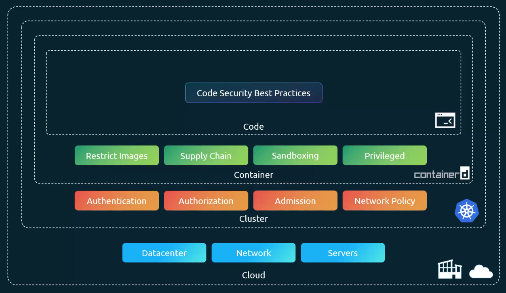
1. **Container Security:**
  - Focuses on securing container images, runtimes, and the container lifecycle.
  - Key practices include image scanning, using minimal base images, and runtime security tools.
2. **Cluster Security:**
  - Involves securing the Kubernetes control plane, nodes, and cluster components.
  - Key practices include RBAC, network policies, and securing etcd.
3. **Cloud Security:**
  - Pertains to securing the underlying cloud infrastructure and services used by Kubernetes.
  - Key practices include IAM policies, VPC configurations, and cloud provider security features.
4. **Code Security:**
  - Focuses on securing the application code running in Kubernetes.
  - Key practices include static code analysis, dependency scanning, and secure coding practices.

#### Cluster Setup and Hardening
##### CIS Benchmarks

The **CIS (Center for Internet Security) Kubernetes Benchmark** provides a set of best practices for securing Kubernetes clusters. It covers various aspects of cluster setup and hardening, including:
- API Server security
- Controller Manager security
- Scheduler security
- etcd security
- ...

It can be run using tools like `kube-bench` to assess compliance with the benchmark and identify areas for improvement.

##### Configuring ABAC
**ABAC (Attribute-Based Access Control)** is an authorization mechanism in Kubernetes that uses policies defined in a JSON file to control access to the API server. Each policy specifies attributes of the user, resource, and action to determine whether a request should be allowed or denied.
Example ABAC policy file (`/etc/kubernetes/abac-policy.jsonl`):
```jsonl
{"apiVersion":"abac.authorization.kubernetes.io/v1","kind":"Policy","spec":{"user":"alice","namespace":"default","resource":"pods","apiGroup":"*","nonResourcePath":"*","verb":"*"}}
{"apiVersion":"abac.authorization.kubernetes.io/v1","kind":"Policy","spec":{"user":"bob","namespace":"testing","resource":"deployments","apiGroup":"apps","nonResourcePath":"*","verb":["get","list"]}}
```

To enable ABAC, start the kube-apiserver with:
```
--authorization-mode=ABAC \
--authorization-policy-file=/etc/kubernetes/abac-policy.jsonl
```

**Note:** ABAC is considered difficult to manage at scale due to the need for manual file editing and API server restarts. **RBAC is the recommended authorization method** for most Kubernetes deployments.

##### Kubelet Security

Kubelet config can be configured in - `kubelet-config.yaml` and passed to the kubelet with `--config=/path/to/kubelet-config.yaml`. Key security settings include:
- `authentication`: Enable client certificate authentication and webhook token authentication.
- `authorization`: Enable webhook authorization mode to delegate access control decisions to the API server.
- `tlsCertFile` and `tlsPrivateKeyFile`: Configure TLS for secure communication with the API server.
- `readOnlyPort`: Disable the read-only port (default 10255) to prevent unauthenticated access.
- `protectKernelDefaults`: Enable to prevent kubelet from modifying kernel parameters.
- `evictionHard`: Configure eviction thresholds to protect node stability under resource pressure.

By default, the kubelet listens on port 10250 for secure communication and 10255 for read-only access. It is recommended to disable the read-only port and secure the API port with TLS and authentication.

Additionally, by default, port 10250 has no authentication. Its important to disable anonymous access and enable authentication to secure the kubelet API:
```yaml
authentication:
  anonymous:
    enabled: false
```

To enable client certificate authentication:
```yaml
authentication:
  x509:
    clientCAFile: /etc/kubernetes/pki/ca.crt
```

By default, authorization mode is `AlwaysAllow`, which allows all requests. It is recommended to switch to `Webhook` mode to delegate authorization decisions to the API server:
```yaml
authorization:
  mode: Webhook
```

##### Docker Service and Daemon Security

By default, the Docker daemon (`dockerd`) listens on a Unix socket (`/var/run/docker.sock`) for local communication within the same machine. This socket-based communication is restricted to users with appropriate permissions (typically members of the `docker` group), providing a basic level of access control for local connections.

**Local Socket Communication:**
- Default listening endpoint: `/var/run/docker.sock`
- Communication method: Unix domain socket
- Access control: File permissions on the socket (typically `660`, readable/writable by root and docker group members)
- Security: Inherently secure for local machine access since it's not exposed to the network

**Remote Access Configuration:**

If remote Docker daemon access is required, you can enable TCP ports:

1. **Unencrypted TCP (port 2375):**
  - Standard HTTP communication
  - Not secure for untrusted networks
  - Allows unauthenticated access to Docker API
  - Configuration: Set `"hosts": ["tcp://0.0.0.0:2375"]` in `/etc/docker/daemon.json`

2. **Encrypted TLS (port 2376):**
  - HTTPS/TLS-secured communication
  - Requires certificate and key files
  - Provides encryption and optional client certificate authentication
  - Configuration example:
    ```json
    {
     "hosts": ["tcp://0.0.0.0:2376"],
     "tls": true,
     "tlscert": "/etc/docker/certs/server-cert.pem",
     "tlskey": "/etc/docker/certs/server-key.pem",
     "tlscacert": "/etc/docker/certs/ca.pem"
    }
    ```
However, even with TLS, the Docker API still has no authentication and anyone can access it by setting `DOCKER_TLS=true` (`--tls`).
To enable authentication, you must use certificates and set `DOCKER_TLS_VERIFY=true` (`--tlsverify`) on the client side, and ensure that only authorized users have access to the client certificates (signed by the CA). You must update the daemon configuration:

```json
{
  "hosts": ["tcp://0.0.0.0:2376"],
  "tlsverify": true,
  "tlscert": "/etc/docker/certs/server-cert.pem",
  "tlskey": "/etc/docker/certs/server-key.pem",
  "tlscacert": "/etc/docker/certs/ca.pem"
}
```

Then, clients can access the Docker API securely with:

```bash
export DOCKER_TLS_VERIFY=true
export DOCKER_HOST=tcp://<docker-host>:2376
docker --tlsverify --tlscacert=/path/to/ca.pem --tlscert=/path/to/client-cert.pem --tlskey=/path/to/client-key.pem ps
```

##### Securing Node Metadata in Kubernetes

Securing node metadata in Kubernetes is crucial to prevent unauthorized access to sensitive information about the cluster and its nodes. Node metadata can include details such as node labels, annotations, and other information that could be exploited by attackers if exposed.
Strategies include:

1. RBAC
2. Node Isolation
3. Network Policies
4. Audit Logs

#### System Hardening

##### Least Privilege Principle

The principle of least privilege is a security concept that recommends granting users, applications, and processes only the minimum level of access necessary to perform their tasks. 

##### Limiting Node Access

Linux systems store user and group information in several key files:

**1. `/etc/passwd`**
- Contains user account information (one entry per line)
- Fields: `username:password-placeholder:UID:GID:gecos:home-directory:shell`
- Password field typically contains `x` (actual passwords stored in `/etc/shadow`)
- Example: `alice:x:1000:1000:Alice User:/home/alice:/bin/bash`
- Readable by all users

**2. `/etc/shadow`**
- Stores encrypted passwords and password aging information
- Fields: `username:encrypted-password:last-change:min-age:max-age:warn:inactive:expiration`
- Readable only by root (permission 600), not world-readable
- Critical to protect from unauthorized access

**3. `/etc/group`**
- Contains group information
- Fields: `group-name:password-placeholder:GID:member-list`
- Used for managing file permissions and access control
- Example: `docker:x:999:alice,bob`

**4. `/etc/gshadow`**
- Stores encrypted group passwords (rarely used)
- Similar protection to `/etc/shadow` (permission 600)


Commands to manage users and groups:

- `who`: Show currently logged-in users
- `id <username>`: Show user ID and group information
- `groups <username>`: Show groups a user belongs to
- `getent passwd <username>`: Get user information from `/etc/passwd`
- `getent shadow <username>`: Get password information from `/etc/shadow` (requires root)
- `getent group <groupname>`: Get group information from `/etc/group`
- `usermod -s /sbin/nologin <username>`: Disable shell access for a user
- `usermod -L <username>`: Lock a user account
- `useradd <username>`: Create a new user account
- `useradd -m <username>`: Create user with home directory
- `usermod -aG <group> <username>`: Add user to a group
- `userdel <username>`: Delete a user account
- `passwd <username>`: Change password for a user
- `passwd -e <username>`: Force user to change password on next login
- `passwd -l <username>`: Lock a user account (alternative to `usermod -L`)
- `passwd -u <username>`: Unlock a user account

##### SSH Configuration for Security

Key SSH security settings in `/etc/ssh/sshd_config`:

- `PermitRootLogin no`: Disable root login via SSH
- `PasswordAuthentication no`: Disable password auth, use keys only
- `PubkeyAuthentication yes`: Enable public key authentication
- `PermitEmptyPasswords no`: Reject empty passwords
- `X11Forwarding no`: Disable X11 forwarding
- `MaxAuthTries 3`: Limit authentication attempts
- `MaxSessions 2`: Limit concurrent sessions
- `ClientAliveInterval 300`: Timeout idle sessions
- `AllowUsers user1 user2`: Whitelist allowed users
- `Port 2222`: Change default port 22 to avoid scanning

Restart SSH after changes: `systemctl restart sshd`

##### /etc/sudoers

**sudoers** file controls which users can run commands with elevated privileges using `sudo`. Located at `/etc/sudoers`, readable only by root (permission 440).

**Edit safely using:**
```bash
visudo  # Use this—prevents syntax errors and file locks
```

**Basic syntax:**
```
user HOST=(runas-user:runas-group) COMMAND
```

**Examples:**
```
alice ALL=(ALL) ALL                          # alice can run any command anywhere
bob ALL=(root) /usr/bin/apt-get              # bob can run apt-get as root only
%wheel ALL=(ALL) NOPASSWD: ALL               # wheel group, no password prompt
```

**Key concepts:**
- `%groupname`: Apply rule to group
- `NOPASSWD`: Skip password prompt
- `ALL`: No restrictions on that field
- `(user:group)`: Specify target user/group for command execution

**Dangerous settings to avoid:**
- `ALL=(ALL) ALL` with `NOPASSWD`: Unrestricted privilege escalation

##### Restricting Kernel Modules

Kernel modules extend kernel functionality at runtime. Restricting or disabling unnecessary modules reduces the attack surface and prevents unauthorized privilege escalation.

**1. Viewing Loaded Modules:**
```bash
lsmod                          # List all loaded modules
lsmod | grep <module-name>    # Check if specific module is loaded
modinfo <module-name>         # Show module information
```

**2. Unloading Modules:**
```bash
modprobe -r <module-name>     # Remove a loaded module
rmmod <module-name>           # Alternative removal command
```

**3. Blacklisting Modules (Prevent Loading):**

Edit `/etc/modprobe.d/blacklist.conf`:
```bash
# Disable USB storage module
blacklist usb_storage

# Disable uncommon network modules
blacklist dccp
blacklist sctp
blacklist rds
blacklist tipc
```

Or create a custom file:
```bash
echo "blacklist usbcore" >> /etc/modprobe.d/disable-usb.conf
```

Then regenerate the initramfs to apply changes:
```bash
update-initramfs -u          # Ubuntu/Debian
dracut -f                     # RHEL/CentOS/Fedora
```

**4. Disabling Uncommon Network Protocols:**

```bash
echo "install dccp /bin/true" >> /etc/modprobe.d/dccp.conf
echo "install sctp /bin/true" >> /etc/modprobe.d/sctp.conf
echo "install rds /bin/true" >> /etc/modprobe.d/rds.conf
echo "install tipc /bin/true" >> /etc/modprobe.d/tipc.conf
```

The `/bin/true` command prevents the module from loading.

**5. Disabling USB and Uncommon Storage:**

```bash
echo "install usb-storage /bin/true" >> /etc/modprobe.d/usb-storage.conf
echo "install usbcore /bin/true" >> /etc/modprobe.d/usb.conf
```

**6. Verifying Restrictions:**

```bash
grep -r "blacklist\|install.*\/bin\/true" /etc/modprobe.d/
```

**7. Common Modules to Restrict:**

- `dccp`: Datagram Congestion Control Protocol (rarely needed)
- `sctp`: Stream Control Transmission Protocol (rarely needed)
- `rds`: Reliable Datagram Sockets (rarely needed)
- `tipc`: Transparent Inter-Process Communication (rarely needed)
- `usb-storage`: USB mass storage (if USB devices not required)
- `bluetooth`: If wireless/Bluetooth not used
- `wifi`: If only wired connectivity needed

**8. Check Which Modules Are Currently Loaded:**

```bash
cat /proc/modules | wc -l     # Count total loaded modules
lsmod | head -20              # Show first 20 modules
```


##### systemctl Commands

**systemctl** is the primary command for managing systemd services on modern Linux systems. It controls service startup, stopping, enabling, and monitoring.

**Basic Service Management:**

- `systemctl start <service>`: Start a service immediately
- `systemctl stop <service>`: Stop a running service
- `systemctl restart <service>`: Stop and restart a service
- `systemctl reload <service>`: Reload service configuration without fully restarting
- `systemctl status <service>`: Show current service status and recent logs
- `systemctl is-active <service>`: Check if service is currently running (returns active/inactive)
- `systemctl is-enabled <service>`: Check if service auto-starts on boot (returns enabled/disabled)

**Enabling and Disabling Services:**

- `systemctl enable <service>`: Enable service to auto-start on boot
- `systemctl disable <service>`: Disable auto-start on boot
- `systemctl enable --now <service>`: Enable and immediately start service
- `systemctl disable --now <service>`: Disable and immediately stop service

**Viewing Service Information:**

- `systemctl list-units --type=service`: List all services
- `systemctl list-units --type=service --state=running`: List only running services
- `systemctl list-units --type=service --state=failed`: List failed services
- `systemctl cat <service>`: Show service unit file contents
- `systemctl show <service>`: Display all service properties and settings
- `systemctl show -p <property> <service>`: Show specific property of a service
- `systemctl list-dependencies <service>`: Show service dependencies

**Logging and Diagnostics:**

- `journalctl -u <service>`: View service logs
- `journalctl -u <service> -n 50`: View last 50 log lines
- `journalctl -u <service> -f`: Follow service logs in real-time
- `journalctl -u <service> --since "1 hour ago"`: View logs from last hour
- `systemctl reset-failed <service>`: Clear failed state of a service

**System State Management:**

- `systemctl reboot`: Reboot the system
- `systemctl poweroff`: Shut down the system
- `systemctl suspend`: Suspend the system (sleep mode)
- `systemctl hibernate`: Hibernate the system
- `systemctl isolate multi-user.target`: Switch to multi-user mode (terminal)
- `systemctl isolate graphical.target`: Switch to graphical mode (GUI)

**Service Unit Files:**

Service unit files are typically located in:
- `/etc/systemd/system/`: Custom user-created services
- `/usr/lib/systemd/system/`: System package services
- `/run/systemd/system/`: Runtime-generated services

**Find service using a specific port:**

```bash
cat /etc/services | grep <port-number>
```

##### UFW (Uncomplicated Firewall)

**UFW** is a simplified firewall management tool for Linux that provides an easy-to-use interface for managing iptables rules. It abstracts the complexity of iptables and provides intuitive commands for allowing or denying traffic.

**Enabling and Disabling UFW:**

- `ufw enable`: Enable the firewall and start enforcing rules
- `ufw disable`: Disable the firewall (removes all rules from active enforcement)
- `ufw status`: Show current firewall status and active rules
- `ufw status verbose`: Show detailed status with rule numbers and logging
- `ufw status numbered`: Show rules with line numbers for easy reference

**Basic Rules - Allow and Deny:**

- `ufw allow 22`: Allow SSH connections (port 22)
- `ufw allow 80/tcp`: Allow HTTP traffic on port 80 (TCP only)
- `ufw allow 443/udp`: Allow traffic on port 443 (UDP only)
- `ufw allow ssh`: Allow SSH by service name (looks up in `/etc/services`)
- `ufw allow http`: Allow HTTP by service name
- `ufw allow https`: Allow HTTPS by service name
- `ufw deny 23`: Deny Telnet connections (port 23)
- `ufw deny from 192.168.1.100`: Deny all traffic from specific IP address
- `ufw allow from 10.0.0.0/8`: Allow all traffic from specific subnet
- `ufw allow from 192.168.1.100 to any port 22`: Allow specific IP to access port 22 only

**Managing Rules:**

- `ufw delete allow 80`: Delete a rule (remove allow on port 80)
- `ufw delete deny 23`: Delete a deny rule
- `ufw delete allow from 192.168.1.100`: Delete rule for specific IP
- `ufw reset`: Reset firewall to default state (removes all rules)
- `ufw reload`: Reload firewall rules without losing current state

**Advanced Rule Management:**

- `ufw default allow incoming`: Set default policy to allow incoming traffic
- `ufw default deny incoming`: Set default policy to deny incoming traffic (recommended)
- `ufw default allow outgoing`: Set default policy to allow outgoing traffic
- `ufw default deny outgoing`: Set default policy to deny outgoing traffic
- `ufw insert 1 allow 22`: Insert rule at line 1 (highest priority)

**Logging:**

- `ufw logging on`: Enable firewall logging
- `ufw logging off`: Disable firewall logging
- `ufw logging high`: Set logging level to high (maximum verbosity)
- `ufw logging medium`: Set logging level to medium
- `ufw logging low`: Set logging level to low (minimal verbosity)
- `journalctl -u ufw`: View UFW logs from systemd journal

**Rule Syntax Examples:**

```bash
# Allow specific port with protocol
ufw allow 3306/tcp                              # MySQL over TCP

# Allow service by name
ufw allow Samba                                 # Allow Samba service

# Allow from specific IP to specific port
ufw allow from 192.168.1.50 to any port 3306   # MySQL from specific IP

# Allow IP range
ufw allow from 10.0.0.0/8                       # Allow entire subnet

# Allow with direction
ufw allow in on eth0 to any port 80             # Allow on specific interface

# Deny rules
ufw deny in on eth0 from 192.168.1.100         # Deny from IP on interface eth0
```

**Common Firewall Configurations:**

**1. Default Deny Incoming (Recommended for Servers):**
```bash
ufw default deny incoming
ufw default allow outgoing
ufw allow 22/tcp                   # SSH
ufw allow 80/tcp                   # HTTP
ufw allow 443/tcp                  # HTTPS
ufw enable
```

**2. Allow Kubernetes API Server:**
```bash
ufw allow 6443/tcp                 # Kubernetes API Server
ufw allow 10250/tcp                # Kubelet
```

**3. Allow Docker Daemon (if needed):**
```bash
ufw allow 2375/tcp                 # Docker (insecure)
ufw allow 2376/tcp                 # Docker (secure with TLS)
```

**4. Allow etcd (cluster communication):**
```bash
ufw allow 2379/tcp                 # etcd client API
ufw allow 2380/tcp                 # etcd peer communication
```

**Troubleshooting:**

- `ufw show added`: Show rules that have been added
- `ufw show raw`: Show raw iptables rules generated by UFW
- `ufw show builtins`: Show built-in chains
- `systemctl status ufw`: Check if UFW service is running
- `systemctl restart ufw`: Restart UFW service

**Important Notes:**

- UFW must be explicitly enabled; it doesn't enforce rules until activated with `ufw enable`
- Default policies should be `deny incoming` and `allow outgoing` for security
- UFW rules persist across reboots after `ufw enable`
- Misconfiguring SSH rules (like denying port 22) while SSH is in use can lock you out if UFW is remote—always test carefully
- UFW is available on Ubuntu/Debian; other distributions may use `firewalld` or direct `iptables`

##### System Calls (syscalls)

**System calls (syscalls)** are the interface between user-space applications and the kernel. They allow processes to request services from the operating system, such as file I/O, process management, memory allocation, network communication, and other privileged operations that only the kernel can perform.

**Why System Calls?**

- User-space applications cannot directly execute privileged operations (e.g., reading from disk, accessing network) for security and stability reasons.
- System calls provide a controlled interface for applications to request kernel services.
- The kernel validates and enforces security policies before performing the requested operation.

**How System Calls Work:**

1. **User Process Issues Request:**
  - Application calls a syscall function (e.g., `read()`, `write()`, `fork()`).

2. **Context Switch:**
  - CPU switches from user mode to kernel mode (privileged mode).
  - The application passes syscall arguments (syscall number and parameters).

3. **Kernel Processes Request:**
  - Kernel validates the request and checks permissions.
  - Kernel performs the requested operation.

4. **Return to User Mode:**
  - Kernel returns the result to the application.
  - CPU switches back to user mode.

This mode switching incurs performance overhead, so frequent syscalls can impact application performance.

**Common System Calls:**

**File Operations:**
- `open()`: Open a file descriptor
- `close()`: Close a file descriptor
- `read()`: Read from a file
- `write()`: Write to a file
- `lseek()`: Seek within a file
- `stat()`: Get file metadata
- `chmod()`: Change file permissions
- `chown()`: Change file owner

**Process Management:**
- `fork()`: Create a new process
- `exec()`: Execute a new program
- `exit()`: Terminate a process
- `wait()`: Wait for child process
- `getpid()`: Get process ID
- `getppid()`: Get parent process ID
- `kill()`: Send signal to process

**Memory Management:**
- `brk()`: Adjust heap size
- `mmap()`: Map memory regions
- `munmap()`: Unmap memory regions
- `mprotect()`: Change memory protection

**Network:**
- `socket()`: Create a socket
- `bind()`: Bind socket to address
- `listen()`: Listen for connections
- `accept()`: Accept connections
- `connect()`: Connect to remote address
- `send()`: Send data
- `recv()`: Receive data

**Signals:**
- `signal()`: Register signal handler
- `sigaction()`: Advanced signal handling
- `kill()`: Send signal to process
- `pause()`: Wait for signal

**Capabilities and Permissions:**
- `setuid()`: Change user ID
- `setgid()`: Change group ID
- `getuid()`: Get user ID
- `getgid()`: Get group ID
- `capset()`: Set process capabilities
- `capget()`: Get process capabilities

**System Calls and Kubernetes Security:**

In Kubernetes, securing system calls is important for preventing privilege escalation and container escape attacks. Mechanisms include:

1. **seccomp (Secure Computing Mode):**
  - Restricts the set of syscalls a container can make.
  - Can be applied at the container level in pod specs.
  - Example: Block `exec`, `fork`, or other dangerous syscalls.
  - Seccomp has 3 modes: 0 (disabled), 1 (strict), 2 (filtering with custom profiles). You can identify the mode on a process by:
    ```bash
    cat /proc/1/status | grep Seccomp
    ```
  - In docker, you can specify seccomp profiles with `--security-opt seccomp=profile.json` when running a container. The default Docker seccomp profile blocks around 64 syscalls that are considered dangerous for containerized applications, such as `ptrace`, `process_vm_readv`, and `process_vm_writev`. This helps prevent container escape and privilege escalation attacks by restricting access to critical kernel features. Some syscals are not allowed even when running unconfined seccomp profile. This is prevented by other security mechanisms.
  - K8s does not implement sseccomp by default. It only blocks around 21 syscalls by default. You can enable it by setting `seccompProfile` in the pod spec. If you want to block more syscalls, you can create a custom seccomp profile and specify it in the pod spec.
2. **AppArmor:**
  - Linux security module that restricts syscalls and file access.
  - Applied via pod annotations or node configuration.

3. **SELinux:**
  - Alternative security module providing mandatory access control.
  - Restricts what syscalls processes can execute based on security policies.

4. **Pod Security Standards:**
  - Restrict privileged syscalls like `SYS_PTRACE`, `SYS_MODULE`, etc.
  - Prevent containers from calling dangerous syscalls.

**Seccomp Profile Types:**

- `RuntimeDefault`: Use the default seccomp profile provided by the container runtime (e.g., Docker's default profile).
- `Localhost`: Use a custom seccomp profile stored on the node (e.g., `my-profile.json`).

**Example: seccomp Profile in Kubernetes Pod:**

```yaml
apiVersion: v1
kind: Pod
metadata:
  name: seccomp-example
spec:
  securityContext:
    seccompProfile:
      type: RuntimeDefault               # Use default seccomp profile. Blocks around 64 syscalls by default.
      # OR
      # type: Localhost
      # localhostProfile: my-profile.json
  containers:
  - name: app
    image: nginx
    securityContext:
      allowPrivilegeEscalation: false
      capabilities:
        drop: ["ALL"]
```

**Common Syscall Blocks:**

To restrict dangerous syscalls in seccomp profiles:
```json
{
  "defaultAction": "SCMP_ACT_ALLOW",
  "defaultErrnoRet": 1,
  "archMap": [
    {
      "architecture": "SCMP_ARCH_X86_64",
      "subArchitectures": ["SCMP_ARCH_X86", "SCMP_ARCH_X32"]
    }
  ],
  "syscalls": [
    {
      "names": ["ptrace", "process_vm_readv", "process_vm_writev"],
      "action": "SCMP_ACT_ERRNO"
    }
  ]
}
```

**Auditing System Calls:**

Kernel provides audit logs of syscalls when configured:

```bash
# Enable audit
auditctl -w /etc/shadow -p wa -k shadow-modifications

# View audit logs
ausearch -k shadow-modifications
```

**Performance Considerations:**

- Each syscall involves context switching, which is expensive.
- Applications making frequent syscalls may have performance bottlenecks.
- Optimize by batching I/O operations or using asynchronous syscalls.
- Use tools like `strace` to profile syscall usage.

**Viewing Syscalls with strace:**

```bash
# Trace all syscalls of a process
strace -o output.txt ./my-application

# Count syscalls by type
strace -c ./my-application

# Filter specific syscalls
strace -e trace=open,read,write ./my-application

# Trace container syscalls (requires privileged access)
kubectl debug -it <pod-name> -- strace -e trace=syscall <command>
```

##### AppArmor

**AppArmor** is a Linux security module (LSM) that provides mandatory access control (MAC) by restricting what system calls and resources a process can access. It works by confining programs to a limited set of resources based on security profiles, helping prevent privilege escalation and unauthorized access to sensitive files and resources.

**How AppArmor Works:**

- **Profiles:** Security policies defined for specific applications or processes.
- **Modes:**
  - `enforce`: Violations are denied and logged.
  - `complain`: Violations are allowed but logged (useful for development).
  - `unconfined`: No restrictions, process runs without confinement.
  - `disabled`: Profile is not active.
- **Confinement:** Restricts file access, network access, and capability usage based on profile rules.

**AppArmor vs SELinux:**

| Feature | AppArmor | SELinux |
|---------|----------|--------|
| Complexity | Simpler, path-based rules | More complex, label-based |
| Learning Curve | Easier to learn and configure | Steeper learning curve |
| Distribution | Ubuntu, Debian (default) | RHEL, CentOS, Fedora (default) |
| Performance | Lower overhead | Slightly higher overhead |
| Flexibility | Good for basic containment | More granular control |

**Common AppArmor Commands:**

- `apparmor_status`: Show status of AppArmor and loaded profiles
- `apparmor_parser -r /etc/apparmor.d/profile-name`: Load/reload a profile
- `apparmor_parser -R /etc/apparmor.d/profile-name`: Remove a profile
- `aa-enforce /etc/apparmor.d/profile-name`: Set profile to enforce mode
- `aa-complain /etc/apparmor.d/profile-name`: Set profile to complain mode
- `aa-disable /etc/apparmor.d/profile-name`: Disable a profile
- `aa-genprof /path/to/application`: Generate a profile interactively
- `aa-logprof`: Update profiles based on audit logs
- `aa-audit /etc/apparmor.d/profile-name`: Enable audit logging for a profile
- `aa-status`: Check which profiles are loaded and their modes

**AppArmor Profile Structure:**

A basic AppArmor profile (`/etc/apparmor.d/profile-name`):

```apparmor
#include <tunables/global>

profile my-app /usr/bin/my-app {
  #include <abstractions/base>
  
  # Allow read and write to specific files
  /etc/my-app.conf r,
  /var/log/my-app.log w,
  /tmp/** rw,
  
  # Allow executing specific binaries
  /usr/bin/sh rix,
  
  # Deny access to sensitive files
  deny /etc/shadow rwk,
  deny /root/** rwx,
  
  # Allow specific capabilities
  capability setuid,
  capability net_bind_service,
  
  # Deny dangerous capabilities
  deny capability sys_ptrace,
  deny capability sys_module,
}
```

**AppArmor Utils:**
- `aa-genprof`: Generate a profile interactively by running the application and logging violations.
- `aa-logprof`: Update profiles based on logged violations, allowing you to refine rules over time.

**AppArmor in Kubernetes:**

AppArmor can be applied to pods via annotations. The kubelet enforces AppArmor profiles on container processes.

**Example Pod with AppArmor:**

```yaml
apiVersion: v1
kind: Pod
metadata:
  name: apparmor-example
  # annotations:
    # container.apparmor.security.beta.kubernetes.io/my-container: localhost/my-app
spec:
  securityContext:
    appArmorProfile:
      type: Localhost
      localhostProfile: my-app
  containers:
  - name: my-container
    image: my-app:latest
    securityContext:
      runAsNonRoot: true
      runAsUser: 1000
      allowPrivilegeEscalation: false
```

**Important Notes:**

- AppArmor must be enabled on the node; check with `aa-status` or `systemctl status apparmor`.
- ApppArmor kernel module must be loaded on the nodes. You can check if its loaded with `cat /sys/module/apparmor/parameters/enabled` (should return `Y`) and the profile should also be loaded (check with `cat /sys/kernel/security/apparmor/profiles`).
- Kubernetes AppArmor support is in beta; profiles must be pre-installed on nodes at `/etc/apparmor.d/`.
- Use `localhost/profile-name` format to reference node-local profiles.
- Without a matching profile, the pod will fail to start if AppArmor annotation is specified.
- AppArmor profiles should be carefully designed to avoid overly restrictive or permissive access.

**Debugging AppArmor:**

- Check AppArmor audit logs: `journalctl -xe | grep apparmor`
- Use complain mode to see violations without blocking: `aa-complain /etc/apparmor.d/profile-name`
- Generate profiles interactively: `aa-genprof /path/to/application`
- Review logs and update profiles: `aa-logprof`


##### Linux Capabilities

**Linux Capabilities** are a security feature that divide the privileges of the root user into distinct units called capabilities. Instead of granting a process all root privileges (UID 0), you can grant it only the specific capabilities it needs to function, adhering to the principle of least privilege.

Capabilities reduce the attack surface by limiting what a process can do even if it's compromised. Rather than running a service as root with unrestricted access, you can run it as a non-root user with only the necessary capabilities.

**Why Capabilities Matter:**

- **Privilege Separation:** Divides root privileges into granular units.
- **Least Privilege:** Processes get only the capabilities they need.
- **Security:** Reduces impact of compromise; a compromised process with limited capabilities can do less damage.
- **Container Security:** Essential for Kubernetes and Docker security hardening.

**Capability Categories:**

Linux capabilities are grouped by when they apply:

- **Permitted (P):** Capabilities the process is allowed to use.
- **Inheritable (I):** Capabilities that child processes can inherit.
- **Effective (E):** Capabilities currently active for the process.
- **Ambient (A):** Capabilities automatically granted to child processes (Linux 4.3+).
- **Bounding Set (B):** Maximum capabilities a process can ever obtain.

**Common Linux Capabilities:**

| Capability | Description |
|-----------|-------------|
| `CAP_CHOWN` | Change file ownership |
| `CAP_DAC_OVERRIDE` | Bypass file permission checks |
| `CAP_DAC_READ_SEARCH` | Bypass file read and directory search checks |
| `CAP_FOWNER` | Bypass permission checks on file operations |
| `CAP_SETGID` | Set group ID (`setgid()`) |
| `CAP_SETUID` | Set user ID (`setuid()`) |
| `CAP_SETFCAP` | Set file capabilities |
| `CAP_NET_BIND_SERVICE` | Bind to ports < 1024 (HTTP, HTTPS, DNS) |
| `CAP_NET_RAW` | Use raw sockets |
| `CAP_NET_ADMIN` | Network administration |
| `CAP_SYS_CHROOT` | Change root directory |
| `CAP_SYS_PTRACE` | Trace processes (`ptrace()`) |
| `CAP_SYS_ADMIN` | Broad admin capabilities (avoid if possible) |
| `CAP_SYS_MODULE` | Load/unload kernel modules |
| `CAP_SYS_BOOT` | Reboot the system |
| `CAP_KILL` | Send signals to processes |
| `CAP_IPC_LOCK` | Lock memory (prevent swapping) |
| `CAP_MAC_ADMIN` | MAC (Mandatory Access Control) administration |
| `CAP_MAC_OVERRIDE` | Override MAC policies |

**Viewing Capabilities:**

```bash
# View capabilities of a running process
getcap /path/to/binary                    # View capabilities of a binary
getpcaps <PID>                            # View capabilities of a running process

# View all capabilities on a system
grep Cap /proc/<PID>/status               # View process capabilities

# List all available capabilities
man capabilities                           # Read capabilities man page
```

**Setting Capabilities:**

```bash
# Add capabilities to a binary
setcap cap_net_bind_service=ep /usr/bin/my-app    # Allow binding to port < 1024

# Multiple capabilities
setcap cap_net_bind_service,cap_setuid=ep /usr/bin/my-app

# Remove capabilities
setcap -r /usr/bin/my-app

# View capabilities of a binary
getcap /usr/bin/my-app
```

**Capability Notation:**

- `e` (effective): The capability is active.
- `p` (permitted): The capability can be used.
- `i` (inheritable): Child processes inherit the capability.
- `+` (add): Add the capability.
- `-` (remove): Remove the capability.

**Examples:**

```bash
setcap cap_net_bind_service=ep /usr/bin/nginx     # ep = effective and permitted
setcap cap_sys_ptrace+ep /usr/bin/debugger        # Allow process tracing
setcap cap_ipc_lock=ep /usr/bin/memory-app        # Allow memory locking
```

**Capabilities in Docker:**

By default, Docker drops many dangerous capabilities and keeps a minimal set:

```bash
# Default capabilities kept by Docker
CAP_CHOWN, CAP_DAC_OVERRIDE, CAP_SETFCAP, CAP_SETGID, CAP_SETUID, 
CAP_SETFCAP, CAP_NET_RAW, CAP_SYS_CHROOT, CAP_KILL, CAP_NET_BIND_SERVICE
```

Add or drop capabilities with Docker:

```bash
# Drop all capabilities, then add back specific ones (recommended)
docker run --cap-drop=ALL --cap-add=NET_BIND_SERVICE my-image

# Add a capability
docker run --cap-add=SYS_ADMIN my-image

# Drop a capability
docker run --cap-drop=NET_RAW my-image

# Run privileged (dangerous—keeps all capabilities)
docker run --privileged my-image
```

**Capabilities in Kubernetes:**

By default, Kubernetes (and Docker) only allows a minimal set of capabilities and drops many by default. You can manage capabilities at the pod or container level using `securityContext`:

**Example: Drop All Capabilities, Add Only Needed Ones:**

```yaml
apiVersion: v1
kind: Pod
metadata:
  name: capability-example
spec:
  containers:
  - name: app
    image: my-app:latest
    securityContext:
      capabilities:
        drop:
          - ALL                         # Drop all capabilities
        add:
          - NET_BIND_SERVICE            # Add only needed capability
      runAsNonRoot: true
      runAsUser: 1000
      allowPrivilegeEscalation: false
```

#### Minimize Microservice Vulnerabilities

##### Pod Security Standards and Pod Security Admission

**Pod Security Standards (PSS)** is a Kubernetes standard that defines three security profiles (restricted, baseline, and privileged) for pod configurations. These standards specify which security features and behaviors are allowed or restricted for pods running in the cluster.

**Pod Security Admission (PSA)** is the enforcement mechanism that implements Pod Security Standards. It's a built-in admission controller that validates pods against the defined security standards and can enforce, audit, or warn based on violations.

**Three Pod Security Standards Levels:**

1. **Privileged:**
  - Unrestricted policy; allows the widest range of pod specifications.
  - No restrictions on dangerous features like privileged containers, host access, etc.
  - Useful for system-level pods and cluster infrastructure.
  - Not recommended for user workloads.
  - Key allowed features:
    - Privileged containers
    - Access to host namespaces (network, PID, IPC)
    - Host port binding
    - Unsafe syscalls
    - SELinux policy override

2. **Baseline:**
  - Minimal restrictions; prevents known privilege escalation vectors.
  - Allows most pod features but blocks the most dangerous ones.
  - Good balance for general-purpose workloads.
  - Allows:
    - Non-privileged containers
    - Host port binding (but not privileged ports < 1024 for non-root)
    - Unsafe syscalls (most)
  - Denies:
    - Privileged containers
    - Privilege escalation via `allowPrivilegeEscalation: true`
    - Access to host namespaces (network, PID, IPC)
    - Host path mounts (except read-only)
    - Dangerous capabilities (e.g., `SYS_ADMIN`, `NET_ADMIN`)

3. **Restricted:**
  - Heavily restricted policy; enforces current security best practices.
  - Most stringent standard; suitable for sensitive workloads.
  - Requires explicit opt-in for most features.
  - Enforces:
    - Non-root user required
    - Read-only root filesystem
    - No privilege escalation
    - Dropped dangerous capabilities
    - Resource limits required
    - No host access
    - Restricted volumes (only projected, configMap, downwardAPI, emptyDir, secret)
    - SELinux restrictions
    - No unsafe syscalls (tight seccomp profile)

**Pod Security Admission Modes:**

Pod Security Admission operates in three modes per namespace:

1. **enforce:**
  - Violations result in pod rejection.
  - Pod will not be created if it violates the standard.
  - Used for production namespaces.

2. **audit:**
  - Violations are logged but pods are allowed.
  - Violations appear in audit logs and Kubernetes events.
  - Useful for identifying non-compliant workloads without blocking them.

3. **warn:**
  - Violations trigger a warning in the API response but pods are allowed.
  - Users see warnings when creating/updating pods.
  - Helpful for development and gradual migration.

**Configuring Pod Security Standards:**

Pod Security Standards are applied via labels on namespaces. The label format is:

```
pod-security.kubernetes.io/<mode>: <level>
```

Where `<mode>` is one of `enforce`, `audit`, or `warn`, and `<level>` is one of `privileged`, `baseline`, or `restricted`.

**Example: Apply Restricted PSS to a Namespace:**

```bash
# Label namespace with restricted enforcement
kubectl label namespace my-app pod-security.kubernetes.io/enforce=restricted

# Also apply audit and warn for visibility
kubectl label namespace my-app \
  pod-security.kubernetes.io/enforce=restricted \
  pod-security.kubernetes.io/audit=restricted \
  pod-security.kubernetes.io/warn=restricted
```

**Namespace YAML with Pod Security Standards:**

```yaml
apiVersion: v1
kind: Namespace
metadata:
  name: secure-ns
  labels:
    pod-security.kubernetes.io/enforce: restricted       # Enforce policy
    pod-security.kubernetes.io/enforce-version: latest   # Use latest standard version
    pod-security.kubernetes.io/audit: restricted         # Audit violations
    pod-security.kubernetes.io/warn: restricted          # Warn on violations
```

**Version Control:**

You can also specify which version of the Pod Security Standard to use:

```bash
pod-security.kubernetes.io/enforce-version: v1.27
```

**Exemptions and Exceptions:**

You can exempt specific pods, users, or runtimes from Pod Security Standards by configuring the Pod Security Admission controller.

Example configuration in `/etc/kubernetes/manifests/kube-apiserver.yaml`:

```yaml
- --admission-control-config-file=/etc/kubernetes/psa-config.yaml
```

PSA config file `/etc/kubernetes/psa-config.yaml`:

```yaml
apiVersion: apiserver.config.k8s.io/v1
kind: AdmissionConfiguration
plugins:
  - name: PodSecurity
    configuration:
      apiVersion: pod-security.admission.config.k8s.io/v1beta1
      kind: PodSecurityAdmissionConfiguration
      defaults:
        enforce: "baseline"
        audit: "restricted"
        warn: "restricted"
      exemptions:
        namespaces: ["kube-system", "kube-public"]
        runtimeClassNames: ["gvisor"]
        usernames: ["system:admin"]
```

**Deprecated: Pod Security Policy (PSP)**

Pod Security Policy (PSP) was the previous mechanism for enforcing pod security standards but is now deprecated as of Kubernetes 1.25 and removed in 1.29. Pod Security Admission (PSA) is the recommended replacement.

##### OPA (Open Policy Agent)

**OPA (Open Policy Agent)** is a general-purpose policy engine that enables decoupled policy decision-making across various systems and applications (e.g., authorization of applications). It provides a unified way to define, manage, and enforce policies as code using a domain-specific language called **Rego**.

**Why OPA?**

- **Centralized Policy Management:** Define security and compliance policies in one place.
- **Decoupled Policies:** Policies are independent of application logic.
- **Fine-Grained Control:** Enforce policies at multiple levels (API gateway, service mesh, CI/CD, cloud infrastructure).
- **Audit and Compliance:** Track policy violations and maintain compliance records.
- **Flexibility:** Works with Kubernetes, microservices, APIs, cloud providers, and more.

**How OPA Works:**

1. **Policy Definition:** Write policies in Rego (OPA's query language).
2. **Input Data:** Pass data and context to OPA for evaluation.
3. **Policy Evaluation:** OPA evaluates the input against policies.
4. **Decision Output:** OPA returns a decision (allow/deny) and reasons.
5. **Action:** The calling system acts on the decision (enforce, log, alert).

**Rego Language Basics:**

Rego is a declarative query language designed for policy and data transformations. Key concepts:

- **Rules:** Logical statements that define policy conditions.
- **Packages:** Organize rules and policies.
- **Imports:** Reference other packages and modules.
- **Variables:** Wildcards and logical variables for pattern matching.

**Example Rego Policy:**

```rego
package kubernetes.admission

# Deny privileged containers
deny[msg] {
  input.request.object.spec.containers[_].securityContext.privileged == true
  msg := "Privileged containers are not allowed"
}

# Deny images from untrusted registries
deny[msg] {
  image := input.request.object.spec.containers[_].image
  not startswith(image, "gcr.io/")
  not startswith(image, "docker.io/library/")
  msg := sprintf("Image from untrusted registry: %v", [image])
}

# Require resource limits
deny[msg] {
  container := input.request.object.spec.containers[_]
  not container.resources.limits
  msg := sprintf("Container %v must have resource limits", [container.name])
}
```

**OPA in Kubernetes (Gatekeeper):**

**Gatekeeper** is a Kubernetes-specific OPA implementation that acts as a ValidatingWebhook or MutatingWebhook admission controller. It enforces policies at the API server level before pods are created or updated.

**Installing Gatekeeper:**

```bash
# Using Helm
helm repo add gatekeeper https://open-policy-agent.github.io/gatekeeper/charts
helm install gatekeeper/gatekeeper --namespace gatekeeper-system --create-namespace

# Or using kubectl
kubectl apply -f https://raw.githubusercontent.com/open-policy-agent/gatekeeper/master/deploy/gatekeeper.yaml
```

**Gatekeeper Components:**

1. **Constraint Templates:** Define the structure of policy constraints (CRDs).
2. **Constraints:** Instances of constraint templates with specific parameters.
3. **Audit:** Tracks violations of existing resources.

**Example: Creating a Constraint Template**

```yaml
apiVersion: templates.gatekeeper.sh/v1
kind: ConstraintTemplate
metadata:
  name: k8srequiredresourcelimits
spec:
  crd:
    spec:
      names:
        kind: K8sRequiredResourceLimits
      validation:
        openAPIV3Schema:
          type: object
          properties:
            exemptImages:
              type: array
              items:
                type: string
  targets:
  - target: admission.k8s.gatekeeper.sh
    rego: |
    package k8srequiredresourcelimits

    violation[{"msg": msg}] {
      container := input.review.object.spec.containers[_]
      image := container.image
      not image_is_exempt(image)
      not container.resources.limits
      msg := sprintf("Container %v must have resource limits", [container.name])
    }

    image_is_exempt(image) {
      exempt_images := object.get(input, ["parameters", "exemptImages"], [])
      exempt_images[_] == image
    }
```

**Example: Creating a Constraint (Enforcement Rule)**

```yaml
apiVersion: constraints.gatekeeper.sh/v1beta1
kind: K8sRequiredResourceLimits
metadata:
  name: require-resource-limits
spec:
  parameters:
    exemptImages:
      - "gcr.io/system-images/*"
  match:
    excludedNamespaces:
      - "kube-system"
      - "gatekeeper-system"
    kinds:
      - apiGroups: [""]
        kinds: ["Pod"]
      - apiGroups: ["apps"]
        kinds: ["Deployment", "StatefulSet", "DaemonSet"]
```

**OPA Use Cases:**

1. **Kubernetes Admission Control:** Enforce security, compliance, and best practices.
2. **API Authorization:** Fine-grained access control for APIs.
3. **CI/CD Pipelines:** Policy enforcement in deployment pipelines.
4. **Cloud Infrastructure:** Policy enforcement for cloud resources (Terraform, CloudFormation).
5. **Data Filtering:** Redact or filter sensitive data in responses.
6. **Configuration Validation:** Validate configurations before deployment.

**Gatekeeper Audit and Violations:**

View policy violations with Gatekeeper's audit feature:

```bash
# View constraint violations
kubectl get constraints

# Describe a specific constraint
kubectl describe k8srequiredresourcelimits require-resource-limits

# View audit logs and violations
kubectl logs -n gatekeeper-system deployment/gatekeeper-audit

# Check if a pod would be allowed (dry-run)
kubectl apply -f my-pod.yaml --dry-run=server
```

**OPA for Mutation (Automatic Fixes):**

Gatekeeper can also mutate (modify) resources automatically using mutation rules:

```yaml
apiVersion: mutations.gatekeeper.sh/v1
kind: Assign
metadata:
  name: add-default-namespace
spec:
  applyTo:
  - groups: [""]
    kinds: ["Pod"]
    versions: ["v1"]
  match:
  excludedNamespaces: ["kube-system"]
  location: "metadata.namespace"
  parameters:
  assign:
    value: "default"
```

##### Container Sandboxes

**Container sandboxes** are lightweight virtualization or isolation mechanisms that provide an additional layer of security between containerized applications and the host kernel. Unlike standard containers that share the kernel with the host, sandboxed containers use techniques like lightweight VMs, kernel isolation, or strict syscall filtering to prevent container escape and limit the impact of container compromise.

**Why Container Sandboxes?**

- **Enhanced Isolation:** Containers share the host kernel, making them vulnerable to kernel exploits and container escape attacks.
- **Defense in Depth:** Sandboxes add an extra security layer beyond standard container isolation.
- **Reduced Blast Radius:** If a container is compromised, the damage is limited to the sandbox environment.
- **Compliance:** Meet stricter security requirements for multi-tenant or regulated environments.
- **Kernel Protection:** Prevents malicious containers from directly attacking the host kernel.

**Types of Container Sandboxes:**

**1. Lightweight VMs (Hardware-Assisted Isolation)**

These use minimal guest OS images running in hypervisors like KVM, QEMU, or Hyper-V. Each container gets its own lightweight VM with a dedicated kernel.

**Examples:**
- **Kata Containers:** Uses lightweight VMs (via QEMU or Cloud Hypervisor) to isolate each pod. Provides near-VM-level isolation with container-like performance and management.
- **gVisor:** Google's container sandbox that intercepts and simulates syscalls instead of passing them to the host kernel. Acts as a guest kernel in userspace.
- **Firecracker:** AWS's minimal hypervisor for ultra-lightweight VMs, powering AWS Lambda and Fargate.

**Pros:**
- Strong isolation guarantee
- Protects host kernel from container exploits
- Each container has its own kernel
- Good for untrusted or multi-tenant workloads

**Cons:**
- Higher resource overhead than standard containers
- Slower startup times
- More memory per container
- Performance overhead vs. native containers

**2. Seccomp and AppArmor (Kernel-Level Filtering)**

These restrict syscalls and capabilities at the kernel level without virtualization, providing lightweight sandboxing.

- **seccomp:** Filters the syscalls a process can make (mode 2).
- **AppArmor:** Restricts file access, capabilities, and network operations.
- **SELinux:** Mandatory Access Control (MAC) enforcing strict policies.

**Pros:**
- Minimal performance overhead
- Easy to implement and manage
- Works with standard containers

**Cons:**
- Less isolation than VMs
- Kernel still shared with host
- Policies can be complex to configure

**3. User Namespaces**

Map container processes to non-root UIDs/GIDs on the host, preventing privilege escalation even if a container escapes.

**Pros:**
- Processes appear as non-root even if running as root inside the container
- Limits damage if container is compromised

**Cons:**
- Does not prevent direct kernel access
- Requires careful namespace mapping configuration

**Container Runtimes with Sandbox Support:**

**1. Kata Containers:**

- Integrates with Kubernetes as a RuntimeClass
- Automatically launches a lightweight VM per pod
- Compatible with Docker, containerd, and CRI-O
- Near-VM security with container performance

**Installation and Usage:**

```bash
# Install Kata Containers
sudo apt-get install kata-containers

# Use Kata in Kubernetes via RuntimeClass
kubectl create -f - <<EOF
apiVersion: node.k8s.io/v1
kind: RuntimeClass
metadata:
  name: kata
handler: kata
EOF

# Schedule pod with Kata runtime
kubectl apply -f - <<EOF
apiVersion: v1
kind: Pod
metadata:
  name: kata-sandbox-pod
spec:
  runtimeClassName: kata
  containers:
  - name: app
    image: nginx:latest
EOF
```

**2. gVisor:**

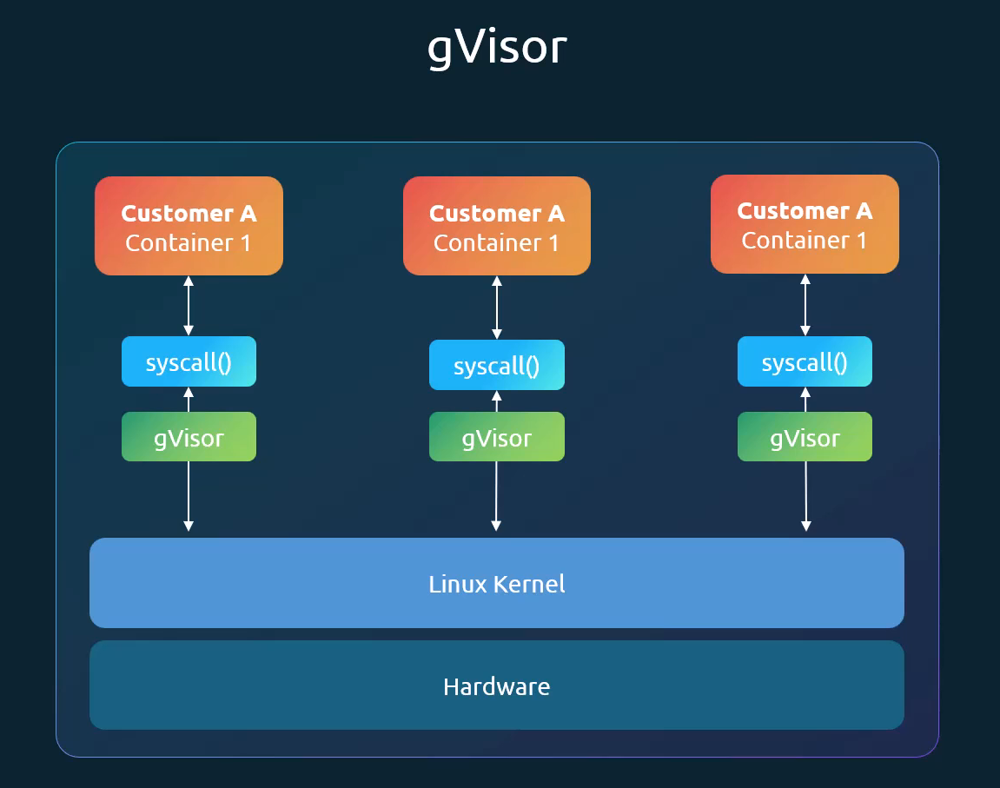

- User-space implementation of the Linux kernel
- Two components: `sentry` and `gofer`. The sentry runs in userspace and intercepts syscalls, while the gofer handles file system access on behalf of the sentry.
- Intercepts and handles syscalls in userspace
- Processes run in an isolated userspace kernel
- No hypervisor overhead; lower resource usage than full VMs
- Limited syscall support; some applications may not work properly

**Installation and Usage:**

```bash
# Install gVisor
curl https://gvisor.dev/archive/latest/containerd-shim-runsc-v1.linux-amd64 -o /usr/local/bin/containerd-shim-runsc-v1
chmod +x /usr/local/bin/containerd-shim-runsc-v1

# Configure containerd with gVisor runtime
cat >> /etc/containerd/config.toml <<EOF
[plugins."io.containerd.grpc.v1.cri".containerd.runtimes.runsc]
  runtime_engine = ""
  runtime_root = ""
  runtime_type = "io.containerd.runsc.v1"
EOF

systemctl restart containerd

# Use gVisor in Kubernetes via RuntimeClass
kubectl create -f - <<EOF
apiVersion: node.k8s.io/v1
kind: RuntimeClass
metadata:
  name: gvisor
handler: runsc
EOF

# Schedule pod with gVisor runtime
kubectl apply -f - <<EOF
apiVersion: v1
kind: Pod
metadata:
  name: gvisor-sandbox-pod
spec:
  runtimeClassName: gvisor
  containers:
  - name: app
    image: nginx:latest
EOF
```

**3. Firecracker:**
- Ultra-lightweight hypervisor for minimal VMs
- Used by AWS Lambda and Fargate
- Very fast boot times and low resource overhead
- Limited Linux compatibility

**Container Sandbox in Kubernetes:**

Kubernetes uses **RuntimeClass** to specify which container runtime a pod should use. This enables mixing standard containers with sandboxed containers in the same cluster.

**Example: RuntimeClass Configuration**

```yaml
apiVersion: node.k8s.io/v1
kind: RuntimeClass
metadata:
  name: kata
handler: kata                          # Points to kata runtime handler
scheduling:
  nodeSelector:
    kata: "true"                       # Run on nodes with kata installed
  tolerations:
  - key: kata
    operator: Equal
    value: "true"
    effect: NoSchedule
---
apiVersion: node.k8s.io/v1
kind: RuntimeClass
metadata:
  name: gvisor
handler: runsc                         # Points to gVisor runtime handler
---
apiVersion: v1
kind: Pod
metadata:
  name: secure-workload
spec:
  runtimeClassName: kata               # Use Kata Containers runtime
  containers:
  - name: secure-app
    image: sensitive-app:latest
```

**Comparing Sandbox Options:**

| Feature | Kata Containers | gVisor | Firecracker | Standard Container |
|---------|-----------------|--------|-------------|-------------------|
| Isolation | VM-level | Userspace kernel | VM-level | Kernel namespace |
| Resource Overhead | Moderate-High | Low-Moderate | Very Low | Minimal |
| Boot Time | ~100ms | ~10ms | ~10ms | <100μs |
| Kernel Access | Isolated kernel | Simulated kernel | Isolated kernel | Shared kernel |
| Kubernetes Support | RuntimeClass | RuntimeClass | Limited | Default |
| Multi-tenant Safe | Excellent | Good | Excellent | Poor |
| Untrusted Workloads | Suitable | Suitable | Suitable | Not recommended |
| Performance Impact | 5-20% | 10-30% | 5-15% | Baseline |

**Security Trade-offs:**

1. **Kata Containers:**
  - Best isolation; close to VM security
  - Higher resource cost and complexity
  - Good balance of security and performance

2. **gVisor:**
  - Good isolation without hypervisor overhead
  - Some syscalls may be unimplemented or slow
  - Lower resource footprint than Kata

3. **Firecracker:**
  - Best performance for ultra-lightweight VMs
  - Very minimal resource footprint
  - Good for serverless and FaaS workloads

4. **Standard Containers + seccomp/AppArmor:**
  - Lightweight and fast
  - Kernel still shared; less isolation
  - Suitable for trusted workloads only

  ##### Container Runtimes

  **Container runtimes** are the software responsible for creating, starting, stopping, and managing containers on a host system. They interface with the kernel's isolation features (namespaces, cgroups) to provide containerized environments. In Kubernetes, the kubelet uses Container Runtime Interface (CRI) to communicate with container runtimes.

  **Role of Container Runtimes:**

  - Create and manage container processes
  - Set up namespaces and cgroup isolation
  - Mount filesystems and manage container networking
  - Enforce resource limits and security policies
  - Handle container lifecycle (create, start, stop, delete)

  **Container Runtime Levels:**

  Container runtimes are typically organized into two levels:

  1. **Low-Level Runtimes (OCI Runtimes):**
    - Directly interact with kernel features to create and run containers
    - Implement the Open Container Initiative (OCI) specification
    - Examples: `runc`, `crun`, `kata`, `runsc` (gVisor)
    - Typically invoked by higher-level runtimes

  2. **High-Level Runtimes (Container Engines):**
    - Manage container images, networking, and storage
    - Use low-level runtimes to actually run containers
    - Provide user-facing interfaces and APIs
    - Examples: Docker, containerd, CRI-O, Podman

  **Common Container Runtimes:**

  ##### runc

  **runc** is the standard, reference implementation of the OCI Container Runtime Specification. It is a lightweight, standalone tool that creates and runs OCI-compliant containers. runc is the default low-level runtime used by Docker, containerd, CRI-O, and Podman.

  **Key Features:**

  - Fully OCI-compliant
  - Lightweight and minimal (small binary footprint)
  - Direct kernel interaction via cgroups and namespaces
  - Supports all container isolation features
  - Used by most container ecosystems

  **How runc Works:**

  1. Takes an OCI bundle (config.json + rootfs directory)
  2. Sets up namespaces and cgroups
  3. Executes the container process
  4. Manages the container lifecycle

  **Common runc Commands:**

  ```bash
  # Create a container (does not start it)
  runc create <container-id> --bundle /path/to/bundle

  # Start a container
  runc start <container-id>

  # Run a container (create + start in one command)
  runc run <container-id> --bundle /path/to/bundle

  # List containers
  runc list

  # Get container state
  runc state <container-id>

  # Stop/kill a container
  runc kill <container-id>

  # Delete a container
  runc delete <container-id>

  # Execute a command in a container
  runc exec <container-id> <command>

  # Pause a container
  runc pause <container-id>

  # Resume a paused container
  runc resume <container-id>
  ```

  **OCI Bundle Structure:**

  ```
  bundle/
  ├── config.json       # Container configuration (OCI spec)
  └── rootfs/          # Root filesystem for the container
      ├── bin/
      ├── etc/
      ├── lib/
      └── ...
  ```

  **config.json Example:**

  ```json
  {
    "ociVersion": "1.0.0",
    "process": {
      "terminal": false,
      "user": {
        "uid": 0,
        "gid": 0
      },
      "args": ["/bin/sh"],
      "env": ["PATH=/usr/local/sbin:/usr/local/bin:/usr/sbin:/usr/bin:/sbin:/bin"]
    },
    "root": {
      "path": "rootfs",
      "readonly": false
    },
    "hostname": "container",
    "linux": {
      "namespaces": [
        {"type": "pid"},
        {"type": "ipc"},
        {"type": "uts"},
        {"type": "mount"},
        {"type": "network"}
      ],
      "cgroups": {
        "path": "/docker/container-id"
      },
      "resources": {
        "memory": {
          "limit": 1073741824
        },
        "cpu": {
          "quota": 100000,
          "period": 100000
        }
      }
    }
  }
  ```

  ##### containerd

  **containerd** is a high-level container runtime that manages the complete container lifecycle. It abstracts away the complexity of working with low-level runtimes like runc, providing a simple, stable API for container management. containerd is widely used in Kubernetes clusters and is the default container runtime in many Kubernetes distributions.

  **Key Features:**

  - OCI-compliant image and runtime support
  - Manages container images (pull, push, store)
  - Manages container networking and storage
  - gRPC-based API for programmatic access
  - Daemon-based architecture (runs as a service)
  - CRI plugin for Kubernetes integration
  - Support for multiple runtimes (runc, kata, gVisor)
  - Lower memory footprint than Docker
  - No dependency on Docker daemon

  **Architecture:**

  ```
  Kubernetes → kubelet → CRI → containerd → runc → kernel
  ```

  **Common containerd Commands:**

  ```bash
  # Pull an image
  ctr images pull docker.io/library/nginx:latest

  # List images
  ctr images list

  # Run a container
  ctr run docker.io/library/nginx:latest nginx-container

  # List containers
  ctr containers list

  # Get container info
  ctr containers info <container-id>

  # Execute a command in a container
  ctr tasks exec -t <container-id> <command>

  # Kill a task
  ctr tasks kill <container-id>

  # List tasks (running containers)
  ctr tasks list

  # Delete a container
  ctr containers delete <container-id>

  # Push an image
  ctr images push docker.io/library/my-image:latest

  # Tag an image
  ctr images tag source:tag target:tag

  # Inspect image content
  ctr images info <image-name>
  ```

  ##### One-Way SSL vs Mutual TLS (mTLS)

  **One-Way SSL (TLS):**

  One-way SSL, also called server authentication, is the most common form of TLS where only the server presents a certificate to the client for authentication. The client verifies the server's certificate but does not provide one in return.

  **How One-Way SSL Works:**

  1. Client initiates a connection to the server.
  2. Server responds with its X.509 certificate signed by a Certificate Authority (CA).
  3. Client verifies the server's certificate against trusted CAs in its certificate store.
  4. If valid, the client establishes an encrypted connection with the server.
  5. Client and server exchange data over the encrypted channel.

  **Use Cases:**

  - Standard HTTPS websites and APIs
  - Client-server communication where server identity is critical but client identity is not
  - Public-facing services (e.g., web applications, APIs)
  - Most internet traffic

  **Security Properties:**

  - Server identity verified
  - Encryption enabled
  - Client identity not verified by certificate (authentication happens via passwords, tokens, etc.)
  - Vulnerable to man-in-the-middle attacks if client doesn't properly validate the certificate

  **Mutual TLS (mTLS):**

  Mutual TLS, also called two-way TLS or client-server authentication, requires both the client and server to present and verify certificates. Both parties authenticate each other before establishing the connection.

  **How mTLS Works:**

  1. Client initiates a connection to the server.
  2. Server presents its certificate; client verifies it.
  3. Server requests the client's certificate.
  4. Client presents its certificate; server verifies it.
  5. Both parties validate each other's certificates against trusted CAs.
  6. If both are valid, an encrypted connection is established.
  7. Client and server exchange data over the encrypted channel.

  **Use Cases:**

  - Kubernetes control plane and kubelet communication
  - Service-to-service communication in microservices
  - API gateway to backend services
  - High-security internal communication (database replication, etcd clustering)
  - Zero-trust network architectures
  - Inter-node communication in distributed systems

  **Security Properties:**

  - Server identity verified
  - Client identity verified
  - Encryption enabled
  - Bidirectional authentication ensures both parties are who they claim to be
  - Prevents unauthorized clients from accessing services
  - Best protection against man-in-the-middle attacks

  **Comparison Table:**

  | Aspect | One-Way SSL | mTLS |
  |--------|------------|------|
  | Server Authentication | ✓ | ✓ |
  | Client Authentication | ✗ | ✓ |
  | Certificate Exchange | Server only | Both client & server |
  | Use Case | Public APIs, websites | Internal services, zero-trust |
  | Complexity | Simple | More complex |
  | Certificate Management | Easier | More overhead (client certs) |
  | Performance Impact | Minimal | Minimal (negligible) |
  | Security Level | Good | Excellent |

  **Kubernetes mTLS Example:**

  In Kubernetes, mTLS is used extensively:

  ```yaml
  # Pod mounting client certificate for API server communication
  apiVersion: v1
  kind: Pod
  metadata:
    name: mtls-client
  spec:
    containers:
    - name: app
      image: nginx:latest
      volumeMounts:
      - name: client-cert
        mountPath: /etc/client-certs
        readOnly: true
    volumes:
    - name: client-cert
      secret:
        secretName: client-certificate
        defaultMode: 0400
  ```

  Service mesh implementations like Istio use automatic mTLS to secure all pod-to-pod communication without requiring application-level changes.

##### Multi Tenancy in Kubernetes

**Multi-Tenancy in Kubernetes** is an architecture pattern where a single Kubernetes cluster is shared among multiple tenants (teams, applications, organizations). Each tenant has isolated resources, access controls, and workloads while sharing the underlying cluster infrastructure, reducing costs and operational overhead. It mainly comes down to Compute, Storage, and Network isolation.

**Why Multi-Tenancy?**

- **Cost Efficiency:** Share cluster resources among multiple teams or projects
- **Simplified Management:** Single cluster to manage instead of one per tenant
- **Resource Optimization:** Better utilization of hardware resources
- **Operational Efficiency:** Fewer clusters to patch, upgrade, and monitor

**Multi-Tenancy Models:**

**1. Namespace-based Multi-Tenancy:**

Tenants are isolated using Kubernetes namespaces. Each tenant gets one or more namespaces where their workloads run. This is the most common and easiest to implement approach.

**Isolation Mechanisms:**

- **RBAC:** Role-based access control ensures tenants can only access their own resources
- **Network Policies:** Prevent cross-tenant traffic by default
- **Resource Quotas:** Limit resource consumption per tenant namespace
- **Pod Security Standards:** Enforce security policies per namespace
- **Storage Isolation:** Separate PersistentVolumes and StorageClasses per tenant

**Example Namespace Setup:**

```yaml
apiVersion: v1
kind: Namespace
metadata:
  name: tenant-a
  labels:
    tenant: tenant-a
    pod-security.kubernetes.io/enforce: restricted
---
apiVersion: v1
kind: ResourceQuota
metadata:
  name: tenant-a-quota
  namespace: tenant-a
spec:
  hard:
    requests.cpu: "10"
    requests.memory: "20Gi"
    limits.cpu: "20"
    limits.memory: "40Gi"
    pods: "100"
---
apiVersion: networking.k8s.io/v1
kind: NetworkPolicy
metadata:
  name: tenant-a-isolation
  namespace: tenant-a
spec:
  podSelector: {}
  policyTypes:
  - Ingress
  - Egress
  ingress:
  - from:
    - namespaceSelector:
        matchLabels:
          tenant: tenant-a
  egress:
  - to:
    - namespaceSelector:
        matchLabels:
          tenant: tenant-a
  - to:
    - namespaceSelector: {}
    ports:
    - protocol: TCP
      port: 53                    # DNS access
---
apiVersion: rbac.authorization.k8s.io/v1
kind: Role
metadata:
  name: tenant-a-admin
  namespace: tenant-a
rules:
- apiGroups: [""]
  resources: ["pods", "services", "configmaps"]
  verbs: ["get", "list", "create", "update", "delete"]
- apiGroups: ["apps"]
  resources: ["deployments", "statefulsets"]
  verbs: ["get", "list", "create", "update", "delete"]
---
apiVersion: rbac.authorization.k8s.io/v1
kind: RoleBinding
metadata:
  name: tenant-a-admin-binding
  namespace: tenant-a
roleRef:
  apiGroup: rbac.authorization.k8s.io
  kind: Role
  name: tenant-a-admin
subjects:
- kind: Group
  name: tenant-a-admins
  apiGroup: rbac.authorization.k8s.io
```

**2. Cluster-based Multi-Tenancy:**

Each tenant gets a dedicated cluster. Provides stronger isolation but higher operational and infrastructure costs.

**Pros:**
- Complete isolation between tenants
- No noisy neighbor problems
- Easier security compliance per tenant
- Stronger blast radius containment

**Cons:**
- Higher infrastructure costs
- More operational overhead
- Duplication of cluster components
- Less efficient resource utilization

**3. Virtual Cluster Multi-Tenancy:**

Using tools like **vCluster** to create lightweight virtual clusters on top of a single physical cluster. Each virtual cluster has its own control plane but shares the underlying node infrastructure.

**Example with vCluster:**

```bash
# Create a virtual cluster for tenant-a
vcluster create tenant-a --namespace tenant-a-vcluster

# Create a virtual cluster for tenant-b
vcluster create tenant-b --namespace tenant-b-vcluster

# Each virtual cluster has isolated API server and controller manager
# But shares physical nodes for pod scheduling
```

**Multi-Tenancy Best Practices:**

**1. Resource Isolation:**

```yaml
apiVersion: v1
kind: LimitRange
metadata:
  name: tenant-limits
  namespace: tenant-a
spec:
  limits:
  - max:
      cpu: "2"
      memory: "2Gi"
    min:
      cpu: "100m"
      memory: "128Mi"
    default:
      cpu: "500m"
      memory: "512Mi"
    defaultRequest:
      cpu: "250m"
      memory: "256Mi"
    type: Container
```

**2. RBAC per Tenant:**

Ensure tenants can only access their own resources and namespaces.

```yaml
apiVersion: rbac.authorization.k8s.io/v1
kind: ClusterRole
metadata:
  name: tenant-viewer
rules:
- apiGroups: [""]
  resources: ["namespaces"]
  verbs: ["get", "list"]
  resourceNames: ["tenant-a"]      # Restrict to specific namespace
- apiGroups: [""]
  resources: ["pods", "services"]
  verbs: ["get", "list"]
```

**3. Network Policies:**

Enforce network segmentation between tenants by default.

```yaml
apiVersion: networking.k8s.io/v1
kind: NetworkPolicy
metadata:
  name: deny-cross-tenant
  namespace: tenant-a
spec:
  podSelector: {}
  policyTypes:
  - Ingress
  - Egress
  ingress:
  - from:
    - podSelector: {}              # Allow only from same namespace
  egress:
  - to:
    - podSelector: {}              # Allow only to same namespace
  - to:                            # Exception: allow DNS
    - namespaceSelector: {}
    ports:
    - protocol: UDP
      port: 53
```

**4. Pod Security Standards:**

Apply security policies per tenant namespace.

```bash
kubectl label namespace tenant-a \
  pod-security.kubernetes.io/enforce=restricted \
  pod-security.kubernetes.io/audit=restricted \
  pod-security.kubernetes.io/warn=restricted
```

**5. Storage Isolation:**

Separate storage classes and persistent volumes per tenant.

```yaml
apiVersion: storage.k8s.io/v1
kind: StorageClass
metadata:
  name: tenant-a-storage
provisioner: pd.csi.storage.gke.io
parameters:
  type: pd-ssd
  replication-type: regional-pd
allowVolumeExpansion: true
---
apiVersion: v1
kind: PersistentVolumeClaim
metadata:
  name: tenant-a-data
  namespace: tenant-a
spec:
  accessModes:
  - ReadWriteOnce
  storageClassName: tenant-a-storage
  resources:
    requests:
      storage: 10Gi
```

**6. Monitoring and Logging Isolation:**

Use label selectors to isolate monitoring and logging per tenant.

```yaml
apiVersion: v1
kind: ConfigMap
metadata:
  name: prometheus-config
  namespace: monitoring
data:
  prometheus.yml: |
    global:
      scrape_interval: 15s
    scrape_configs:
    - job_name: 'tenant-a'
      kubernetes_sd_configs:
      - role: pod
        namespaces:
          names:
          - tenant-a
      relabel_configs:
      - source_labels: [__meta_kubernetes_namespace]
        target_label: namespace
```

**Multi-Tenancy Implementation Tools:**

1. **Namespace-based:** Native Kubernetes features (RBAC, NetworkPolicy, ResourceQuota)
2. **Policy Enforcement:** OPA/Gatekeeper, Kyverno
3. **Virtual Clusters:** vCluster, Capsule
4. **Service Mesh:** Istio (for network policy and mTLS)
5. **Monitoring:** Prometheus + Grafana with label filtering

**Challenges in Multi-Tenancy:**

1. **Noisy Neighbor Problem:** One tenant's workload consuming resources affects others
   - Solution: Resource quotas, LimitRange, Pod QoS classes

2. **Security Isolation:** Kernel exploits could affect all tenants
   - Solution: Container sandboxes (Kata, gVisor), strict Pod Security Standards

3. **Data Isolation:** Accidental data access across tenants
   - Solution: RBAC, network policies, encryption at rest

4. **Cost Attribution:** Tracking costs per tenant
   - Solution: Label all resources with tenant identifier, use cloud billing integration

5. **Compliance:** Meeting isolation requirements for regulated tenants
   - Solution: Cluster-based multi-tenancy or virtual clusters for strict requirements

**Types of Isolation in Multi-Tenancy:**

1. **Control Plane Isolation:** Namespaces, RBAC, and resource quotas.

2. **Data Plane Isolation:** Network policies, storage classes, and taints/tolerations (node pools).

**API Access Control:**

**API Priority and Fairness:** Kubernetes API server can be configured to prioritize requests from certain tenants, ensuring critical workloads get API access during high load.

You can configure it using the `PriorityLevelConfiguration` resource:

```yaml
apiVersion: flowcontrol.apiserver.k8s.io/v1beta1
kind: PriorityLevelConfiguration
metadata:
  name: tenant-a-priority
spec:
  type: limited
  limited:
    assuredConcurrencyShares: 100
```

and the `FlowSchema` resource to bind it to specific users or groups:

```yaml
apiVersion: flowcontrol.apiserver.k8s.io/v1beta1
kind: FlowSchema
metadata:
  name: tenant-a-flow
spec:
  priorityLevelConfiguration:
    name: tenant-a-priority
  rules:
  - subjects:
    - kind: Group
      name: tenant-a-users
      apiGroup: rbac.authorization.k8s.io
    resourceRules:
    - verbs: ["*"]
      apiGroups: ["*"]
      resources: ["*"]
```

**Multi Tenant DNS:**

Use CoreDNS with custom configuration to provide tenant-specific DNS resolution. You can configure CoreDNS to only resolve names within a tenant's namespace, which helps prevent cross-tenant service discovery. Even with network policies in place, this adds an additional layer of isolation by ensuring tenants cannot easily discover services in other namespaces.

```yaml
apiVersion: v1
kind: ConfigMap
metadata:
  name: coredns
  namespace: kube-system
data:
  Corefile: |
    # Tenant-specific namespace zone — resolved first
    tenant-a.svc.cluster.local:53 {
      kubernetes cluster.local {
        namespaces tenant-a
        fallthrough
      }
      forward . /etc/resolv.conf
      cache 30
      errors
      log
    }

    # Default catch-all zone
    .:53 {
      errors
      health
      ready
      kubernetes cluster.local in-addr.arpa ip6.arpa {
        pods insecure
        fallthrough in-addr.arpa ip6.arpa
      }
      forward . /etc/resolv.conf
      cache 30
      loop
      reload
      loadbalance
    }
```
#### Supply Chain Security

Supply chain security in Kubernetes focuses on securing the entire lifecycle of software development, from code creation to deployment. It involves ensuring that all components of the software supply chain, including source code, dependencies, build processes, and deployment pipelines, are secure and free from vulnerabilities.

##### SBOM

A **Software Bill of Materials (SBOM)** is a comprehensive inventory of all components, libraries, and dependencies used in a software application. It provides detailed information about the software's composition, including the versions of each component, their sources, and any known vulnerabilities. SBOMs are crucial for supply chain security as they enable organizations to track and manage the components in their software, identify vulnerabilities, and ensure compliance with security standards.

**SBOM Formats:**

- **CycloneDX:** A lightweight SBOM format designed for software supply chain security.
- **SPDX:** A widely adopted (standard) SBOM format that provides detailed information about software components and their licenses.

**SBOM Workflow:**

1. **Generation:** SBOMs are generated during the build process using tools like Syft, CycloneDX CLI, or SPDX tools.
2. **Storage:** SBOMs are stored in a secure repository or artifact registry alongside the built artifacts.
3. **Analysis:** SBOMs are analyzed for vulnerabilities using tools like Snyk, Trivy, or OSS Index.
4. **Remediation:** If vulnerabilities are found, developers can update dependencies, apply patches, or take other remediation actions based on the SBOM analysis.
5. **Monitoring:** Continuously monitor for new vulnerabilities in the components listed in the SBOM and update accordingly.

**Example SBOM Generation with Syft:**

```bash
# Generate an SBOM for a Docker image
syft my-app:latest -o cyclonedx-json > sbom.json
```

**Example SBOM Generation with bom:**

```bash
# Generate an SBOM for a project directory
bom -d /path/to/project -o spdx-json > sbom.spdx.json
```

##### KubeLinter

**KubeLinter** is a static analysis tool designed to identify misconfigurations and security issues in Kubernetes YAML manifests. It helps developers and operators ensure that their Kubernetes resources adhere to best practices and security standards before deployment.

**Usage:**

```bash
kube-linter lint /path/to/manifests
```

##### Trivy

**Trivy** is a comprehensive vulnerability scanner for container images, file systems, and Git repositories. It detects vulnerabilities in OS packages, application dependencies, and configuration files, making it an essential tool for supply chain security in Kubernetes.

**Usage:**

```bash
# Scan a Docker image for vulnerabilities
trivy image my-app:latest
# Scan a file system for vulnerabilities
trivy fs /path/to/filesystem
# Scan a Git repository for vulnerabilities
trivy repo
```

#### Monitoring, Logging, and Runtime Security

##### Falco

**Falco** is an open-source runtime security tool for Kubernetes and cloud-native environments. It monitors system calls and Kubernetes events in real time to detect unexpected behavior, suspicious activity, and potential security threats. Falco uses rules to define what constitutes abnormal activity (e.g., shell in a container, changes to sensitive files, privilege escalation) and generates alerts when violations occur.

**Key Features:**
- Real-time detection of anomalous behavior in containers, pods, and nodes.
- Uses kernel-level syscall monitoring (via eBPF or kernel modules).
- Integrates with Kubernetes to enrich alerts with pod, namespace, and label information.
- Highly customizable rules for security, compliance, and operational monitoring.
- Supports alerting via logging, webhooks, Slack, and other integrations.

**Example Falco Rule:**
```yaml
- rule: Terminal shell in container
  desc: Detects interactive shell sessions in containers
  condition: container and shell and not user_known_shell
  output: "Terminal shell spawned in container (user=%user.name command=%proc.cmdline container=%container.id image=%container.image.repository)"
  priority: WARNING
```

**Typical Use Cases:**
- Detecting exec into containers (possible intrusion).
- Monitoring file changes in sensitive directories.
- Alerting on privilege escalation or suspicious network activity.
- Compliance monitoring for regulated environments.

**Installation:**
- As a DaemonSet in Kubernetes:  
  `kubectl apply -f https://raw.githubusercontent.com/falcosecurity/falco/master/deploy/kubernetes/falco-daemonset.yaml`
- As a standalone agent on Linux hosts.

**Falco rules:**

Falco rules define what behaviors are considered suspicious or anomalous in your Kubernetes cluster or Linux hosts. Each rule consists of a condition (what to match), an output (alert message), and a priority (severity level).

**Rule Structure:**
```yaml
- rule: <rule-name>
  desc: <description>
  condition: <filter expression>
  output: <alert message>
  priority: <severity>
```

**Conditions:**  
Conditions are logical expressions based on system calls, process information, container context, user actions, and more. Falco provides built-in fields like `container`, `shell`, `user.name`, `proc.cmdline`, `file.name`, etc.

**Examples:**
- Detect shell execution in a container:
  ```yaml
  condition: container and shell
  ```
- Detect file changes in `/etc`:
  ```yaml
  condition: open_write and file.name startswith /etc/
  ```
- Detect privilege escalation:
  ```yaml
  condition: evt.type=execve and user.uid != 0 and proc.name=su
  ```

**Output:**  
Customizable alert messages with placeholders for dynamic values:
```yaml
output: "Shell spawned in container (user=%user.name command=%proc.cmdline container=%container.id image=%container.image.repository)"
```

**Priority Levels:**
- `EMERGENCY`
- `ALERT`
- `CRITICAL`
- `ERROR`
- `WARNING`
- `NOTICE`
- `INFO`
- `DEBUG`

**Custom Rules:**  
You can add your own rules to `/etc/falco/falco_rules.local.yaml` or extend built-in rules. For example, to alert on any process running as root:
```yaml
- rule: Run as root
  desc: Detect processes running as root user
  condition: user.uid=0
  output: "Process running as root (command=%proc.cmdline user=%user.name)"
  priority: WARNING
```

**Rule Management:**
- Built-in rules: `/etc/falco/falco_rules.yaml`. You should not modify this file directly as it may be overwritten during updates.
- Custom rules: `/etc/falco/falco_rules.local.yaml`
- Rules can be enabled, disabled, or tuned for your environment.
- Use `falco --list` to list all rules.

##### Immutable Infrastructure

**Immutable Infrastructure** is a DevOps and cloud-native practice where infrastructure components (servers, containers, configurations) are never modified after deployment. Instead of updating or patching existing systems, you replace them entirely with new versions. This approach improves reliability, security, and reproducibility by eliminating configuration drift and ensuring consistent deployments.

**Key Principles:**

1. **Never Modify After Deployment:** Once deployed, infrastructure is treated as immutable. No SSH access for manual changes, no runtime patches, no in-place updates.
2. **Version Everything:** Every change results in a new version of the infrastructure component (container image, machine image, configuration).
3. **Replace, Don't Update:** When changes are needed, deploy new infrastructure and retire the old.
4. **Infrastructure as Code:** All infrastructure configuration is defined in code, version-controlled, and reproducible.

**Benefits:**

- **Consistency:** Every deployment is identical; no configuration drift between environments.
- **Reliability:** Eliminates issues from manual changes or incomplete deployments.
- **Security:** Reduces attack surface by preventing runtime modifications and unauthorized access.
- **Faster Recovery:** Quickly redeploy known-good versions if issues arise.
- **Easier Rollbacks:** Simply redeploy a previous version without complex rollback procedures.
- **Compliance:** All changes are auditable and traceable through version control.
- **Scalability:** New instances are guaranteed to have the same configuration.

**Implementation in Kubernetes:**

Kubernetes is inherently designed around immutable infrastructure principles:

1. **Container Images:**
  - Each container image is immutable; changes result in a new image with a new tag.
  - Deployments specify exact image versions (never use `latest`).
  - New deployments pull the new image; old pods are replaced.

2. **Pod Disruption Budgets:**
  - Control how many pods can be unavailable during updates.
  - Enable safe rolling updates without manual intervention.
  ```yaml
  apiVersion: policy/v1
  kind: PodDisruptionBudget
  metadata:
    name: app-pdb
  spec:
    minAvailable: 2
    selector:
     matchLabels:
      app: my-app
  ```

3. **Immutable ConfigMaps and Secrets:**
  - Mark ConfigMaps and Secrets as immutable to prevent accidental modifications.
  ```yaml
  apiVersion: v1
  kind: ConfigMap
  metadata:
    name: app-config
  immutable: true
  data:
    config.yaml: |
     debug: false
  ```

4. **Read-Only Root Filesystem:**
  - Configure containers with read-only root filesystems to prevent runtime modifications.
  ```yaml
  apiVersion: v1
  kind: Pod
  metadata:
    name: read-only-pod
  spec:
    containers:
    - name: app
     image: my-app:v1.2.3
     securityContext:
      readOnlyRootFilesystem: true
     volumeMounts:
     - name: tmp
      mountPath: /tmp
    volumes:
    - name: tmp
     emptyDir: {}
  ```

5. **No Manual Changes:**
  - Disable SSH or limit access to nodes.
  - Use admission controllers to prevent runtime modifications.
  - All changes go through GitOps workflows (e.g., ArgoCD, Flux).

**Tools for Immutable Infrastructure:**

- **Packer:** Build immutable machine images (for VMs).
- **Kaniko/Buildah:** Build container images without Docker daemon.
- **Clair/Trivy:** Scan images for vulnerabilities before deployment.
- **ArgoCD/Flux:** GitOps tools for immutable deployments.
- **Renovate/Dependabot:** Automatically update dependencies and image tags in version control.
- **Kyverno/OPA:** Admission controllers to enforce immutable infrastructure policies.

##### Kubernetes Auditing

**Kubernetes Auditing** is a capability that logs requests submitted to the Kubernetes API server, allowing you to track and monitor all API activity within your cluster. Auditing is essential for security, compliance, debugging, and forensic analysis. Every request to the API server can be logged with details about who performed the action, what was changed, and when it occurred.

**Why Kubernetes Auditing?**

- **Security Monitoring:** Track suspicious API activity and potential unauthorized access attempts.
- **Compliance:** Meet regulatory requirements (HIPAA, PCI-DSS, SOC 2) by maintaining audit logs.
- **Forensics:** Investigate security incidents by examining historical API changes.
- **Debugging:** Troubleshoot issues by understanding what API calls were made and by whom.
- **Accountability:** Maintain a complete audit trail of all cluster changes for auditing purposes.

**Audit Log Contents:**

Each audit log entry includes:
- **RequestReceivedTimestamp:** When the request was received by the API server.
- **User:** Information about the user or service account that made the request.
- **ImpersonatedUser:** If impersonation was used.
- **SourceIPs:** Source IP address(es) of the request.
- **Verb:** The API operation (create, update, delete, get, list, watch, etc.).
- **ObjectRef:** The resource being accessed (pod, deployment, secret, etc.).
- **RequestObject:** The full object sent in the request (for mutations like create, update, patch).
- **ResponseStatus:** The HTTP status code returned by the API server.
- **ResponseObject:** The object returned by the API server (for read operations).
- **RequestURI:** The full API endpoint and query string.
- **UserAgent:** The user agent of the client making the request.
- **Annotations:** Custom annotations added by admission controllers or audit policies.

**Enabling Audit Logging:**

Audit logging is configured on the kube-apiserver via the `--audit-policy-file` and `--audit-log-*` flags.

**1. Create an Audit Policy File:**

The audit policy file defines which events should be logged and at what level of detail. Save it as `/etc/kubernetes/audit-policy.yaml`:

```yaml
apiVersion: audit.k8s.io/v1
kind: Policy
# Log all requests at the Metadata level
rules:
# Metadata level logs request/response headers but not the bodies
- level: Metadata
  omitStages:
  - RequestReceived

# Log pod exec at RequestResponse level (includes full request/response)
- level: RequestResponse
  verbs: ["create"]
  resources:
  - group: ""
    resources: ["pods/exec", "pods/portforward"]

# Log secret reads at RequestResponse level
- level: RequestResponse
  verbs: ["get", "list"]
  resources:
  - group: ""
    resources: ["secrets"]
  omitStages:
  - RequestReceived

# Log namespace deletions at RequestResponse level
- level: RequestResponse
  verbs: ["delete"]
  resources:
  - group: ""
    resources: ["namespaces"]

# Log all RBAC changes at RequestResponse level
- level: RequestResponse
  verbs: ["create", "update", "patch", "delete"]
  resources:
  - group: "rbac.authorization.k8s.io"
    resources: ["clusterroles", "clusterrolebindings", "roles", "rolebindings"]

# Log failed authentication attempts at Warning level
- level: Warning
  omitStages:
  - RequestReceived
  userGroups: ["system:unauthenticated"]

# Log ConfigMap and Secret updates at Metadata level
- level: Metadata
  verbs: ["update", "patch", "create", "delete"]
  resources:
  - group: ""
    resources: ["configmaps", "secrets"]

# Catch-all rule: log everything at Metadata level
- level: Metadata
  omitStages:
  - RequestReceived
```

**Audit Policy Levels:**

- **None:** Do not log events matching this rule.
- **Metadata:** Log request metadata (user, timestamp, resource) but not request/response bodies.
- **Request:** Log request metadata and body but not response.
- **RequestResponse:** Log request and response metadata and bodies.

**OmitStages:**

- **RequestReceived:** Log the initial receipt of the request (rarely used, reduces log volume).
- **ResponseStarted:** Log when the response begins to be sent.
- **ResponseComplete:** Log when the response is complete.

**2. Configure kube-apiserver:**

Update the kube-apiserver manifest (`/etc/kubernetes/manifests/kube-apiserver.yaml`) to enable audit logging:

```yaml
apiVersion: v1
kind: Pod
metadata:
  name: kube-apiserver
  namespace: kube-system
spec:
  containers:
  - name: kube-apiserver
    image: k8s.gcr.io/kube-apiserver:vX.Y.Z
    command:
    - kube-apiserver
    # ... other flags ...
    # Enable audit logging
    - --audit-policy-file=/etc/kubernetes/audit-policy.yaml
    - --audit-log-maxage=30                          # Rotate logs after 30 days
    - --audit-log-maxbackup=10                       # Keep 10 backup log files
    - --audit-log-maxsize=100                        # Rotate logs at 100MB size
    - --audit-log-path=/var/log/kubernetes/audit.log # Log file location
    # Optional: Log to webhook (send to external service)
    # - --audit-webhook-config-file=/etc/kubernetes/audit-webhook.yaml
    # - --audit-webhook-mode=batch
    # - --audit-webhook-batch-max-size=100
    volumeMounts:
    - name: audit
      mountPath: /etc/kubernetes
      readOnly: true
    - name: audit-log
      mountPath: /var/log/kubernetes
  volumes:
  - name: audit
    hostPath:
      path: /etc/kubernetes
      type: Directory
  - name: audit-log
    hostPath:
      path: /var/log/kubernetes
      type: DirectoryOrCreate
```

**Audit Webhook (Log to External Service):**

Instead of (or in addition to) writing logs to a file, you can send audit events to an external service (webhook).

**1. Create Webhook Configuration:**

Save as `/etc/kubernetes/audit-webhook.yaml`:

```yaml
apiVersion: v1
kind: Config
clusters:
- name: falco
  cluster:
    server: http://falco-service:8765/k8s-audit
contexts:
- context:
    cluster: falco
    user: ""
  name: default-context
current-context: default-context
preferences: {}
users: []
```

**2. Update kube-apiserver:**

```yaml
- --audit-webhook-config-file=/etc/kubernetes/audit-webhook.yaml
- --audit-webhook-mode=batch                       # Batch mode for efficiency
- --audit-webhook-batch-max-size=100               # Max events per batch
- --audit-webhook-batch-max-wait=5s                # Max time to wait before sending batch
```

**3. Webhook Receiver:**

The webhook service must accept POST requests with audit events in JSON format.

**Audit Log Analysis and Tools:**

**1. Manual Analysis with jq:**

```bash
# Count API calls by user
cat /var/log/kubernetes/audit.log | jq -r '.user.username' | sort | uniq -c

# Find all failed authentication attempts
cat /var/log/kubernetes/audit.log | jq 'select(.user.username == "system:unauthenticated" and .responseStatus.code == 401)'

# Track all resource deletions
cat /var/log/kubernetes/audit.log | jq 'select(.verb == "delete")'

# Find all exec commands into pods
cat /var/log/kubernetes/audit.log | jq 'select(.verb == "create" and .objectRef.resource == "pods/exec")'
```

**2. Using Falco for Audit Log Analysis:**

Falco can consume Kubernetes audit logs and generate alerts based on suspicious patterns:

```yaml
# Configure Falco to read audit logs
- rule: Pod exec detected
  desc: Detect exec into pods
  condition: k8s_audit and ka.verb == "create" and ka.target.resource == "pods/exec"
  output: "Pod exec detected (user=%ka.user.name pod=%ka.target.name namespace=%ka.target.namespace)"
  priority: WARNING
```

**3. Export to External Systems:**

- **ELK Stack (Elasticsearch, Logstash, Kibana):** Store and visualize audit logs.
- **Loki:** Send audit logs to Grafana Loki for querying and visualization.
- **Prometheus:** Expose audit metrics (with custom tooling).

**Done with CKS Material!**