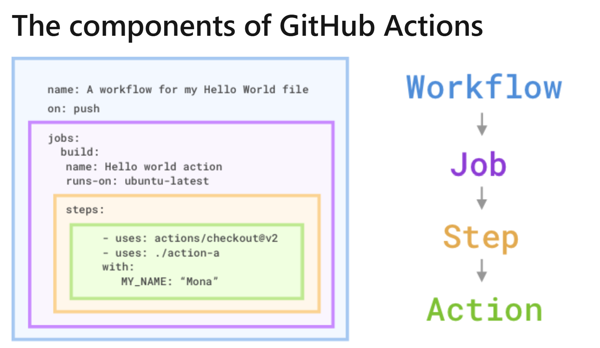
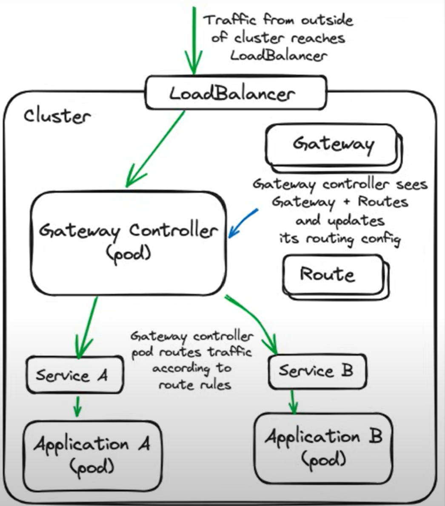

# DevOps Notes (Cheatsheet)

These notes are meant to be coupled with a practical component and serve merely as the theoritical reference. These notes combine various technical blogs, courses, and books. All references have been included.

_Have fun.. and remember, do not get stuck in tutorial hell :)_

### Table of Contents

1. [DevOps Overview](#devops-overview)

- [What is DevOps?](#what-is-devops)
- [Key DevOps Operations](#key-devops-operations)

2. [Containers](#containers-reference)

- [What is a Container?](#what-is-a-container)
- [Containers' Building Blocks](#containers-building-blocks)

3. [Github Actions](#github-actions)

- [What is Github Actions?](#what-is-github-actions)
- [Github Features](#github-features)
- [Types of Actions](#types-of-actions)
- [Github Actions Workflows](#github-actions-workflows)
- [Components of Github Actions](#components-of-github-actions)
- [More on Github Actions](#more-on-github-actions)
- [Some Important Actions](#some-important-actions)

4. [DevOps Directive Kubernetes Course](#devops-directive-kubernetes-course-link)

- [Terminologies](#terminologies)
- [Kubernetes Architecture](#kubernetes-architecture)
- [Kubernetes System Components](#kubernetes-system-components)
- [Setup Tools](#setup-tools)
- [Built-in Kubernetes Resources](#built-in-kubernetes-resources)
- [Helm](#helm)
- [Demo Application](#demo-application)
- [Extending the Kubernetes API](#extending-the-kubernetes-api)
- [Auxiliary Tooling](#auxiliary-tooling)
- [Developer Experience](#developer-experience)
- [Debugging](#debugging)
- [Deploying to Multiple Environments](#deploying-to-multiple-environments)
- [Cluster/Node Upgrades](#clusternode-upgrades)
- [CI/CD](#cicd)

5. [GitOps](#gitops)

- [What is GitOps?](#what-is-gitops)
- [Perks of using GitOps](#perks-of-using-gitops)
- [How does GitOps work?](#how-does-gitops-work)
- [Working with Multiple Applications and Environments](#working-with-multiple-applications-and-environments)
- [Secret Handling](#secret-handling)
- [GitOps References](#gitops-references)

6. [Certified Kubernetes Application Developer (CKAD) Certification](#certified-kubernetes-application-developer-ckad-certification)

- [About The Certification](#about-the-certification)
- [Resources](#resources)

7. [CKAD Udemy Course](#ckad-udemy-course-link)

- [Section 1: Introduction](#section-1-introduction)
- [Section 2: Core Concepts](#section-2-core-concepts)
- [Section 3: Configuration](#section-3-configuration)
- [Section 4: Multi-Container Pods](#section-4-multi-container-pods)
- [Section 5: Observability](#section-5-observability)
- [Section 6: Pod Design](#section-6-pod-design)
- [Section 7: Services & Networking](#section-7-services--networking)
- [Section 8: State Persistence](#section-8-state-persistence)

### DevOps Overview

#### What is DevOps?

DevOps is a collaborative culture and set of practices that unify software development (Dev) and IT operations (Ops). It emphasizes automation, continuous feedback, and shared ownership to accelerate software delivery, improve reliability, and foster agility. By breaking down silos between teams, DevOps enables organizations to ship high-quality code faster and respond to market changes effectively.

#### Key DevOps Operations

| **Operation**                    | **Description**                                                               | **Examples**                                 |
| -------------------------------- | ----------------------------------------------------------------------------- | -------------------------------------------- |
| **Continuous Integration (CI)**  | Automate building and testing code changes to catch issues early.             | Jenkins, GitHub Actions, GitLab CI           |
| **Continuous Delivery (CD)**     | Automate deployments to staging/production environments after CI passes.      | ArgoCD, Spinnaker, AWS CodeDeploy            |
| **Infrastructure as Code (IaC)** | Define and manage infrastructure (servers, networks) using declarative code.  | Terraform, AWS CloudFormation                |
| **Monitoring & Observability**   | Track system health, logs, and metrics in real-time to detect anomalies.      | Prometheus, Grafana, Datadog                 |
| **Incident Management**          | Respond to and resolve outages with tools for alerts, collaboration, and RCA. | PagerDuty, Opsgenie, Jira Service Management |
| **Security (DevSecOps)**         | Integrate security checks into pipelines to identify vulnerabilities early.   | Snyk, SonarQube, HashiCorp Vault             |
| **Configuration Management**     | Automate server/application configuration to ensure consistency.              | Ansible, Chef, Puppet                        |

**End of DevOps Overview!**

### Containers ([reference](https://courses.devopsdirective.com/docker-beginner-to-pro))

#### What is a Container?

A Docker container image is a lightweight, standalone, executable package of software that includes everything needed to run an application. This package contains:

- Underlying OS dependencies
- Runtime dependencies (e.g., Python runtime)
- Libraries (e.g., SQL Alchemy, FastAPI)
- Application code
  Containers leverage three linux features to work their magic:

Docker is a specific implementation of the Open Container Initiative (OCI) standard that aims to create open standards for container formats. When referring to Docker images or Docker container images, it means the Docker implementation of the OCI specification.

#### Containers' Building Blocks

1. cgroups: are a Linux kernel feature which allow processes to be organized into hierarchical groups whose usage of various types of resources (e.g., CPU, memory, etc) can then be limited and monitored.

2. namespaces: wraps a global system resource in an abstraction that makes it appear to the processes within the namespace that they have their own isolated instance of the global resource. Changes to the global resource are visible to other processes that are members of the namespace, but are invisible to other processes.

3. union fileystems: allows files and directories of separate file systems, known as branches, to be transparently overlaid, forming a single coherent file system.

Contents of directories which have the same path within the merged branches will be seen together in a single merged directory, within the new, virtual filesystem.

This approach allows for efficient use of space because common layers can be shared. For example, if multiple containers from the same image are created on a single host, the container runtime only has to allocate a thin overlay specific to each container, while the underlying image layers can be shared. More detail on understanding the implications of these filesystem on data persistence can be found in 04-using-3rd-party-containers.


**End of Containers!**

### Github Actions

#### What is Github Actions?

GitHub Actions are packaged scripts to automate tasks in a software-development workflow in GitHub. You can configure GitHub Actions to trigger complex workflows that meet your organization's needs. The trigger can happen each time developers check new source code into a specific branch, at timed intervals, or manually. The result is a reliable and sustainable automated workflow, which leads to a significant decrease in development time.

#### Github Features

GitHub is designed to help teams of developers and DevOps engineers build and deploy applications quickly. There are many features in GitHub that enable this, but they generally fall into one of two categories:

Communication: Consider all of the ways that GitHub makes it easy for a team of developers to communicate about the software development project: code reviews in pull requests, GitHub issues, project boards, wikis, notifications, and so on.
Automation: GitHub Actions lets your team automate workflows at every step in the software-development process, from integration to delivery to deployment. It even lets you automate adding labels to pull requests and checking for stale issues and pull requests.

#### Types of Actions

There are three types of GitHub actions: container actions, JavaScript actions, and composite actions.

With container actions, the environment is part of the action's code. These actions can only be run in a Linux environment that GitHub hosts. Container actions support many different languages.

JavaScript actions don't include the environment in the code. You'll have to specify the environment to execute these actions. You can run these actions in a VM (virtual machine) in the cloud or on-premises. JavaScript actions support Linux, macOS, and Windows environments.

Composite actions allow you to combine multiple workflow steps within one action. For example, you can use this feature to bundle together multiple run commands into an action, and then have a workflow that executes the bundled commands as a single step using that action.

#### Github Actions Workflows

A GitHub Actions workflow is a process that you set up in your repository to automate software-development lifecycle tasks, including GitHub Actions. With a workflow, you can build, test, package, release, and deploy any project on GitHub. To create a workflow, you add actions to a .yml file in the .github/workflows directory in your GitHub repository.

A workflow must have at least one job. A job is a section of the workflow associated with a runner. A runner can be GitHub-hosted or self-hosted, and the job can run on a machine or in a container. You'll specify the runner with the runs-on: attribute. A runner is simply a server that has the GitHub Actions runner application installed.

#### Components of Github Actions

There are several components that work together to run tasks or jobs within a GitHub Actions workflow. In short, an event triggers the workflow, which contains a job. This job then uses steps to dictate which actions will run within the workflow.



A workflow is an automated process that you add to your repository. A workflow needs to have at least one job, and different events can trigger it. You can use it to build, test, package, release, or deploy your repository's project on GitHub.

The job is the first major component within the workflow. A job is a section of the workflow that will be associated with a runner. A runner can be GitHub-hosted or self-hosted, and the job can run on a machine or in a container.

A step is an individual task that can run commands in a job.

The actions inside your workflow are the standalone commands that are executed. These standalone commands can reference GitHub actions such as using your own custom actions, or community actions.

#### More on Github Actions

In addition to default environment variables, you can use defined variables as contexts. Contexts and default variables are similar in that they both provide access to environment information, but they have some important differences. While default environment variables can only be used within the runner, context variables can be used at any point within the workflow. For example, context variables allow you to run an if statement to evaluate an expression before the runner is executed.

#### Some Important Actions

1. actions/checkout:

   - Clones your repository to the GitHub Actions runner.
   - Checks out the specified ref (branch, tag, SHA).
   - Sets up Git credentials for subsequent Git operations.
   - Configures the Git environment for the workflow.

2. actions/setup-node:

   - Sets up a Node.js environment for use in your workflow.
   - Allows you to specify the Node.js version.
   - Useful for installing dependencies and running JavaScript/TypeScript builds or tests.

3. actions/cache:

   - Caches dependencies and build outputs to speed up workflow execution.
   - Commonly used to cache package manager directories (e.g., npm, pip, Maven).

4. actions/upload-artifact & actions/download-artifact:

   - Uploads and downloads build artifacts between workflow steps or jobs.
   - Useful for sharing files (e.g., test reports, binaries) across jobs.

5. docker/build-push-action:

   - Builds and pushes Docker images to a container registry.
   - Supports advanced features like build caching and multi-platform builds.

6. actions/setup-python:

   - Sets up a Python environment for your workflow.
   - Allows you to specify the Python version and install dependencies.

7. github/codeql-action:

   - Runs CodeQL analysis for security and code quality scanning.
   - Helps identify vulnerabilities in your codebase.

8. actions/github-script:

   - Allows you to run custom JavaScript directly in your workflow.
   - Useful for automating GitHub API calls or custom logic.

For a comprehensive list, see the [GitHub Actions Marketplace](https://github.com/marketplace?type=actions).

**End of Github Actions!**

### DevOps Directive Kubernetes Course ([link](https://youtu.be/2T86xAtR6Fo?si=FrIHT84JCSGWPfY6))

#### Terminologies

**Clusters**: a set of machines (physical or virtual) that work together to run containerized applications. It consists of at least one control plane (master node) and multiple worker nodes.

**Nodes**: a single machine (physical or virtual) in a Kubernetes cluster. Nodes are responsible for running the workloads (pods and containers). There are two types of nodes:

- Control Plane Node (Master Node): Manages the cluster, schedules workloads, and maintains the desired state of the system.
- Worker Node: Executes the workloads (pods and containers). Each worker node has a kubelet (agent) that communicates with the control plane.

**Namespaces**: a logical partition within a Kubernetes cluster. It is used to organize and isolate resources (like pods, services, and deployments) within the cluster. Namespaces are particularly useful in multi-tenant environments, where different teams or projects share the same cluster but need resource isolation.

**Workloads**: an application or a set of applications running on the cluster.

**Pods**: the smallest deployable unit in Kubernetes. It represents a single instance of a running process in your cluster. A pod can contain one or more containers that share the same network namespace, storage, and configuration. Pods are ephemeral by nature, meaning they can be created, destroyed, and replaced as needed.

**Containers**: a lightweight, standalone, and executable package of software that includes everything needed to run an application (code, runtime, libraries, and dependencies). In Kubernetes, containers are run inside pods. Kubernetes supports multiple container runtimes, with Docker being the most commonly used.

**CPU Requests**: CPU requests specify the minimum amount of CPU resources a container is guaranteed to have. Kubernetes uses this value to schedule the container on a node that has enough available CPU capacity. Measured in cores or millicores.
If a container's CPU request is not set, Kubernetes may schedule it on a node without guaranteeing that the container will have enough CPU resources, which could lead to performance issues.

**CPU Limits**: CPU limits specify the maximum amount of CPU resources a container is allowed to use. If the container tries to exceed this limit, Kubernetes throttles the container's CPU usage. Measured in cores or millicores.
If a container's CPU limit is not set, it can use as much CPU as is available on the node, potentially starving other containers of resources.

#### Kubernetes Architecture


Node: A "node" is a computer/server. Multiple nodes are joined together to form a "cluster".

Control Plane: A subset of nodes in the cluster dedicated to performing system tasks. Nodes that are part of the control plane are referred to as "control plane nodes".

Data Plane: A subset of nodes in the cluster dedicated to running user worklods. Nodes that are part of the data plane are referred to as "worker nodes".

#### Kubernetes System Components


Kubernetes is comprised of many smaller components:

- etcd: Key-value store used for storing all cluster data. It serves as the source of truth for the cluster state and configuration.

- kube-apiserver: The front end for the Kubernetes control plane.

- kube-scheduler: Schedules pods onto the appropriate nodes based on resource availability and other constraints.

- kube-controller-manager: Runs controller processes. Each controller is a separate process that manages routine tasks such as maintaining the desired state of resources, managing replication, handling node operations, etc...

- cloud-controller-manager: Integrates with the underlying cloud provider (if running in one) to manage cloud-specific resources. It handles tasks such as managing load balancers, storage, and networking.

- kubelet: An agent that runs on each worker node and ensures that containers are running in pods and manages the lifecycle of containers.

- kube-proxy: This network proxy runs on each node and maintains network rules to allow communication to and from pods (not a necessity, other networking mechanisms exist).

- Interfaces: Container Runtime Interface (CRI), Container Network Interface (CNI), Container Storage Interface (CSI). Defining these interfaces allows for a modular system where innovation can happen outside of the main Kubernetes project and be easily “plugged in” or swapped to achieve new functionality.
  - CRI: Standard interface that Kubernetes uses to exeucte and run container processes within the system (e.g., container d, cri-o). Docker is no longer compatible.
  - CNI: Defines how networking should be set up for the containers running within Kubernetes. Many different ones exist. Not all of them uses kube-proxy.
  - CSI: Interface to provide storage to containers through drivers (e.g., cloud specific driver, cert manager driver, secrets store driver).

Kubernetes uses Docker images (OCI-compliant container images) as the standardized packaging format, but runs them through container runtimes like containerd or CRI-O that implement the Container Runtime Interface (CRI). This separation allows Kubernetes to support multiple runtime implementations while maintaining compatibility with the widely-adopted Docker image format.

[CNCF Landscape](https://landscape.cncf.io/) -> A website to find all the tools that are out there

#### Setup Tools

- DevBox: Devbox is a command-line tool developed by Jetpack.io that creates isolated, reproducible development environments. It allows developers to specify and manage development dependencies using a simple configuration file.
- KinD: simple local cluster for development. Supports multiple nodes where each node is a container.
- Civo: managed cluster platform.
- GKE: Google's Kubernetes Engine for a recommended managed cluster experience. Two modes: standard and autopilot. Google manages control plane in both but autopilot abstracts more details.


#### Built-in Kubernetes Resources

- Namespace: provides a mechanism to logically group resources within a cluster. There are four initial namespaces: default, kube-system, kube-node-lease, kube-public.
  By default, namespaces DO NOT act as a network/security boundary.
- Pods: the smallest deployable unit in Kubernetes. You almost never create a pod directly. Containers within a pod share networking and storage. Usually primary container, init containers (ran before primary container is run), and sidecar containers (run alongside primary container in perpetuity). To investigate a pod: `kubectl logs some-pod`. `kubectl get pods -o wide`

  **Pod -> ReplicaSet -> Deployment -> StatefulSet**

- ReplicaSet: creates replica instances of the pods at all time. labels are the link between ReplicaSet and Pods.
- Deployment: adds the concept of rollouts and rollbacks to ReplicaSet. Used for long-running stateless applications.
- Service: an internal load balancer across replicas. It routes network traffic. Uses pod labels to determine which pods to serve. Types: ClusterIP (internal), NodePort (listens on each node in cluster), LoadBalancer (provisions external load balancer with cloud provider)


- Jobs: pods with completion tracking. Adds ability to retry pods. To investigate a job: `kubectl describe job some-job`
- CronJobs: scheduled jobs. [How the schedule string works](https://crontab.guru).
- DaemonSet: runs a copy of the specific pod on all (or some) nodes in the cluster. Useful for log aggregation, cluster storage daemon, monitoring. An example would be Grafana.
- StatefulSet: Similar to deployments but designed for stateful workloads. Has sticky identity (e.g., pod-0, pod-1), each pod mounts separate volumes, rollout behavior is ordered. Limitation: can't modify many of the fields after a StatefulSet has been created. InitContainers are often used with StatefulSets.
  Note that a headless ClusterIP service is needed to address each pod in the StatefulSet individually (DNS resolution) as the normal ClusterIP service provides a single stable IP address and DNS name for accessing the StatefulSet pods as a whole and not individually.
- ConfigMaps: enable environment specific configuration to be decoupled from container images. Two primary styles: property-like keys, file-like keys.
- Secrets: similar to ConfigMaps with one main difference: data is base64 encoded. This is to support binary data.
- Ingress: enables routing traffic to many services via a single external LoadBalancer (ingress controllers e.g., Ingress-nginx, HAProxy, Kong). Only officialy supports layer 7 routing but some application allow for layer 4 (TCP/UDP) routing.
  
- GatewayAPI: evolution of the Ingress API. Adds support for layer 4 routing and more advanced routing scenarios.
  
  (See Ingress x GatewayAPI x LoadBalancer GPT explanation below)
- PersistentVolume & PersistentVolumeClaim: provides api for persistent storage. Access modes: ReadWriteOnce (limited mounting to one node) ReadWriteOncePod (one pod), ReadOnlyMany, ReadWriteMany. Reclaim policy: retain vs delete.
  Note that dynamically specified Deployments and StatefulSets behave different when it comes tp PersistentVolumeClaim, where Deployment only creates one volume claim that is shared across the pods but StatefulSets creates one per pod.
  
- RBAC (ServiceAccount, Role, RoleBinding): provide applications or users access to the Kubernetes API. Access can be granted by namespace or cluster wide.
- Labels: key-value pairs used to identify and organize Kubernetes resources. Can be used to filter api-servier queries (e.g., with kubectl).
- Annotations: Key-value pairs used for non-identifiying metadata. Used for things like configuration details, deployment history. Often used by tools to configure specific behaviors (e.g., ingress annotations).
  **Ingress x GatewayAPI x LoadBalancer GPT explanation:**

**Ingress** is a Kubernetes API object that manages external access to services within a Kubernetes cluster, typically HTTP/HTTPS traffic. It acts as a smart router, allowing you to define rules for routing traffic from outside the cluster to internal services based on hostnames, paths, or other criteria.

**Key points about Ingress:**

- It provides a way to expose multiple services under the same IP address or DNS name.
- Ingress resources define rules (e.g., "traffic to `/api` goes to Service A, `/web` goes to Service B"). Services here are the different application components.

  Typical flow of a request:

  ```
  External Request → Load Balancer → Ingress Controller → Single Ingress Resource
                                              ├── /api → Backend Service → Backend Pods
                                              ├── /web → Frontend Service → Frontend Pods
                                              └── /admin → Admin Service → Admin Pods
  ```

- Ingress requires an **Ingress Controller** (like NGINX, Traefik, or HAProxy) to actually implement the routing logic.

**Important Summary:**

**Ingress Controller = The software/infrastructure (nginx, traefik, ALB) - shared across cluster.**

**Ingress Resource = Your app's specific routing rules - one per app/service.**

---

The **Gateway API** is a newer, more flexible, and extensible way to manage traffic into Kubernetes clusters. It aims to address some limitations of Ingress and provide a more expressive model for traffic management.

**Key points about Gateway API:**

- It introduces new resources: `GatewayClass`, `Gateway`, `HTTPRoute`, `TCPRoute`, etc.
- It separates infrastructure concerns (e.g., how traffic enters the cluster) from application routing (e.g., which service gets the traffic).
- It supports advanced use cases like traffic splitting, header-based routing, and cross-namespace routing.
- It is designed to be more portable across different environments and vendors.

---

A **Load Balancer** in Kubernetes is typically an external or cloud-managed resource that distributes incoming network traffic across multiple backend pods or services to ensure reliability and scalability.

**Key points about Load Balancers:**

- When you create a `Service` of type `LoadBalancer`, Kubernetes asks the cloud provider (e.g., AWS, GCP, Azure) to provision an external load balancer.
- The load balancer gets a public IP address and forwards traffic to the Kubernetes nodes, which then route it to the appropriate pods.
- In on-premises environments, you might use MetalLB or similar solutions to provide load balancer functionality.

---

**How They Work Together:** Here’s how these components typically interact in a Kubernetes environment:

1. **External Traffic Entry:**  
   Traffic from the internet first hits a **Load Balancer** (provisioned by a Service of type LoadBalancer or by the Gateway API).

2. **Routing to the Cluster:**  
   The load balancer forwards the traffic to one or more Kubernetes nodes, targeting the Ingress Controller or Gateway implementation running as a pod.

3. **Application Routing:**

   - If using **Ingress**, the Ingress Controller reads Ingress resources and routes the traffic to the correct service based on the rules.
   - If using **Gateway API**, the Gateway implementation reads Gateway and Route resources to determine how to route the traffic.

4. **Service Discovery:**  
   The traffic is finally forwarded to the appropriate Kubernetes Service, which then load balances it across the relevant pods.

#### Helm

Helm is the De-facto standard for distributing software for Kubernetes. Its a combination of a package manager and a templating engine. Primary use cases: application deployment, environment management.
Commands:

- helm install
- helm upgrade
- helm rollback


#### Demo Application


Demo application architecture. Container images hosting on docker hub used for all components except postgres and ingress controller, to which helm charts were used.

#### Extending the Kubernetes API

Kubernetes is not just a container orchestrator.
It provides an API for:

- Declaring a set of resources.
- Observing and acting upon those resources (control loop).

Custom Resource Definitions (CRDs) allow applications to extend the default resource set.

Custom controllers observe and act upon CRDs.

Use Cases:

- Embed custom login into "Operators" (CloudNativePG).
- Manage TLS certificates (Cert-Manager).
- Deploy infrastructure with automatic reconciliation (Crossplane).

To build your own resource, define your own configuration and build a controller (operator) to act upon that custom configuration.


#### Auxiliary Tooling

**CloudNative PG:** A Kubernetes operator that manages PostgreSQL workloads with high availability, disaster recovery, and cloud-native features. Barman: backup and recovery manager.

**Trivy Operator:** A Kubernetes operator that continuously scans your cluster for vulnerabilities and misconfigurations using Trivy scanner.

#### Developer Experience

**Tilt:** A developer tool that rebuilds, deploys, and updates your application continuously as you edit code, providing fast feedback for Kubernetes development workflows. This is better than using a docker compose as tilt works in a real kubernetes environment, rather than just a Dockerfile.

**External Secrets Operator**: A Kubernetes operator that synchronizes secrets from external APIs (like AWS Secrets Manager, HashiCorp Vault, or Azure Key Vault) into Kubernetes as Secret resources.

#### Debugging

[Troubleshooting Guide](https://learnk8s.io/troubleshooting-deployments)

#### Deploying to Multiple Environments

1. Kustomize: a tool built into kubectl. Uses base + overlay model where you define some base configuration and then for each environment you will specify an overlay. Its limitations lie within lists and multi-line strings in YAML.
   
2. Helm: uses a templating model. A configuration file for each environment. Has "hooks" which allow encoding dependencies. Its limitations are with the un-readable templates at a large scale, boilerplate configuration, and CRD management is limited.
3. Kluctl: uses a templating model. Also has hooks. Integrates with helm and kustomize. Includes a built in GitOps engine. Great choice for deploying to multiple environments, but requires slightly more setup.

#### Cluster/Node Upgrades

**Upgrade Process:**

1. `Check for usage of deprecated APIs`: If you are using deprecated APIs that will be removed by a Kubernetes upgrade, you need to address those before upgrading. One tool that automatically checks this is [kubent](https://github.com/doitintl/kube-no-trouble).

2. `Update the control plane`: The control plane version can be ahead of the worker nodes, but cannot be behind so it is updated first.

3. `Create a new nodepool`: Rather than update nodes in place, it can be safer to create a new node group. This way the new nodes will be fully operational before you shift workloads to them and if something goes wrong you can shift the workloads back to the old nodes.

4. `Drain and cordon the old nodes`: You can use kubernetes scheduling capabilities to shift all of the pods onto the newly provisioned nodes.

5. `Delete the old nodepool`: Once all of the workloads are successfully running on the new nodes, you can safely delete the old nodes.

_Note: managed clusters may not give the perms to follow the above process, to which you will have to upgrade in place. Some people also prefer to deploy entirely new clusters rather than upgrading (depending on the amount of state in the cluster)._

#### CI/CD

##### Deployment Strategies

- Level -1: kubectl create (imperative).
- Level 0: kubectl apply manually (declarative).
- Level 1: kubectl apply from pipeline (automated).
- Level 2: GitOps (continuous).

##### Continuous Integration

- Run linting, tests, validation.
- Build and push container images.

Both of these are easily done via Github Actions.

[**Sample Github Actions CI Workflow**](workflows/image-ci.yml)

This workflow builds and pushes Docker images (CI), while updating image tags in Kubernetes manifests for CD.

##### Continuous Delivery

- Update Kubernetes manifests using Github Actions.

- Apply updated manifests to cluster(s) using kluctl GitOps (or other CD tools like ArgoCD).

  Kluctl GitOps architecture:
  

- Validate deployments worked as expected.

**End of DevOps Directive Kubernetes Course!**

### GitOps

#### What is GitOps?

GitOps is a way to do Kubernetes cluster management and application delivery. It works by using Git as a single source of truth for declarative infrastructure and applications (i.e., infrastructure as code), together with tools ensuring the actual state of infrastructure and applications converges towards the desired state declared in Git. With Git at the center of your delivery pipelines, developers can make pull requests to accelerate and simplify application deployments and operations tasks to your infrastructure or container-orchestration system (e.g. Kubernetes).


The core idea of GitOps is having a Git repository that always contains declarative descriptions of the infrastructure currently desired in the production environment and an automated process to make the production environment match the described state in the repository. If you want to deploy a new application or update an existing one, you only need to update the repository - the automated process handles everything else. It’s like having cruise control for managing your applications in production.

_GitOps: versioned CI/CD on top of declarative infrastructure. Stop scripting and start shipping._ - Kelsey Hightower

_GitOps is a subset of DevOps: GitOps implements DevOps principles (automation, collaboration) but focuses specifically on deployment workflows. - Deepseek R1_

#### Perks of using GitOps

_High Velocity Deployments_: What is unique about GitOps is that you don’t have to switch tools for deploying your application. Everything happens in the version control system you use for developing the application anyways.

_Easy and Fast Error Recovery_: With GitOps you have a complete history of how your environment changed over time. This makes error recovery as easy as issuing a `git revert` and watching your environment being restored.

_The Git record is then not just an audit log but also a transaction log. You can roll back & forth to any snapshot._ - Alexis Richardson

_Easier Credential Management_: GitOps allows you to manage deployments completely from inside your environment. For that, your environment only needs access to your repository and image registry. That’s it. You don’t have to give your developers direct access to the environment.

_Self-documenting Deployments_: Have you ever SSH’d into a server and wondered what’s running there? With GitOps, every change to any environment must happen through the repository. You can always check out the master branch and get a complete description of what is deployed where plus the complete history of every change ever made to the system. And you get an audit trail of any changes in your system for free!

_Shared Knowledge_: Using Git to store complete descriptions of your deployed infrastructure allows everybody in your team to check out its evolution over time. With great commit messages everybody can reproduce the thought process of changing infrastructure and also easily find examples of how to set up new systems.

#### How does GitOps work?

_Environment Configurations as Git repository_: GitOps organizes the deployment process around code repositories as the central element. There are at least two repositories: the application repository and the environment configuration repository. The application repository contains the source code of the application and the deployment manifests to deploy the application. The environment configuration repository contains all deployment manifests of the currently desired infrastructure of an deployment environment. It describes what applications and infrastructural services (message broker, service mesh, monitoring tool, …) should run with what configuration and version in the deployment environment.

_Push-based vs. Pull-based Deployments_: There are two ways to implement the deployment strategy for GitOps: Push-based and Pull-based deployments. The difference between the two deployment types is how it is ensured, that the deployment environment actually resembles the desired infrastructure. When possible, the Pull-based approach should be preferred as it is considered the more secure and thus better practice to implement GitOps.

The Push-based deployment strategy is implemented by popular CI/CD tools such as Jenkins, CircleCI, or Travis CI. The source code of the application lives inside the application repository along with the Kubernetes YAMLs needed to deploy the app. Whenever the application code is updated, the build pipeline is triggered, which builds the container images and finally the environment configuration repository is updated with new deployment descriptors.

Tip: You can also just store templates of the YAMLs in the application repository. When a new version is built, the template can be used to generate the YAML in the environment configuration repository.


With this approach it is indispensable to provide credentials to the deployment environment. So the pipeline has god-mode enabled. In some use cases a Push-based deployment is inevitable when running an automated provisioning of cloud infrastructure. In such cases it is strongly recommended to utilize the fine-granular configurable authorization system of the cloud provider for more restrictive deployment permissions.

Another important thing to keep in mind when using this approach is that the deployment pipeline only is triggered when the environment repository changes. It can not automatically notice any deviations of the environment and its desired state. This means, it needs some way of monitoring in place, so that one can intervene if the environment doesn’t match what is described in the environment repository.

The Pull-based deployment strategy uses the same concepts as the push-based variant but differs in how the deployment pipeline works. Traditional CI/CD pipelines are triggered by an external event, for example when new code is pushed to an application repository. With the pull-based deployment approach, the operator is introduced. It takes over the role of the pipeline by continuously comparing the desired state in the environment repository with the actual state in the deployed infrastructure. Whenever differences are noticed, the operator updates the infrastructure to match the environment repository. Additionally the image registry can be monitored to find new versions of images to deploy.


Just like the push-based deployment, this variant updates the environment whenever the environment repository changes. However, with the operator, changes can also be noticed in the other direction. Whenever the deployed infrastructure changes in any way not described in the environment repository, these changes are reverted. This ensures that all changes are made traceable in the Git log, by making all direct changes to the cluster impossible.

This change in direction solves the problem of push-based deployments, where the environment is only updated when the environment repository is updated. However, this doesn’t mean you can completely do without any monitoring in place. Most operators support sending mails or Slack notifications if it can not bring the environment to the desired state for any reason, for example if it can not pull a container image. Additionally, you probably should set up monitoring for the operator itself, as there is no longer any automated deployment process without it.

The operator should always live in the same environment or cluster as the application to deploy. This prevents the god-mode, seen with the push-based approach, where credentials for doing deployments are known by the CI/CD pipeline. When the actual deploying instance lives inside the very same environment, no credentials need to be known by external services. The Authorization mechanism of the deployment platform in use can be utilized to restrict the permissions on performing deployments. This has a huge impact in terms of security. When using Kubernetes, RBAC configurations and service accounts can be utilized.

#### Working with Multiple Applications and Environments

You can always just set up multiple build pipelines that update the environment repository. From there on the regular automated GitOps workflow kicks in and deploys all parts of your application.


Managing multiple environments with GitOps can be done by just using separate branches in the environment repository. You can set up the operator or the deployment pipeline to react to changes on one branch by deploying to the production environment and another to deploy to staging.

#### Secret Handling

First of all, never store secrets in plain text in git! Never!

That being said, you have secrets created within the environment which never leave the environment. The secret stays unknown, and applications get the secrets they require but they aren’t exposed to the outside world. For example, you provision a database within the environment and give the secret to the applications interacting with the database only.

Another approach is to add a private key once to the environment (probably by someone from a dedicated ops team) and from that point you can add secrets encrypted by the public key to the environment repository. There’s even tool support for such sealed secrets in the K8s ecosystem.

_There are no GitOps engineers. GitOps is not a role (and neither is DevOps). GitOps is a set of practices. You can look for a developer who has experience practicing GitOps — or simply let your developers try out those practices._

#### GitOps References

- https://github.com/weaveworks/awesome-gitops
- https://www.gitops.tech/

**End of GitOps!**

### Certified Kubernetes Application Developer (CKAD) Certification

#### About The Certification

The [Certified Kubernetes Application Developer (CKAD) certification](https://training.linuxfoundation.org/certification/certified-kubernetes-application-developer-ckad/) is a performance-based exam designed to validate a candidate's ability to design, build, and run applications on Kubernetes. It focuses on core concepts such as configuration, multi-container pods, observability, pod design, services, networking, and state persistence. The exam is hands-on and requires practical knowledge of Kubernetes resources, YAML manifest creation, and troubleshooting skills, making it ideal for developers who want to demonstrate their proficiency in deploying and managing applications in Kubernetes environments.

#### Resources

There are many ways to help prepare you for the [CKAD exam](https://training.linuxfoundation.org/certification/certified-kubernetes-application-developer-ckad/), the following notes are based on this [udemy course](https://udemy.com/course/certified-kubernetes-application-developer) with its practical labs from [KodeKloud](https://kodekloud.com/).

For practice exams, [killer.sh](https://killer.sh/) and [acloud.guru](http://acloud.guru/) are the go to.

### CKAD Udemy Course [(link)](https://udemy.com/course/certified-kubernetes-application-developer)

#### Section 1: Introduction

All introductory concepts are already covered with my other notes above. Be sure to be comfortable with the concepts above.

In the following sections, **I have only included new information, mainly commands, tips and tricks, and the practical side of Kubernetes**. Be sure to get your hands dirty, preferably follow the practical labs from [KodeKloud](https://kodekloud.com/).

#### Section 2: Core Concepts

##### Container Runtimes

Support for docker as Kubernete's container runtime (through dockershim) was removed version 1.24. This meant only CRI runtimes (e.g., containerd) could be used.

CLI tools to interact with containers:

| Tool        | Description                                                              | Use Case                                       | Supported Runtimes        | CLI Syntax Example             |
| ----------- | ------------------------------------------------------------------------ | ---------------------------------------------- | ------------------------- | ------------------------------ |
| **ctr**     | Low-level CLI for containerd; exposes containerd’s API directly.         | Advanced debugging, scripting, direct control. | containerd                | `ctr images pull nginx:latest` |
| **nerdctl** | Docker-compatible CLI for containerd; supports Docker-like commands.     | Docker-like workflows with containerd backend. | containerd                | `nerdctl run -d nginx:latest`  |
| **crictl**  | CLI for CRI-compatible runtimes (containerd, CRI-O); Kubernetes-focused. | Debugging Kubernetes nodes, troubleshooting.   | containerd, CRI-O, others | `crictl pods`                  |

**Summary:**

- `ctr` is for direct, low-level containerd operations.
- `nerdctl` is for users familiar with Docker CLI, but using containerd.
- `crictl` is for interacting with Kubernetes container runtimes via the CRI.

##### YAML Manifests

**The required YAML fields for a Kubernetes object are:**

1. `apiVersion`: Specifies the version of the Kubernetes API to use for the object.
2. `kind`: Specifies the type of Kubernetes object (e.g., Pod, Deployment, Service).
3. `metadata`: Provides data that helps uniquely identify the object, including a `name` and optionally `namespace`, `labels`, etc.
4. `spec`: Defines the desired state and configuration for the object.

Example:

```yaml
apiVersion: v1
kind: Pod
metadata:
  name: my-pod
spec:
  containers:
    - name: my-container
      image: nginx
```

##### Pod Definitions

If you are not given a pod definition file, you may extract the definition to a file using the below command:

`kubectl get pod <pod-name> -o yaml > pod-definition.yaml`

To modify the properties of the pod, you can utilize the `kubectl edit pod <pod-name>` command. Please note that only the properties listed below are editable.

- spec.containers[*].image

- spec.initContainers[*].image

- spec.activeDeadlineSeconds

- spec.tolerations

- spec.terminationGracePeriodSeconds

With Deployments, however, you can easily edit ANY field/property of the POD template. Since the pod template is a child of the deployment specification, with every change the deployment will automatically delete and create a new pod with the new changes. So if you are asked to edit a property of a POD part of a deployment you may do that simply by running the command:

```
kubectl edit deployment my-deployment
```

##### Scaling ReplicaSets

To scale up a ReplicaSet, you can use the `kubectl scale` command and specify the desired number of replicas. For example, to scale a ReplicaSet named `my-replicaset` to 5 replicas:

```
kubectl replace -f replicaset.yaml
```

**Tip:** For minor changes, consider using `kubectl apply` (declarative) or `kubectl edit` (interactive) instead of `replace`, as `replace` will overwrite the entire resource.

Alternatively, you can use the scale command, but the manifest file would not be updated.

```
kubectl scale replicaset my-replicaset --replicas=5
```

Alternatively, you can edit the ReplicaSet manifest and update the `spec.replicas` field, then apply the changes:

```
export KUBE_EDITOR="nano" # otherwise, vi will be used..
kubectl edit replicaset my-replicaset
```

Change the `replicas` value under `spec` and save the file.

**Note:** Deployments manage ReplicaSets automatically, so it's recommended to scale Deployments instead of ReplicaSets directly in most cases.

##### Cluster DNS

Kubernetes provides built-in DNS-based service discovery for workloads running in the cluster. The DNS add-on (usually CoreDNS) automatically creates DNS records for Services and Pods, allowing applications to refer to each other by name.

- **Service DNS:** Each Service gets a DNS entry in the form `<service-name>.<namespace>.svc.cluster.local`. For example, a Service named `backend` in the `default` namespace is accessible at `backend.default.svc.cluster.local`.
- **Pod DNS:** Pods can also be assigned DNS records, but direct Pod addressing is less common.
- **Automatic Resolution:** Applications can use just the Service name if they're in the same namespace, or the fully qualified domain name (FQDN) for cross-namespace communication.

**Example:**
If a Deployment's Pods need to connect to a database Service called `postgres` in the `db` namespace, they can use the address: `postgres.db.svc.cluster.local`.

**Note:** CoreDNS is the default DNS provider in modern Kubernetes clusters. You can check DNS resolution by running `nslookup <service-name>` or `dig <service-name>` from within a Pod.

**Troubleshooting:** If DNS resolution fails, check that the CoreDNS pods are running (`kubectl get pods -n kube-system -l k8s-app=kube-dns`) and that your Pod's DNS config is correct.

Switch namespaces manually (without kubens) using this command:

```
kubectl config set-context --current --namespace=<namespace-name>
```

##### Creating Manifest Files on The Run

`--dry-run`: By default, as soon as the command is run, the resource will be created.

If you simply want to test your command, use the `--dry-run=client` option. This will not create the resource. Instead, tell you whether the resource can be created and if your command is right.

`-o yaml`: This will output the resource definition in YAML format on the screen.

Use the above two in combination along with Linux output redirection to generate a resource definition file quickly, that you can then modify and create resources as required, instead of creating the files from scratch.

```
kubectl run nginx --image=nginx --dry-run=client -o yaml > nginx-pod.yaml
```

Similarly for other resource types:

```
kubectl create deployment --image=nginx nginx --dry-run -o yaml
```

Notice how run is used for Pods and create for all other resources.

Create a Service named redis-service of type ClusterIP to expose pod redis on port 6379:

```
kubectl expose pod redis --port=6379 --name redis-service --dry-run=client -o yaml
```

The above will automatically use the pod's labels as selectors.

Or:

```
kubectl create service clusterip redis --tcp=6379:6379 --dry-run=client -o yaml
```

This will not use the pods' labels as selectors; instead it will assume selectors as app=redis. You cannot pass in selectors as an option. So it does not work well if your pod has a different label set. So generate the file and modify the selectors before creating the service.

Now, what if you want to create a Service named nginx of type NodePort to expose pod nginx's port 80 on port 30080 on the nodes:

```
kubectl expose pod nginx --port=80 --name nginx-service --type=NodePort --dry-run=client -o yaml
```

Or

```
kubectl create service nodeport nginx --tcp=80:80 --node-port=30080 --dry-run=client -o yaml
```

Both the above commands have their own challenges. While one of it cannot accept a node port the other cannot accept a selector. I would recommend going with the `kubectl expose` command. If you need to specify a node port, generate a definition file using the same command and manually input the nodeport before creating the service.

##### Overriding Docker Image ENTRYPOINT and CMD in Kubernetes

In Kubernetes, when you specify a command in the Pod spec (under containers[].command), it overrides the Docker image’s ENTRYPOINT.

If you specify args (under containers[].args), it overrides the Docker image’s CMD.

**End of Section 2: Core Concepts!**

#### Section 3: Configuration

##### ConfigMaps and Secrets

ConfigMaps and Secrets allow a way to pass variables to Pods. The only difference is that a Secret is base64 encoded and is supposed to be used for sensitive data. You can still easily access the Secret data as its NOT encrypted by default.

You can (and should) encrypt Secrets at Rest in etcd by following the [documentation](https://kubernetes.io/docs/tasks/administer-cluster/encrypt-data/).

##### Service Accounts

By default, every Pod in Kubernetes is assigned a ServiceAccount named `default` in its namespace. The ServiceAccount's credentials (a token and CA certificate) are automatically mounted into the Pod at `/var/run/secrets/kubernetes.io/serviceaccount`. This allows applications running inside the Pod to authenticate to the Kubernetes API server.

You can specify a different ServiceAccount for a Pod by setting the `serviceAccountName` field in the Pod spec. If you do not want any ServiceAccount token to be mounted, set `automountServiceAccountToken: false` in the Pod or ServiceAccount spec.

**Example:**

```yaml
apiVersion: v1
kind: Pod
metadata:
   name: mypod
spec:
   serviceAccountName: my-custom-sa
   containers:
      - name: app
         image: nginx
```

**Key Points:**

- ServiceAccounts are used for Pod-to-API authentication.
- The default ServiceAccount is used unless overridden.
- Tokens are mounted as files in the Pod by default.
- You can create custom ServiceAccounts and bind roles to them for fine-grained access control.
- To list ServiceAccounts: `kubectl get serviceaccounts`
- To describe a ServiceAccount: `kubectl describe serviceaccount <name>`

##### Service Account Token: Secret Object vs TokenRequest API

**Legacy Secret-based Tokens:**

- Traditionally, when a ServiceAccount is created, Kubernetes automatically generates a long-lived Secret of type `kubernetes.io/service-account-token`.
- This Secret contains a JWT token and is mounted into Pods using that ServiceAccount.
- The token is static (does not expire) and is stored as a Secret resource in the namespace.
- Example:
  ```yaml
  apiVersion: v1
  kind: Secret
  type: kubernetes.io/service-account-token
  metadata:
    name: my-sa-token-xxxxx
    annotations:
      kubernetes.io/service-account.name: my-sa
  ```
- Drawbacks: Tokens are long-lived, cannot be easily revoked, and are visible as Secrets.

**TokenRequest API (Bound Service Account Tokens):**

- Introduced in Kubernetes 1.22+ for improved security.
- Tokens are created on-demand via the TokenRequest API (`/api/v1/namespaces/{namespace}/serviceaccounts/{name}/token`).
- These tokens are short-lived (default 1 hour), can be audience-bound, and are not stored as Secrets.
- Used by projected service account token volumes and for external systems needing a token.
- Example (kubectl):
  ```bash
  kubectl create token my-sa --duration=10m
  ```
- Benefits: Tokens are ephemeral, can be audience-restricted, and are not persisted in etcd.

**Historical Importance:**

In older Kubernetes versions, the default ServiceAccount had a secret with a static token mounted into Pods automatically. However, starting from Kubernetes 1.24 (and more fully in 1.25+), the ServiceAccount Token Volume Projection mechanism is used by default.

This means:

- Instead of mounting a static token secret, Kubernetes uses the TokenRequest API to dynamically request a short-lived token for the ServiceAccount.
- This token is projected into the Pod via a volume mount and is automatically refreshed.
- This approach improves security by avoiding long-lived static tokens.

**Best Practice:**

Prefer using the TokenRequest API and projected service account tokens for improved security and token management.

##### Resource Requirements

It is best practice to have at least requests of the pod set to guarantee its resources. If both limits and requests are not set, any pod can consume all available resources and starve the other pods in the node.

If both limits and requests are set, Kubernetes will ensure that the pod gets at least the requested resources, but will not allow it to exceed the specified limits. If a container tries to use more than its limit, it will be throttled (for CPU) or terminated (for memory), even if the resources are available and unused in the node.

**Example:**

```yaml
resources:
  requests:
    memory: '64Mi'
    cpu: '250m'
  limits:
    memory: '128Mi'
    cpu: '500m'
```

- `requests`: The minimum amount of resources guaranteed for the container.
- `limits`: The maximum amount of resources the container can use.

**Key Points:**

- If only `limits` are set, `requests` default to `limits`.
- If only `requests` are set, there is no upper bound; the container can use more if available.

**Commands:**

- To view resource usage:  
   `kubectl top pod <pod-name>`
- To describe resource requests/limits:  
   `kubectl describe pod <pod-name>`

**LimitRange:**

LimitRange is a Kubernetes resource that enforces default and maximum/minimum resource requests and limits for Pods or Containers within a namespace. This helps ensure that all workloads in a namespace have appropriate resource constraints, preventing resource starvation or overconsumption.

**Example:**

```yaml
apiVersion: v1
kind: LimitRange
metadata:
   name: mem-cpu-limit-range
spec:
   limits:
      - default:
            cpu: 500m
            memory: 256Mi
         defaultRequest:
            cpu: 250m
            memory: 128Mi
         type: Container
```

**ResourceQuota:**

ResourceQuota is a Kubernetes resource that sets aggregate resource limits (such as CPU, memory, number of objects) for a namespace. It helps prevent a single team or workload from consuming all resources in a shared cluster.

**Example:**

```yaml
apiVersion: v1
kind: ResourceQuota
metadata:
  name: compute-resources
spec:
  hard:
    pods: '10'
    requests.cpu: '4'
    requests.memory: 8Gi
    limits.cpu: '8'
    limits.memory: 16Gi
```

**Key Points:**

- ResourceQuotas are applied per namespace.
- If a quota is exceeded, new resources (pods, services, etc.) cannot be created until usage drops below the quota.
- Use `kubectl describe quota` to view current usage and limits.

**Best Practice:**

Combine `LimitRange` and `ResourceQuota` to enforce both per-container and per-namespace resource constraints.

##### Taints and Tolerations

Taints and tolerations work together to control which pods can be scheduled on which nodes in a Kubernetes cluster.

- **Taints** are applied to nodes and allow a node to repel a set of pods unless those pods explicitly tolerate the taint.
- **Tolerations** are applied to pods and allow (but do not require) the pods to be scheduled onto nodes with matching taints.

**Taint Example:**

```bash
kubectl taint nodes node1 key=value:NoSchedule
```

This command adds a taint to `node1` with key `key`, value `value`, and effect `NoSchedule`. Pods without a matching toleration will not be scheduled on this node.

**Toleration Example:**

```yaml
tolerations:
   - key: "key"
      operator: "Equal"
      value: "value"
      effect: "NoSchedule"
```

Add this toleration to a pod spec to allow it to be scheduled on nodes with the above taint.

**Taint Effects:**

- `NoSchedule`: Pod will not be scheduled on the node unless it tolerates the taint.
- `PreferNoSchedule`: Kubernetes will try to avoid placing a pod on the node unless necessary.
- `NoExecute`: Existing pods that do not tolerate the taint will be evicted from the node.

**Key Points:**

- Taints are for nodes; tolerations are for pods.
- Tolerations do not guarantee scheduling on tainted nodes—they only allow it.
- Use taints and tolerations to dedicate nodes to specific workloads or to isolate critical applications.

**Commands:**

- List taints on a node:  
   `kubectl describe node <node-name>`
- Remove a taint:  
   `kubectl taint nodes node1 key:NoSchedule-`

##### Node Selectors and Node Affinity

Node selectors and node affinity are mechanisms to influence pod scheduling onto specific nodes.

**Node Selector**

- The simplest way to constrain a pod to run on particular nodes.
- Uses node labels to select nodes.

**Example:**

```yaml
spec:
  nodeSelector:
    disktype: ssd
```

This pod will only be scheduled on nodes labeled `disktype=ssd`.

**Node Affinity**

- More expressive than nodeSelector.
- Supports required (hard) and preferred (soft) rules.
- Defined under `affinity.nodeAffinity` in the pod spec.

**Types:**

- `requiredDuringSchedulingIgnoredDuringExecution`: Pod is scheduled only if rules are met (hard requirement).
- `preferredDuringSchedulingIgnoredDuringExecution`: Scheduler tries to place the pod on matching nodes, but will use others if none match (soft preference).

**Example:**

```yaml
spec:
   affinity:
      nodeAffinity:
         requiredDuringSchedulingIgnoredDuringExecution:
            nodeSelectorTerms:
               - matchExpressions:
                     - key: disktype
                        operator: In
                        values:
                           - ssd
         preferredDuringSchedulingIgnoredDuringExecution:
            - weight: 1
               preference:
                  matchExpressions:
                     - key: zone
                        operator: In
                        values:
                           - us-east-1a
```

**Key Points:**

- Use nodeSelector for simple, single-label constraints.
- Use node affinity for complex, multi-label, or preference-based scheduling.
- Both mechanisms help ensure pods run on appropriate nodes for performance, compliance, or hardware requirements.
- Node affinity is recommended over nodeSelector for new workloads.

**Commands:**

- Add a label to a node:  
   `kubectl label nodes <node-name> <key>=<value>`
- View node labels:  
   `kubectl get nodes --show-labels`

**End of Section 3: Configuration!**

#### Section 4: Multi-Container Pods

Following a microservices architecture, its best practice to separate services as much as possible. For example, for a web server and a logging agent, you would not want to merge them as they function differently. You would want the two to be deployed separately but for them to work together. That can be achieved by placing the two in the same pod, sharing the same lifecycle, network, and resources. In a multi-container pod, each container is expected to run a process that stays alive as long as the pod's lifecycle.

##### Design Patterns

There are three common multi-container pod design patterns in Kubernetes: **sidecar**, **adapter**, and **ambassador**. Each pattern addresses a different use case for running multiple containers together in a single pod.

##### Sidecar Pattern

A **sidecar** container extends or enhances the primary application container. It shares the pod's storage and network, allowing it to augment the main container's functionality without modifying its code.

**Implementation note:**

Starting with Kubernetes v1.29, sidecar containers are implemented as restartable init containers by setting `restartPolicy: Always`, and are placed under the `initContainers` field. This approach ensures that sidecar containers start before and are terminated after the main application containers and continue running throughout the Pod's lifecycle.

When a pod is first created the initContainer is run, and the process in the initContainer must run to a completion before the real container hosting the application starts.

You can configure multiple such initContainers as well, like how we did for multi-pod containers. In that case each init container is run one at a time in sequential order.

**Co-located containers** refer to multiple containers running within the same Pod that collaborate to achieve a common goal. That is the new term now used to distinguish what was previously referred to as a sidecar before the Kubernetes v1.29 updates. Unlike sidecar containers, co-located containers often share equal responsibility in the application's functionality. They can start and stop independently and may not have a defined startup order.

**Use cases:**

- Log shippers (e.g., forwarding logs to a central system)
- Proxies for TLS termination
- Automatic configuration reloaders

**Example:**  
A web server container with a sidecar container running a log forwarder.

##### Adapter Pattern

An **adapter** container transforms data or interfaces between the main application and other systems. It acts as a translator, converting output from the main container into a format required by external systems.

**Use cases:**

- Converting application logs to a standard format
- Translating metrics for monitoring systems

**Example:**  
A container that reads logs from a shared volume and reformats them before sending to a monitoring service.

##### Ambassador Pattern

An **ambassador** container acts as a proxy between the main application and the outside world (or other services). It handles communication, such as routing, load balancing, or protocol translation.

**Use cases:**

- Connecting to external databases or APIs
- Injecting service mesh proxies (e.g., Envoy, Istio sidecars)

**Example:**  
A database proxy container that manages secure connections to an external database on behalf of the main application.

**Design Patterns Summary Table:**

| Pattern    | Purpose                                     | Example Use Case                 |
| ---------- | ------------------------------------------- | -------------------------------- |
| Sidecar    | Augment/extend main container functionality | Log forwarding, config reload    |
| Adapter    | Transform data/interface for compatibility  | Log/metrics format conversion    |
| Ambassador | Proxy/mediate external communication        | Database/API proxy, service mesh |

These patterns help structure multi-container pods for modularity, reusability, and separation of concerns.

**End of Section 4: Multi-Container Pods**

#### Section 5: Observability

##### Readiness and Liveness Probes

Kubernetes uses probes to determine the health and availability of containers in a Pod. The two most common types are **readiness** and **liveness** probes.

**Readiness Probe**

- Indicates if a container is _ready_ to accept traffic.
- If the readiness probe fails, the Pod is removed from Service endpoints and will not receive requests.
- Useful for delaying traffic until the application is fully initialized.

**Liveness Probe**

- Indicates if a container is _alive_ (i.e., running as expected).
- If the liveness probe fails, Kubernetes restarts the container.
- Useful for recovering from deadlocks or stuck processes.

**Probe Types**

- `httpGet`: Performs an HTTP GET request.
- `tcpSocket`: Checks if a TCP socket is open.
- `exec`: Runs a command inside the container.

**Example:**

```yaml
livenessProbe:
  httpGet:
    path: /healthz
    port: 8080
  initialDelaySeconds: 10
  periodSeconds: 5

readinessProbe:
  httpGet:
    path: /ready
    port: 8080
  initialDelaySeconds: 5
  periodSeconds: 5
```

**End of Section 5: Observability**

#### Section 6: Pod Design

##### Deployment Strategies

When deploying new versions of applications in Kubernetes, common deployment strategies are **Recreate**, **Rolling Update**, **Blue Green**, and **Canary**.

**1. Recreate**

- Terminates all existing pods before creating new ones.
- Causes downtime during the deployment, as no pods are available while the new version starts.
- Simple to implement but not suitable for high-availability applications.
- Example: All old pods are stopped, then new pods are started with the updated version.
- Pros: Ensures only one version is running at any time, avoids compatibility issues.
- Cons: Downtime during the transition, not ideal for production workloads.

**2. Rolling Update**

- Gradually replaces old pods with new ones.
- Ensures zero downtime by incrementally updating pods.
- Kubernetes Deployments use rolling updates by default. Under the hood, a new replicaset is created for the rolling update.
- Example: If you have 5 replicas, Kubernetes will terminate one old pod and start a new one, repeating until all pods are updated.
- Pros: No downtime, easy rollback.
- Cons: Briefly runs both old and new versions, which may cause issues if they are incompatible.

**Important: Rollout**

- Every time you update the Deployment spec (e.g., change the image, environment variables, etc.), Kubernetes creates a new _revision_.
- The revision history is stored in the Deployment's ReplicaSets and can be viewed with the `rollout history` command.

  ```sh
  kubectl rollout status deployment/<deployment-name>
  ```

  Shows the progress of the current rollout.

  ```sh
  kubectl rollout history deployment/<deployment-name>
  ```

  Lists all revisions of the Deployment, showing changes over time.

  ```sh
  kubectl rollout undo deployment/<deployment-name> --to-revision=<revision-number>
  ```

  Rolls back to a specific revision from the history.

  ```sh
  kubectl set image deployment nginx nginx=nginx:1.17 --record
  ```

  We can use the --record flag to save the command used to create/update a deployment against the revision number (shown in the change-clause of `rollout history`)

**3. Blue Green**

- Maintains two separate environments: "blue" (current/production) and "green" (new version).
- Deploys the new version to the green environment while blue continues serving traffic.
- Once the green environment is verified, traffic is switched from blue to green (usually by updating a Service or Ingress).
- Enables instant rollback by redirecting traffic back to blue if issues are found.
- Pros: Zero downtime, easy rollback, safe testing of new versions.
- Cons: Requires double the resources during deployment, more complex setup.

**4. Canary**

- Gradually rolls out the new version to a small subset of users or pods before a full rollout.
- Initially, only a small percentage of traffic is routed to the new version (the "canary"), while the rest continues to use the old version.
- If the canary performs well (no errors, good metrics), the rollout continues to more pods or users until the new version is fully deployed.
- If issues are detected, the rollout can be halted or rolled back with minimal impact.
- Pros: Reduces risk by exposing changes to a small group first, enables real-world testing, easy rollback.
- Cons: Requires monitoring and automation to manage traffic shifting, more complex than rolling updates.

**Example:** In Kubernetes, canary deployments can be implemented using multiple Deployments and Services, or with advanced tools like [Argo Rollouts](https://argoproj.github.io/argo-rollouts/), or [Flagger](https://flagger.app/) that automate traffic shifting and analysis.

```yaml
# Example: Two Deployments (stable and canary) with a Service
apiVersion: apps/v1
kind: Deployment
metadata:
  name: my-app-stable
spec:
  replicas: 4
  template:
    spec:
      containers:
        - name: my-app
          image: my-app:v1
---
apiVersion: apps/v1
kind: Deployment
metadata:
  name: my-app-canary
spec:
  replicas: 1 # this will make the service route the least traffic here as it distributes the traffic equally among the replicas
  template:
    spec:
      containers:
        - name: my-app
          image: my-app:v2
```

The Service routes traffic to both Deployments, allowing a small portion to hit the canary since it only has one pod.

##### Jobs

A **Job** in Kubernetes is a controller that ensures a specified number of pods successfully complete their work (run to completion). Unlike Deployments, which manage long-running applications, Jobs are used for batch or one-off tasks such as data processing, database migrations, or scheduled scripts.

```yaml
apiVersion: batch/v1
kind: Job
metadata:
  name: pi
spec:
  template:
    spec:
      containers:
        - name: pi
          image: perl
          command: ['perl', '-Mbignum=bpi', '-wle', 'print bpi(2000)']
      restartPolicy: Never
```

- `restartPolicy: Never` is required for Jobs. By default for pods, `restartPolicy: Always` which makes Pods restart the container shortly after it exits. Hence, `restartPolicy: Never` is required for Jobs.

You can run multiple pods in parallel by setting `parallelism` and `completions`:

```yaml
spec:
  completions: 5
  parallelism: 2
```

- `completions`: Total successful pods needed.
- `parallelism`: How many pods run at the same time.

##### CronJobs

For recurring tasks, use a **CronJob**:

```yaml
apiVersion: batch/v1
kind: CronJob
metadata:
  name: hello
spec:
  schedule: '*/5 * * * *'
  jobTemplate:
    spec:
      template:
        spec:
          containers:
            - name: hello
              image: busybox
              args:
                - /bin/sh
                - -c
                - date; echo Hello from the Kubernetes cluster
          restartPolicy: OnFailure
```

**Useful Commands:**

- List jobs: `kubectl get jobs`
- Describe a job: `kubectl describe job <job-name>`
- View job pods: `kubectl get pods --selector=job-name=<job-name>`

**End of Section 6: Pod Design!**

#### Section 7: Services & Networking

##### Services

Kubernetes **Services** provide stable networking endpoints to access a set of pods from inside and outside the cluster. Since pods are ephemeral and can be recreated with different IPs, Services abstract away the underlying pod IPs and offer a consistent way to reach your application.

**Why Use Services?**

- Pods are created and destroyed dynamically; their IPs change.
- Services provide a stable DNS name and IP address for clients to connect to.
- They enable load balancing across multiple pod replicas.

**Types of Services:**

1. **ClusterIP** (default)

- Exposes the Service on an internal IP in the cluster.
- Accessible only within the cluster.
- Use case: Provides an interface for internal communication between the different microservices.
- Example:
  ```yaml
  apiVersion: v1
  kind: Service
  metadata:
    name: my-service
  spec:
    selector:
      app: my-app
    ports:
      - protocol: TCP
        port: 80
        targetPort: 8080
  ```

2. **NodePort**

- Exposes the Service on a static port on each node's IP.
- Accessible from outside the cluster using `<NodeIP>:<NodePort>`.
- If you have an app spanning multiple nodes, NodePort allows you to access any pod replica via any node's IP and the assigned port without extra configuration.
- Use case: Simple external access for development/testing.
- Example:
  ```yaml
  spec:
    type: NodePort
    ports:
      - port: 80 # required
        targetPort: 8080 # optional, defaults to port
        nodePort: 30080 # optional, defaults to any valid port available between 30000 and 32767
  ```

3. **LoadBalancer**

- Provisions an external load balancer (cloud provider required).
- Exposes the Service externally using a cloud provider's load balancer.
- Use case: Production-grade external access.
- Example:
  ```yaml
  spec:
    type: LoadBalancer
    ports:
      - port: 80
        targetPort: 8080
  ```

4. **ExternalName**

- Maps the Service to a DNS name (external to the cluster).
- No proxying; just DNS CNAME.
- Example:
  ```yaml
  spec:
    type: ExternalName
    externalName: my.database.example.com
  ```

**How Services Work:**

- Services use **selectors** to match pods via labels.
- Traffic sent to the Service is load balanced across matching pods.
- Kubernetes sets up virtual IPs (ClusterIP) and manages routing via kube-proxy.

**Useful Commands:**

- List services: `kubectl get svc`
- Describe a service: `kubectl describe svc <service-name>`
- Get endpoints: `kubectl get endpoints <service-name>`

**Headless Services:**

- Set `clusterIP: None` to create a headless Service.
- No load balancing or cluster IP; DNS returns pod IPs directly.
- Useful for StatefulSets and direct pod-to-pod communication.

##### Ingress

**Ingress** is a Kubernetes API object that manages external HTTP and HTTPS access to services within a cluster. It provides a way to define routing rules for incoming traffic, enabling you to expose multiple services under a single IP address or DNS name and route requests based on hostnames or URL paths.

**Why Use Ingress?**

- Consolidates access to multiple services behind a single entry point.
- Supports advanced routing (e.g., path-based, host-based).
- Enables TLS/SSL termination at the edge.
- Reduces the need for multiple LoadBalancer or NodePort services.

**How Ingress Works:**

- **Ingress Resource:** Defines routing rules (e.g., `/api` goes to Service A, `/web` to Service B).
- **Ingress Controller:** A pod running in the cluster (e.g., NGINX, Traefik) that implements the rules and manages the actual traffic routing. You must provision this as Kubernetes does not provide one by default.

**Typical Flow:**

```
Client → LoadBalancer/NodePort → Ingress Controller → Service → Pod
```

**Example: Deploying an Ingress Controller (NGINX)**

To use Ingress resources, you need to deploy an Ingress controller. Below is a minimal example of deploying the NGINX Ingress Controller using a Deployment and a ConfigMap.

**nginx-ingress-controller Deployment:**

This is a simple example nginx-ingress-controller deployment for demo purposes. Other services such as LoadBalancer/NodePort, ConfigMap, and ServiceAccount are required.

```yaml
apiVersion: apps/v1
kind: Deployment
metadata:
  name: ingress-nginx-controller
  namespace: ingress-nginx
  labels:
    app.kubernetes.io/name: ingress-nginx
spec:
  replicas: 1
  selector:
    matchLabels:
      app.kubernetes.io/name: ingress-nginx
  template:
    metadata:
      labels:
        app.kubernetes.io/name: ingress-nginx
    spec:
      serviceAccountName: ingress-nginx
      containers:
      - name: controller
        image: registry.k8s.io/ingress-nginx/controller:v1.9.4
        args:
          - /nginx-ingress-controller
          - --configmap=$(POD_NAMESPACE)/ingress-nginx-controller
        env:
        - name: POD_NAME
            valueFrom:
              fieldRef:
                fieldPath: metadata.name
          - name: POD_NAMESPACE
            valueFrom:
              fieldRef:
                fieldPath: metadata.namespace
        ports:
          - name: http
            containerPort: 80
          - name: https
            containerPort: 443
```

Once the controller is running, your Ingress resources will be processed and traffic will be routed according to your rules.

**Example Ingress Resource:**

```yaml
apiVersion: networking.k8s.io/v1
kind: Ingress
metadata:
  annotations:
    nginx.ingress.kubernetes.io/rewrite-target: /
  name: example-ingress
spec:
  rules:
    - host: myapp.example.com
      http:
        paths:
          - path: /api
            pathType: Prefix
            backend:
              service:
                name: api-service
                port:
                  number: 80
          - path: /web
            pathType: Prefix
            backend:
              service:
                name: web-service
                port:
                  number: 80
  tls:
    - hosts:
        - myapp.example.com
      secretName: my-tls-secret
```

**Key Points:**

- **Ingress Controller Required:** You must deploy an Ingress controller (e.g., ingress-nginx) for Ingress resources to take effect.
- **TLS Support:** Ingress can terminate SSL/TLS using Kubernetes secrets.
- **Annotations:** Ingress resources can use annotations for custom behaviors (e.g., rewrite-target, rate limiting). The rewrite-target annotation, for instance, is used to modify the URL path of incoming requests before they are sent to the backend service.

**Useful Commands:**

- List ingresses: `kubectl get ingress`
- Describe ingress: `kubectl describe ingress <name>`

##### Network Policies

**Network Policies** in Kubernetes are resources that control the network traffic flow between pods and/or namespaces. They allow you to specify which pods can communicate with each other and with external endpoints, providing fine-grained control over network access within your cluster.

**Why Use Network Policies?**

- By default, all pods can communicate with each other (allow all).
- Network Policies let you restrict traffic for security and compliance.
- You can enforce isolation between environments, applications, or tenants.

**How Network Policies Work:**

- Network Policies are implemented by the network plugin (CNI) used in your cluster (e.g., Calico, Cilium, Weave). Not all CNIs support them.
- Policies are applied to pods selected by labels.
- You can define rules for ingress (incoming) and egress (outgoing) traffic.

**Basic Example: Allow Only Frontend to Access Backend**

```yaml
apiVersion: networking.k8s.io/v1
kind: NetworkPolicy
metadata:
  name: allow-frontend-to-backend
  namespace: my-app
spec:
  podSelector:
    matchLabels:
      app: backend
  policyTypes:
    - Ingress # Since only Ingress is specified, Egress default values persist.
  ingress:
    - from:
        - podSelector:
            matchLabels:
              app: frontend
```

- This policy allows only pods with label `app: frontend` to connect to pods with label `app: backend` in the `my-app` namespace.
- All other incoming traffic to backend pods is denied.

**Key Points:**

- If any NetworkPolicy selects a pod, all traffic not explicitly allowed is denied (default deny).
- You can combine multiple policies for complex scenarios.
- Policies can match on pod labels, namespace labels, and IP blocks.

**Useful Commands:**

- List network policies: `kubectl get networkpolicy`
- Describe a policy: `kubectl describe networkpolicy <name>`

**End of Section 7: Services & Networking!**

#### Section 8: State Persistence

##### Volumes

**Volumes** in Kubernetes provide a way for containers in a pod to store and share data. Unlike a container's local filesystem, which is ephemeral and lost when the container restarts, volumes persist data for the lifetime of the pod. Volumes can be used for sharing files between containers in a pod or for persisting data across container restarts (but not pod restarts).

**Types of Volumes:**

- `emptyDir`: Created when a pod is assigned to a node, exists as long as the pod runs.
- `hostPath`: Mounts a file or directory from the host node's filesystem.
- `configMap`, `secret`, `downwardAPI`: Used for injecting config data or secrets.
- Many others for cloud storage, NFS, etc.

##### Persistent Volumes and PersistentVolumeClaims

Kubernetes separates storage provisioning from usage using the Persistent Volume (PV) and PersistentVolumeClaim (PVC) model. Suppose you have a pod that needs to store user uploads. With a normal volume like `emptyDir`, data is lost if the pod restarts or moves to another node. Using a `hostPath` volume can persist data across container restarts and even pod restarts, but only as long as the pod is scheduled on the same node—if the pod moves to a different node, the data is lost.

With PV/PVC, storage is managed at the cluster level and is decoupled from individual pods and nodes. This means:

- Data persists even if the pod is deleted and recreated, or scheduled on a different node (as long as the underlying storage supports it).
- Storage can be dynamically provisioned and managed independently of workloads.
- Access modes and storage classes allow for flexible, cloud-native storage solutions.

**Example:**  
If you use a PVC backed by a networked storage system (like NFS or cloud block storage), your pod can be rescheduled anywhere in the cluster and still access the same persistent data, which is not possible with `hostPath` or `emptyDir`.

- **PersistentVolume (PV):**  
  A cluster-wide resource representing a piece of storage in the cluster, provisioned by an admin or dynamically via a StorageClass. PVs have a lifecycle independent of any individual pod.

  ```yaml
  apiVersion: v1
  kind: PersistentVolume
  metadata:
    name: my-pv
  spec:
    capacity:
      storage: 5Gi
    accessModes:
      - ReadWriteOnce
    hostPath:
      path: /mnt/data
  ```

- **PersistentVolumeClaim (PVC):**  
  A request for storage by a user. Pods use PVCs to claim storage resources. The PVC specifies size, access mode, and optionally a StorageClass.

  ```yaml
  apiVersion: v1
  kind: PersistentVolumeClaim
  metadata:
    name: my-pvc
  spec:
    accessModes:
      - ReadWriteOnce
    resources:
      requests:
        storage: 2Gi
  ```

- **How it works:**

  1. Admin (or dynamic provisioner) creates a PV.
  2. User creates a PVC.
  3. Kubernetes binds the PVC to a suitable PV.
  4. The PVC can be mounted as a volume in a pod.

  ```yaml
  apiVersion: v1
  kind: Pod
  metadata:
    name: my-pod
  spec:
    containers:
      - name: app
        image: busybox
        volumeMounts:
          - mountPath: '/data'
            name: my-storage
    volumes:
      - name: my-storage
        persistentVolumeClaim:
          claimName: my-pvc
  ```

**Key Points:**

- PVs are provisioned storage; PVCs are requests for storage.
- PVCs decouple storage usage from storage provisioning.
- 1 to 1 relationship between PVs and PVCs. Its advisable to use labels and selectors to pair them up.
- Supports dynamic provisioning via StorageClasses.
- Access modes: `ReadWriteOnce`, `ReadOnlyMany`, `ReadWriteMany`.
- Useful commands:
  - `kubectl get pv`
  - `kubectl get pvc`
  - `kubectl describe pvc <name>`

##### Storage Classes

**Storage Classes** in Kubernetes provide a way to describe different types of storage (e.g., SSD, HDD, network-attached, cloud block storage) and their provisioning parameters. They enable dynamic provisioning of PersistentVolumes (PVs) so that users don't need to manually create PVs ahead of time.

**Why Use Storage Classes?**

- Automate PV creation when a PersistentVolumeClaim (PVC) requests storage.
- Allow different storage backends and performance profiles (e.g., fast SSD vs. standard HDD).
- Enable features like encryption, replication, or custom mount options.

**How Storage Classes Work:**

- A cluster admin defines one or more StorageClass resources, each specifying a provisioner (plugin) and parameters.
- When a PVC specifies a `storageClassName`, Kubernetes uses the corresponding StorageClass to dynamically provision a PV that matches the claim.
- If no `storageClassName` is specified, the default StorageClass (if set) is used.

**Example StorageClass:**

```yaml
apiVersion: storage.k8s.io/v1
kind: StorageClass
metadata:
  name: fast-ssd
provisioner: kubernetes.io/aws-ebs
volumeBindingMode: waitForFirstConsumer
parameters:
  type: gp3
  encrypted: 'true'
reclaimPolicy: Delete
mountOptions:
  - discard
```

**Example PVC using a StorageClass:**

```yaml
apiVersion: v1
kind: PersistentVolumeClaim
metadata:
  name: my-fast-pvc
spec:
  accessModes:
    - ReadWriteOnce
  resources:
    requests:
      storage: 10Gi
  storageClassName: fast-ssd
```

**Key Points:**

- The `provisioner` field specifies the storage backend (e.g., AWS EBS, GCE PD, NFS, CSI drivers).
- `parameters` are backend-specific options (e.g., disk type, IOPS).
- `reclaimPolicy` controls what happens to the PV after the PVC is deleted (`Delete` or `Retain`).
- You can set a default StorageClass by adding the annotation `storageclass.kubernetes.io/is-default-class: "true"`.

**Useful Commands:**

- List storage classes: `kubectl get storageclass`
- Describe a storage class: `kubectl describe storageclass <name>`

##### StatefulSets

**StatefulSets** are a Kubernetes resource designed for managing stateful applications that require stable network identities, persistent storage, and ordered deployment or scaling. Unlike Deployments, which are ideal for stateless workloads, StatefulSets provide guarantees for the identity and storage of each pod.

**Key Features:**

- **Stable, unique network identities:** Each pod in a StatefulSet gets a persistent DNS name based on its ordinal index (e.g., `myapp-0`, `myapp-1`).
- **Stable storage:** Each pod can have its own PersistentVolumeClaim, ensuring data persists across pod restarts and rescheduling.
- **Ordered, graceful deployment and scaling:** Pods are created, updated, and deleted in a defined order (from lowest to highest ordinal).
- **Ordered rolling updates and rollbacks:** Ensures updates happen one pod at a time, maintaining application stability.

**Typical Use Cases:**

- Databases (e.g., MySQL, PostgreSQL, MongoDB) (important for database replication)
- Distributed systems (e.g., Kafka, Zookeeper, Elasticsearch)
- Any workload needing stable identities and persistent storage

**Example:**

```yaml
apiVersion: apps/v1
kind: StatefulSet
metadata:
  name: web
spec:
  serviceName: 'web'
  replicas: 3
  selector:
    matchLabels:
      app: nginx
  template:
    metadata:
      labels:
        app: nginx
    spec:
      containers:
        - name: nginx
          image: nginx:1.21
          volumeMounts:
            - name: www
              mountPath: /usr/share/nginx/html
  volumeClaimTemplates:
    - metadata:
        name: www
      spec:
        accessModes: ['ReadWriteOnce']
        resources:
          requests:
            storage: 1Gi
```

- Each pod (`web-0`, `web-1`, `web-2`) gets its own PVC named `www-web-0`, `www-web-1`, etc.
- Pods are created and terminated in order, ensuring predictable startup/shutdown.

**Important Notes:**

- StatefulSets require a headless Service (`clusterIP: None`) for stable network identities.
- PVCs created by StatefulSets are not deleted automatically when the StatefulSet is deleted; you must clean them up manually if desired.
- Not all applications need StatefulSets—use them only when you need stable identity or storage.

**Useful Commands:**

- List StatefulSets: `kubectl get statefulsets`
- Describe a StatefulSet: `kubectl describe statefulset <name>`
- View pods: `kubectl get pods -l app=nginx`

##### Storage in StatefulSets

When using StatefulSets, each pod gets its own PersistentVolumeClaim (PVC) from the `volumeClaimTemplates` section. This ensures that each replica has dedicated storage that persists across pod restarts and rescheduling. The PVCs are named using the pattern `<claim-name>-<statefulset-name>-<ordinal>`, e.g., `www-web-0`, `www-web-1`, etc.

**How it works:**

- When a StatefulSet is created, Kubernetes automatically creates a PVC for each replica based on the `volumeClaimTemplates`.
- Each pod mounts its own PVC at the specified mount path.
- If a pod is deleted and recreated (even on a different node), it will reattach to its own PVC, preserving its data.
- PVCs created by StatefulSets are not deleted when the StatefulSet or pods are deleted; you must manually delete them if you want to reclaim the storage.

**Example:**

```yaml
apiVersion: apps/v1
kind: StatefulSet
metadata:
  name: db
spec:
  serviceName: 'db'
  replicas: 2
  selector:
    matchLabels:
      app: postgres
  template:
    metadata:
      labels:
        app: postgres
    spec:
      containers:
        - name: postgres
          image: postgres:15
          volumeMounts:
            - name: data
              mountPath: /var/lib/postgresql/data
  volumeClaimTemplates:
    - metadata:
        name: data
      spec:
        accessModes: ['ReadWriteOnce']
        resources:
          requests:
            storage: 10Gi
```

This creates two PVCs: `data-db-0` and `data-db-1`, each mounted to its respective pod.

##### Headless Services

A **headless Service** in Kubernetes is a Service without a cluster IP (`clusterIP: None`). Unlike a standard Service, which provides a single stable virtual IP and load-balances traffic to backend pods, a headless Service allows clients to discover the individual pod IPs directly via DNS.

The headless ClusterIP service is needed to address each pod in a StatefulSet individually (DNS resolution) as the normal ClusterIP service provides a single stable IP address and DNS name for accessing the StatefulSet pods as a whole and not individually.

**Key Points:**

- Each pod gets a stable DNS name (e.g., `pod-0.my-headless-service.default.svc.cluster.local`).
- A `hostname` and a `subdomain` required for a regular Pod using headless service. A StatefulSet automatically assigns those fields but you must set the `serviceName` in the StatefulSet definition file.
- No load balancing or proxying is performed by Kubernetes.
- DNS returns A records for each pod IP.
- Essential for StatefulSets and some distributed systems.

**Useful Commands:**

- View endpoints: `kubectl get endpoints <service-name>`
- Describe service: `kubectl describe svc <service-name>`

**End of Section 8: State Persistence!**

#### Section 9: Security

##### Authentication

Authentication: who can access the cluster (kube-apiserver).
Kubernetes supports multiple authentication mechanisms to control access to the API server. Common methods include:

- **Static Token File:** Pre-generated bearer tokens mapped to users/groups. Useful for simple or test clusters.
- **X.509 Client Certificates:** Used for authenticating users and components (e.g., kubelets, controllers). Certificates are signed by the cluster's Certificate Authority (CA).
- **Bootstrap Tokens:** Short-lived tokens for bootstrapping nodes.
- **Service Account Tokens:** Automatically mounted into pods for in-cluster authentication. Used by applications and controllers.
- **OpenID Connect (OIDC):** Integrates with external identity providers (e.g., Google, Azure AD, Okta) for single sign-on and centralized user management.
- **Webhook Token Authentication:** Delegates authentication to an external service via webhook.

Authentication is the first step; after successful authentication, authorization and admission control determine what actions the user or service account can perform.

##### KubeConfig

A **kubeconfig** file is a YAML configuration file used by `kubectl` and other Kubernetes clients to authenticate and interact with one or more clusters. It contains information about clusters, users, contexts, and credentials.

**Key Sections:**

- `clusters`: Defines cluster endpoints and certificate authorities.
- `users`: Stores authentication info (certificates, tokens, etc.).
- `contexts`: Associates a user with a cluster and namespace.
- `current-context`: Specifies the default context for commands.

**Default Location:**  
`~/.kube/config` (can be overridden with `--kubeconfig` flag).

**Example:**

```yaml
apiVersion: v1
kind: Config
clusters:
  - name: my-cluster
    cluster:
      server: https://1.2.3.4:6443
      certificate-authority: /path/to/ca.crt
users:
  - name: my-user
    user:
      client-certificate: /path/to/client.crt
      client-key: /path/to/client.key
contexts:
  - name: my-context
    context:
      cluster: my-cluster
      user: my-user
      namespace: default
current-context: my-context
```

**Common Commands:**

- View config: `kubectl config view`
- Switch context: `kubectl config use-context <context-name>`
- List contexts: `kubectl config get-contexts`
- Set namespace: `kubectl config set-context --current --namespace=<ns>`

**Tip:**  
You can merge multiple kubeconfig files by setting the `KUBECONFIG` environment variable with a colon-separated list of files.

##### API Groups

Kubernetes organizes its API resources into logical groupings called **API groups**. Each group represents a set of related functionality and resources, allowing the Kubernetes API to evolve and add new features without breaking existing clients.

**Core (Legacy) Group:**

- Resources like `Pod`, `Service`, `Node`, and `Namespace` are part of the core group.
- These resources use URLs like `/api/v1`.

**Named API Groups:**

- Additional features and resources are organized into named groups, such as:
  - `apps` (e.g., Deployments, StatefulSets, DaemonSets)
  - `batch` (e.g., Jobs, CronJobs)
  - `rbac.authorization.k8s.io` (e.g., Roles, RoleBindings)
  - `networking.k8s.io` (e.g., Ingress, NetworkPolicy)
- These resources use URLs like `/apis/<group>/<version>` (e.g., `/apis/apps/v1`).

**Why API Groups Matter:**

- Enable versioning and evolution of APIs.
- Allow independent development and deprecation of features.
- Help organize resources logically.

**How to Identify API Groups:**

- The `apiVersion` field in a manifest specifies the group and version, e.g.:
  - `apiVersion: v1` (core group)
  - `apiVersion: apps/v1` (apps group)
  - `apiVersion: batch/v1` (batch group)

**List All API Groups:**

```sh
kubectl api-versions
```

**Side note: kube-proxy vs kubectl-proxy:**

**kube-proxy** is a network component that runs on each node in a Kubernetes cluster. It maintains network rules on nodes, enabling communication to and from pods, and implements Service load balancing by managing iptables, IPVS, or userspace proxying.

**kubectl proxy** is a command-line tool that runs a local HTTP proxy (port 8001) to the Kubernetes API server. It allows you to access the Kubernetes API securely from your local machine or a pod, forwarding requests to the API server using your kubeconfig credentials.


##### Authroization

Authorization: what can a user do after they have been authenticated. Kubernetes supports multiple authorization modules, with the most common being **Role-Based Access Control (RBAC)**.

###### RBAC (Role-Based Access Control)

RBAC allows you to define roles with specific permissions and bind them to users or service accounts.

- **Role**: Defines permissions (verbs like get, list, create, delete) within a namespace.
- **ClusterRole**: Like Role, but applies cluster-wide or to non-namespaced resources.
- **RoleBinding**: Grants a Role's permissions to a user or service account within a namespace.
- **ClusterRoleBinding**: Grants a ClusterRole's permissions cluster-wide.

**Example: Granting read-only access to pods in dev namespace**

```yaml
apiVersion: rbac.authorization.k8s.io/v1
kind: Role
metadata:
  namespace: dev
  name: pod-reader
rules:
- apiGroups: [""]
  resources: ["pods"]
  verbs: ["get", "list", "watch"]
---
apiVersion: rbac.authorization.k8s.io/v1
kind: RoleBinding
metadata:
  name: read-pods
  namespace: dev
subjects:
- kind: User
  name: jane
roleRef:
  kind: Role
  name: pod-reader
  apiGroup: rbac.authorization.k8s.io
```

**Some Other Authorization Modes**

- **Node Authorization**: Grants kubelets permissions to perform actions on their own resources.
- **ABAC (Attribute-Based Access Control)**: Uses policies defined in a file (less common).
- **Webhook Authorization**: Delegates authorization decisions to an external service.

**Key Commands**

- List roles: `kubectl get roles --all-namespaces`
- List role bindings: `kubectl get rolebindings --all-namespaces`
- Check access: `kubectl auth can-i <verb> <resource> --as <user>`

###### Namspaced vs Cluster-Scoped Resources

In Kubernetes, resources are either **namespaced** or **cluster-scoped**:

- **Namespaced resources** exist within a specific namespace and are isolated from resources in other namespaces. Examples include Pods, Services, Deployments, ConfigMaps, Secrets, Roles, and RoleBindings. Namespaces are useful for organizing resources by environment, team, or application.

- **Cluster-scoped resources** exist at the cluster level and are not tied to any namespace. They apply to the entire cluster. Examples include Nodes, PersistentVolumes, Namespaces themselves, ClusterRoles, and ClusterRoleBindings.

**Key Differences:**

- Namespaced resources require a namespace for creation and access; cluster-scoped resources do not.
- RBAC permissions for namespaced resources use Roles and RoleBindings; cluster-scoped resources use ClusterRoles and ClusterRoleBindings.
- To list namespaced API resourced:
  `kubectl api-resources --namespaced=true`
- Side note: PVC is namespaced while PV is cluster-scoped
- To list namespaced resources:  
  `kubectl get <resource> -n <namespace>`
- To list cluster-scoped resources:  
  `kubectl get <resource>`
##### Admission Controllers

**Admission Controllers** are plugins that intercept requests to the Kubernetes API server after authentication and authorization, but before the object is persisted. They can modify (mutate) or reject (validate) requests, enforcing policies or injecting defaults.

Kubernetes enables several admission controllers by default to provide baseline security, resource management, and policy enforcement. 

**Types of Admission Controllers:**
- **Validating Admission Controllers:** Inspect requests and can reject them if they don't meet certain criteria (e.g., PodSecurity, ResourceQuota).
- **Mutating Admission Controllers:** Can modify requests before they are persisted (e.g., adding default labels, injecting sidecars).

**Common Use Cases:**
- Enforcing security policies (e.g., PodSecurityPolicy, PodSecurity admission).
- Injecting sidecar containers (e.g., Istio, Linkerd).
- Setting resource defaults or limits.
- Restricting image registries or namespaces.

**How They Work:**
1. User submits a request to the API server.
2. Authentication and authorization are performed.
3. Admission controllers are invoked in sequence:
  - Mutating controllers run first and can modify the object.
  - Validating controllers run next and can accept or reject the object.
4. If all controllers approve, the object is persisted.

- **Webhook Admission Controllers:** Allow custom logic via HTTP callbacks (MutatingAdmissionWebhook, ValidatingAdmissionWebhook). Useful for custom policies or integrations.

**Configuration:**
- Admission controllers are enabled/disabled via the API server's `--enable-admission-plugins` flag.
- Webhooks are configured using `MutatingWebhookConfiguration` and `ValidatingWebhookConfiguration` resources.

**Example Validating Webhook Configuration Manifest:**

```yaml
apiVersion: admissionregistration.k8s.io/v1
kind: ValidatingWebhookConfiguration
metadata:
  name: example-validating-webhook
webhooks:
  - name: validate.example.com
    clientConfig:
      service:
        name: example-webhook-service
        namespace: default
        path: /validate
      caBundle: <base64-encoded-CA-cert>
    rules:
      - apiGroups: ["apps"]
        apiVersions: ["v1"]
        operations: ["CREATE", "UPDATE"]
        resources: ["deployments"]
        scope: "Namespaced"
    admissionReviewVersions: ["v1"]
    sideEffects: None
    timeoutSeconds: 10
```

**Key Points:**
- Admission controllers are critical for enforcing cluster-wide policies and automating best practices.
- They operate at the API level, affecting all resource creation and modification requests.

**Useful Commands:**
- List enabled admission plugins:  
  `kube-apiserver -h  | grep enable-admission-plugins`
- You can also look at the kube-apiserver process:  
  `ps -ef | grep kube-apiserver | grep admission-plugins`
- View webhook configurations:  
  `kubectl get mutatingwebhookconfigurations`
  `kubectl get validatingwebhookconfigurations`

##### API Versions

Kubernetes resources are defined and managed via the Kubernetes API, which evolves over time. Each resource kind is associated with an `apiVersion` that determines the schema and features available for that resource.

**API Version Format:**
```
<group>/<version>
```
- **Core group** resources (like Pod, Service) use `apiVersion: v1`.
- Other resources use a group and version, e.g., `apps/v1`, `batch/v1`, `rbac.authorization.k8s.io/v1`.

**API Version Stages:**
- **alpha**: Early preview, may change or be removed at any time. Not enabled by default.
- **beta**: More stable, enabled by default, but may still change.
- **stable (no prefix)**: Considered production-ready (e.g., `v1`).

**Preferred and Storage Versions:**

  The preferred version is the API version that Kubernetes recommends for interacting with a resource via `kubectl` or client libraries. When you run `kubectl get <resource>`, Kubernetes uses the preferred version for that resource group.

  The storage version is the API version that Kubernetes uses to persist the resource in etcd (the cluster's backing store). Even if you create or update a resource using a different version, Kubernetes converts it to the storage version before saving it.

**Why API Versions Matter:**
- The API version controls which fields are available and how resources behave.
- Deprecated versions are eventually removed; manifests must be updated to use supported versions.
- Upgrading Kubernetes may require updating manifests to newer API versions.

**Examples:**
```yaml
apiVersion: v1
kind: Pod
# Core group, stable

apiVersion: apps/v1
kind: Deployment
# apps group, stable

apiVersion: networking.k8s.io/v1
kind: Ingress
# networking group, stable
```

**Checking Supported API Versions:**
- List all supported resources and their API versions:
  ```
  kubectl api-resources
  ```
- List all available API versions:
  ```
  kubectl api-versions
  ```

**Useful Tools:**
- [`kubent`](https://github.com/doitintl/kube-no-trouble): Detects deprecated APIs in your cluster.
- `kubectl explain <resource>`: Shows documentation for a resource, including supported fields for its API version.

##### API Deprecation

Kubernetes evolves rapidly, and as new features and improvements are introduced, older API versions may be deprecated and eventually removed. Understanding the deprecation policy is crucial for maintaining cluster compatibility and ensuring smooth upgrades.

API deprecation means that a particular API version is marked for removal in a future Kubernetes release. Deprecated APIs continue to function for a period of time, but users are encouraged to migrate to the newer, supported versions.

**API Deprecation Policy Rules:**

1. API elements may only be removed by incrementing the version of the API group (e.g., v1alpha1 to v1alpha2).
2. API objects must be able to round-trip between API versions in a given release without information loss, with the excpetion of whole REST resources that do not exist in some versions (e.g., v1alpha1 to v1alpha2 back to v1alpha1).
3. An API version in a given track may not be deprecated until a new API version at least as stable is released (e.g., GA can deprecate a beta version, but not the other way around).
4. a. Other then the most recent API versions in each track, older API versions must be supported after their announced deprecation for a duration of no less than: 
  - GA: 12 months or 3 releases (whichever is longer)
  - Beta: 9 months or 3 releases (whichever is longer)
  - Alpha: 0 releases

  b. The "preferred" API version and the "storage" version for a given group may not advance until after a release has been made that supports both the new version and the previous version (e.g., the second release after v1beta2 is introduced in addition to v1beta1)

**Deprecation Policy Highlights:**

- **Announcement:** Deprecations are announced in Kubernetes release notes and documentation.
- **Grace Period:** Deprecated APIs are typically supported for at least one full release (often longer), giving users time to migrate.
- **Removal:** After the deprecation period, the API version is removed in a subsequent release. Resources using the removed version will fail to work after upgrading.
- **Backward Compatibility:** Kubernetes aims to maintain backward compatibility within a major version, but deprecated APIs may be removed in minor releases (e.g., v1.22 to v1.23).

**Example:**

The `extensions/v1beta1` API for Deployments, Ingress, and DaemonSets was deprecated in Kubernetes 1.16 and removed in 1.22. Users needed to migrate to `apps/v1` for Deployments and DaemonSets, and `networking.k8s.io/v1` for Ingress.

**Converting to a new version:**

`kubectl convert` is a command-line tool that helps you migrate Kubernetes manifests from deprecated or old API versions to newer, supported versions. This is especially useful when upgrading clusters or updating manifests to comply with the latest Kubernetes API standards.

**Usage Examples:**

Convert a manifest file from an old API version to the latest supported version:
```sh
kubectl convert -f old-deployment.yaml --output-version new-api -o yaml > new-deployment.yaml
```

Convert a live resource in the cluster:
```sh
kubectl convert -f <(kubectl get deployment my-deployment -o yaml) -o yaml
```

**Note:**  
`kubectl convert` is not included in the default kubectl binary. You must [install](https://kubernetes.io/docs/tasks/tools/install-kubectl-linux/#install-kubectl-convert-plugin) it separately.

##### Custom Resource Definitions (CRDs)

**Custom Resource Definitions (CRDs)** allow you to extend the Kubernetes API by defining your own resource types. This enables you to manage custom objects (like `Foo`, `Bar`, etc.) just like built-in resources (Pods, Deployments).

**Why Use CRDs?**
- Add new API objects tailored to your application's needs.
- Build controllers/operators that automate tasks for custom resources.
- Integrate external systems or workflows with Kubernetes-native management.

**How CRDs Work:**
- You create a CRD manifest specifying the resource's schema, group, version, and scope (namespaced or cluster-scoped).
- Once applied, Kubernetes exposes new endpoints (e.g., `/apis/mygroup/v1/foos`).
- You can create, update, and delete custom resources using `kubectl` and the Kubernetes API.

**Example CRD Manifest:**
```yaml
apiVersion: apiextensions.k8s.io/v1
kind: CustomResourceDefinition
metadata:
  name: widgets.example.com
spec:
  group: example.com
  versions:
    - name: v1
      served: true
      storage: true
      schema:
        openAPIV3Schema:
          type: object
          properties:
            spec:
              type: object
              properties:
                size:
                  type: string
  scope: Namespaced
  names:
    plural: widgets
    singular: widget
    kind: Widget
    shortNames:
      - wd
```

**Creating a Custom Resource:**
```yaml
apiVersion: example.com/v1
kind: Widget
metadata:
  name: my-widget
spec:
  size: large
```

**Operators and Controllers:**
- For each built-in resource, there is a dedicated controller (e.g., deployment controller) that runs in the background as a process and monitors the resource and performs the needed changes to maintain the state as expected (e.g., create replicaset for a deployment controller). They are all managed by the kube-controller-manager.

- Operators are custom controllers that watch for changes to CRDs and automate actions (e.g., provisioning databases, managing certificates). Operator frameworks allows packaging of the custom controller with the CRD manifest. Popular operator frameworks: [Kubebuilder](https://book.kubebuilder.io/), [Operator SDK](https://sdk.operatorframework.io/).

**Useful Commands:**
- List CRDs: `kubectl get crds`
- View custom resources: `kubectl get <custom-resource>`
- Describe CRD: `kubectl describe crd <name>`

**Done with Section 9: Security!**

#### Section 10: Helm Fundamentals

**Helm** is a package manager and templating engine for Kubernetes that simplifies the deployment and management of applications using reusable templates called charts. Helm charts package Kubernetes resources and configuration into a single unit, making it easy to install, upgrade, and share applications.

**Key Concepts:**
- **Chart:** A collection of files that describe a related set of Kubernetes resources.
- **Release:** An instance of a chart running in a Kubernetes cluster.
- **Repository:** A collection of charts available for download and installation.

**Common Helm Commands:**
- Add a chart repository (artifact hub is added by default):
  ```
  helm repo add <repo-name> <repo-url>
  ```
- Update chart repositories:
  ```
  helm repo update
  ```
- Search for charts:
  ```
  helm search repo <keyword>
  ```
- Install a chart:
  ```
  helm install <release-name> <chart> [--values values.yaml]
  ```
- List installed releases:
  ```
  helm list
  ```
- Upgrade a release:
  ```
  helm upgrade <release-name> <chart> [--values values.yaml]
  ```
- Uninstall a release:
  ```
  helm uninstall <release-name>
  ```
- View release history:
  ```
  helm history <release-name>
  ```
- Roll back to a previous release revision:
  ```
  helm rollback <release-name> <revision>
  ```
- Show chart values:
  ```
  helm show values <chart>
  ```

**Example Directory Structure:**
  ```
  k8s/helm-chart/
    Chart.yaml           # Chart metadata (name, version, description)
    values.yaml          # Default configuration values
    values/              # Environment-specific values
      stg.yaml           # Staging values
      prod.yaml          # Production values
    templates/           # Kubernetes manifest templates (YAML files)
  ```
**Done with Section 10: Helm Fundamentals!**

#### Section 11: Kustomize Basics

**Kustomize** is a tool built into `kubectl` for customizing Kubernetes resource configurations without modifying the original YAML files. It enables you to manage overlays, patches, and environment-specific settings in a declarative way.

**Key Concepts:**
- **Base:** A directory containing original resource manifests.
- **Overlay:** A directory that modifies the base using patches, configMap generators, secret generators, etc.
- **kustomization.yaml:** The main configuration file that defines resources, patches, and customizations.

**Features:**
- Patch existing manifests (add labels, change images, etc.).
- Generate ConfigMaps and Secrets from files or literals.
- Compose multiple bases and overlays for different environments (dev, staging, prod).
- No need for templating languages; works directly with YAML.

**Example Directory Structure:**
```
k8s/
  base/
    deployment.yaml
    service.yaml
    kustomization.yaml
  overlays/
    dev/
      kustomization.yaml
      patch.yaml
    prod/
      kustomization.yaml
      patch.yaml
```

**Sample `kustomization.yaml`:**
```yaml
resources:
  - deployment.yaml
  - service.yaml

patchesStrategicMerge:
  - patch.yaml

configMapGenerator:
  - name: app-config
    files:
      - config.properties
```

**Common Commands:**
- Get kustomization manifest output (usually for testing):
  ```
  kustomize build <directory>
  ```
- Apply a kustomization:
  ```
  kubectl apply -k <directory>
  ```
- Build and view the final manifests:
  ```
  kubectl kustomize <directory>
  ```

**Transformers:**

Transformers (not the ones you are thinking about :) are plugins or built-in features in Kustomize that modify Kubernetes resources in bulk according to specific rules. They allow you to apply changes like adding labels, updating namespaces, or modifying image tags across multiple resources without editing each manifest individually.

**Common Built-in Transformers:**
- **LabelTransformer:** Adds or modifies labels on all resources.
- **NamespaceTransformer:** Sets the namespace for resources.
- **AnnotationTransformer:** Adds or updates annotations.
- **ImageTransformer:** Updates container image references.

**Example: Adding Labels to All Resources**
```yaml
# kustomization.yaml
commonLabels:
  app: my-app
  environment: dev
```

**Example: Changing Namespace**
```yaml
# kustomization.yaml
namespace: staging
```

**Custom Transformers:**
You can write custom transformers as Go plugins or use third-party transformers for advanced use cases. These are referenced in the `kustomization.yaml` under the `transformers` field.

**Example: Using a Custom Transformer**
```yaml
transformers:
  - custom-transformer.yaml
```

**Patches:**

**Kustomize patches** allow you to modify existing Kubernetes resource manifests without editing the original files. Patches are applied on top of base resources, making it easy to customize configurations for different environments or use cases.

**Types of Patches:**
- **Strategic Merge Patch:** Merges changes into the target resource using Kubernetes-specific rules. Commonly used for modifying fields like container images, resource limits, or labels.
- **JSON Patch:** Uses RFC 6902 syntax to specify operations (add, remove, replace) on resource fields.
- **Patch Transformer:** Applies patches using a transformer defined in the `kustomization.yaml`.

**Example: Strategic Merge Patch**

Suppose you want to change the image and add an environment variable to a Deployment:

```yaml
# patch.yaml
apiVersion: apps/v1
kind: Deployment
metadata:
  name: my-app
spec:
  template:
    spec:
      containers:
        - name: app-container
          image: my-app:v2
          env:
            - name: ENV
              value: "production"
```

Reference the patch in your `kustomization.yaml`:

```yaml
# kustomization.yaml
patchesStrategicMerge:
  - patch.yaml
```

**Example: JSON Patch**

```yaml
# kustomization.yaml
patchesJson6902:
  - target:
      group: apps
      version: v1
      kind: Deployment
      name: my-app
    path: json-patch.yaml
```

```yaml
# json-patch.yaml
- op: replace
  path: /spec/replicas
  value: 5
```

**Overlays:**

**Overlays** are a core feature in Kustomize that allow you to customize base Kubernetes manifests for different environments (such as development, staging, or production) without duplicating YAML files. Overlays reference a base configuration and apply patches, transformers, or additional resources to produce environment-specific manifests.

**How Overlays Work:**
- You define a **base** directory containing the common resource manifests and a `kustomization.yaml`.
- For each environment, you create an **overlay** directory with its own `kustomization.yaml` that points to the base and specifies patches or customizations.
- When you build or apply the overlay, Kustomize merges the base resources with the overlay modifications.

**Sample Overlay `kustomization.yaml`:**
```yaml
resources:
  - ../../base

patchesStrategicMerge:
  - patch.yaml

commonLabels:
  environment: dev
```

**Kustomize vs Helm:**

| Feature            | Kustomize                                         | Helm                                         |
|--------------------|---------------------------------------------------|----------------------------------------------|
| Approach           | Patch and overlay YAML manifests                   | Package, template, and manage charts         |
| Templating         | No templating language; uses overlays and patches  | Go templating engine for dynamic values      |
| Complexity         | Simple, declarative customization                  | Supports complex parameterization            |
| Packaging          | No chart packaging; works with raw YAML            | Packages resources into charts               |
| Dependencies       | No dependency management                           | Supports chart dependencies                  |
| Use Case           | Environment-specific customization, overlays       | Application installation, upgrades, sharing  |
| Integration        | Built into `kubectl`                               | Separate CLI (`helm`)                        |
| Learning Curve     | Lower; YAML-based                                  | Higher; requires understanding Helm concepts |

**Summary:**  
- Use **Kustomize** for straightforward customization and overlays of existing manifests, especially when you want to avoid templating.
- Use **Helm** when you need packaging, versioning, sharing, and advanced templating for complex applications.
- Both tools can be used together: Helm charts can be customized further with Kustomize overlays.

**Done with Section 11: Kustomize Basics!**

**Done with CKAD Course Material!**